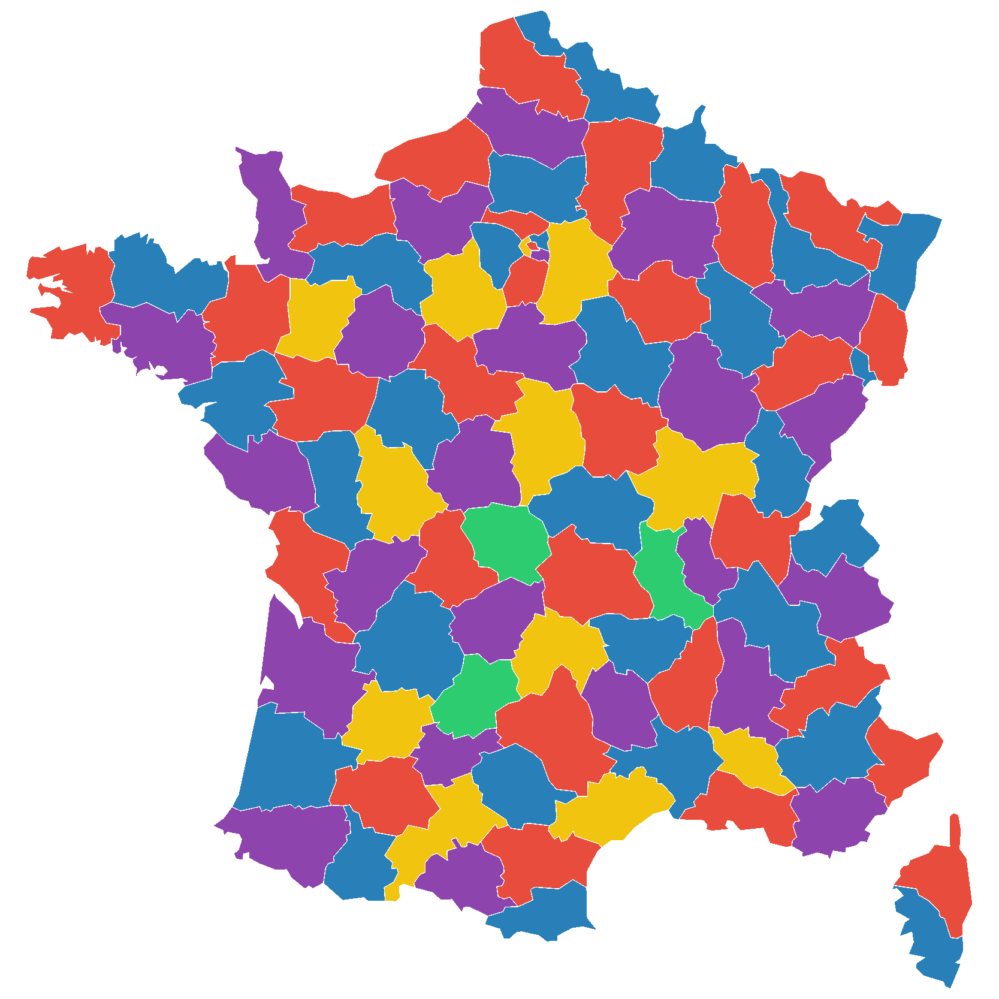

# (PART\*) Iterating rarefaction {-}

# Iterating rarefaction intro & setup {#iterating_rarefaction_chap}
<center>
{style="width:200px"}
</center>

In this section we will create code to carry out __iterative rarefaction__.
We'll create a vector of __random seeds__, each used for a different __iteration__ of __rarefaction__.
We use this vector to loop through, using each __random seed__ to carry out one __iteration__ of __rarefaction__.
In the next sections we will utilise this code to produce alpha and beta diversity values that we will analyse.

## Iterating rarefaction dataset
<center>
{style="width:200px"}
</center>

The data set we will use is the same as that used in the [R community analysis workshop](https://neof-workshops.github.io/R_community_whqkt8/Course/02-Dataset_and_workflow.html#dataset).

Below are brief bullet points about the data:

- It is a 16S dataset of ASV counts with taxonomy and phylogeny produced by QIIME2
- The samples come from surface water from the Durance River in the south-east of France
- There are three sampling sites on an anthropisation gradient (low to high agriculture)
  - Upper Durance (UD)
  - Middle Durance (MD)
  - Lower Durance (LD)
- Four different media approaches were used to produce bacterial lawns that were sequenced
  - Environmental sample (ENV): No media used, frozen at -20°C.
  - TSA 10% incubated at 28°C for 2 days.
  - KBC incubated at 28°C for 2 days.
  - CVP incubated at 28°C for 3 days.
- There are three replicates for each sampling site and media combination (36 samples total)

## Iterating rarefaction setup
<center>
{style="width:200px"}
</center>

First, create a new R jupyter-notebook called "Iterating_rarefaction.ipynb".

At the top of this notebook create a code cell to load in the various packages and data we need. The code is below:

```{R, eval=FALSE}
#Libraries
library("phyloseq")
library("microbiome")
library("IRdisplay")
#Load processed but unrarefied data from R community analysis workshop
load("phyloseq.RData")
```

## Rarefaction iterations
<center>
{style="width:200px"}
</center>

We need to choose the number of __iterations__ we are going to carry out.

For our __practice__ we will use __10 iterations__ for speed. 
In your real analysis I would recommend using __1000 iterations__.

Let's create a variable for our number of __iterations__.

```{R, eval=FALSE}
#Number of rarefaction iterations to be carried out
#Using 10 here for speed, real analysis should use 1000
rarefaction_iters <- 10
```

## RNG vector creation {#rng_vec_creation}
<center>
{style="width:200px; background-color:white; border-radius:15px"}
</center>

We can now carry out __Random Number Generation (RNG)__ to create a number of __random seeds__ equal to the number of iterations planned.

```{R, eval=FALSE}
#Create rngseed vector
#Set seed for reproducibility
#This number was chosen randomly
set.seed(2605)
#Sample 10 (number of iters) values from the number range 1-100,000
rngseed_vec <- sample(x=1:100000, size = rarefaction_iters, replace = FALSE)
#Print out vector
rngseed_vec
#Save our rngseed vector
save(rngseed_vec, file="rngseeds.RData")
#Reset seed
set.seed(NULL)
```

There are a lot of steps above. These are:

- __Setting the random seed:__ We carry this out so we will always get the same rngseed vector that will be used for the rarefaction iterations. This is important so you will always get the same results if you need to rework some analysis, stats, or plots. Also useful here so you get the same results as the instructor and other attendees.
- __Creating the rngseed vector:__ We use our old friend `sample()` to create a random number for each __iteration__ we will carry out. 
  - We arbitrarily sample from the numbers 1-100,000, you could change this to a larger range in your future research.
  - We use our previous object `rarefaction_iters` as `size=` to produce a random number for each of our __iterations__.
  - We carry this out __without replacement__ so none of our __rarefaction iterations__ are identical.
- __Save the rngseed vector:__ We save the vector as a file. We will load this in our alpha and beta diversity notebooks to be used for iterative rarefaction. This is also useful so you have a backup file of the rngseed vectors. 
- __Reset seed:__ Always good to reset the seed at the end of a Jupyter notebook cell or after it has been used in a Rscript.