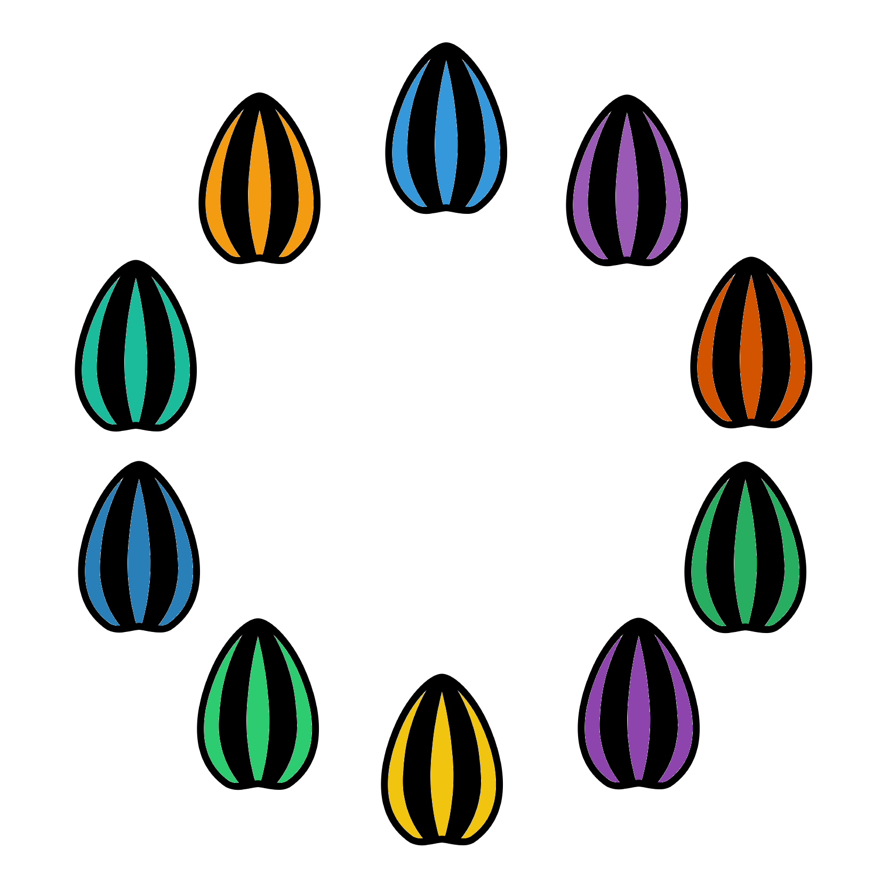

# (PART\*) Alpha diversity {-}

# $\alpha$ Diversity intro {#alpha_chap}
<center>
{style="width:300px"}
</center>

In this section we'll carry out __alpha diversity__ analysis using the __iterative rarefaction__ approach.
We will carry this out on the ASV counts rather than at a taxonomy level such as phyla.

These materials are mostly a combination of the __iterative rarefaction__ in this book and the __alpha diversity__ analysis in the R community workshop.
Due to this we won't go into great detail, instead focussing on giving you the code to be able to carry this out.

## $\alpha$: Setup
<center>
{style="width:200px; background-color:white; border-radius:15px"}
</center>

Create a new R jupyter notebook called "Alpha_diversity.ipynb".

Load the required data and libraries.

```{R, eval = FALSE}
#Libraries
library("phyloseq")
library("microbiome")
library("tidyverse")
library("IRdisplay")
library("ggpubr")
#Load processed but unrarefied ASV data from main R community workshop
load("phyloseq.RData")
```

## $\alpha$: Iterative rarefaction values
<center>
{style="width:200px"}
</center>

Before carrying out __iterative rarefaction__ we need to decide on a few values

- __Rarefaction size:__ The sequence depth to normalise samples to
  - We are using the minimum sample depth here
  - The size you choose will be based on your data and what you feel is appropriate
  - More info in the R community workshop
- __RNG seeds:__ The rng seeds we will use for all the rarefactions
  - We created these in the previous [chapter](#rng_vec_creation)
- __Rarefaction iterations:__ The number of rarefaction iterations we will use
  - We are using 10 here based on the length of our rng seed vector
  - We recommend you use 1000 in your real analysis

```{r, eval=FALSE}
#Rarefaction values
#Rarefaction size
#Minimum sample depth in this case
rarefaction_size <- min(microbiome::readcount(pseq))
#Load the vector of 10 rngseeds created in the previous chapter
load("rngseeds.RData")
#Number of rarefaction iterations to be carried out
#Based on length of rng seed vector
rarefaction_iters <- length(rngseed_vec)
```