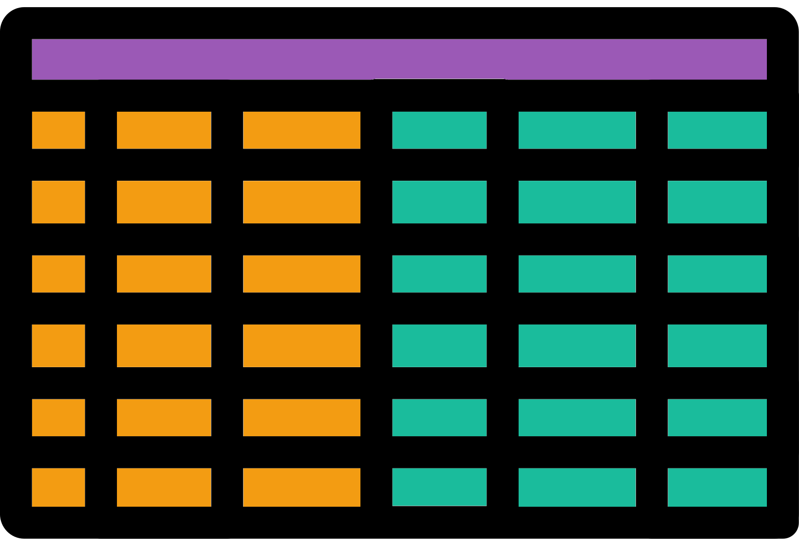

# $\alpha$ data frame tidying
<center>
{style="width:200px; background-color:white; border-radius:15px"}
</center>

In this section we will tidy up our data frame to make it ready for plotting by:

- Combining our __alpha diversity__ values and metadata
- Converting our wide data frame to a long data frame
- Subsetting our data frame so it only contains the __alpha diversity__ metrics we want to plot

## $\alpha$: Metric and metadata data frame
<center>
{style="width:200px"}
</center>

Now that we have our __alpha diversity__ values we can create a data frame that contains these values and the metadata.

In the below code we extract the metadata from the rarefied phyloseq object created in the last rarefaction iteration loop.
This ensures we only acquire metadata from samples that are retained after __rarefaction__.
The samples that are retained are always the same across our __rarefaction iterations__.
This is because samples are retained based on the __rarefaction size/depth__ which is kept consistent across our __rarefactions iterations__.

```{r, eval=FALSE}
#Combine metadata and alpha diversity mean values into one data frame
#Extract metadata from rarefied phyloseq object
metadf <- phyloseq::sample_data(pseq)
#Ensure row names are identical
#if not sort alpha data frame rows by metadata row names
if (identical(row.names(metadf), row.names(alpha_df_mean)) == FALSE) {
  alpha_df_mean <- alpha_df_mean[row.names(metadf),]
}
#Combine with cbind (column bind)
meta_alpha_mean_df <- cbind(metadf,alpha_df_mean)
head(meta_alpha_mean_df)
#Remove rarefied phyloseq object that we do not need any more in this notebook
rm(pseq_rarefy) 
```

From the output of `head()` you should see a table with the first set of columns being the metadata columns. The next set of columns is the alpha diversity metrics.

## $\alpha$: Long data frame {#alpha_long_df}
<center>
{style="width:100px"}
</center>

We will plot our __alpha diversity__ values with `ggplot2` functions.
Before we carry this out we need to convert our wide data frame to a long data frame.
We'll carry this out with `tidyr::pivot_longer()`.

We want our metric values to become long.
This means that instead of the __alpha diversity__ values being spread across multiple rows and columns, there will only be one value per row.

Two columns will represent these values in the long format:

- __metric:__ The name of the alpha diversity metric
- __value:__ The value of the alpha diversity metric

```{r,eval=FALSE}
#Create long version for plotting
#alpha_df_mean (no metadata) column names to be used for long conversion
alpha_div_colnames <- colnames(alpha_df_mean)
#Wide to long
meta_alpha_mean_long_df <- 
  tidyr::pivot_longer(data = meta_alpha_mean_df,
                      #Change the alpha diversity names to long format
                      #I.e. keep our metadata columns as separate columns
                      #all_of() used to silence warning message
                      cols = all_of(alpha_div_colnames)
                      #Set metric names to column called metric
                      #Set values to column called value
                      names_to = "metric", values_to = "value"
                      )
#Change our metric column to a factor
#Useful for plotting
meta_alpha_mean_long_df$metric <- as.factor(meta_alpha_mean_long_df$metric)
#Check head and dimensions of long data frame
head(meta_alpha_mean_long_df)
dim(meta_alpha_mean_long_df)
#Remove unneeded objects
rm(alpha_df_mean, metadf)
```

## $\alpha$: Subset metrics
<center>
{style="width:200px; background-color:white; border-radius:15px"}
</center>

There are a lot of diversity values created by `microbiome::alpha()`.
For this tutorial we are only interested in:

- __observed:__ The number of observed features (ASVs, Phlya, Species, etc.)
- __chao1:__ The estimated real total number of features
- __diversity_shannon:__ The Shannon diversity metric
  - An estimate of feature diversity based on richness (presence/absence) and abundance
  - The higher the value the higher the diversity
  
We'll subset our long data frame to only retain rows with these metrics.
We'll also use the utility of factors to order the metrics so they will be plotted in our preferred order.

```{R, eval=FALSE}
#Process our long data frame
#Subset our long alpha diversity data frame to only contain our metrics of choice
metrics <- c("observed", "chao1","diversity_shannon")
basic_alpha_metrics_long_df <- meta_alpha_mean_long_df[
  meta_alpha_mean_long_df$metric %in% metrics,
]
#Change instances of diversity_shannon to shannon
basic_alpha_metrics_long_df$metric <- gsub(pattern = "diversity_shannon",
                                           replacement = "shannon",
                                           x = basic_alpha_metrics_long_df$metric)
#The gsub() function changes our factor to a character vector
#Therefore change back to factor
#We will also choose our order of the metric names for plotting
basic_alpha_metrics_long_df$metric <- factor(x = basic_alpha_metrics_long_df$metric,
                                             levels = c("observed","chao1","shannon"))
#Check level order of metric factor column
levels(basic_alpha_metrics_long_df$metric)
#Check head of subsetted long data frame
head(basic_alpha_metrics_long_df)
```

With this data frame we can move onto visualisation and statistics.