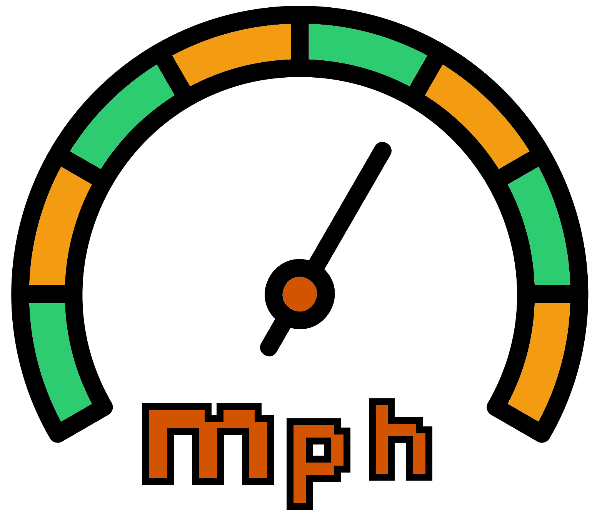
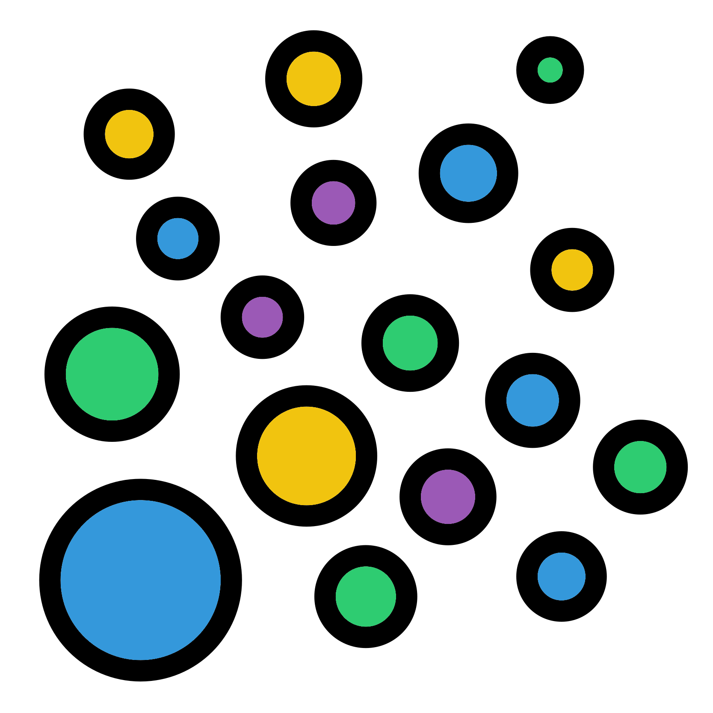

# $\beta$: Ordination
<center>
{style="width:200px"}
</center>

There are various ways to ordinate paired dissimilarity distances.
We are going to use two of the most popular for community based data: __NMDS__ and __PCoA__.

## Load weighted unifrac matrix
<center>
{style="width:300px"}
</center>

Prior to ordination we need to load the weighted unifrac matrix.
This is a useful cell to have as we don't need to rerun the __iterative rarefaction__ to reacquire this object if we save, close + halt, and then reopen this notebook.

```{R, eval=FALSE}
#Load wunifrac matrix
load("wunifrac_df_mean.RData")
```

## NMDS
<center>
{style="width:200px"}
</center>

The first ordination technique we will use is __NMDS__ (Non-metric MultiDimensional Scaling).
To carry this out we can use the function `vegan::monoMDS()`.

### NMDS ordinate
<center>
{style="width:200px"}
</center>

We provide the function with our __beta diversity dissimilarity matrix__ and the parameter `k = 2`.
The parameter`k` specifies the number of dimensions to calculate, we want 2 as we will only be plotting an x and y axis i.e. 2 dimensions.

```{R, eval=FALSE}
#NMDS ordinate
nmds_res <- vegan::monoMDS(beta_df_mean, k = 2)
#Structure of nmds_res
str(nmds_res)
```

### NMDS points
<center>
{style="width:150px"}
</center>

The function produces a __list__ containing 28 different objects.
Here we are only interested in the `points` data frame.
This contains the points we will be plotting in our NMDS plot.
Lets extract this data frame.

```{R, eval = FALSE}
#Extract plot points
nmds_points <- nmds_res$points
#Check head
head(nmds_points)
```

### NMDS data frame with metadata
<center>
{style="width:200px"}
</center>

Before plotting with `ggplot2` we need to combine the metadata and points into a long data frame.
There is no need to "longify" our data frame as it will start in the long format we require.

```{R, eval=FALSE}
#Create long data frame with metadata and points
#Extract metadata and ensure row names order matches
metadf <- phyloseq::sample_data(pseq)
if (identicial(row.names(metadf), row.names(nmds_points)) == FALSE) {
  metadf <- metadf[row.names(nmds_points),]
}
#Make points with metadata data frame
nmds_points_metadata <- cbind(nmds_points, metadf)
#Check head of data frame
head(nmds_points_metadata)
#Save object we want, remove ones we don't
save(nmds_points_metadata, file = "wunifrac_NMDS.RData")
rm(metadf, nmds_res, nmds_points)
```

### NMDS scatter plot
<center>
{style="width:150px"}
</center>

Now we can produce a NMDS scatter plot.
We will colour the points by site and the point shapes will be determined by the media.

```{R, eval = FALSE}
#Produce NMDS scatter plot
#Plot ordination
nmds.wunifrac <- ggplot(data = nmds_points_metadata,
                        aes(x = NMDS1, y = NMDS2, color = site, shape = media)) +
                ggplot2::geom_point()
#Save ggplot2 object with ggsave
ggsave(filename = "./Beta_diversity_NMDS_wunifrac_media_site.png",
       plot = nmds.wunifrac,
       device = "png", dpi = 300, units = "mm", height = 125, width = 150)
#Display plot
IRdisplay::display_png(file = "./Beta_diversity_NMDS_wunifrac_media_site.png")
```

Super!
You should see that the plot is mainly separated by NMDS1 splitting the ENV samples compared to the media samples.
The next major difference is in NMDS2 which separates the TSA samples compared to the CVP and KBC samples.
The CVP and KBC samples also appear to form distinct clusters.

## PCoA
<center>
{style="width:200px; background-color:white; border-radius:15px"}
</center>

The second, and last, ordination method we will look at is __PCoA__ (Principal Correspondence Analysis).

### PCoA ordinate
<center>
{style="width:200px; background-color:white; border-radius:15px"}
</center>

The `vegan` package cannot carry out __PCoA__ ordination. 
Therefore, we will use the function `pcoa()` from the `ape` package.

```{R, eval = FALSE}
#PCoA ordinate
pcoa_res <- ape::pcoa(beta_df_mean)
#Structure of pcoa_res
str(pcoa_res)
```

The function creates a __list__ containing 5 objects.

We are interested in 2 of these objects, `vectors` and `values`.

### PCoA points
<center>
{style="width:150px"}
</center>

Whereas we can specify the number of dimensions we want for NMDS, PCoA will create a certain number of dimensions based on the provided data.
The `vectors` object contains the axes points for all these dimensions.
We will only plot the first 2 axes.

Extract these points:

```{R, eval = FALSE}
#Extract first 2 axes
pcoa_points <- pcoa_res$vectors[,1:2]
head(pcoa_points)
```

### PCoA variance
<center>
{style="width:200px; background-color:white; border-radius:15px; border: white solid 5px"}
</center>

As there are multiple axes created we need to know the strength of each axis.
This is known as the __"Percentage/proportion of variance explained"__, this tells us how much of the total variance is explained by each axis.
The axes are always ordered from highest to lowest __% variance explained__.
Therefore axis one explains the most variance, followed by axis 2.

The higher the __% variance explained__ of axis 1 and axis 2, the better our subsequent plot represents our data.
General guidelines to how good our plot are based on the sum of these 2 values:

- <50%: Poor
- 50-69%: Decent
- 70-89%: Good
- 90-100%: Great

The __% variance explained__ is contained in the `values` __data frame__ within the `Relative_eig` column.
These are proportion values (0-1) so we will times them by 100 to make them percentages and round these digits to 2 decimal places (`round(,digits=2)`.

Let's extract the __% variance explained__ values.

```{R, eval = FALSE}
#Variation explained values 
pcoa_axis_var_explained <- round(x=pcoa_res$values[,"Relative_eig"] * 100, digits=2)
```

### PCoA data frame with metadata
<center>
{style="width:150px; background-color:white; border-radius:15px"}
</center>

As with the NMDS data we will create a __long data frame__ containing our points and metadata.

```{R, eval=FALSE}
#Create point long data frame with metadata
#Extract metadata and ensure row names order matches
metadf <- phyloseq::sample_data(pseq)
if (identicial(row.names(metadf), row.names(pcoa_points)) == FALSE) {
  metadf <- metadf[row.names(pcoa_points),]
}
#Make points with metadata data frame
pcoa_points_metadata <- cbind(pcoa_points, metadf)
head(pcoa_points_metadata)
#Save object we want, remove ones we don't
save(pcoa_points_metadata, file = "wunifrac_PCoA.RData")
rm(metadf, pcoa_res, pcoa_points)
```

### PCoA scatter plot
<center>
{style="width:150px; background-color:white; border-radius:15px"}
</center>

When plotting a PCoA scatter plot it is important to include the __% variance__ on the axes labels.
We will carry this out using the `pcoa_axis_var_explained` __vector__ we created earlier.

```{R, eval = FALSE}
#Produce PCoA scatter plot
#Plot ordination
pcoa.wunifrac <- ggplot(data = pcoa_points_metadata, 
                        aes(x = Axis.1, y = Axis.2, color = site, shape = media)) +
                ggplot2::geom_point() +
                #Add x and y labels to include % variance explained
                labs(x = paste0("Axis.1 [", pcoa_axis_var_explained[1], "%]"),
                     y = paste0("Axis.2 [", pcoa_axis_var_explained[2], "%]"))
#Save ggplot2 object with ggsave
ggsave(filename = "./Beta_diversity_pcoa_wunifrac_media_site.png", plot = pcoa.wunifrac
       device = "png", dpi = 300, units = "mm", height = 125, width = 150)
#Display plot
IRdisplay::display_png(file = "./Beta_diversity_pcoa_wunifrac_media_site.png")
```

We have a PCoA plot which represents 82.1% (67.46+14.64) of the variance of our data.
It is quite similar to our NMDS plot.

## Ordination recap

In this chapter you have created ordination values (NMDS & PCOA) with iterative rarefaction and created scatter plots with these.
In this next chapter we will use the ordination values to carry out statistics. 


