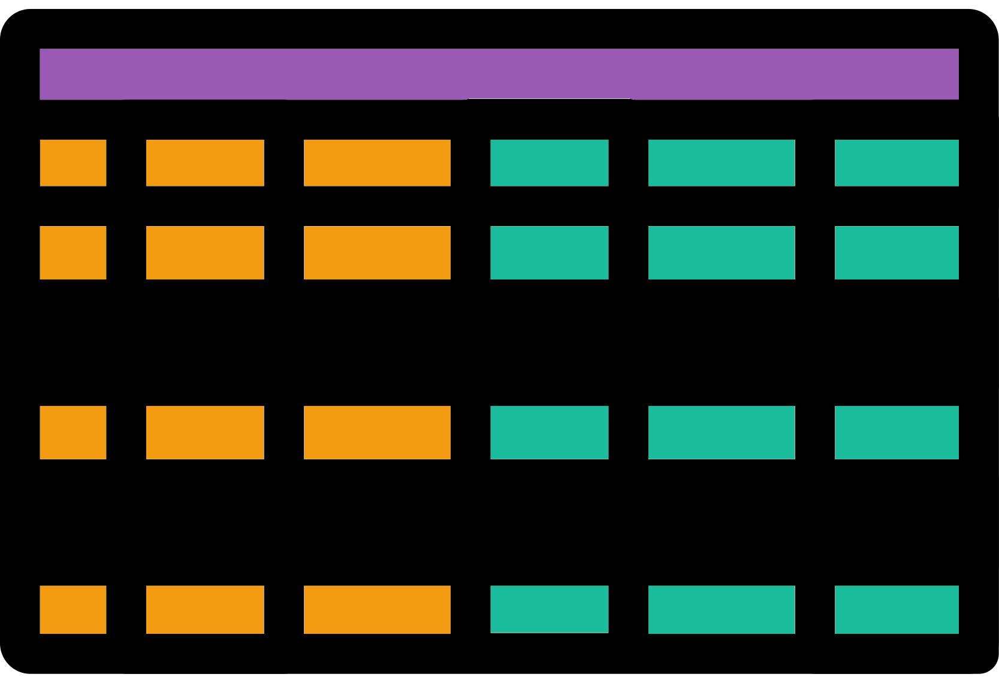
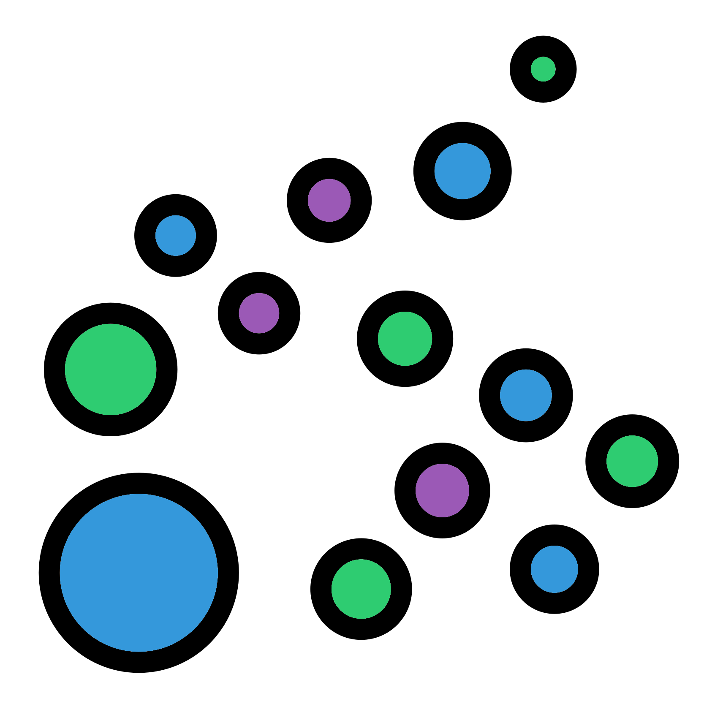

# $\beta$: Subset ordinations
<center>
{style="width:200px"}
</center>

When you ordinate data the distances within groups may be hard to see.
This can be caused by one group causing a larger difference and therefore most of the displayed variation is explaining that.

This can be seen with our previous ordination plots where the majority of the variation explained is caused by the difference of the environmental samples against the media samples.
We will therefore subset our ordination in this chapter to only look at the media samples.

## Subset distance matrix
<center>
{style="width:200px"}
</center>

The ordination values (PCoA, NMDS) will change when you remove or add samples.
This means we cannot simply subset our ordination points.

However, paired distance values never change between samples.
We can therefore subset our distance matrix and then ordinate it.
This is much better than having to carry out the iterative rarefaction again.

Subset out previously produced distance matrix to only removes the environmental samples:

```{R, eval=FALSE}
#Load wunifrac
load("wunifrac_df_mean.RData")
#Load metadata
metadf <- phyloseq::sample_data(pseq)
#Subset data frame so it excludes env samples
metadf_noenv <- metadf[metadf$media != ENV,]
#Subset distance matrix so it only contains non env samples
beta_df_mean_noenv <- beta_df_mean[row.names(metadf_noenv), row.names(metadf_noenv)]
beta_df_mean_no_env
```

## Points long data frame
<center>
{style="width:150px"}
</center>

We can now ordinate (PCoA) our subset distance matrix:

```{R, eval=FALSE}
#Ordinate subset distance matrix with PCoA
#PCoA ordinate
pcoa_res <- ape::pcoa(beta_df_mean_noenv)
#Variation explained values
pcoa_axis_var_explained <- round(pcoa_res$values[,"Relative_eig"] * 100, digits = 2)
pcoa_axis_var_explained
#Extract 1st 2 axes
pcoa_res_points <- pcoa_res$vectros[,1:2]
head(pcoa_res_points)
```

Followed by producing a long data frame for plotting:

```{R, eval = FALSE}
#Create point long data frame with metadata
#Ennsure row names order matches
if (identicial(row.names(metadf), row.names(pcoa_points)) == FALSE) {
  metadf <- metadf[row.names(pcoa_points),]
}
#Make points with metadata data frame
pcoa_points_metadata <- cbind(pcoa_points, metadf_noenv)
head(nmds_points_metadata)
#Save object we want, remove ones we don't
save(pcoa_points_metadata, file = "noenv_wunifrac_PCoA.RData")
rm(metadf, nmds_res, pcoa_points)
```

## Media PCoA scatter plot
<center>
{style="width:200px; background-color:white; border-radius:15px; border: white solid 5px"}
</center>

Finally you can produce the PCoA scatter plot for just the media samples:

```{R, eval = FALSE}
#Produce PCoA scatter plot
#Plot ordination
pcoa.wunifrac <- ggplot(data = pcoa_points_metadata, 
                        aes(x = Axis.1, y = Axis.2, color = site, shape = media)) +
  ggplot2::geom_points() +
  labs(x = paste0("Axis.1 [", pcoa_axis_var_explained[1], "%]"),
       y = paste0("Axis.2 [", pcoa_axis_var_explained[2], "%]"))
#Save ggplot2 object with ggsave
ggsave(filename = "./Beta_diversity_pcoa_wunifrac_noenv_media_site.png",
       plot = pcoa.wunifrac,
       device = "png", dpi = 300, units = "mm", height = 125, width = 150)
#Display plot
IRdisplay::display_png(file = "./Beta_diversity_pcoa_wunifrac_noenv_media_site.png")
```

Now we can see some much clearer clustering of the media and site groupings:

- The different media produce distinct separate clusters.
- CVP has the tightest clustering.
- Within the KBC and TSA groups the three different sites seems to produce distinct clusters.

## Stats?

As the statistics are based on the paired distances and not the ordination you don't need to repeat the statistical tests if you have already compared the media group pairs as we did.