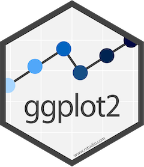

# R Packages {#rpackchap}
<center>
{style="width:200px"}
</center>

During this workshop we will use various R packages with their own intricacies. Before going into analysis we'll introduce you to some of these important concepts.

## R packages/libraries
<center>
{style="width:200px"}
</center>

R packages/libraries contain additional functions, data and code for analysing, manipulating and plotting different types of data. Many common packages will be installed as default when you install R. Other more specialised packages, such as the `ggplot2` package, must be installed by the user.

Packages found on The Comprehensive R Archive Network (CRAN), R’s central software repository, can be installed using the following command.

```{r eval=FALSE}
install.packages("package_name")
```

Every time you reload R you will need to load the packages you require if they are not installed in R by default. To do this type:

```{r eval=FALSE}
library("package_name")
```

I generally have a list of `library()` functions at the top of my R scripts (`.R` files) for all the packages I use in the script.

Throughout this course you will get a lot of practice installing and loading various packages.

`r hide("R package or R Library?")`
R packages are a collection of R functions, data, and compiled code. You can install these into a directory on your computer.

An R library is a directory containing a R package.

Because of this, the terms R package and R library may be used synonymously. We will use the term package in this workshop.
`r unhide()`

As we will be using a lot of packages we shall use double colons (`::`) to specify which package each function belongs to, unless the function is from base R. For example if we use the function `summarize_phyloseq()` from the package `microbiome` we would type the function like below:

__Note__: Do not run the below command.

```{r eval=FALSE}
microbiome::summarize_phyloseq()
```

This convention has 2 benefits:

- We can easily tell which R package each function comes from.
  - This is useful for your future coding where you may copy some, but not all, commands from one script to another. You will therefore know which packages you will need to load.
  - If you need some more documentation about a function you will know what package to look up.
  - Writing your methods will be a lot easier.
- Different packages may have functions with the same name. Specifying the package will ensure you are using the correct function.

## The grammar of graphics
<center>
{style="width:200px"}
</center>

During this course we will be using the grammar of graphics coding approach. This approach is implemented by the R package `ggplot2` to create visualisations such as bar charts, box plots, ordination plots etc. In turn `ggplot2` is used by a host of other packages, some of which we will be using. Although `ggplot2` is R code, its structure is very different and it takes effort to learn. Thankfully, `ggplot2` is very powerful and flexible, and it produces very professional and clean plots.

We will use the `iris` dataset (inbuilt into R) to show an example of `ggplot2` code and its visualisation output. You don't need to run the below code.

__Note__: If you would like to see the contents of the `iris` dataset you can run the command `View(iris)` in your R instance later.

```{r, fig.align='center', f}
#Load library
library(ggplot2)

#Create new ggplot2 object using iris dataset
ggplot2::ggplot(iris, aes(x=Sepal.Length, y=Sepal.Width, colour=Species)) +
  #Make the object a scatter plot 
  ggplot2::geom_point() +
  #Add plot tile
  ggplot2::ggtitle("Iris Sepal length vs width") +
  #Set x and y axis label names
  ggplot2::labs(x = "Sepal length", y = "Sepal width")
```

We will not learn `ggplot2` specifically during this course. However, the structure of creating an object will be used. In the above case the initial object was built with `ggplot`. Subsequently additions and edits were carried out with `+` and various other functions.

An important concept of the grammar of graphics is aesthetics. Aesthetics are the parts of a graphic/plot. In the above command we set the aesthetics with the function `aes()` within the `ggplot()` function. The X aesthetic (i.e. what values are assigned to the x axis) was set as the Sepal length values from the column `Sepal.Length` of the dataframe `iris`. In turn the Y axis values are set to the Sepal width and the colouring of the points are set to the Species.

That was a quick introduction to the grammar of graphics. We will be using this to create visualisations with a `phyloseq` object using various R packages specifically designed for community abundance data within `phyloseq` objects.

For more resources on `ggplot2` please see the [appendix](#ggplot2_appendix) of this book.

## phyloseq
<center>
{style="width:200px"}
</center>

In this book we will be working with [`phyloseq`](https://joey711.github.io/phyloseq/) objects to preprocess  our dataset, create visualisations, and carry out statistical analyses. This is a very popular object type for community abundance datasets as it contains the abundance table, metadata, and taxonomy table in one object, optionally containing the phylogenetic tree and reference sequences if wanted/required.

<center>
{style="border-radius: 15px; width: 800px; border: 5px solid #333333"}
</center>

For more info on `phyloseq` and associated packages please see the [appendix](#phyloseq_appendix).