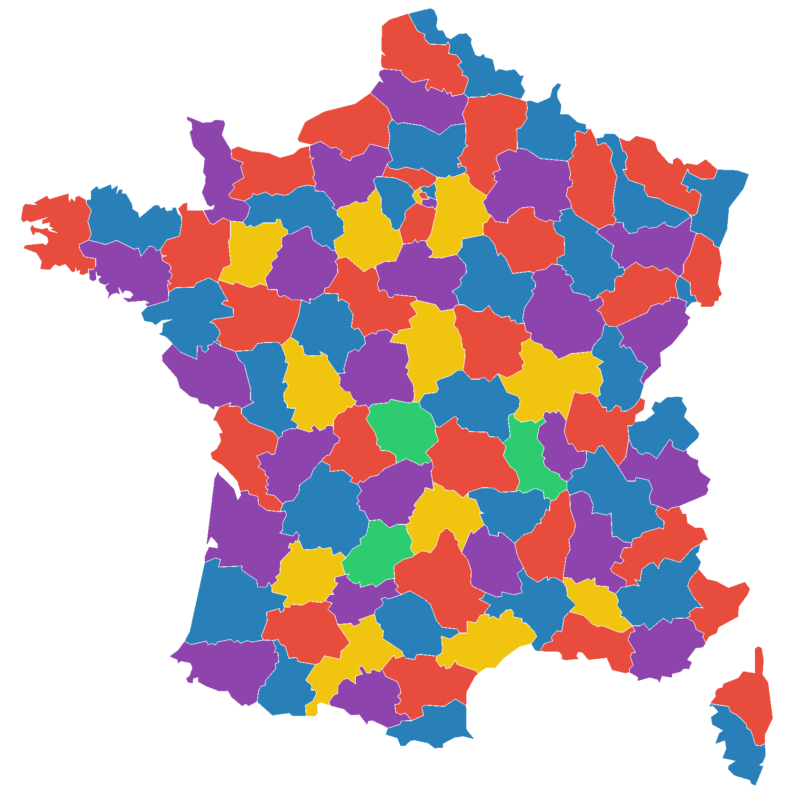

# Iterating rarefaction {#iterating_rarefaction_chap}
<center>
{style="width:200px"}
</center>

In this chapter we will create code to carry out __iterative rarefaction__.
For this we create a vector of __random seeds__, each used for a different __iteration__ of __rarefaction__.
We will loop through these __random seeds__, using each __random seed__ to carry out one __iteration__ of __rarefaction__.
In the next chapters we will utilise this code to produce alpha and beta diversity values that we will analyse.

## Iterating rarefaction dataset
<center>
{style="width:200px"}
</center>

We will utilise the same dataset used in the [R community analysis workshop](https://neof-workshops.github.io/R_community_whqkt8/Course/02-Dataset_and_workflow.html#dataset).

Below are brief bullet points about the data:

- It is a 16S dataset of ASV counts with taxonomy and phylogeny produced by QIIME2
- The samples come from surface water from the Durance River in the south-east of France
- There are three sampling sites on an anthropisation gradient (low to high agriculture)
  - Upper Durance (UD)
  - Middle Durance (MD)
  - Lower Durance (LD)
- Four different media approaches were used to produce bacterial lawns that were sequenced
  - Environmental sample (ENV): No media used, frozen at -20°C.
  - TSA 10% incubated at 28°C for 2 days.
  - KBC incubated at 28°C for 2 days.
  - CVP incubated at 28°C for 3 days.
- There are three replicates for each sampling site and media combination (36 samples total)

## Iterating rarefaction setup
<center>
{style="width:200px"}
</center>

First, create a new R jupyter-notebook called "Iterating_rarefaction.ipynb".

At the top of this notebook create a code cell to load in the various packages and data we need. The code is below:

```{R, eval=FALSE}
#Libraries
library("phyloseq")
library("microbiome")
library("IRdisplay")
#Load processed but unrarefied data from R community analysis workshop
load("phyloseq.RData")
```

## Rarefaction iterations
<center>
{style="width:200px"}
</center>

We need to choose the number of __iterations__ we are going to carry out.

For our __practice__ we will use __10 iterations__ for speed. 
In your real analysis I would recommend using __1000 iterations__.

Let's create a variable for our number of __iterations__.

```{R, eval=FALSE}
#Number of rarefaction iterations to be carried out
#Using 10 here for speed, real analysis should use 1000
rarefaction_iters <- 10
```

## RNG vector creation
<center>
{style="width:200px; background-color:white; border-radius:15px"}
</center>

We can now carry out __Random Number Generation (RNG)__ to create a number of __random seeds__ equal to the number of iterations planned.

```{R, eval=FALSE}
#Create rngseed vector
#Set seed for reproducibility
#This number was chosen randomly
set.seed(2605)
#Sample 10 (number of iters) values from the number range 1-100,000
rngseed_vec <- sample(x=1:100000, size = rarefaction_iters, replace = FALSE)
#Print out vector
rngseed_vec
#Save our rngseed vector
save(rngseed_vec, file="rngseeds.RData")
#Reset seed
set.seed(NULL)
```

There are a lot of steps above. These are:

- __Setting the random seed:__ We carry this out so we will always get the same rngseed vector that will be used for the rarefaction iterations. This is important so you will always get the same results if you need to rework some analysis, stats, or plots. Also useful here so you get the same results as the instructor and other attendees.
- __Creating the rngseed vector:__ We use our old friend `sample()` to create a random number for each __iteration__ we will carry out. 
  - We arbitrarily sample from the numbers 1-100,000, you could change this to a larger range in your future research.
  - We use our previous object `rarefaction_iters` as `size=` to produce a random number for each of our __iterations__.
  - We carry this out __without replacement__ so none of our __rarefaction iterations__ are identical.
- __Save the rngseed vector:__ We save the vector as a file. We will load this in our alpha and beta diversity notebooks to be used for iterative rarefaction. This is also useful so you have a backup file of the rngseed vectors. 
- __Reset seed:__ Always good to reset the seed at the end of a cell.

## Phyla relative abundance

Prior to __iterative rarefaction__ we will look at the phyla composition of the environmental samples.

### Subset and phyla aggregation

For demonstrative purposes we will reduce the amount of samples and features in our data for this chapter. We will carry this out by:

- Subsetting the data so it only contains the 9 environmental samples.
- Aggregate the taxa to phyla whilst aggregating rare taxa to one "other group"

```{R, eval=FALSE}
#Reduce data for demonstrative purposes
#Subset phyloseq object to only retain the ENV samples
#I.e. remove the media samples
physeq_env <- phyloseq::subset_samples(pseq, media == "ENV")

#Aggregate to phyla level whilst aggregating rare phyla
pseq_env_phyla <- microbiome::aggregate_rare(pseq_env, level = "Phylum",
                                             detection = 0.1, prevalence = 0.5,
                                             verbose = FALSE)
#View count table
otu_table(pseq_env_phyla)
#Sum count of samples
microbiome::readcount(pseq_env_phyla)
#Remove unwanted objects
rm(pseq, pseq_env)
```

### Phyla relative abundance bar chart

Let's have a quick look at the non rarefied phyla relative abundance through a bar chart.

__Note:__ This is how you would normally at this type of bar chart.

```{R, eval=FALSE}
#Quick phyla bar chart of relative abundance
#Relative abundance transformation
pseq_env_phyla_relabund <- microbiome::transform(pseq_env_phyla, "compositional")
#Create, save, and display bar chart
phylum_bar <- microbiome::plot_composition(pseq_env_phyla_relabund)
ggsave(filename = "./env_phyla_relabund.png", plot = phylum_bar,
       device = "png", dpi = 300, units = "mm", height = 100, width = 100)
IRdisplay::display_png(file = "./env_phyla_relabund.png")
```

## One Round (1R) of rarefaction

We will first carry out one round of __rarefaction__ .
This is so we can get a reminder of how to carry it out and to compare the results of no __rarefaction__ and only one round.

### 1R: Rarefaction

Carry out one round of __rarefaction__ and view the __rarefied__ counts.

We are using the environmental samples subsetted and phyla aggregated data.
Additionally, we are using the first of our __random seeds__ in `rng_seed_vec` and the minimum read count as our __rarefaction__ size.

```{R, eval=FALSE}
#One round of rarefaction
pseq_env_phyla_rarefy_1 <- phyloseq::rarefy_even_depth(
  pseq_env_phyla,
  #Minimum read count as rarefaction size
  sample.size = min(microbiome::readcount(pseq_env_phyla)),
  #First random seed as the rng seed
  rngseed = rngseed_vec[1])
#View count table
otu_table(pseq_env_phyla_rarefy_1)
#Sum count of samples
microbiome::readcount(pseq_env_phyla_rarefy_1)
```

You should see that all the samples now have a total count of __11046__.

### 1R: Relative abundance bar chart

Now to create a relative abundance bar chart with our __rarefied__ data to compare to our non-rarefied data.

```{R, eval=FALSE}
#Quick phyla bar chart of relative abundance
#Relative abundance transformation
pseq_env_phyla_rarefy_1_relabund <- microbiome::transform(pseq_env_phyla_rarefy_1, "compositional")
#Create, save, and display bar chart
phylum_bar <- microbiome::plot_composition(pseq_env_phyla_rarefy_1_relabund)
ggsave(filename = "./env_phyla_rarefy_1_relabund.png", plot = phylum_bar,
       device = "png", dpi = 300, units = "mm", height = 100, width = 100)
IRdisplay::display_png(file = "./env_phyla_rarefy_1_relabund.png")
```

Viewing the non-rarefied and __rarefied__ based bar charts shows some differences. However, these are quite difficult to discern.

### 1R: Difference from non-rarefied

To more easily see the differences we will subtract the two relative abundance tables from each other.
This will produce a matrix of differences.

```{R, eval=FALSE}
#Value difference matrix
single_rarefaction_diff <- 
  phyloseq::otu_table(pseq_env_phyla) - phyloseq::otu_table(pseq_env_phyla_rarefy_1_relabund)
single_rarefaction_diff
```

We can see there are some differences.
To make these differences even clearer let's make a histogram.

```{R, eval = FALSE}
#Histogram of differences
hist(single_rarefaction_diff, main = "Single rarefaction")
```

```{r, echo = FALSE}
opts_p <- c("__-0.0003(-3e-04) to 0.0003(3e-04)__", "__-0.003 to 0.003__", answer="__-0.015 to 0.015__")
```
What is the range of the differences? `r longmcq(opts_p)`

Although these values appear quite small keep in mind we are working with relative abundance values.
Each sample has a total relative abundance of 1.00 so a relative abundance value of 0.01 is 1%.

Let's see if we can get these differences smaller with multiple rounds of rarefaction.

## Multiple Rarefaction (MR) iterations

We will now carry out iterative rarefaction.

### MR: Rarefaction

The below loop creates a relative abundance table created by 10 rounds of iteration.
Type the code and read the annotations to understand what is going on.
Then run the code.

```{R, eval=FALSE}
#Iterative rarefaction to produce an average rarefied relative abundance table

#Assign rarefaction size
rarefaction_size <- min(microbiome::readcount(pseq_env_phyla))
#Read in our rng seed vector
load("rngseeds.RData")

#Initalise where we will store the output
#In this case we create the first iteration
#Carry out first rarefaction
pseq_rarefy <- phyloseq::rarefy_even_depth(pseq_env_phyla,
                                           sample.size = rarefaction_size
                                           #First random seed as the rng seed
                                           rngseed = rngseed_vec[1])
#Calculate relative abundance
pseq_rarefy_relabund <- microbiome::transform(pseq_rarefy, "compositional")
#Relabund phyla table object
relabund_phyla_table <- as.data.frame(phyloseq::otu_table(pseq_rarefy_relabund))

#Loop through the next 9 iterations
#Add the relabund rarefied values to phyla_table
for (i in 2:length(rngseed_vec)){
  #Rarefy
  pseq_rarefy <- phyloseq::rarefy_even_depth(pseq_env_phyla,
                                           sample.size = rarefaction_size
                                           #First random seed as the rng seed
                                           rngseed = rngseed_vec[i])
  #Calculate relative abundance
  pseq_rarefy_relabund <- microbiome::transform(pseq_rarefy, "compositional")
  #Add values to phyla_table
  relabund_phyla_table <- 
    relabund_phyla_table + as.data.frame(phyloseq::otu_table(pseq_rarefy_relabund))
}
#Average the values of the summed relabund phyla_table
relabund_phyla_table <- relabund_phyla_table / length(rngseed_vec)
```

### MR: Difference from non-rarefied

We'll skip the bar chart this time and only look at the difference of the values.

```{R, eval=FALSE}
#Value difference matrix
iterative_rarefaction_diff <- 
  as.matrix(phyloseq::otu_table(pseq_env_phyla) - relabund_phyla_table)
iterative_rarefaction_diff
#Histogram
hist(iterative_rarefaction_diff)
```

```{r, echo = FALSE}
opts_p <- c("__-0.0003(-3e-04) to 0.0003(3e-04)__", answer="__-0.003 to 0.003__", "__-0.015 to 0.015__")
```
What is the range of the differences? `r longmcq(opts_p)`

You should notice that the differences are much smaller.
This indicates that the structure of the __iterative rarefied__ data is much closer to the non-rarefied data than the one __rarefied__ data.
This is what we want.

## Iterating rarefaction task

Superlative! Now that you know how to carry out __iterative rarefaction__ I'll ask you to do it once more for the phyla data.

Create a rarefaction averaged phyla relative abundance as we have done above but with 1000 __rarefaction iterations__.
For this task use __153478__ as the __seed__ when creating your vector of 1000 __rng seeds__.

After creating the relative abundance matrix determine how different the values are compared to the non-rarefied relative abundance.

```{r, echo = FALSE}
opts_p <- c(answer="__-0.0003(-3e-04) to 0.0003(3e-04)__", "__-0.003 to 0.003__", "__-0.015 to 0.015__")
```
What is the range of the differences? `r longmcq(opts_p)`

## Iterating rarefaction recap

With this chapter you have learnt:

- How to create a vector of rngseeds
- How to use rng seeds to carry out itertaive rarefaction

In you real life analysis you would not use this method to create relative abundance taxonomy bar charts, you would use the non-rarefied relative abundance.
However, this hopefully gave you a good idea of how __iterataive rarefaction__ works so we can utilise it the next 2 chapters for alpha and beta diversity analysis.


