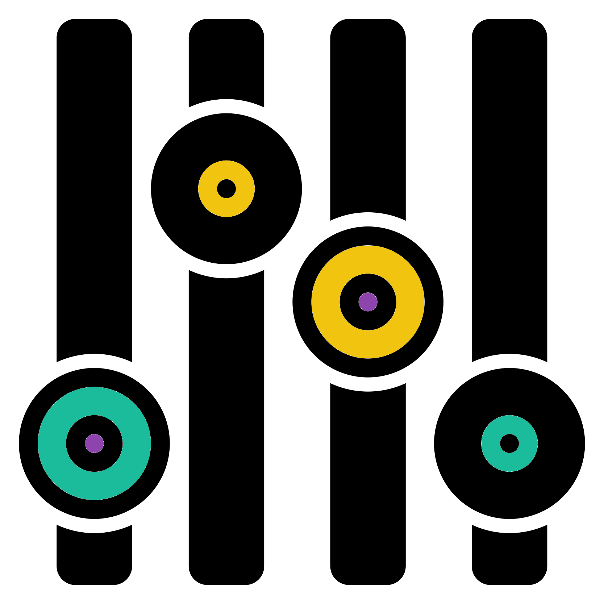

# Alpha Diversity {#alpha_chap}
<center>
{style="width:300px"}
</center>

In this chapter we'll carry out alpha diversity analysis using the __iterative rarefaction__ approach.
We will carry this out on the ASV counts rather than at a taxonomy level such as phyla.

These materials are mostly a combination of the __iterative rarefaction__ in this book and the __alpha diversity__ analysis in the R community workshop.
Due to this we won't go into great detail, instead focussing on giving you the code to be able to carry this out.

## Alpha diversity setup
<center>
{style="width:200px; background-color:white; border-radius:15px"}
</center>

Create a new R jupyter notebook called "Alpha_diversity.ipynb".

Load the required data and libraries.

```{R, eval = FALSE}
#Libraries
library("phyloseq")
library("microbiome")
library("tidyverse")
library("IRdisplay")
library("ggpubr")
#Load processed but unrarefied ASV data from main R community workshop
load("phyloseq.RData")
```

## Alpha diversity iterative rarefaction values
<center>
{style="width:200px"}
</center>

Before carrying out __iterative rarefaction__ we need to decide on a few values

- __Rarefaction size:__ The sequence depth to normalise samples to
  - We are using the minimum sample depth here.
  - The size you choose will be based on your data and what you feel is appropriate. More info in the R community workshop.
- __RNG seeds:__ The rng seeds we will use for all the rarefactions
  - We created these in the previous [chapter](#rng_vec_creation)
- __Rarefaction iterations:__ The number of rarefaction iterations we will use
  - We are using 10 here based on the length of our rng seed vector
  - We recommend you use 1000 in your real analysis

```{r, eval=FALSE}
#Rarefaction values
#Rarefaction size
#Minimum sample depth in this case
rarefaction_size <- min(microbiome::readcount(pseq))
#Load the vector of 10 rngseeds created in the previous chapter
load("rngseeds.RData")
#Number of rarefaction iterations to be carried out
#Based on length of rn seed vector
rarefaction_iters <- length(rngseed_vec)
```

## Alpha diversity iterative rarefaction loop
<center>
{style="width:300px"}
</center>

Now we will create averaged __alpha diversity__ values through __iterative rarefaction__.
We will carry this out by:

- Calculating initial __alpha diversity__ values from the first __iteration__
- Looping through the subsequent __rarefaction iterations__ and adding/summing calculated __alpha diversity__ values to the initial __alpha diversity__ values
- Dividing each value of the final summed __alpha diversity__ by the number of __rarefaction iterations__.

For this we will use the function `microbiome::alpha()` to calculate our alpha diversity values.

```{r, eval=FALSE}
#Loop to create iteration based rarefied alpha diversity values

#Create data frame to contain final summed alpha diversity values
#In this case we'll run the first rarefied alpha diversity analysis
pseq_rarefy <- phyloseq::rarefy_even_depth(pseq,
                                           sample.size = rarefaction_size,
                                           rngseed = rngseed_vec[1], verbose = FALSE)
#Alpha diversity
alpha_df_sum <- microbiome::alpha(pseq_rarefy, index = "all")

#Loop through 2 to the number of iterations
for (i in 2:rarefaction_iters){
  pseq_rarefy <- phyloseq::rarefy_even_depth(pseq,
                                           sample.size = rarefaction_size,
                                           rngseed = rngseed_vec[i], verbose = FALSE)
  #Alpha diversity
  alpha_df <- microbiome::alpha(pseq_rarefy, index = "all")
  #Add/sum the new data frame values to sum data frame
  alpha_df_sum <- alpha_df_sum + alpha_df
}
#Divide by number of rarefaction iterations to get average
alpha_df_mean <- alpha_df_sum / rarefaction_iters
#Save alpha mean data frame
save(alpha_df_mean, file = "alpha_df_mean.RData")
#Remove unneeded objects
rm(pseq_rarefy, alpha_df_sum, alpha_df)
```

You can check the structure and contents of our aalpha diveristy data fraem with `head()`.

```{r, eval=FALSE}
head(alpha_df_mean)
```
