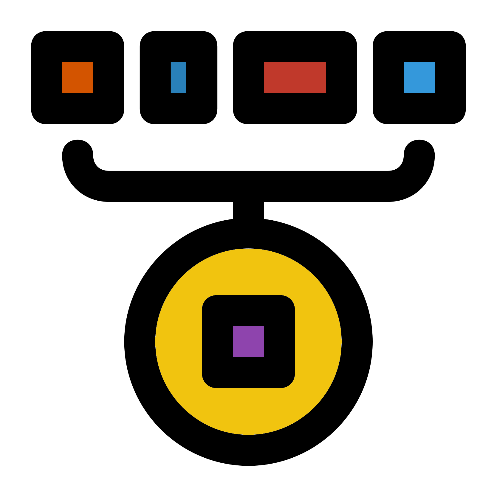

# Beta Diversity {#beta_chap}
<center>
{style="width:300px"}
</center>

This chapter will teach you how to carry out __beta diversity__ analysis.
The steps will include:

- Calculating __beta diversity__ distances
- Using __iterative rarefaction__ to create averaged distance values
- Carrying various ordination techniques to visualise the distances between samples

## $\beta$: Setup
<center>
{style="width:200px"}
</center>

Create a new R jupyter notebook called "Beta_diversity.ipynb".

Load the required data and libraries.

```{R, eval = FALSE}
#Libraries
library("phyloseq")
library("microbiome")
library("IRdisplay")
library("vegan")
library("rbiom")
library("ape")
#Load processed but unrarefied ASV data from main R community workshop
load("phyloseq.RData")
```

## $\beta$: Distance matrices
<center>
{style="width:300px"}
</center>

Here we'll find out how to produce a paired distance matrix with our __beta diversity__ metric of choice.
Unfortunately there is not one function that can calculate all the metrics we may want.

### Unifrac distances
<center>
{style="width:200px"}
</center>

Unifrac distances are preferred by many when a phylogenetic tree is available for your data.
We are working with 16S data so a phylogenetic tree was created.
Other barcodes or types of data may not have a phylogenetic such as ITS data or complex shotgun metagenomic data.

To produce a Unifrac distance matrix we will use the function `unifrac()` from the package `rbiom`.

The function `rbiom::unifrac()` was created to work with biom files and not __phyloseq__ objects.
Thankfully we don't need to convert our objects to a biom object, instead only needing to extract our count/abundance data and phylogenetic tree.
We can carry this out with the following 2 functions:

- `phyloseq::otu_table()`: Extracts the feature count/abundances table
- `phyloseq::phy_tree()`: Extract the phylogenetic tree

There are 2 types of Unifrac distances:

- Weighted: Incorporate relative abundances
- Unweighted: Does not incorporate relative abundances

We'll calculate weighted Unifrac distances by specifying the parameter `weighted = TRUE`.

So our output works with subsequent ordination step we'll convert the output of `rbiom::unifrac()` into a matrix with `as.matrix()`.

Carry out the matrix production with the below script:

```{R, eval=FALSE}
#Calculate weighted unifrac values
unifrac_rbiom_microbiome <- as.matrix(
  rbiom::unifrac(biom = phyloseq::otu_table(pseq),
                 tree = phyloseq::phy_tree(pseq),
                 weighted = TRUE))
#Check the first 6 rows and columns of the resulting distance matrix
head(unifrac_rbiom_microbiome)
```

### Vegan distances
<center>
{style="width:200px"}
</center>

To calculate non-unifrac __beta diversity__ distances we can use the `vegan` package and its function `vegdist()`.

The function `rbiom::unifrac()` calculates paired distances, this is the samples in the `otu_table` of a phyloseq object.
Unfortunately, `vegan::vegdist()` calculates paired distances by rows (features), this being the features in the `otu_table` of a phyloseq object.
We do not want this but thankfully all we need to add is the function `t()` to our abundance object to transpose the data.

Create a __Bray-Curtis__ distance matrix with the below code:

```{R, eval=FALSE}
#Calculate Bray-Curtis distance matrix
bray_curtis_mat <- as.matrix(
  vegan::vegdist(x = t(phyloseq::otu_table(pseq)),
                 method = "bray"))
#Check first 6 rows and columns of matrix
bray_curtis_mat[1:6,1:6]
```

The function can calculate a plethora of metrics with the full list available at the following [webpage](https://rdrr.io/cran/vegan/man/vegdist.html).

## $\beta$: Iterative rarefaction
<center>
{style="width:400px"}
</center>

Now that we know how to create a __beta diveristy__ paired distance matrix, we can create one with averaged values created by __iterative rarefaction__.

### Iterative rarefaction values
<center>
{style="width:200px"}
</center>

We need to set our __rarefaction__ values and rngseeds.
We can use the same code as we used in the __alpha_diversity__ analysis.

```{R, eval = FALSE}
#Rarefaction values
#Rarefaction size
#Minimum sample depth in this case
rarefaction_size <- min(microbiome::readcount(pseq))
#Load the vector of 10 rngseeds created in the previous chapter
load("rngseeds.RData")
#Number of rarefaction iterations to be carried out
#Based on length of rng seed vector
rarefaction_iters <- length(rngseed_vec)
```

### Iterative beta diversity calculation
<center>
{style="width:200px"}
</center>

The below code carries out __itertaive rarefaction__ and produces an averaged __weighted unifrac__ paired distance matrix.

```{R, eval = FALSE}
#Loop to create iteration based rarefied weighted unifrac values

#Create matrix to contain summed wunifrac beta diversity values
#In this case we'll run the first rarefied beta diversity analysis
pseq_rarefy <- phyloseq::rarefy_even_depth(
  pseq,
  sample.size = rarefaction_size,
  rngseed = rngseed_vec[1],
  verbose = FALSE)
#wunifrac beta diversity
beta_df_sum <- as.matrix(
  rbiom::unifrac(
    biom = phyloseq::otu_table(pseq_rarefy),
    tree = phyloseq::phy_tree(pseq_rarefy),
    weighted = TRUE))

#Loop through 2 to the number of iterations
for (i in 2:rarefaction_iters){
  #Rarefaction
  pseq_rarefy <- phyloseq::rarefy_even_depth(
    pseq,
    sample.size = rarefaction_size,
    rngseed = rngseed_vec[i],
    verbose = FALSE)
  #Beta diversity
  beta_df <- as.matrix(
    rbiom::unifrac(
      biom = phyloseq::otu_table(pseq_rarefy),
      tree = phyloseq::phy_tree(pseq_rarefy),
      weighted = TRUE))
  #Add/sum the new data frame values to the sum data frame
  beta_df_sum <- beta_df_sum + beta_df
}
#Divide by number of rarefaction iterations to get average
beta_df_mean <- beta_df_sum / rarefaction_iters
#Save alpha mean data frame
save(beta_df_mean, file = "wunifrac_df_mean.RData")
#View first 6 rows and columns of matrix
beta_df_mean[1:6,1:6]
#Remove unneeded objects
rm(beta_df_sum, beta_df_mean, pseq_rarefy)
```

`r hide("verbose = FALSE option")`
We include the option `verbose = FALSE` in the `phyloseq::rarefy_even_depth()` to prevent a lot of text to be displayed.
This text says which rngseed was used in the rarefaction.
We don't need this message as we already have a record of the rngseeds we used in `rngseed_vec`.
`r unhide()`

You'll notice that each value is duplicated, once in the bottom left triangle and once in the top right triangle.
This is fine as the subsequent functions in this chapter will work with this in the same manner as if the matrix was de-duplicated.

In the above case we saved our final distance matrix and removed it.
We will then load the object in the next section.
This is convenient as it means we only need to run this code cell once. 
With higher numbers of rarefaction iterations it can take a while.

## $\beta$: Ordination
<center>
{style="width:200px"}
</center>

There are various ways to ordinate paired dissimilarity distances.
We are going to use two of the most popular for community based data: __NMDS__ and __PCoA__.

### Load weighted unifrac matrix
<center>
{style="width:300px"}
</center>

Prior to ordination we need to load the weighted unifrac matrix.
This is a useful cell to have as we don't need to rerun the __iterative rarefaction__ to reacquire this object if we save, close + halt, and then reopen this notebook.

```{R, eval=FALSE}
#Load wunifrac matrix
load("wunifrac_df_mean.RData")
```

### NMDS


### Which ordination method to use?