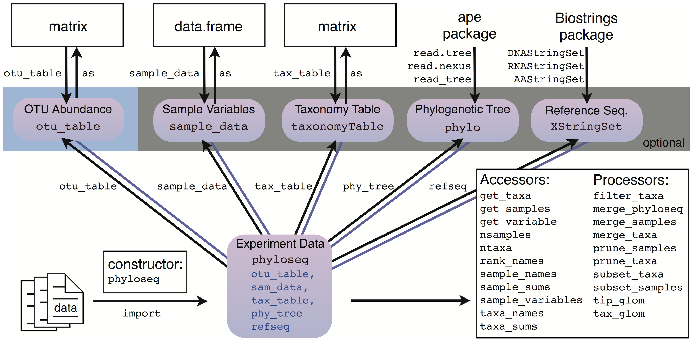
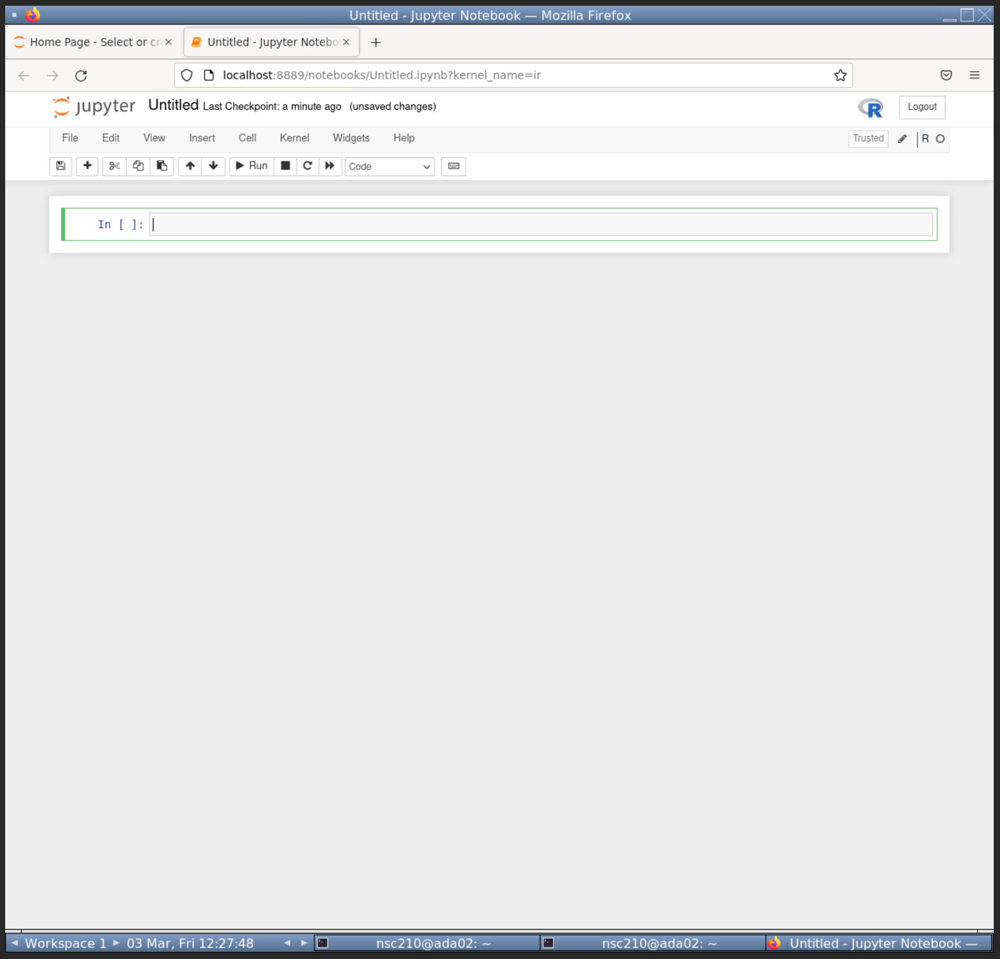
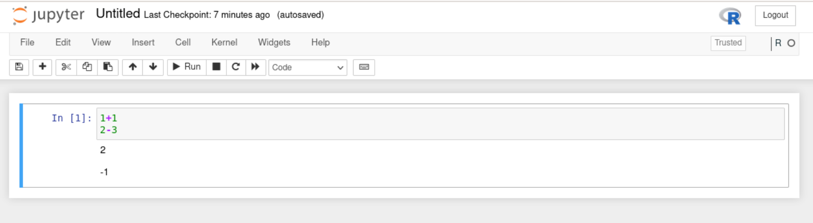

--- 
title: "R community advanced analysis"
author: "Matthew R. Gemmell"
date: "`r Sys.Date()`"
site: bookdown::bookdown_site
output: bookdown::gitbook
documentclass: book
bibliography: [book.bib, packages.bib]
biblio-style: apalike
link-citations: yes
favicon: figures/NEOF_favicon.png
description: NEOF book for the R community advanced analysis course
cover-image: "figures/NEOF.png"
---
```{r include=FALSE, cache=FALSE}
library(webexercises)
```

```{r, echo=FALSE}
#Change colour, border, and text of code chunks
#Check style.css for .Rchunk
#https://stackoverflow.com/questions/65627531/change-r-chunk-background-color-in-bookdown-gitbook
#https://bookdown.org/yihui/rmarkdown-cookbook/chunk-styling.html
knitr::opts_chunk$set(class.source="Rchunk") 
```

```{r cite-packages, include = FALSE}
# automatically create a bib database for R packages
# add any packages you want to cite here
knitr::write_bib(c(
  .packages(), 'bookdown', 'webexercises'
), 'packages.bib')
```

<center>
{style="border-radius: 15px; width: 300px"}
</center>

# (PART\*) Intro {-}

# Introduction

ADD NEW COURSE LOGO

ADD NEW COURSE INTRO

## Table of contents {-}

ADD TABLE OF CONTENTS

<a rel="license" href="http://creativecommons.org/licenses/by-nc-sa/4.0/"></a><br />This work is licensed under a <a rel="license" href="http://creativecommons.org/licenses/by-nc-sa/4.0/">Creative Commons Attribution-NonCommercial-ShareAlike 4.0 International License</a>.

<!--chapter:end:01-R_community_advanced_main_book.Rmd-->

```{r include=FALSE, cache=FALSE}
library(webexercises)
```
# Dataset & workflow {#datasetandworkflowchap}
<center>
{style="width:200px"}
</center>

## Dataset
<center>
{style="border-radius: 5px; width: 500px; border: 5px solid #333333"}
</center>

In this tutorial we will be using a 16S metabarcoding dataset derived from surface water from the Durance River in the south-east of France.
Two major comparisons were carried out in combination with each other.

[Link to paper](https://www.mdpi.com/2076-2607/8/8/1129)

### Sites
<center>
{style="width:200px"}
</center>

Three different sites were chosen on the Durance River. These three sites were representative of an anthropisation (transformation of land by humans) gradient along a river stream. These sites were:

- __Upper Durance sampling site (UD)__: Alpine part of the river with little/no anthropisation.
- __Middle Durance sampling site (MD)__: Upper part of agricultural land dominated by apple and pear production.
- __Lower Durance sampling site (LD)__: Lower part of agricultural land with intensive production of fruits, cereals, and vegetables.

### Culture media
<center>
{style="width:200px"}
</center>

Surface water was sampled and different culture media were used to produce bacterial lawns for each site. The media used were:

- __Environmental sample (ENV)__: No media used, frozen at -20°C.
- __TSA 10%__ incubated at 28°C for 2 days.
- __KBC__ incubated at 28°C for 2 days.
- __CVP__ incubated at 28°C for 3 days.

### Summary & questions {#sum_and_qs}
<center>
{style="width:200px"}
</center>

Each sample and media combination was produced in replicates of three giving a total of 36 samples (3 X 4 X 3 = 36). The three replicates were cultured on three different plates with the same media. An ASV table, taxonomy table, and phylogenetic tree were produced with QIIME2 and DADA2.

With this data we can ask and investigate the following questions:

- How do the bacterial communities change across the anthropisation gradient?
- Is there a difference in the replicates of one site and media combination? I.e. do any of the media produce inconsistent profiles?
- Is there more difference between the sites or the media used?
- Do the media samples differ from the ENV samples? If so, how?

## Workflow
<center>
{style="width:200px; border-radius:15px; background:white"}
</center>

1. [Import](#import_chap): Import QIIME2 artifacts into a `phyloseq` object with `qiime2R`.
2. [Summarisations](#sum_phyloseq_chap): Check our `phyloseq` object with summarisations.
3. [Minimum depth](#mindepthchap): Determine the minimum depth we should use and remove samples with lower depth.
4. [Taxanomic relative abundance](#taxa_relabund_chap): Create taxonomic relative abundance tables.
5. [Taxa plots](#chaptaxaplots): Produce heat maps and bar plots of taxa relative abundances.
6. [Family and genus](#family_genus_chap): Using the last step to produce family and genus based taxa plots.
7. [Rarefaction](#rarefaction_chap): Carry out sample depth normalisation with rarefactions. This will be used for alpha and beta diversity analysis.
8. [Alpha diversity](#alpha_chap): Carry out alpha diversity analysis through plots and statistics.
9. [Beta diversity](#beta_chap): Carry out beta diversity analysis through plots and statistics.
10. [Differenital abundance anlaysis](#DA_chap): Detect biomarkers compared to a reference group with ANCOM.

<!--chapter:end:02-Dataset_and_workflow.Rmd-->

```{r include=FALSE, cache=FALSE}
library(webexercises)
```
# R Packages {#rpackchap}
<center>
{style="width:200px"}
</center>

During this workshop we will use various R packages with their own intricacies. Before going into analysis we'll introduce you to some of these important concepts.

## R packages/libraries
<center>
{style="width:200px"}
</center>

R packages/libraries contain additional functions, data and code for analysing, manipulating and plotting different types of data. Many common packages will be installed as default when you install R. Other more specialised packages, such as the `ggplot2` package, must be installed by the user.

Packages found on The Comprehensive R Archive Network (CRAN), R’s central software repository, can be installed using the following command.

```{r eval=FALSE}
install.packages("package_name")
```

Every time you reload R you will need to load the packages you require if they are not installed in R by default. To do this type:

```{r eval=FALSE}
library("package_name")
```

I generally have a list of `library()` functions at the top of my R scripts (`.R` files) for all the packages I use in the script.

Throughout this course you will get a lot of practice installing and loading various packages.

`r hide("R package or R Library?")`
R packages are a collection of R functions, data, and compiled code. You can install these into a directory on your computer.

An R library is a directory containing a R package.

Because of this, the terms R package and R library may be used synonymously. We will use the term package in this workshop.
`r unhide()`

As we will be using a lot of packages we shall use double colons (`::`) to specify which package each function belongs to, unless the function is from base R. For example if we use the function `summarize_phyloseq()` from the package `microbiome` we would type the function like below:

__Note__: Do not run the below command.

```{r eval=FALSE}
microbiome::summarize_phyloseq()
```

This convention has 2 benefits:

- We can easily tell which R package each function comes from.
  - This is useful for your future coding where you may copy some, but not all, commands from one script to another. You will therefore know which packages you will need to load.
  - If you need some more documentation about a function you will know what package to look up.
  - Writing your methods will be a lot easier.
- Different packages may have functions with the same name. Specifying the package will ensure you are using the correct function.

## The grammar of graphics
<center>
{style="width:200px"}
</center>

During this course we will be using the grammar of graphics coding approach. This approach is implemented by the R package `ggplot2` to create visualisations such as bar charts, box plots, ordination plots etc. In turn `ggplot2` is used by a host of other packages, some of which we will be using. Although `ggplot2` is R code, its structure is very different and it takes effort to learn. Thankfully, `ggplot2` is very powerful and flexible, and it produces very professional and clean plots.

We will use the `iris` dataset (inbuilt into R) to show an example of `ggplot2` code and its visualisation output. You don't need to run the below code.

__Note__: If you would like to see the contents of the `iris` dataset you can run the command `View(iris)` in your R instance later.

```{r, fig.align='center', f}
#Load library
library(ggplot2)

#Create new ggplot2 object using iris dataset
ggplot2::ggplot(iris, aes(x=Sepal.Length, y=Sepal.Width, colour=Species)) +
  #Make the object a scatter plot 
  ggplot2::geom_point() +
  #Add plot tile
  ggplot2::ggtitle("Iris Sepal length vs width") +
  #Set x and y axis label names
  ggplot2::labs(x = "Sepal length", y = "Sepal width")
```

We will not learn `ggplot2` specifically during this course. However, the structure of creating an object will be used. In the above case the initial object was built with `ggplot`. Subsequently additions and edits were carried out with `+` and various other functions.

An important concept of the grammar of graphics is aesthetics. Aesthetics are the parts of a graphic/plot. In the above command we set the aesthetics with the function `aes()` within the `ggplot()` function. The X aesthetic (i.e. what values are assigned to the x axis) was set as the Sepal length values from the column `Sepal.Length` of the dataframe `iris`. In turn the Y axis values are set to the Sepal width and the colouring of the points are set to the Species.

That was a quick introduction to the grammar of graphics. We will be using this to create visualisations with a `phyloseq` object using various R packages specifically designed for community abundance data within `phyloseq` objects.

For more resources on `ggplot2` please see the [appendix](#ggplot2_appendix) of this book.

## phyloseq
<center>
{style="width:200px"}
</center>

In this book we will be working with [`phyloseq`](https://joey711.github.io/phyloseq/) objects to preprocess  our dataset, create visualisations, and carry out statistical analyses. This is a very popular object type for community abundance datasets as it contains the abundance table, metadata, and taxonomy table in one object, optionally containing the phylogenetic tree and reference sequences if wanted/required.

<center>
{style="border-radius: 15px; width: 800px; border: 5px solid #333333"}
</center>

For more info on `phyloseq` and associated packages please see the [appendix](#phyloseq_appendix).

<!--chapter:end:03-R_packages.Rmd-->

```{r include=FALSE, cache=FALSE}
library(webexercises)
```
# Set-up {#setupchap}
<center>
{style="width:200px"}
</center>

Prior to any analysis we need to setup our environment in the webVNC.

## Logon instructions {#cluster}

For this workshop we will be using Virtual Network Computing (VNC). Connect to the VNC with a browser by using the webVNC link you were sent.

You will now be in a logged-in Linux VNC desktop. 
You will see something as below (there may be only one terminal which is fine). 
If you do not see something similar please ask for assistance.

<center>
{style="width:800px"}
</center>

If the VNC is taking up too much/little space of your browser you can use the zoom of your browser to adjust the size. 
You will most likely need to use your browser's tool bar to accomplish this. 
Ensure you can see the grey borders.

These instructions will not work outside of this workshop. 
If you would like to install your own Linux OS on your desktop or laptop we would recommend Mint Linux 

The following link is a guide to install Mint Linux:  
https://linuxmint-installation-guide.readthedocs.io/en/latest/

## Mamba
<center>
{style="width:200px; border-radius:15px; background:null"}
</center>

This workshop requires a lot of packages. 
These all can be difficult to install with R. 
Instead we have used Mamba forge to install R, its packages, and Jupyter-notebook (more info below). 
To learn more about Mamba-forge and how to create your own environment please see the [appendix](#mamba_install).

To set-up your environment for this workshop please run the following code (you must include the full stop and space at the front of the command).

```{bash, eval=FALSE}
. usercommunity
```

You will have successfully activated the environment if you now see `(r_community)` at the start of your command prompt. 
This indicates you are now in the mamba environment called `r_community` created by the instructor.

If you are interested in the use script you can look at its contents.

```{bash, eval=FALSE}
less /usr/local/bin/usercommunity
```

__Tip:__ press `q` to quit `less`.

For more about mamba and how to create your own `r_community` environment please see the [appendix](#mamba_install)

<!--chapter:end:04-Setup.Rmd-->

```{r include=FALSE, cache=FALSE}
library(webexercises)
```
# Jupyter {#jupyterchap}

<center>
{style="border-radius: 15px; width: 200px; background-color: white"}
</center>


[`Jupyter-notebook`](https://jupyter.org/) is a nice browser based method to write, edit, and run code. It was initally created for Python coding, but has since branched out to many other languages, such as `R`.

We are using it in this workshop for a variety of its properties:

-   It is popular and well maintained.
-   It is lightweight. Other heavier weight programs, such as RStudio, would struggle in our HPC due to the graphical and CPU load.
-   It is interactive and displays code output.
-   It allows for easier annotation, editing, and debugging than the command line.
-   It provides a graphical interface for changing directories and choosing files.

Before carrying out any analysis we will go through a quick tutorial of `jupyter-notebook`.

__Note:__ There is a [video tutorial](#jup_vid_tut) of this chapter at the bottom of this page if you prefer to watch it.

## Open Jupyter-notebook

The first step is to open `jupyter-notebook`. Run the below command in your `(r_community)` environment.

```{bash, eval=FALSE}
jupyter-notebook
```

This will open `jupyter-notebook` in firefox. We won't need to access the linux terminal anymore. Leave the terminal running `jupyter-notebook` and full screen your `firefox` so you should see something like below.

`r hide("Can't see the whole webVNC window?")`
You may need to zoom out with your browser so you can see the full webVNC window.

- __Chrome__: Click on the __three dots in vertical line__ (
```{r, echo=FALSE}
icons::ionicons("ellipsis-vertical")
``` 
) on the top left for a dropdown menu which includes zoom options.
- __Edge__: Click on the __three horizontal lines__ (
```{r, echo=FALSE}
icons::ionicons("ellipsis-horizontal")
``` 
) on the top left for a dropdown menu which includes zoom options.
- __Firefox__: Click on the __three dots in horizontal line__ (
```{r, echo=FALSE}
icons::fontawesome("bars")
```
) on the top left for a dropdown menu which includes zoom options.
`r unhide()`

<center>
{style="width: 1000px; border-radius: 15px; border: 5px solid #333333"}
</center>

## Create R notebook

The next step is to create an R notebook.

1.  Click on the **"New"** button towards the top right, right of the "Upload" button.
2.  From the dropdown click **"R"** below "Python 3 (ipykernel)".

This will open up a new R notebook like below.

<center>
{style="width: 1000px; border-radius: 15px; border: 5px solid #333333"}
</center>

## Cells and code

`Jupyter-notebook` uses **cells** (the grey boxes) to separate code. This is very useful to compartmentalise our code.

There will already be one **cell**. Within the **cell**, type in the below commands.

```{r, eval=FALSE}
1+1
2-3
```

When pressing enter in **cells** it will create a new line. To run all commands in a **cell** press `CTRL + enter`.

Run your current **cell** and you should see something like below.

<center>
{style="width: 1000px; border-radius: 15px; border: 5px solid #333333"}
</center>

## Create new cells

You can create new **cells** by 2 different means.

-   Press the `+` button on the tool bar (between the floppy disk
```{r, echo=FALSE}
icons::icon_style(icons::ionicons("save-outline"), background="white")
``` 
and scissors
```{r, echo=FALSE}
icons::icon_style(icons::ionicons("cut"), background="white")
``` 
). This will add a **cell** below your currently selected **cell**.
-   Click on the **`Insert`** button and use the dropdown to add a cell above or below your currently selected cell.

**Tip:** Hover over the toolbar icons to display a text based description of its function.

With that knowledge add a second **cell** below the first **cell**. Add the following code to your second **cell** but do not run it.

```{r, eval=FALSE}
num_1 <- 3
num_2 <- 10
```

**Tip:** Notice there are green lines around your selected cell.

Insert a third **cell** and add the following code to it. Do not run the code.

```{r, eval=FALSE}
num_1 * num_2
```

## Running code

Try to run the code in the third **cell**. There should be an error as we have not created the objects `num_1` & `num_2`. We have only written the code for these objects but not run them.

We can run all the code in a notebook starting from the first **cell** to the last **cell**.

To run all **cells** from the start:

-   Click on the **"Cell"** button.
-   Click **"Run All"** from the drop-down options.

You should then see something like the below in your notebook.

<center>
{style="width: 1000px; border-radius: 15px; border: 5px solid #333333"}
</center>

There is no output printed for __cell__ 2 because we are assigning variables. However, the correct output for Cell 3 is below it. This is because the variables were assigned in **cell** 2 before **cell** 3 was run.

## Saving the file
<center>
{style="width:100px"}
</center>

As with RStudio and other good coding interfaces we can save our notebook.

First we should rename the file. Rename the notebook to **"jupyter_tut.ipynb"**:

1.  Click on the name of the notebook, currently called **"Untitled"**.
    -   This is at the very top of the notebook, right of the Jupyter logo.
2.  A pop-up called **"Rename Notebook"** will appear. Change the Name to **"jupyter_tut.ipynb"**.
3.  Click **"Rename"**.

Now we can save the file. Two methods to save are:

-   Click the floppy disk 
```{r, echo=FALSE}
icons::icon_style(icons::ionicons("save-outline"), background="white")
``` 
on the toolbar.
-   Click on the **"File"** button. Click **"Save and Checkpoint"** from the dropdown options.

## Title cells with markdown

We will be using multiple notebooks in this workshop. We will also have multiple sections per notebook. It will be useful to create header cells with markdown to create visual separation of the different sections.

To add a header __cell__ to the top of our notebook:

-   Create a new __cell__ at the top of the notebook.
-   Click on the **"Code"** drop down and select **"Markdown"**.
    -   The **"Heading"** option no longer works.

<center>{style="width: 1000px; border-radius: 15px; border: 5px solid #333333"}</center>

-   Add the following to the **"Markdown"** cell to create a first level header.
    -   Ensure you have a space between the `#` and header text ("Tutorial").

```{r, eval=FALSE}
# Tutorial
```

Great, we can now add nice headers in our notebooks. **Save** the notebook once more before carrying on to the next section.

`r hide("Markdown")` 
You won't need to know more about `Markdown` but if you are interested please see the [`Markdown` guide](https://www.markdownguide.org/basic-syntax/). 
`r unhide()`

## Close the notebook

To close the notebook:

-   Click on **"File"**.
-   From the dropdown options click **"Close and Halt"**.

When you are back in the file explorer page you may not yet see the new file you saved. If so, you will need to refresh the page with the Refresh button 
```{r, echo=FALSE}
icons::icon_style(icons::ionicons("refresh"), background="white")
``` 
towards the top right.

<center>
{style="width: 1000px; border-radius: 15px; border: 5px solid #333333"}
</center>

With that quick tutorial of `jupyter-notebook` we can start our community analysis in the next chapter.

For more info on `jupter-notebook` please see the [appendix](#jupyter_appendix).

## Video tutorial {#jup_vid_tut}
<div class="container">
<iframe src="https://www.youtube.com/embed/-c_6HoPMw9g" 
frameborder="0" allowfullscreen class="video"></iframe>
</div>

<!--chapter:end:05-Jupyter.Rmd-->

```{r include=FALSE, cache=FALSE}
library(webexercises)
```
# (PART\*) Iterative rarefaction {.unnumbered}

# Iterative rarefaction intro {#rarefaction_intro_chap}

<center>
{style="width:200px"}
</center>

__Rarefaction__ is the process of randomly subsetting samples so the total count values are identical across all samples.
__Rarefaction__ is intended to correct for bias caused by varying sampling depths across the samples to be analysed.

## Should you rarefy?
<center>
{style="width:200px"}
</center>

__Rarefaction__ can be a hotly debated topic with two main points of view.

1.  Some researchers believe it is not appropriate.
    1.  This is backed up by the 2014 paper ["Waste Not, Want Not: Why Rarefying Microbiome Data Is Inadmissible"](https://journals.plos.org/ploscompbiol/article?id=10.1371/journal.pcbi.1003531)
    2.  Various R package developers do not recommend it such as the developers of [`phyloseq`](https://joey711.github.io/phyloseq/) & [`microbiome`](https://microbiome.github.io/tutorials/).
2.  Some researchers believe it is appropriate.
    1.  This is backed up by the 2022 paper ["To rarefy or not to rarefy: robustness and efficiency trade-offs of rarefying microbiome data"](https://academic.oup.com/bioinformatics/article/38/9/2389/6536959)
    2.  The QIIME2 developers include rarefaction in their tutorials/SOPs for alpha and beta diversity analysis

We use __rarefaction__ in our analyses but it is ultimately up to you whether you utilise it or not.

## Using iterations
<center>
{style="width:200px; background-color:white; border-radius:15px"}
</center>

In our initial R community analysis workshop we only __rarefy__ once for each sample.
In this section we will __rarefy__ multiple times to calculate average values for alpha and beta diversity metrics.
This is __iterative rarefaction__ analysis.

This iterative approach will, in theory, smooth out any extreme results one round of __rarefaction__ may cause. Extreme results are possibly due the random nature of __rarefaction__.
These extreme results can include:

-   Leaving important features (ASVs, taxonomic groups, etc.) with no counts
-   Causing a few features to have much higher relative abundances
-   Varying alpha and beta diversity values with different sets of rarefaction

## Section contents
<center>
{style="width:200px; background-color:white; border-radius:15px"}
</center>

In this section we will learn how to:

- Use __random seeds__ for sampling
- Carry out __iterative rarefaction__ with sets of __random seeds__
- Use __iterative rarefaction__ to carry out alpha diversity analysis
- Use __iterative rarefaction__ to carry out beta diversity analysis

<!--chapter:end:06-Iterative_rarefaction.Rmd-->

```{r include=FALSE, cache=FALSE}
library(webexercises)
```
# Random seeds {#random_seeds_chap}
<center>
{style="width:200px"}
</center>

What are __random seeds__?

__Random seeds__ are numbers that computational tasks use to determine how they will carry out a random task.

In this chapter we will demonstrate the use of __random seeds__. 
This is to help understand what they are and why they are used.
We won't do anything of value with the results in this chapter, instead this knowledge will be useful for understanding __iterative rarefaction__.

## Random seed notebook

<center>
{style="width:100px"}
</center>

Create a new R jupyter-notebook called "Random_seeds.ipynb".
We will use this for this chapter.

## Random sampling
<center>
{style="width:200px; background:white; border-radius:5px"}
</center>

To demonstrate to use of random seed we will use the R function `sample()`. 
This function randomly samples a set of numbers.

Create the below code in a code cell.

```{R, eval=FALSE}
#Create a vector containing the numbers 0 to 10
num_vec <- 0:10
#Randomly sample 5 of these numbers
sample(x = num_vec, size = 5)
```

If you run the code you will get five random single digit numbers.

Run this multiple times and you will hopefully see the sampled numbers are different every time.

## Sampling with replacement
<center>
{style="width:200px"}
</center>

You may also notice that within each sample there are no repeating numbers.
You can change this by adding the options `replace = TRUE`.

Try this out in a new cell.

```{R, eval=FALSE}
#Randomly sample 5 of these numbers with replacement
sample(x = num_vec, size = 5, replace = TRUE)
```

Run this a few times and you will hopefully notice that the five numbers are not always unique.

When sampling __with replacement__ you put back any results back into the sampling pool.
When sampling __without replacement__ you don't put back any results into the sampling pool.

The famous example is sampling green and yellow balls from a bag.
If you had a bag with 1000 balls and you wanted a rough idea of the ratio of yellow and green balls you could count the number of these balls within a sample of only 50.
Without replacement you would take out a ball, record its colour and throw it in a separate container.
With replacement you would take out a ball, record its colour and put it back into the initial bag, meaning it could possibly be recounted.

One advantage of sampling with replacement is that your sampling size can be larger than your actual population size.
For example, you could create a random sampling of 50 with a bag containing 10 balls with replacement.
This would not work without replacement.
The below script will cause R to produce an error saying it can be done with replacement.

```{R, eval=FALSE}
#Randomly sample 5 of these numbers with replacement
sample(x = num_vec, size = 5, replace = TRUE)
```

Importantly for us __rarefaction__ uses sampling __without replacement__.

## Setting a random seed
<center>
{style="width:400px"}
</center>

We'll sample, without replacement, the numbers one more time in a new cell.
However, this time we will set the __random seed__ with the function `seet.seed()`.

```{R, eval=FALSE}
#Set random seed
set.seed(1234)
#Randomly sample 12 of these numbers without replacement
sample(x = num_vec, size = 12, replace = FALSE)
#Reset random seed
set.seed(NULL)
```

Before we explain the code further, try running the cell multiple times.
If it is identical to the above code you will get the numbers "9, 5, 4, 3, & 6".

How come you are getting these results if it is random?

True randomness is pretty much impossible, especially in computing.
Therefore, many programs use __seeds__ to determine how random tasks will be carried out.
Various programs that use __random seeds__ include:

- Sampling tools such as `sample()` and rarefaction
- Creating bootstrapped phylogenies
- Creating procedural content such as building Minecraft worlds

If you run a tool that uses random sampling you will always get the same results if:

- You use the same random seed
- You use the same data
- You use the same parameters including the replacement method (with or without)

In fact, run the below code in a new code cell and you may notice a similarity with your previous output.

```{R, eval=FALSE}
#Set random seed
set.seed(1234)
#Create a vector containing the numbers 0 to 10
larger_num_vec <- 10:19
#Randomly sample 5 of these numbers
sample(x = num_vec, size = 5)
#Reset random seed
set.seed(NULL)
```

That's right, `sample()` will always take the 10th (9/19), 6th (5/15), 5th (4/14), 4th (3/13), and 7th (6/16) values if it is given the __random seed__ of __1234__, provided with an 11 length vector, and asked to sample 5 values.

Setting our randomness is incredible beneficial for reproducibility in research.

When you carry out analysis you may need to redo some work. 
This could be due to reviewer comments or you want to incorporate some new methods.
As long as you saved the random seeds you used you can get the same results where you need to.
It also means others can replicate your results.

## Reset seed
<center>
{style="width:400px"}
</center>

We set a __random seed__ at the start of the cell for reproducibility and control, but why do we then run the line `set.seed(NULL)`?

The normal operation of R means that, in effect, its __random seed__ changes every time it is used.
This means R normally randomly determines randomness.
This is how it should be until we want to set the randomness.
It is therefore good practice to set the seed to `NULL` after you have utilised your set __seeds__.
This will revert the __seed__ to its normal random operations.

One last point to note is R versions. 
Version 3.6 changed R's sampling methods, therefore if you use Version 3.5 or below you will get different results than we have got.
Hopefully the R developers will not change this in a later version again.

## Random seed practice
<center>
{style="width:200px"}
</center>

Brilliant! To reinforce the above knowledge try out the following challenges.

First create the following vector:

```{R, eval=FALSE}
second_millenium <- 1001:2000
```

__Note:__ Remember it is best practice to `set.seed(NULL)` at the end of a code cell.

### Random seed: Question 1

Sample the object `second_millenium` with the following parameters:

- Extract 10 values
- Without replacement
- Use the __random seed__ `489`

```{r, echo = FALSE}
opts_p <- c("__1120__", answer="__1369__", "__1744__")
```
What is the fourth number in the produced vector? `r longmcq(opts_p)`

### Random seed: Question 2

Sample the object `second_millenium` with the following parameters:

- Extract 24 values
- Without replacement
- Use the answer to the first question as the __random seed__

```{r, echo = FALSE}
opts_p <- c("__1120__", "__1369__", answer="__1744__")
```
What is the 16th number in the produced vector? `r longmcq(opts_p)`

### Random seed: Question 3

Sample the object `second_millenium` with the following parameters:

- Extract a number of values equal to the answer of the second question
- With replacement
- Use the answer to the first question as the __random seed__

```{r, echo = FALSE}
opts_p <- c(answer="__1120__", "__1369__", "__1744__")
```
What is the 999th number in the produced vector? `r longmcq(opts_p)`

Once you are happy you can save then close and halt your "Random_seeds.ipynb" notebook.

Hopefully this has given you a good understanding of the principle of __random seeds__. With this you can continue onto __iterative rarefaction__.

<!--chapter:end:07-Rarefaction_and_random_seeds.Rmd-->

```{r include=FALSE, cache=FALSE}
library(webexercises)
```
# Iterating rarefaction {#iterating_rarefaction_chap}
<center>
{style="width:200px"}
</center>

In this chapter we will create code to carry out __iterative rarefaction__.
For this we create a vector of __random seeds__, each used for a different __iteration__ of __rarefaction__.
We will loop through these __random seeds__, using each __random seed__ to carry out one __iteration__ of __rarefaction__.
In the next chapters we will utilise this code to produce alpha and beta diversity values that we will analyse.

## Iterating rarefaction dataset
<center>
{style="width:200px"}
</center>

We will utilise the same dataset used in the [R community analysis workshop](https://neof-workshops.github.io/R_community_whqkt8/Course/02-Dataset_and_workflow.html#dataset).

Below are brief bullet points about the data:

- It is a 16S dataset of ASV counts with taxonomy and phylogeny produced by QIIME2
- The samples come from surface water from the Durance River in the south-east of France
- There are three sampling sites on an anthropisation gradient (low to high agriculture)
  - Upper Durance (UD)
  - Middle Durance (MD)
  - Lower Durance (LD)
- Four different media approaches were used to produce bacterial lawns that were sequenced
  - Environmental sample (ENV): No media used, frozen at -20°C.
  - TSA 10% incubated at 28°C for 2 days.
  - KBC incubated at 28°C for 2 days.
  - CVP incubated at 28°C for 3 days.
- There are three replicates for each sampling site and media combination (36 samples total)

## Iterating rarefaction setup
<center>
{style="width:200px"}
</center>

First, create a new R jupyter-notebook called "Iterating_rarefaction.ipynb".

At the top of this notebook create a code cell to load in the various packages and data we need. The code is below:

```{R, eval=FALSE}
#Libraries
library("phyloseq")
library("microbiome")
library("IRdisplay")
#Load processed but unrarefied data from R community analysis workshop
load("phyloseq.RData")
```

## Rarefaction iterations
<center>
{style="width:200px"}
</center>

We need to choose the number of __iterations__ we are going to carry out.

For our __practice__ we will use __10 iterations__ for speed. 
In your real analysis I would recommend using __1000 iterations__.

Let's create a variable for our number of __iterations__.

```{R, eval=FALSE}
#Number of rarefaction iterations to be carried out
#Using 10 here for speed, real analysis should use 1000
rarefaction_iters <- 10
```

## RNG vector creation
<center>
{style="width:200px; background-color:white; border-radius:15px"}
</center>

We can now carry out __Random Number Generation (RNG)__ to create a number of __random seeds__ equal to the number of iterations planned.

```{R, eval=FALSE}
#Create rngseed vector
#Set seed for reproducibility
#This number was chosen randomly
set.seed(2605)
#Sample 10 (number of iters) values from the number range 1-100,000
rngseed_vec <- sample(x=1:100000, size = rarefaction_iters, replace = FALSE)
#Print out vector
rngseed_vec
#Save our rngseed vector
save(rngseed_vec, file="rngseeds.RData")
#Reset seed
set.seed(NULL)
```

There are a lot of steps above. These are:

- __Setting the random seed:__ We carry this out so we will always get the same rngseed vector that will be used for the rarefaction iterations. This is important so you will always get the same results if you need to rework some analysis, stats, or plots. Also useful here so you get the same results as the instructor and other attendees.
- __Creating the rngseed vector:__ We use our old friend `sample()` to create a random number for each __iteration__ we will carry out. 
  - We arbitrarily sample from the numbers 1-100,000, you could change this to a larger range in your future research.
  - We use our previous object `rarefaction_iters` as `size=` to produce a random number for each of our __iterations__.
  - We carry this out __without replacement__ so none of our __rarefaction iterations__ are identical.
- __Save the rngseed vector:__ We save the vector as a file. We will load this in our alpha and beta diversity notebooks to be used for iterative rarefaction. This is also useful so you have a backup file of the rngseed vectors. 
- __Reset seed:__ Always good to reset the seed at the end of a cell.

## Phyla relative abundance

Prior to __iterative rarefaction__ we will look at the phyla composition of the environmental samples.

### Subset and phyla aggregation

For demonstrative purposes we will reduce the amount of samples and features in our data for this chapter. We will carry this out by:

- Subsetting the data so it only contains the 9 environmental samples.
- Aggregate the taxa to phyla whilst aggregating rare taxa to one "other group"

```{R, eval=FALSE}
#Reduce data for demonstrative purposes
#Subset phyloseq object to only retain the ENV samples
#I.e. remove the media samples
physeq_env <- phyloseq::subset_samples(pseq, media == "ENV")

#Aggregate to phyla level whilst aggregating rare phyla
pseq_env_phyla <- microbiome::aggregate_rare(pseq_env, level = "Phylum",
                                             detection = 0.1, prevalence = 0.5,
                                             verbose = FALSE)
#View count table
otu_table(pseq_env_phyla)
#Sum count of samples
microbiome::readcount(pseq_env_phyla)
#Remove unwanted objects
rm(pseq, pseq_env)
```

### Phyla relative abundance bar chart

Let's have a quick look at the non rarefied phyla relative abundance through a bar chart.

__Note:__ This is how you would normally at this type of bar chart.

```{R, eval=FALSE}
#Quick phyla bar chart of relative abundance
#Relative abundance transformation
pseq_env_phyla_relabund <- microbiome::transform(pseq_env_phyla, "compositional")
#Create, save, and display bar chart
phylum_bar <- microbiome::plot_composition(pseq_env_phyla_relabund)
ggsave(filename = "./env_phyla_relabund.png", plot = phylum_bar,
       device = "png", dpi = 300, units = "mm", height = 100, width = 100)
IRdisplay::display_png(file = "./env_phyla_relabund.png")
```

## One Round (1R) of rarefaction

We will first carry out one round of __rarefaction__ .
This is so we can get a reminder of how to carry it out and to compare the results of no __rarefaction__ and only one round.

### 1R: Rarefaction

Carry out one round of __rarefaction__ and view the __rarefied__ counts.

We are using the environmental samples subsetted and phyla aggregated data.
Additionally, we are using the first of our __random seeds__ in `rng_seed_vec` and the minimum read count as our __rarefaction__ size.

```{R, eval=FALSE}
#One round of rarefaction
pseq_env_phyla_rarefy_1 <- phyloseq::rarefy_even_depth(
  pseq_env_phyla,
  #Minimum read count as rarefaction size
  sample.size = min(microbiome::readcount(pseq_env_phyla)),
  #First random seed as the rng seed
  rngseed = rngseed_vec[1])
#View count table
otu_table(pseq_env_phyla_rarefy_1)
#Sum count of samples
microbiome::readcount(pseq_env_phyla_rarefy_1)
```

You should see that all the samples now have a total count of __11046__.

### 1R: Relative abundance bar chart

Now to create a relative abundance bar chart with our __rarefied__ data to compare to our non-rarefied data.

```{R, eval=FALSE}
#Quick phyla bar chart of relative abundance
#Relative abundance transformation
pseq_env_phyla_rarefy_1_relabund <- microbiome::transform(pseq_env_phyla_rarefy_1, "compositional")
#Create, save, and display bar chart
phylum_bar <- microbiome::plot_composition(pseq_env_phyla_rarefy_1_relabund)
ggsave(filename = "./env_phyla_rarefy_1_relabund.png", plot = phylum_bar,
       device = "png", dpi = 300, units = "mm", height = 100, width = 100)
IRdisplay::display_png(file = "./env_phyla_rarefy_1_relabund.png")
```

Viewing the non-rarefied and __rarefied__ based bar charts shows some differences. However, these are quite difficult to discern.

### 1R: Difference from non-rarefied

To more easily see the differences we will subtract the two relative abundance tables from each other.
This will produce a matrix of differences.

```{R, eval=FALSE}
#Value difference matrix
single_rarefaction_diff <- 
  phyloseq::otu_table(pseq_env_phyla) - phyloseq::otu_table(pseq_env_phyla_rarefy_1_relabund)
single_rarefaction_diff
```

We can see there are some differences.
To make these differences even clearer let's make a histogram.

```{R, eval = FALSE}
#Histogram of differences
hist(single_rarefaction_diff, main = "Single rarefaction")
```

```{r, echo = FALSE}
opts_p <- c("__-0.0003(-3e-04) to 0.0003(3e-04)__", "__-0.003 to 0.003__", answer="__-0.015 to 0.015__")
```
What is the range of the differences? `r longmcq(opts_p)`

Although these values appear quite small keep in mind we are working with relative abundance values.
Each sample has a total relative abundance of 1.00 so a relative abundance value of 0.01 is 1%.

Let's see if we can get these differences smaller with multiple rounds of rarefaction.

## Multiple Rarefaction (MR) iterations

We will now carry out iterative rarefaction.

### MR: Rarefaction

The below loop creates a relative abundance table created by 10 rounds of iteration.
Type the code and read the annotations to understand what is going on.
Then run the code.

```{R, eval=FALSE}
#Iterative rarefaction to produce an average rarefied relative abundance table

#Assign rarefaction size
rarefaction_size <- min(microbiome::readcount(pseq_env_phyla))
#Read in our rng seed vector
load("rngseeds.RData")

#Initalise where we will store the output
#In this case we create the first iteration
#Carry out first rarefaction
pseq_rarefy <- phyloseq::rarefy_even_depth(pseq_env_phyla,
                                           sample.size = rarefaction_size
                                           #First random seed as the rng seed
                                           rngseed = rngseed_vec[1])
#Calculate relative abundance
pseq_rarefy_relabund <- microbiome::transform(pseq_rarefy, "compositional")
#Relabund phyla table object
relabund_phyla_table <- as.data.frame(phyloseq::otu_table(pseq_rarefy_relabund))

#Loop through the next 9 iterations
#Add the relabund rarefied values to phyla_table
for (i in 2:length(rngseed_vec)){
  #Rarefy
  pseq_rarefy <- phyloseq::rarefy_even_depth(pseq_env_phyla,
                                           sample.size = rarefaction_size
                                           #First random seed as the rng seed
                                           rngseed = rngseed_vec[i])
  #Calculate relative abundance
  pseq_rarefy_relabund <- microbiome::transform(pseq_rarefy, "compositional")
  #Add values to phyla_table
  relabund_phyla_table <- 
    relabund_phyla_table + as.data.frame(phyloseq::otu_table(pseq_rarefy_relabund))
}
#Average the values of the summed relabund phyla_table
relabund_phyla_table <- relabund_phyla_table / length(rngseed_vec)
```

### MR: Difference from non-rarefied

We'll skip the bar chart this time and only look at the difference of the values.

```{R, eval=FALSE}
#Value difference matrix
iterative_rarefaction_diff <- 
  as.matrix(phyloseq::otu_table(pseq_env_phyla) - relabund_phyla_table)
iterative_rarefaction_diff
#Histogram
hist(iterative_rarefaction_diff)
```

```{r, echo = FALSE}
opts_p <- c("__-0.0003(-3e-04) to 0.0003(3e-04)__", answer="__-0.003 to 0.003__", "__-0.015 to 0.015__")
```
What is the range of the differences? `r longmcq(opts_p)`

You should notice that the differences are much smaller.
This indicates that the structure of the __iterative rarefied__ data is much closer to the non-rarefied data than the one __rarefied__ data.
This is what we want.

## Iterating rarefaction task

Superlative! Now that you know how to carry out __iterative rarefaction__ I'll ask you to do it once more for the phyla data.

Create a rarefaction averaged phyla relative abundance as we have done above but with 1000 __rarefaction iterations__.
For this task use __153478__ as the __seed__ when creating your vector of 1000 __rng seeds__.

After creating the relative abundance matrix determine how different the values are compared to the non-rarefied relative abundance.

```{r, echo = FALSE}
opts_p <- c(answer="__-0.0003(-3e-04) to 0.0003(3e-04)__", "__-0.003 to 0.003__", "__-0.015 to 0.015__")
```
What is the range of the differences? `r longmcq(opts_p)`

## Iterating rarefaction recap

With this chapter you have learnt:

- How to create a vector of rngseeds
- How to use rng seeds to carry out itertaive rarefaction

In you real life analysis you would not use this method to create relative abundance taxonomy bar charts, you would use the non-rarefied relative abundance.
However, this hopefully gave you a good idea of how __iterataive rarefaction__ works so we can utilise it the next 2 chapters for alpha and beta diversity analysis.


<!--chapter:end:08-Iterating_rarefaction.Rmd-->

