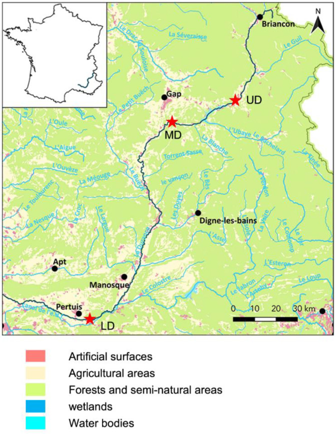
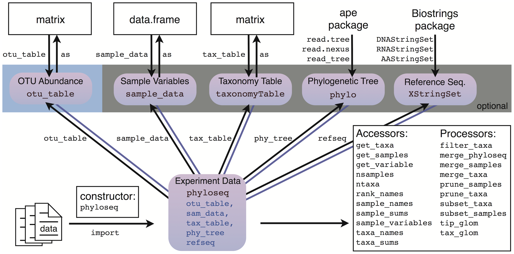
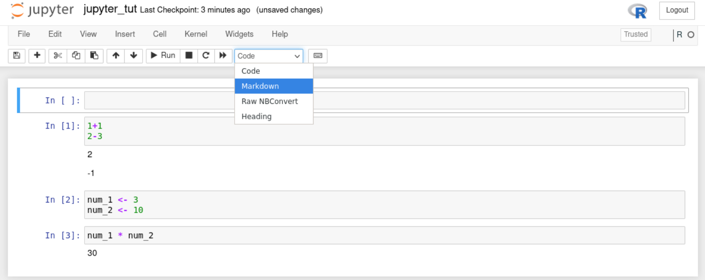

--- 
title: "R community advanced analysis"
author: "Matthew R. Gemmell"
date: "`r Sys.Date()`"
site: bookdown::bookdown_site
output: bookdown::gitbook
documentclass: book
bibliography: [book.bib, packages.bib]
biblio-style: apalike
link-citations: yes
favicon: figures/NEOF_favicon.png
description: NEOF book for the R community advanced analysis course
cover-image: "figures/NEOF.png"
---
```{r include=FALSE, cache=FALSE}
library(webexercises)
```

```{r, echo=FALSE}
#Change colour, border, and text of code chunks
#Check style.css for .Rchunk
#https://stackoverflow.com/questions/65627531/change-r-chunk-background-color-in-bookdown-gitbook
#https://bookdown.org/yihui/rmarkdown-cookbook/chunk-styling.html
knitr::opts_chunk$set(class.source="Rchunk") 
```

```{r cite-packages, include = FALSE}
# automatically create a bib database for R packages
# add any packages you want to cite here
knitr::write_bib(c(
  .packages(), 'bookdown', 'webexercises'
), 'packages.bib')
```

<center>
{style="border-radius: 15px; width: 300px"}
</center>

# (PART\*) Intro {-}

# Introduction
<center>
{style="width:200px"}
</center>


A lot of different analyses and visualisations can be carried out with community data. This includes taxonomy and functional abundance tables from 16S rRNA and Shotgun metagenomics analysis. This workshop will teach you how to use R with the `phyloseq` R object; a specialised object containing an abundance, taxonomy, and metadata table. 

The workshop will use a 16S dataset that has been pre-analysed with QIIME2 to create the ASV table, taxonomy table, and phylogenetic tree. [Supplementary materials](https://neof-workshops.github.io/R_community_whqkt8/Supplemental/) will show how to import Bracken shotgun metagenomic abundance data and generic abundance data frames into a phyloseq object.
 
The sessions will start with a brief presentation followed by self-paced computer practicals guided by this online interactive book. This book contains theory and practice code. This will be reinforced with multiple choice questions that will recap concepts and aid in interpretation of results.

At the end of the course learners will be able to:

- Import QIIME2 artifacts into a phyloseq object.
- Summarise the abundance and taxonomy contents of a phyloseq object
- Preprocess the abundance and taxonomy tables. This will include transforming sample counts, and subsetting samples & taxonomies.
- Understand the grammar of graphics (ggplot2) used by phyloseq and related packages.
- Carry out alpha & beta diversity, and biomarker detection with the phyloseq object.
- Produce and customise publication quality plots.
- Run statistical analysis.

There are [supplemental](https://neof-workshops.github.io/R_community_whqkt8/Supplemental/) materials including importing other types of data into phyloseq, and the use of R plotly to produce interactive HTML based plots.

## Table of contents {-}

```{r, echo=FALSE, align="centre"}
#Create 2 column dataframe
column_1 <- c(
  #1 intro
  '[**Intro**](#datasetandworkflowchap)', 
 '[{height="150"}](#datasetandworkflowchap)',
 #3 Setup
    '[**Set-up**](#setupchap)', 
 '[{height="150"}](#setupchap)',
 #5 Data prep
   '[**Data preparation**](#preprocess_section)', 
 '[{height="150"}](#preprocess_section)',
 #7 Taxa relabund
   '[**Taxonomy relative abundance**](#taxa_relabund_chap)', 
 '[{height="150"}](#taxa_relabund_chap)',
 #9 Rarefaction
 '[**Rarefaction**](#rarefaction_chap)', 
 '[{height="150"}](#rarefaction_chap)',
 #11 Beta
  '[**Beta diversity**](#beta_chap)', 
 '[{height="150"}](#beta_chap)',
 #13 Summary
   '[**Summary**](#sumchap)', 
 '[{style="height:150px; border-radius:15px; background:white"}](#sumchap)'
)
column_2 <- c(
  #2: R packages
  '[**R packages**](#rpackchap)', 
 '[{height="150"}](#rpackchap)',
 #4 Jupyter
   '[**Jupyter**](#jupyterchap)', 
 '[{style="height:150px; border-radius:15px; background:white"}](#jupyterchap)',
 #6 Min reads
   '[**Minimum read depth**](#mindepthchap)', 
 '[{height="150"}](#mindepthchap)',
 #8 taxa plots
 '[**Taxa plots**](#chaptaxaplots)', 
 '[{height="150"}](#chaptaxaplots)',
 #10 ALpha
 '[**Alpha diversity**](#alpha_chap)', 
 '[{height="150"}](#alpha_chap)',
 #12 DA
  '[**Differential abundance**](#DA_chap)', 
 '[{height="150"}](#DA_chap)',
   #14 appendix
    '[**Appendix**](#mambainstalls)', 
 '[{style="height:150px; border-radius:15px; background:null"}](#mambainstalls)'
)
table_df <- data.frame(column_1, column_2)
#Kable and kableextra libraries
library(knitr)
library(kableExtra)
#Create table
#ALign both column in centre (align = "cc")
table_df %>%
  kbl(align= "cc", col.names = NULL) %>%
  kable_styling(position = "center")
```

<a rel="license" href="http://creativecommons.org/licenses/by-nc-sa/4.0/"></a><br />This work is licensed under a <a rel="license" href="http://creativecommons.org/licenses/by-nc-sa/4.0/">Creative Commons Attribution-NonCommercial-ShareAlike 4.0 International License</a>.

<!--chapter:end:01-R_community_main_workflow.Rmd-->

```{r include=FALSE, cache=FALSE}
library(webexercises)
```
# Dataset & workflow {#datasetandworkflowchap}
<center>
{style="width:200px"}
</center>

## Dataset
<center>
{style="border-radius: 5px; width: 500px; border: 5px solid #333333"}
</center>

In this tutorial we will be using a 16S metabarcoding dataset derived from surface water from the Durance River in the south-east of France.
Two major comparisons were carried out in combination with each other.

[Link to paper](https://www.mdpi.com/2076-2607/8/8/1129)

### Sites
<center>
{style="width:200px"}
</center>

Three different sites were chosen on the Durance River. These three sites were representative of an anthropisation (transformation of land by humans) gradient along a river stream. These sites were:

- __Upper Durance sampling site (UD)__: Alpine part of the river with little/no anthropisation.
- __Middle Durance sampling site (MD)__: Upper part of agricultural land dominated by apple and pear production.
- __Lower Durance sampling site (LD)__: Lower part of agricultural land with intensive production of fruits, cereals, and vegetables.

### Culture media
<center>
{style="width:200px"}
</center>

Surface water was sampled and different culture media were used to produce bacterial lawns for each site. The media used were:

- __Environmental sample (ENV)__: No media used, frozen at -20°C.
- __TSA 10%__ incubated at 28°C for 2 days.
- __KBC__ incubated at 28°C for 2 days.
- __CVP__ incubated at 28°C for 3 days.

### Summary & questions {#sum_and_qs}
<center>
{style="width:200px"}
</center>

Each sample and media combination was produced in replicates of three giving a total of 36 samples (3 X 4 X 3 = 36). The three replicates were cultured on three different plates with the same media. An ASV table, taxonomy table, and phylogenetic tree were produced with QIIME2 and DADA2.

With this data we can ask and investigate the following questions:

- How do the bacterial communities change across the anthropisation gradient?
- Is there a difference in the replicates of one site and media combination? I.e. do any of the media produce inconsistent profiles?
- Is there more difference between the sites or the media used?
- Do the media samples differ from the ENV samples? If so, how?

## Workflow
<center>
{style="width:200px; border-radius:15px; background:white"}
</center>

1. [Import](#import_chap): Import QIIME2 artifacts into a `phyloseq` object with `qiime2R`.
2. [Summarisations](#sum_phyloseq_chap): Check our `phyloseq` object with summarisations.
3. [Minimum depth](#mindepthchap): Determine the minimum depth we should use and remove samples with lower depth.
4. [Taxanomic relative abundance](#taxa_relabund_chap): Create taxonomic relative abundance tables.
5. [Taxa plots](#chaptaxaplots): Produce heat maps and bar plots of taxa relative abundances.
6. [Family and genus](#family_genus_chap): Using the last step to produce family and genus based taxa plots.
7. [Rarefaction](#rarefaction_chap): Carry out sample depth normalisation with rarefactions. This will be used for alpha and beta diversity analysis.
8. [Alpha diversity](#alpha_chap): Carry out alpha diversity analysis through plots and statistics.
9. [Beta diversity](#beta_chap): Carry out beta diversity analysis through plots and statistics.
10. [Differenital abundance anlaysis](#DA_chap): Detect biomarkers compared to a reference group with ANCOM.

<!--chapter:end:02-Dataset_and_workflow.Rmd-->

```{r include=FALSE, cache=FALSE}
library(webexercises)
```
# R Packages {#rpackchap}
<center>
{style="width:200px"}
</center>

During this workshop we will use various R packages with their own intricacies. Before going into analysis we'll introduce you to some of these important concepts.

## R packages/libraries
<center>
{style="width:200px"}
</center>

R packages/libraries contain additional functions, data and code for analysing, manipulating and plotting different types of data. Many common packages will be installed as default when you install R. Other more specialised packages, such as the `ggplot2` package, must be installed by the user.

Packages found on The Comprehensive R Archive Network (CRAN), R’s central software repository, can be installed using the following command.

```{r eval=FALSE}
install.packages("package_name")
```

Every time you reload R you will need to load the packages you require if they are not installed in R by default. To do this type:

```{r eval=FALSE}
library("package_name")
```

I generally have a list of `library()` functions at the top of my R scripts (`.R` files) for all the packages I use in the script.

Throughout this course you will get a lot of practice installing and loading various packages.

`r hide("R package or R Library?")`
R packages are a collection of R functions, data, and compiled code. You can install these into a directory on your computer.

An R library is a directory containing a R package.

Because of this, the terms R package and R library may be used synonymously. We will use the term package in this workshop.
`r unhide()`

As we will be using a lot of packages we shall use double colons (`::`) to specify which package each function belongs to, unless the function is from base R. For example if we use the function `summarize_phyloseq()` from the package `microbiome` we would type the function like below:

__Note__: Do not run the below command.

```{r eval=FALSE}
microbiome::summarize_phyloseq()
```

This convention has 2 benefits:

- We can easily tell which R package each function comes from.
  - This is useful for your future coding where you may copy some, but not all, commands from one script to another. You will therefore know which packages you will need to load.
  - If you need some more documentation about a function you will know what package to look up.
  - Writing your methods will be a lot easier.
- Different packages may have functions with the same name. Specifying the package will ensure you are using the correct function.

## The grammar of graphics
<center>
{style="width:200px"}
</center>

During this course we will be using the grammar of graphics coding approach. This approach is implemented by the R package `ggplot2` to create visualisations such as bar charts, box plots, ordination plots etc. In turn `ggplot2` is used by a host of other packages, some of which we will be using. Although `ggplot2` is R code, its structure is very different and it takes effort to learn. Thankfully, `ggplot2` is very powerful and flexible, and it produces very professional and clean plots.

We will use the `iris` dataset (inbuilt into R) to show an example of `ggplot2` code and its visualisation output. You don't need to run the below code.

__Note__: If you would like to see the contents of the `iris` dataset you can run the command `View(iris)` in your R instance later.

```{r, fig.align='center', f}
#Load library
library(ggplot2)

#Create new ggplot2 object using iris dataset
ggplot2::ggplot(iris, aes(x=Sepal.Length, y=Sepal.Width, colour=Species)) +
  #Make the object a scatter plot 
  ggplot2::geom_point() +
  #Add plot tile
  ggplot2::ggtitle("Iris Sepal length vs width") +
  #Set x and y axis label names
  ggplot2::labs(x = "Sepal length", y = "Sepal width")
```

We will not learn `ggplot2` specifically during this course. However, the structure of creating an object will be used. In the above case the initial object was built with `ggplot`. Subsequently additions and edits were carried out with `+` and various other functions.

An important concept of the grammar of graphics is aesthetics. Aesthetics are the parts of a graphic/plot. In the above command we set the aesthetics with the function `aes()` within the `ggplot()` function. The X aesthetic (i.e. what values are assigned to the x axis) was set as the Sepal length values from the column `Sepal.Length` of the dataframe `iris`. In turn the Y axis values are set to the Sepal width and the colouring of the points are set to the Species.

That was a quick introduction to the grammar of graphics. We will be using this to create visualisations with a `phyloseq` object using various R packages specifically designed for community abundance data within `phyloseq` objects.

For more resources on `ggplot2` please see the [appendix](#ggplot2_appendix) of this book.

## phyloseq
<center>
{style="width:200px"}
</center>

In this book we will be working with [`phyloseq`](https://joey711.github.io/phyloseq/) objects to preprocess  our dataset, create visualisations, and carry out statistical analyses. This is a very popular object type for community abundance datasets as it contains the abundance table, metadata, and taxonomy table in one object, optionally containing the phylogenetic tree and reference sequences if wanted/required.

<center>
{style="border-radius: 15px; width: 800px; border: 5px solid #333333"}
</center>

For more info on `phyloseq` and associated packages please see the [appendix](#phyloseq_appendix).

<!--chapter:end:03-R_packages.Rmd-->

```{r include=FALSE, cache=FALSE}
library(webexercises)
```
# Set-up {#setupchap}
<center>
{style="width:200px"}
</center>

Prior to any analysis we need to setup our environment in the webVNC.

## Logon instructions {#cluster}

For this workshop we will be using Virtual Network Computing (VNC). Connect to the VNC with a browser by using the webVNC link you were sent.

You will now be in a logged-in Linux VNC desktop. 
You will see something as below (there may be only one terminal which is fine). 
If you do not see something similar please ask for assistance.

<center>
{style="width:800px"}
</center>

If the VNC is taking up too much/little space of your browser you can use the zoom of your browser to adjust the size. 
You will most likely need to use your browser's tool bar to accomplish this. 
Ensure you can see the grey borders.

These instructions will not work outside of this workshop. 
If you would like to install your own Linux OS on your desktop or laptop we would recommend Mint Linux 

The following link is a guide to install Mint Linux:  
https://linuxmint-installation-guide.readthedocs.io/en/latest/

## Mamba
<center>
{style="width:200px; border-radius:15px; background:null"}
</center>

This workshop requires a lot of packages. 
These all can be difficult to install with R. 
Instead we have used Mamba forge to install R, its packages, and Jupyter-notebook (more info below). 
To learn more about Mamba-forge and how to create your own environment please see the [appendix](#mamba_install).

To set-up your environment for this workshop please run the following code (you must include the full stop and space at the front of the command).

```{bash, eval=FALSE}
. usercommunity
```

You will have successfully activated the environment if you now see `(r_community)` at the start of your command prompt. 
This indicates you are now in the mamba environment called `r_community` created by the instructor.

If you are interested in the use script you can look at its contents.

```{bash, eval=FALSE}
less /usr/local/bin/usercommunity
```

__Tip:__ press `q` to quit `less`.

For more about mamba and how to create your own `r_community` environment please see the [appendix](#mamba_install)

<!--chapter:end:04-Setup.Rmd-->

```{r include=FALSE, cache=FALSE}
library(webexercises)
```
# Jupyter {#jupyterchap}

<center>
{style="border-radius: 15px; width: 200px; background-color: white"}
</center>


[`Jupyter-notebook`](https://jupyter.org/) is a nice browser based method to write, edit, and run code. It was initally created for Python coding, but has since branched out to many other languages, such as `R`.

We are using it in this workshop for a variety of its properties:

-   It is popular and well maintained.
-   It is lightweight. Other heavier weight programs, such as RStudio, would struggle in our HPC due to the graphical and CPU load.
-   It is interactive and displays code output.
-   It allows for easier annotation, editing, and debugging than the command line.
-   It provides a graphical interface for changing directories and choosing files.

Before carrying out any analysis we will go through a quick tutorial of `jupyter-notebook`.

__Note:__ There is a [video tutorial](#jup_vid_tut) of this chapter at the bottom of this page if you prefer to watch it.

## Open Jupyter-notebook

The first step is to open `jupyter-notebook`. Run the below command in your `(r_community)` environment.

```{bash, eval=FALSE}
jupyter-notebook
```

This will open `jupyter-notebook` in firefox. We won't need to access the linux terminal anymore. Leave the terminal running `jupyter-notebook` and full screen your `firefox` so you should see something like below.

`r hide("Can't see the whole webVNC window?")`
You may need to zoom out with your browser so you can see the full webVNC window.

- __Chrome__: Click on the __three dots in vertical line__ (
```{r, echo=FALSE}
icons::ionicons("ellipsis-vertical")
``` 
) on the top left for a dropdown menu which includes zoom options.
- __Edge__: Click on the __three horizontal lines__ (
```{r, echo=FALSE}
icons::ionicons("ellipsis-horizontal")
``` 
) on the top left for a dropdown menu which includes zoom options.
- __Firefox__: Click on the __three dots in horizontal line__ (
```{r, echo=FALSE}
icons::fontawesome("bars")
```
) on the top left for a dropdown menu which includes zoom options.
`r unhide()`

<center>
{style="width: 1000px; border-radius: 15px; border: 5px solid #333333"}
</center>

## Create R notebook

The next step is to create an R notebook.

1.  Click on the **"New"** button towards the top right, right of the "Upload" button.
2.  From the dropdown click **"R"** below "Python 3 (ipykernel)".

This will open up a new R notebook like below.

<center>
{style="width: 1000px; border-radius: 15px; border: 5px solid #333333"}
</center>

## Cells and code

`Jupyter-notebook` uses **cells** (the grey boxes) to separate code. This is very useful to compartmentalise our code.

There will already be one **cell**. Within the **cell**, type in the below commands.

```{r, eval=FALSE}
1+1
2-3
```

When pressing enter in **cells** it will create a new line. To run all commands in a **cell** press `CTRL + enter`.

Run your current **cell** and you should see something like below.

<center>
{style="width: 1000px; border-radius: 15px; border: 5px solid #333333"}
</center>

## Create new cells

You can create new **cells** by 2 different means.

-   Press the `+` button on the tool bar (between the floppy disk
```{r, echo=FALSE}
icons::icon_style(icons::ionicons("save-outline"), background="white")
``` 
and scissors
```{r, echo=FALSE}
icons::icon_style(icons::ionicons("cut"), background="white")
``` 
). This will add a **cell** below your currently selected **cell**.
-   Click on the **`Insert`** button and use the dropdown to add a cell above or below your currently selected cell.

**Tip:** Hover over the toolbar icons to display a text based description of its function.

With that knowledge add a second **cell** below the first **cell**. Add the following code to your second **cell** but do not run it.

```{r, eval=FALSE}
num_1 <- 3
num_2 <- 10
```

**Tip:** Notice there are green lines around your selected cell.

Insert a third **cell** and add the following code to it. Do not run the code.

```{r, eval=FALSE}
num_1 * num_2
```

## Running code

Try to run the code in the third **cell**. There should be an error as we have not created the objects `num_1` & `num_2`. We have only written the code for these objects but not run them.

We can run all the code in a notebook starting from the first **cell** to the last **cell**.

To run all **cells** from the start:

-   Click on the **"Cell"** button.
-   Click **"Run All"** from the drop-down options.

You should then see something like the below in your notebook.

<center>
{style="width: 1000px; border-radius: 15px; border: 5px solid #333333"}
</center>

There is no output printed for __cell__ 2 because we are assigning variables. However, the correct output for Cell 3 is below it. This is because the variables were assigned in **cell** 2 before **cell** 3 was run.

## Saving the file
<center>
{style="width:100px"}
</center>

As with RStudio and other good coding interfaces we can save our notebook.

First we should rename the file. Rename the notebook to **"jupyter_tut.ipynb"**:

1.  Click on the name of the notebook, currently called **"Untitled"**.
    -   This is at the very top of the notebook, right of the Jupyter logo.
2.  A pop-up called **"Rename Notebook"** will appear. Change the Name to **"jupyter_tut.ipynb"**.
3.  Click **"Rename"**.

Now we can save the file. Two methods to save are:

-   Click the floppy disk 
```{r, echo=FALSE}
icons::icon_style(icons::ionicons("save-outline"), background="white")
``` 
on the toolbar.
-   Click on the **"File"** button. Click **"Save and Checkpoint"** from the dropdown options.

## Title cells with markdown

We will be using multiple notebooks in this workshop. We will also have multiple sections per notebook. It will be useful to create header cells with markdown to create visual separation of the different sections.

To add a header __cell__ to the top of our notebook:

-   Create a new __cell__ at the top of the notebook.
-   Click on the **"Code"** drop down and select **"Markdown"**.
    -   The **"Heading"** option no longer works.

<center>{style="width: 1000px; border-radius: 15px; border: 5px solid #333333"}</center>

-   Add the following to the **"Markdown"** cell to create a first level header.
    -   Ensure you have a space between the `#` and header text ("Tutorial").

```{r, eval=FALSE}
# Tutorial
```

Great, we can now add nice headers in our notebooks. **Save** the notebook once more before carrying on to the next section.

`r hide("Markdown")` 
You won't need to know more about `Markdown` but if you are interested please see the [`Markdown` guide](https://www.markdownguide.org/basic-syntax/). 
`r unhide()`

## Close the notebook

To close the notebook:

-   Click on **"File"**.
-   From the dropdown options click **"Close and Halt"**.

When you are back in the file explorer page you may not yet see the new file you saved. If so, you will need to refresh the page with the Refresh button 
```{r, echo=FALSE}
icons::icon_style(icons::ionicons("refresh"), background="white")
``` 
towards the top right.

<center>
{style="width: 1000px; border-radius: 15px; border: 5px solid #333333"}
</center>

With that quick tutorial of `jupyter-notebook` we can start our community analysis in the next chapter.

For more info on `jupter-notebook` please see the [appendix](#jupyter_appendix).

## Video tutorial {#jup_vid_tut}
<div class="container">
<iframe src="https://www.youtube.com/embed/-c_6HoPMw9g" 
frameborder="0" allowfullscreen class="video"></iframe>
</div>

<!--chapter:end:05-Jupyter.Rmd-->

---
editor_options: 
  markdown: 
    wrap: sentence
---
```{r include=FALSE, cache=FALSE}
library(webexercises)
```

# (PART\*) Iterative rarefaction {.unnumbered}

# Iterative rarefaction intro {#rarefaction_intro_chap}

<center>!
[](figures/half_tablespoon.png){style="width:200px"}
</center>

Rarefaction is the process of randomly subsetting samples so the total count values are identical across all samples.
Rarefaction is intended to correct for bias caused by varying sampling depths across the samples to be analysed.

## Should you rarefy?

Rarefaction can be a hotly debated topic with two main points of view.

1.  Some researchers believe it is not appropriate.
    1.  This is backed up by the 2014 paper ["Waste Not, Want Not: Why Rarefying Microbiome Data Is Inadmissible"](https://journals.plos.org/ploscompbiol/article?id=10.1371/journal.pcbi.1003531)
    2.  Various R package developers do not recommend it such as the developers of [`phyloseq`](https://joey711.github.io/phyloseq/) & [`microbiome`](https://microbiome.github.io/tutorials/).
2.  Some researchers believe it is appropriate.
    1.  This is backed up by the 2022 paper ["To rarefy or not to rarefy: robustness and efficiency trade-offs of rarefying microbiome data"](https://academic.oup.com/bioinformatics/article/38/9/2389/6536959)
    2.  The QIIME2 developers include rarefaction in their tutorials/SOPs for alpha and beta diversity analysis

We use rarefaction in our analyses but it is ultimately up to you whether you utilise it or not.

## Using iterations

In our initial R community analysis workshop we only rarefy once for each sample.
In this section we will rarefy multiple times to calculate average values for alpha and beta diversity metrics.
This is an iterative rarefaction analysis.

This iterative approach will, in theory, smooth out any extreme results one round of rarefaction may cause, Extreme results being possibly due the random nature of rarefaction.
These extreme results can include:

-   Leaving important features (ASVs, taxonomic groups, etc.) with no counts
-   Causing a few features to have much higher relative abundances than
-   Varying alpha and beta diversity values with different sets of rarefaction

## Section contents

CHECK below sentence

In the next 3 chapters (X-Y) we will learn how to:

-   Carry out iterative rarefaction by creating sets of random seeds
-   Using iterative rarefaction to carry out alpha diversity analysis
-   Using iterative rarefaction to carry out beta diversity analysis

<!--chapter:end:06-Iterative_rarefaction.Rmd-->

```{r include=FALSE, cache=FALSE}
library(webexercises)
```
# Rarefaction and random seeds {#rarefaction_randomw_seeds_chap}

<center>{style="width:200px"}</center>

Rarefaction is the process of randomly subsetting samples so the total count values are identical across all samples.
Rarefaction is intended to correct for bias caused by varying sampling depths across the samples to be analysed.

## Should you rarefy?

Rarefaction can be a hotly debated topic with two main points of view.

1.  Some researchers believe it is not appropriate.
    1.  This is backed up by the 2014 paper ["Waste Not, Want Not: Why Rarefying Microbiome Data Is Inadmissible"](https://journals.plos.org/ploscompbiol/article?id=10.1371/journal.pcbi.1003531)
    2.  Various R package developers do not recommend it such as the developers of [`phyloseq`](https://joey711.github.io/phyloseq/) & [`microbiome`](https://microbiome.github.io/tutorials/).
2.  Some researchers believe it is appropriate.
    1.  This is backed up by the 2022 paper ["To rarefy or not to rarefy: robustness and efficiency trade-offs of rarefying microbiome data"](https://academic.oup.com/bioinformatics/article/38/9/2389/6536959)
    2.  The QIIME2 developers include rarefaction in their tutorials/SOPs for alpha and beta diversity analysis

We use rarefaction in our analyses but it is ultimately up to you whether you utilise it or not.

## Using iterations

In our initial R community analysis workshop we only rarefy once for each sample.
In this section we will rarefy multiple times to calculate average values for alpha and beta diversity metrics.
This is an iterative rarefaction analysis.

This iterative approach will, in theory, smooth out any extreme results one round of rarefaction may cause, Extreme results being possibly due the random nature of rarefaction.
These extreme results can include:

-   Leaving important features (ASVs, taxonomic groups, etc.) with no counts
-   Causing a few features to have much higher relative abundances than
-   Varying alpha and beta diversity values with different sets of rarefaction

## Section contents

CHECK below sentence

In the next 3 chapters (X-Y) we will learn how to:

-   Carry out iterative rarefaction by creating sets of random seeds
-   Using iterative rarefaction to carry out alpha diversity analysis
-   Using iterative rarefaction to carry out beta diversity analysis

<!--chapter:end:07-Rarefaction_and_random_seeds.Rmd-->

