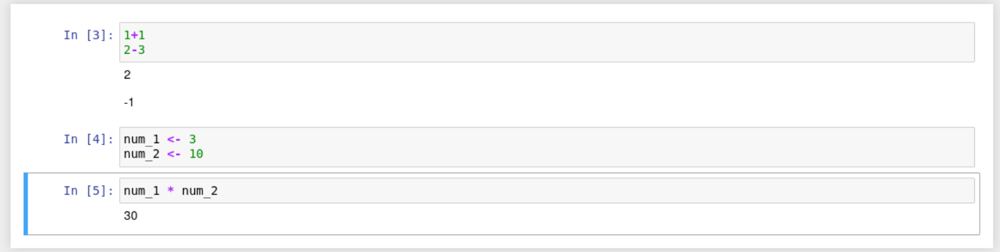

--- 
title: "R community analysis"
author: "Matthew R. Gemmell"
date: "`r Sys.Date()`"
site: bookdown::bookdown_site
output: bookdown::gitbook
documentclass: book
bibliography: [book.bib, packages.bib]
biblio-style: apalike
link-citations: yes
favicon: figures/NEOF_favicon.png
description: NEOF book for the R community analysis workflow
cover-image: "figures/NEOF.png"
---
```{r include=FALSE, cache=FALSE}
library(webexercises)
```

```{r, echo=FALSE}
#Change colour, border, and text of code chunks
#Check style.css for .Rchunk
#https://stackoverflow.com/questions/65627531/change-r-chunk-background-color-in-bookdown-gitbook
#https://bookdown.org/yihui/rmarkdown-cookbook/chunk-styling.html
knitr::opts_chunk$set(class.source="Rchunk") 
```

```{r cite-packages, include = FALSE}
# automatically create a bib database for R packages
# add any packages you want to cite here
knitr::write_bib(c(
  .packages(), 'bookdown', 'webexercises'
), 'packages.bib')
```

<center>
{style="border-radius: 15px; width: 300px"}
</center>

# (PART\*) Intro {-}

# Introduction
<center>
{style="width:200px"}
</center>


A lot of different analyses and visualisations can be carried out with community data. This includes taxonomy and functional abundance tables from 16S rRNA and Shotgun metagenomics analysis. This workshop will teach you how to use R with the `phyloseq` R object; a specialised object containing an abundance, taxonomy, and metadata table. 

The workshop will use a 16S dataset that has been pre-analysed with QIIME2 to create the ASV table, taxonomy table, and phylogenetic tree. [Supplementary materials](https://neof-workshops.github.io/R_community_whqkt8/Supplemental/) will show how to import Bracken shotgun metagenomic abundance data and generic abundance data frames into a phyloseq object.
 
The sessions will start with a brief presentation followed by self-paced computer practicals guided by this online interactive book. This book contains theory and practice code. This will be reinforced with multiple choice questions that will recap concepts and aid in interpretation of results.

At the end of the course learners will be able to:

- Import QIIME2 artifacts into a phyloseq object.
- Summarise the abundance and taxonomy contents of a phyloseq object
- Preprocess the abundance and taxonomy tables. This will include transforming sample counts, and subsetting samples & taxonomies.
- Understand the grammar of graphics (ggplot2) used by phyloseq and related packages.
- Carry out alpha & beta diversity, and biomarker detection with the phyloseq object.
- Produce and customise publication quality plots.
- Run statistical analysis.

There are [supplemental](https://neof-workshops.github.io/R_community_whqkt8/Supplemental/) materials including importing other types of data into phyloseq, and the use of R plotly to produce interactive HTML based plots.

## Table of contents {-}

```{r, echo=FALSE, align="centre"}
#Create 2 column dataframe
column_1 <- c(
  #1 intro
  '[**Intro**](#datasetandworkflowchap)', 
 '[{height="150"}](#datasetandworkflowchap)',
 #3 Setup
    '[**Set-up**](#setupchap)', 
 '[{height="150"}](#setupchap)',
 #5 Data prep
   '[**Data preparation**](#preprocess_section)', 
 '[{height="150"}](#preprocess_section)',
 #7 Taxa relabund
   '[**Taxonomy relative abundance**](#taxa_relabund_chap)', 
 '[{height="150"}](#taxa_relabund_chap)',
 #9 Rarefaction
 '[**Rarefaction**](#rarefaction_chap)', 
 '[{height="150"}](#rarefaction_chap)',
 #11 Beta
  '[**Beta diversity**](#beta_chap)', 
 '[{height="150"}](#beta_chap)',
 #13 Summary
   '[**Summary**](#sumchap)', 
 '[{style="height:150px; border-radius:15px; background:white"}](#sumchap)'
)
column_2 <- c(
  #2: R packages
  '[**R packages**](#rpackchap)', 
 '[{height="150"}](#rpackchap)',
 #4 Jupyter
   '[**Jupyter**](#jupyterchap)', 
 '[{style="height:150px; border-radius:15px; background:white"}](#jupyterchap)',
 #6 Min reads
   '[**Minimum read depth**](#mindepthchap)', 
 '[{height="150"}](#mindepthchap)',
 #8 taxa plots
 '[**Taxa plots**](#chaptaxaplots)', 
 '[{height="150"}](#chaptaxaplots)',
 #10 ALpha
 '[**Alpha diversity**](#alpha_chap)', 
 '[{height="150"}](#alpha_chap)',
 #12 DA
  '[**Differential abundance**](#DA_chap)', 
 '[{height="150"}](#DA_chap)',
   #14 appendix
    '[**Appendix**](#mambainstalls)', 
 '[{style="height:150px; border-radius:15px; background:null"}](#mambainstalls)'
)
table_df <- data.frame(column_1, column_2)
#Kable and kableextra libraries
library(knitr)
library(kableExtra)
#Create table
#ALign both column in centre (align = "cc")
table_df %>%
  kbl(align= "cc", col.names = NULL) %>%
  kable_styling(position = "center")
```

<a rel="license" href="http://creativecommons.org/licenses/by-nc-sa/4.0/"></a><br />This work is licensed under a <a rel="license" href="http://creativecommons.org/licenses/by-nc-sa/4.0/">Creative Commons Attribution-NonCommercial-ShareAlike 4.0 International License</a>.

<!--chapter:end:01-R_community_main_workflow.Rmd-->

```{r include=FALSE, cache=FALSE}
library(webexercises)
```
# Dataset & workflow {#datasetandworkflowchap}
<center>
{style="width:200px"}
</center>

## Dataset
<center>
{style="border-radius: 5px; width: 500px; border: 5px solid #333333"}
</center>

In this tutorial we will be using a 16S metabarcoding dataset derived from surface water from the Durance River in the south-east of France.
Two major comparisons were carried out in combination with each other.

[Link to paper](https://www.mdpi.com/2076-2607/8/8/1129)

### Sites
<center>
{style="width:200px"}
</center>

Three different sites were chosen on the Durance River. These three sites were representative of an anthropisation (transformation of land by humans) gradient along a river stream. These sites were:

- __Upper Durance sampling site (UD)__: Alpine part of the river with little/no anthropisation.
- __Middle Durance sampling site (MD)__: Upper part of agricultural land dominated by apple and pear production.
- __Lower Durance sampling site (LD)__: Lower part of agricultural land with intensive production of fruits, cereals, and vegetables.

### Culture media
<center>
{style="width:200px"}
</center>

Surface water was sampled and different culture media were used to produce bacterial lawns for each site. The media used were:

- __Environmental sample (ENV)__: No media used, frozen at -20°C.
- __TSA 10%__ incubated at 28°C for 2 days.
- __KBC__ incubated at 28°C for 2 days.
- __CVP__ incubated at 28°C for 3 days.

### Summary & questions {#sum_and_qs}
<center>
{style="width:200px"}
</center>

Each sample and media combination was produced in replicates of three giving a total of 36 samples (3 X 4 X 3 = 36). The three replicates were cultured on three different plates with the same media. An ASV table, taxonomy table, and phylogenetic tree were produced with QIIME2 and DADA2.

With this data we can ask and investigate the following questions:

- How do the bacterial communities change across the anthropisation gradient?
- Is there a difference in the replicates of one site and media combination? I.e. do any of the media produce inconsistent profiles?
- Is there more difference between the sites or the media used?
- Do the media samples differ from the ENV samples? If so, how?

## Workflow
<center>
{style="width:200px; border-radius:15px; background:white"}
</center>

1. [Import](#import_chap): Import QIIME2 artifacts into a `phyloseq` object with `qiime2R`.
2. [Summarisations](#sum_phyloseq_chap): Check our `phyloseq` object with summarisations.
3. [Minimum depth](#mindepthchap): Determine the minimum depth we should use and remove samples with lower depth.
4. [Taxanomic relative abundance](#taxa_relabund_chap): Create taxonomic relative abundance tables.
5. [Taxa plots](#chaptaxaplots): Produce heat maps and bar plots of taxa relative abundances.
6. [Family and genus](#family_genus_chap): Using the last step to produce family and genus based taxa plots.
7. [Rarefaction](#rarefaction_chap): Carry out sample depth normalisation with rarefactions. This will be used for alpha and beta diversity analysis.
8. [Alpha diversity](#alpha_chap): Carry out alpha diversity analysis through plots and statistics.
9. [Beta diversity](#beta_chap): Carry out beta diversity analysis through plots and statistics.
10. [Differenital abundance anlaysis](#DA_chap): Detect biomarkers compared to a reference group with ANCOM.

<!--chapter:end:02-Dataset_and_workflow.Rmd-->

```{r include=FALSE, cache=FALSE}
library(webexercises)
```
# R Packages {#rpackchap}
<center>
{style="width:200px"}
</center>

During this workshop we will use various R packages with their own intricacies. Before going into analysis we'll introduce you to some of these important concepts.

## R packages/libraries
<center>
{style="width:200px"}
</center>

R packages/libraries contain additional functions, data and code for analysing, manipulating and plotting different types of data. Many common packages will be installed as default when you install R. Other more specialised packages, such as the `ggplot2` package, must be installed by the user.

Packages found on The Comprehensive R Archive Network (CRAN), R’s central software repository, can be installed using the following command.

```{r eval=FALSE}
install.packages("package_name")
```

Every time you reload R you will need to load the packages you require if they are not installed in R by default. To do this type:

```{r eval=FALSE}
library("package_name")
```

I generally have a list of `library()` functions at the top of my R scripts (`.R` files) for all the packages I use in the script.

Throughout this course you will get a lot of practice installing and loading various packages.

`r hide("R package or R Library?")`
R packages are a collection of R functions, data, and compiled code. You can install these into a directory on your computer.

An R library is a directory containing a R package.

Because of this, the terms R package and R library may be used synonymously. We will use the term package in this workshop.
`r unhide()`

As we will be using a lot of packages we shall use double colons (`::`) to specify which package each function belongs to, unless the function is from base R. For example if we use the function `summarize_phyloseq()` from the package `microbiome` we would type the function like below:

__Note__: Do not run the below command.

```{r eval=FALSE}
microbiome::summarize_phyloseq()
```

This convention has 2 benefits:

- We can easily tell which R package each function comes from.
  - This is useful for your future coding where you may copy some, but not all, commands from one script to another. You will therefore know which packages you will need to load.
  - If you need some more documentation about a function you will know what package to look up.
  - Writing your methods will be a lot easier.
- Different packages may have functions with the same name. Specifying the package will ensure you are using the correct function.

## The grammar of graphics
<center>
{style="width:200px"}
</center>

During this course we will be using the grammar of graphics coding approach. This approach is implemented by the R package `ggplot2` to create visualisations such as bar charts, box plots, ordination plots etc. In turn `ggplot2` is used by a host of other packages, some of which we will be using. Although `ggplot2` is R code, its structure is very different and it takes effort to learn. Thankfully, `ggplot2` is very powerful and flexible, and it produces very professional and clean plots.

We will use the `iris` dataset (inbuilt into R) to show an example of `ggplot2` code and its visualisation output. You don't need to run the below code.

__Note__: If you would like to see the contents of the `iris` dataset you can run the command `View(iris)` in your R instance later.

```{r, fig.align='center', f}
#Load library
library(ggplot2)

#Create new ggplot2 object using iris dataset
ggplot2::ggplot(iris, aes(x=Sepal.Length, y=Sepal.Width, colour=Species)) +
  #Make the object a scatter plot 
  ggplot2::geom_point() +
  #Add plot tile
  ggplot2::ggtitle("Iris Sepal length vs width") +
  #Set x and y axis label names
  ggplot2::labs(x = "Sepal length", y = "Sepal width")
```

We will not learn `ggplot2` specifically during this course. However, the structure of creating an object will be used. In the above case the initial object was built with `ggplot`. Subsequently additions and edits were carried out with `+` and various other functions.

An important concept of the grammar of graphics is aesthetics. Aesthetics are the parts of a graphic/plot. In the above command we set the aesthetics with the function `aes()` within the `ggplot()` function. The X aesthetic (i.e. what values are assigned to the x axis) was set as the Sepal length values from the column `Sepal.Length` of the dataframe `iris`. In turn the Y axis values are set to the Sepal width and the colouring of the points are set to the Species.

That was a quick introduction to the grammar of graphics. We will be using this to create visualisations with a `phyloseq` object using various R packages specifically designed for community abundance data within `phyloseq` objects.

For more resources on `ggplot2` please see the [appendix](#ggplot2_appendix) of this book.

## phyloseq
<center>
{style="width:200px"}
</center>

In this book we will be working with [`phyloseq`](https://joey711.github.io/phyloseq/) objects to preprocess  our dataset, create visualisations, and carry out statistical analyses. This is a very popular object type for community abundance datasets as it contains the abundance table, metadata, and taxonomy table in one object, optionally containing the phylogenetic tree and reference sequences if wanted/required.

<center>
{style="border-radius: 15px; width: 800px; border: 5px solid #333333"}
</center>

For more info on `phyloseq` and associated packages please see the [appendix](#phyloseq_appendix).

<!--chapter:end:03-R_packages.Rmd-->

```{r include=FALSE, cache=FALSE}
library(webexercises)
```
# Set-up {#setupchap}
<center>
{style="width:200px"}
</center>

Prior to any analysis we need to setup our environment in the webVNC.

## Logon instructions {#cluster}

For this workshop we will be using Virtual Network Computing (VNC). Connect to the VNC with a browser by using the webVNC link you were sent.

You will now be in a logged-in Linux VNC desktop. 
You will see something as below (there may be only one terminal which is fine). 
If you do not see something similar please ask for assistance.

<center>
{style="width:800px"}
</center>

If the VNC is taking up too much/little space of your browser you can use the zoom of your browser to adjust the size. 
You will most likely need to use your browser's tool bar to accomplish this. 
Ensure you can see the grey borders.

These instructions will not work outside of this workshop. 
If you would like to install your own Linux OS on your desktop or laptop we would recommend Mint Linux 

The following link is a guide to install Mint Linux:  
https://linuxmint-installation-guide.readthedocs.io/en/latest/

## Mamba
<center>
{style="width:200px; border-radius:15px; background:null"}
</center>

This workshop requires a lot of packages. 
These all can be difficult to install with R. 
Instead we have used Mamba forge to install R, its packages, and Jupyter-notebook (more info below). 
To learn more about Mamba-forge and how to create your own environment please see the [appendix](#mamba_install).

To set-up your environment for this workshop please run the following code (you must include the full stop and space at the front of the command).

```{bash, eval=FALSE}
. usercommunity
```

You will have successfully activated the environment if you now see `(r_community)` at the start of your command prompt. 
This indicates you are now in the mamba environment called `r_community` created by the instructor.

If you are interested in the use script you can look at its contents.

```{bash, eval=FALSE}
less /usr/local/bin/usercommunity
```

__Tip:__ press `q` to quit `less`.

For more about mamba and how to create your own `r_community` environment please see the [appendix](#mamba_install)

<!--chapter:end:04-Setup.Rmd-->

```{r include=FALSE, cache=FALSE}
library(webexercises)
```
# Jupyter {#jupyterchap}

<center>
{style="border-radius: 15px; width: 200px; background-color: white"}
</center>


[`Jupyter-notebook`](https://jupyter.org/) is a nice browser based method to write, edit, and run code. It was initally created for Python coding, but has since branched out to many other languages, such as `R`.

We are using it in this workshop for a variety of its properties:

-   It is popular and well maintained.
-   It is lightweight. Other heavier weight programs, such as RStudio, would struggle in our HPC due to the graphical and CPU load.
-   It is interactive and displays code output.
-   It allows for easier annotation, editing, and debugging than the command line.
-   It provides a graphical interface for changing directories and choosing files.

Before carrying out any analysis we will go through a quick tutorial of `jupyter-notebook`.

__Note:__ There is a [video tutorial](#jup_vid_tut) of this chapter at the bottom of this page if you prefer to watch it.

## Open Jupyter-notebook

The first step is to open `jupyter-notebook`. Run the below command in your `(r_community)` environment.

```{bash, eval=FALSE}
jupyter-notebook
```

This will open `jupyter-notebook` in firefox. We won't need to access the linux terminal anymore. Leave the terminal running `jupyter-notebook` and full screen your `firefox` so you should see something like below.

`r hide("Can't see the whole webVNC window?")`
You may need to zoom out with your browser so you can see the full webVNC window.

- __Chrome__: Click on the __three dots in vertical line__ (
```{r, echo=FALSE}
icons::ionicons("ellipsis-vertical")
``` 
) on the top left for a dropdown menu which includes zoom options.
- __Edge__: Click on the __three horizontal lines__ (
```{r, echo=FALSE}
icons::ionicons("ellipsis-horizontal")
``` 
) on the top left for a dropdown menu which includes zoom options.
- __Firefox__: Click on the __three dots in horizontal line__ (
```{r, echo=FALSE}
icons::fontawesome("bars")
```
) on the top left for a dropdown menu which includes zoom options.
`r unhide()`

<center>
{style="width: 1000px; border-radius: 15px; border: 5px solid #333333"}
</center>

## Create R notebook

The next step is to create an R notebook.

1.  Click on the **"New"** button towards the top right, right of the "Upload" button.
2.  From the dropdown click **"R"** below "Python 3 (ipykernel)".

This will open up a new R notebook like below.

<center>
{style="width: 1000px; border-radius: 15px; border: 5px solid #333333"}
</center>

## Cells and code

`Jupyter-notebook` uses **cells** (the grey boxes) to separate code. This is very useful to compartmentalise our code.

There will already be one **cell**. Within the **cell**, type in the below commands.

```{r, eval=FALSE}
1+1
2-3
```

When pressing enter in **cells** it will create a new line. To run all commands in a **cell** press `CTRL + enter`.

Run your current **cell** and you should see something like below.

<center>
{style="width: 1000px; border-radius: 15px; border: 5px solid #333333"}
</center>

## Create new cells

You can create new **cells** by 2 different means.

-   Press the `+` button on the tool bar (between the floppy disk
```{r, echo=FALSE}
icons::icon_style(icons::ionicons("save-outline"), background="white")
``` 
and scissors
```{r, echo=FALSE}
icons::icon_style(icons::ionicons("cut"), background="white")
``` 
). This will add a **cell** below your currently selected **cell**.
-   Click on the **`Insert`** button and use the dropdown to add a cell above or below your currently selected cell.

**Tip:** Hover over the toolbar icons to display a text based description of its function.

With that knowledge add a second **cell** below the first **cell**. Add the following code to your second **cell** but do not run it.

```{r, eval=FALSE}
num_1 <- 3
num_2 <- 10
```

**Tip:** Notice there are green lines around your selected cell.

Insert a third **cell** and add the following code to it. Do not run the code.

```{r, eval=FALSE}
num_1 * num_2
```

## Running code

Try to run the code in the third **cell**. There should be an error as we have not created the objects `num_1` & `num_2`. We have only written the code for these objects but not run them.

We can run all the code in a notebook starting from the first **cell** to the last **cell**.

To run all **cells** from the start:

-   Click on the **"Cell"** button.
-   Click **"Run All"** from the drop-down options.

You should then see something like the below in your notebook.

<center>
{style="width: 1000px; border-radius: 15px; border: 5px solid #333333"}
</center>

There is no output printed for __cell__ 2 because we are assigning variables. However, the correct output for Cell 3 is below it. This is because the variables were assigned in **cell** 2 before **cell** 3 was run.

## Saving the file
<center>
{style="width:100px"}
</center>

As with RStudio and other good coding interfaces we can save our notebook.

First we should rename the file. Rename the notebook to **"jupyter_tut.ipynb"**:

1.  Click on the name of the notebook, currently called **"Untitled"**.
    -   This is at the very top of the notebook, right of the Jupyter logo.
2.  A pop-up called **"Rename Notebook"** will appear. Change the Name to **"jupyter_tut.ipynb"**.
3.  Click **"Rename"**.

Now we can save the file. Two methods to save are:

-   Click the floppy disk 
```{r, echo=FALSE}
icons::icon_style(icons::ionicons("save-outline"), background="white")
``` 
on the toolbar.
-   Click on the **"File"** button. Click **"Save and Checkpoint"** from the dropdown options.

## Title cells with markdown

We will be using multiple notebooks in this workshop. We will also have multiple sections per notebook. It will be useful to create header cells with markdown to create visual separation of the different sections.

To add a header __cell__ to the top of our notebook:

-   Create a new __cell__ at the top of the notebook.
-   Click on the **"Code"** drop down and select **"Markdown"**.
    -   The **"Heading"** option no longer works.

<center>{style="width: 1000px; border-radius: 15px; border: 5px solid #333333"}</center>

-   Add the following to the **"Markdown"** cell to create a first level header.
    -   Ensure you have a space between the `#` and header text ("Tutorial").

```{r, eval=FALSE}
# Tutorial
```

Great, we can now add nice headers in our notebooks. **Save** the notebook once more before carrying on to the next section.

`r hide("Markdown")` 
You won't need to know more about `Markdown` but if you are interested please see the [`Markdown` guide](https://www.markdownguide.org/basic-syntax/). 
`r unhide()`

## Close the notebook

To close the notebook:

-   Click on **"File"**.
-   From the dropdown options click **"Close and Halt"**.

When you are back in the file explorer page you may not yet see the new file you saved. If so, you will need to refresh the page with the Refresh button 
```{r, echo=FALSE}
icons::icon_style(icons::ionicons("refresh"), background="white")
``` 
towards the top right.

<center>
{style="width: 1000px; border-radius: 15px; border: 5px solid #333333"}
</center>

With that quick tutorial of `jupyter-notebook` we can start our community analysis in the next chapter.

For more info on `jupter-notebook` please see the [appendix](#jupyter_appendix).

## Video tutorial {#jup_vid_tut}
<div class="container">
<iframe src="https://www.youtube.com/embed/-c_6HoPMw9g" 
frameborder="0" allowfullscreen class="video"></iframe>
</div>

<!--chapter:end:05-Jupyter.Rmd-->

```{r include=FALSE, cache=FALSE}
library(webexercises)
```
# (PART\*) Data preparation {-}

# Data prep intro {#preprocess_section}
<center>
{style="width:200px"}
</center>

In the next 3 chapters (7-9) we will learn how to:

- [Import our data.](#import_chap)
- [Summarise our `phyloseq` object.](#sum_phyloseq_chap)
- [Determine the minimum read depth for samples to be used.](#mindepthchap)

We will also use this as a chance to reinforce how to use `jupyter-notebook` with clear instructions. 
However, from chapters 10 onwards you will make more decisions on how many __"Coding"__ and __"Markdown"__ cells you want.

<!--chapter:end:06-Preprocess_part.Rmd-->

```{r include=FALSE, cache=FALSE}
library(webexercises)
```
# Import {#import_chap}
<center>
{style="width:200px"}
</center>

Before carrying out any analysis we first need to import our QIIME2 artifacts into a `phyloseq` object. Thankfully there is an R package called `qiime2R`.

## Import: notebook
<center>
{style="width:200px"}
</center>

Prior to any coding, we will create a new directory, our analysis directory.
Next, we'll create a new notebook called __"1-Import.ipynb"__ in it. 
We will be creating many notebooks and numbering them so we can easily see the order of scripts.

First create a new directory.

- In the notebook file explorer, click the __"New"__ button.
- Select __"Folder"__.

You will have an __"Untitled Folder"__. To rename it:

- Click on the box left of the name.
- Press the __"Rename"__ button that appeared.
- Change the name to __"R_community_workshop"__.
- Click __"Rename"__.

Click on your __"R_community_workshop"__ folder to move into it.

Next step is to create a new R notebook, rename it to __"1-Import.ipynb"__, and save it.

## qiime2R
<center>
{style="width:400px"}
</center>

[`qiime2R`](https://github.com/jbisanz/qiime2R) is an R package for importing QIIME2 artifacts into a R `phyloseq` object. The package contains many different commands. Its function `read_qza()` can read a single artifact at a time.

The best way to import all your QIIME2 artifacts is with the `qiime2R::qza_to_phyloseq()` function. In your __"1-Import.ipynb"__ script, add the following and run the commands.

__Tip__: You can tab complete and/or copy and paste file paths within the webVNC.

```{r, eval=FALSE}
#Cell 1
#Load the package/library
library("qiime2R")

#Import data
pseq <- qiime2R::qza_to_phyloseq(
  features = "/pub14/tea/nsc206/NEOF/R_community/data/table-dada2.qza",
  tree = "/pub14/tea/nsc206/NEOF/R_community/data/rooted-tree.qza",
  taxonomy = "/pub14/tea/nsc206/NEOF/R_community/data/taxonomy.sklearn.qza",
  metadata = "/pub14/tea/nsc206/NEOF/R_community/data/media_metadata.txt"
)
```

This command creates a phyloseq object named `pseq`. It contains:

-   The ASV abundance table (`features = "table-dada2.qza"`).
-   The rooted phylogenetic tree (`tree = "rooted-tree.qza"`).
-   The taxonomic classifications of the ASVs (`taxonomy = "taxonomy.sklearn.qza"`).
-   The sample metadata (`metadata = "media_metadata.txt"`)

## Import: Summarise phyloseq
<center>
{style="width:200px"}
</center>

Now that we have imported the data we can extract some summary information from it.

First we will use the `microbiome` package with its `summarize_phyloseq()` function.

Create a new __cell__ and write + run the below in it.

```{r, eval=FALSE}
#Cell 2
#Load microbiome library
library("microbiome")
#Summary of phyloseq object
microbiome::summarize_phyloseq(pseq)
```

This gives us a plethora of information:

-   The top line tells us if the data is compositional (relative abundance).
-   We get the following list of values in a paragraph and via a list.
    -   __Min. number of reads:__ Number of reads in the sample with the lowest number of reads.
    -   __Max. number of reads:__ Number of reads in the sample with the largest number of reads.
    -   __Total number of reads:__ Sum of all reads across all samples.
    -   __Average number of reads:__ Sum of all reads / number of samples.
    -   __Median number of reads:__ Midpoint read abundance across samples.
    -   __Sparsity:__ See expandable box further down.
    -   __Any OTU sum to 1 or less?:__ States if there are any ASVs with a summed abundance of 1 or less across all the samples. 
    -   __Number of singletons:__ Number of ASVs with a sum of 1 across all samples.
    -   __Percent of OTUs that are singletons:__ Percentage of ASVs that only contain one read across all the samples.
    -   __Number of sample variables are:__ Number of sample variables/groupings in our metadata.
    -   The last line shows the names of the sample variables/groupings in our metadata.

`r hide("Sparsity")`
Sparsity is a measure of the number of 0s in a table. It can be represented by the following equation:

$$
sparsity = Z/C
$$

Where:

-   Z = The number of cells that equal zero.
-   C = The total number of cells.

Let's look at an example of an abundance table with a small amount of ASVs and Samples.

|      | Sample1 | Sample2 | Sample3 |
|------|---------|---------|---------|
| ASV1 | 0       | 10      | 24      |
| ASV2 | 1       | 0       | 37      |
| ASV3 | 6       | 25      | 0       |
| ASV4 | 51      | 2       | 0       |

- This abundance table has 12 cells (3 samples \* 4 ASVs). 
- Of these cells, 4 have an abundance of zero. 
- 4/12 = 0.3333, therefore its sparsity is 0.3333.

Sparsity can be any value from 0-1. The higher the value the more sparse it is, with a value of 1 meaning all the cells have an abundance of zero. The lower the value the less sparse it is, with a value of 0 meaning all the cells have an abundance of 1 or more.

16S data is known to be sparse so high sparsity is not unexpected. Keep in mind that lower levels of taxa (ASVs, Species, & Genera) will generally have more sparse tables that higher levels of taxa (Kingdom, Phylum, Class).
`r unhide()`

If you would like to see how the function calculates its values you can view the [source code online](https://rdrr.io/github/microbiome/microbiome/src/R/summarize_phyloseq.R).

## Save the phyloseq object
<center>
{style="width:200px"}
</center>

When using multiple notebooks/scripts for analysis it is useful to save the R objects that will be used in different notebooks/scripts. This can be carried out with the function `save()`.

Write and run the following code in a third __cell__.

```{r, eval=FALSE}
#Cell 3
#Save phyloseq as file
save(pseq, file = "phyloseq.RData")
```

This saves our object `pseq` into the file `phyloseq.RData`. The suffix `.RData` is the normal convention.

We have saved our final object of the notebook. Close and halt it.

## Import: recap
<center>
{style="width:200px; border-radius:15px; background:white"}
</center>

We have imported our QIIME2 artifacts into one `phyloseq` object so we can analyse the data in R. This object has been saved into a ".RData" file which we will load in the next chapter.

<!--chapter:end:07-Import.Rmd-->

```{r include=FALSE, cache=FALSE}
library(webexercises)
```
# Summarise phyloseq {#sum_phyloseq_chap}
<center>
{style="width:200px; border-radius:15px; background:white"}
</center>

For the next 2 chapters we will use one notebook. We will setup this notebook with packages and the `phyloseq` object we created in the last chapter.

After this, we will summarise the `phyloseq` object. We will investigate the read depth of samples and the number of ASVs in our dataset.

## Summarise: setup
<center>
{style="width:200px; border-radius:15px; background:white"}
</center>

Before starting analysis create and save a new `R` notebook called __"2-Preprocess.ipynb"__ in the analysis directory (when renaming you don't need to include the suffix).

It is useful to add a title to the top of the notebook. 
Create a __"Markdown"__ __cell__ and add the following first level header:

```{r, eval=FALSE}
# Preprocessing data notebook
```

The first section of our notebook will be used for setup.
This will involve loading packages and data we need. 

For good documentation add a second level heading to the first __"Markdown"__ cell. 

```{r, eval=FALSE}
## Setup
```

To decrease the level of a heading add another `#`.

- `# `: 1st level header.
- `## `: 2nd level header.
- `### `: 3rd level header etc...

I like to load all the packages to be used in the notebook in this section. We will explain their uses later in this chapter. Add the below to a new __"Code"__ cell in your notebook:

```{r, eval=FALSE}
#Packages
library("phyloseq")
library("microbiome")
library("vegan")
library("IRdisplay")
```

Our last bit of set-up is to load in our abundance `phyloseq` object we created in the previous chapter.

```{r, eval=FALSE}
#Load the phyloseq object
load("phyloseq.RData")
```

Ensure you have run the code in this cell.

### Summarise header
<center>
{style="width:200px; border-radius:15px; background:white"}
</center>

When you load in a dataset it is always useful to check it. 
We will therefore use a new section to inspect the data.

In a new __"Markdown"__ cell add the following 2nd level header.

```{r, eval=FALSE}
## Summarise the phyloseq object
```

### Summarise phyloseq
<center>
{style="width:200px"}
</center>

Create a new code __cell__ and add the following annotation and code. Then run the code.

```{r, eval=FALSE}
#Summary of phyloseq object
microbiome::summarize_phyloseq(pseq)
```

We ran this code in the __"01-Import.ipynb"__. You can therefore check if our new output matched the output from that notebook. This should be the case since they are the same data.

Due to the relative large amount of output to screen we'll put the next part into a new __cell__.

### Reads per sample
<center>
{style="width:200px"}
</center>

In a new __cell__ we will use the command `microbiome::readcount()` to store and display the number of reads in each sample within our `phyloseq` object (`pseq`).

```{r, eval=FALSE}
#Number of reads per sample
sample_depths <- microbiome::readcount(pseq)
sample_depths
```

With this info we can make a histogram of read numbers per sample with the base `R` function `hist()`.
We will save this as a `.png` file with the functions `png()` and `dev.off()`.

```{r, eval=FALSE}
#Histogram
#Save as png
png(filename = "./sample_depth_histogram.png", res = 300,
    units = "mm", height = 100, width = 200)
hist(sample_depths, main = "Histogram of read depths")
dev.off()
```

### Display png
<center>
{style="width:200px"}
</center>

We can use the R package [`IRdisplay`](https://github.com/IRkernel/IRdisplay) to display plots from files in `jupyter-notebook`.

Use the function `display_png()` to display our histogram.

```{r, eval=FALSE}
#Display the plot in jupyter notebook
IRdisplay::display_png(file="./sample_depth_histogram.png")
```

This information is very useful. We will use it in the next chapter to determine what our minimum read depth should be.

### ASVs per sample
<center>
{style="width:200px"}
</center>

The last information we will look at before some preprocessing are the ASVs (Amplicon Sequnces Variants).

A useful `phyloseq` command is `otu_table()`. This allows us to extract the ASV/OTU/feature table. With this we can then carry out some other commands.

For demonstrative purposes write and run the following code in its own __cell__ to display the ASV table.

```{r, eval=FALSE}
#Can extract ASV table (known as otu table in phyloseq)
phyloseq::otu_table(pseq)
```

With this function we will extract the number of ASVs in the original abundance table. 
We will then save this in a vector using a new __cell__.

```{r, eval=FALSE}
#Each row is an ASV and each column is a sample
#Therefore we can get the number of ASVs in the data by counting the number of rows
#Let's make a new vector with this info so we can easily keep track
num_asvs_vec <- c(nrow(phyloseq::otu_table(pseq)))
#Give the 1st element a relevant name
names(num_asvs_vec)[1] <- "abundance"
#View current vector
num_asvs_vec
```

Save this vector as a `.Rdata` object in a new __cell__.
This will allow us to load it in future notebooks.
We can remove the object so it doesn't use RAM.

```{r, eval=FALSE}
#Save object as file
save(num_asvs_vec, file= "num_asvs_vec.RData")
#Remove object from environment
rm(num_asvs_vec)
```

## Summarise: recap
<center>
{style="width:200px; border-radius:15px; background:white"}
</center>

We now have an idea of some of the attributes of our dataset. This includes the number of reads and ASVs. We can use this knowledge to carry out some preprocessing.

<!--chapter:end:08-Summarise_phyloseq.Rmd-->

```{r include=FALSE, cache=FALSE}
library(webexercises)
```
# Minimum read depth {#mindepthchap}
<center>
{style="width:200px"}
</center>

It is good to remove samples with a very low read depth (number of sequencing reads).
But determining an appropriate minimum read depth is not trivial.
This value will vary from study to study.
Normally, for 16S data, a depth of at least 20K per sample is suggested.
This is the general consensus for __human microbiome__ data. 

In this chapter we will:

- Cover a brief intro to considerations of what is an acceptable minimum depth for your dataset.
- Reinvestigate our sample depths with a previously created histogram.
- View the depth ranges of different sample groups (site & media) with box plots.
- Create a rarefaction curve to assess if the depth of our samples has captured a good amount of biodiversity.
- Demonstrate how to filter samples by depth.

## Considerations
<center>
{style="width:200px; border-radius:5px; background:white"}
</center>

There are 3 main considerations to take into account when choosing an appropriate depth for your dataset.

- __The biodiversity of your samples.__
  - If your sample is very biodiverse, such as the human gut microbiome, you will need a good depth (>20K per sample).
  - If your sample is less biodiverse, such as many geological environments or skin, then you will not need as much read depth.
  - Rarefaction curves are a good method to determine if your samples have enough depth. We will look at this in this chapter.
- __The biomass of your samples.__
  - Some environments are hard to extract DNA from.
  - If this is the case for you, then people will hopefully accept that this is an unfortunate reality of life and you will use what you can.
  - Be careful of your conclusions. If you think your dataset doesn't have as much data as it could, do not make very definitive detailed claims.
- __Read depth of sample groups.__
  - It may be possible that a few samples have a much lower depth than the rest. It may be a good idea to remove them.
  - However, these may all come from the same sample group and so you will lose all information of one group.
  - For instance, you may be comparing different geological surfaces and your rock samples have much lower read depths than the various soil samples.
  - For comparisons including the lower depth sample group (e.g. rock samples) you will need to retain the lower depth samples.

That is a brief overview of that topic. If you are interested in more I suggest you look at papers where they have studied an environment similar to yours.

## Minimum read depth section title
<center>
{style="width:200px; border-radius:5px; border: 5px solid white; background:white"}
</center>

In the next section of our `jupyter-notebook` we will investigate what the minimum read depth should be and remove samples with a lower depth.

Create a new __"Markdown"__ __cell__ and add the following 2nd level header.

```{r, eval=FALSE}
## Minimum read depth
```

## Read depth vector and histogram
<center>
{style="width:200px"}
</center>

We have already created a vector and histogram of the read depths across our samples. Scroll up your notebook to view these and answer the following MCQ:

```{r, echo = FALSE}
opts_p <- c("__1-8__", answer="__10,000-18,000__", "__20,000+__")
```
- What is the approximate read depth range of our dataset? `r longmcq(opts_p)`

This is a good first step but what if we want to know how the read depths vary between sample groups?

## Sample depth boxplot {#depth-boxplots}
<center>
{style="width:200px; border-radius:15px; background:white"}
</center>

We are going to use `ggplot2` to create a couple boxplots to show the sequencing depth ranges of the different sample groups (Site & Media).

### Creating a data frame for boxplots
<center>
{style="width:200px"}
</center>

First, we need to create an object containing our sample names, site & media information, and the depth.
We will use this object to produce our boxplots.
Thankfully the metadata in our `phyloseq` object contains all this information except the depth.

In a new __cell__ write and run the below code. This will extract the sample data (metadata) to a new object and display the top 6 rows of this new object.

```{r, eval=FALSE}
#Extract sample data as a separate R object
abundance_metadf <- phyloseq::sample_data(pseq)
#View top 6 rows of metadata data frame
head(abundance_metadf)
```

The 2 new functions above are:

- `phyloseq::sample_data()`: Extracts the sample data (metadata) data frame from a `phyloseq` object.
- `head()`: Returns the first 6 parts of an R object by default.
  - It can be used for a vector, matrix, table, data frame, or function.
  - In the case of a data frame it returns the first 6 rows.

We need to add the depth information to our new data frame. 
We have extracted this previously into an object called `sample_depths`. 
However, before adding it we want to check if it has the same order of samples as the rows in `abundance_metadf`.

Write and run the below script in the same __cell__. The code uses `head()` to view the first 6 elements of `sample_depths` and the row names of `abundance_metadf`. Then the function `identical()` is used to see if they are identical (`TRUE`) or not (`FALSE`).

```{r, eval=FALSE}
#Check if our vector of sample_depths has the same order as our metadata rows
head(names(sample_depths))
head(row.names(abundance_metadf))
identical(names(sample_depths),row.names(abundance_metadf))
```

The order of samples is identical so we can add the depth information to `abundance_metadf`. Carry this out in the same cell with the code below.

```{r, eval=FALSE}
#Add sample depths to metadata data frame
abundance_metadf[,"depth"] <- sample_depths
#View top 6 rows of edited metadata dataframe
head(abundance_metadf)
```

Great! We will use this data frame to create 2 boxplots.

### ggplot2 boxplot
<center>
{style="width:200px; border-radius:15px; background:white"}
</center>

We are going to create 2 boxplots with `ggplot2`.
We won't go into too much detail on how the code works here, instead learning more later in this book.

The code below creates a `ggplot2` boxplot. We carry this out with 2 functions:

- `ggplot()`: This creates a `ggplot2` object, storing the information and aesthetics.
  - The first option is the data we want to use for plotting (`abundance_metadf`).
  - The second option is the aesthetics (`aes()`) to plot. In this case we want the depth column to be plotted on the y-axis (`y=depth`) and the site column to be plotted on the x-axis (`x=site`).
- `+`: We need to have a `+` at the end of the `ggplot()` function to add the next component of the plot.
- `geom_boxplot()`: This adds a __layer__ to our `ggplot2` object. In this case it converts the `ggplot` object, which is just information, into a boxplot.

Write and run the following code in a new cell:

```{r, eval=FALSE}
#Load the ggplot2 library
library(ggplot2)

#Create ggplot2 boxplot of depth by site
boxplot <- ggplot2::ggplot(abundance_metadf, aes(y=depth, x=site)) +
  ggplot2::geom_boxplot()
```

We have a saved `ggplot2` object but now we need to save it as an image file and display it.

### Save ggplot as png
<center>
{style="width:200px"}
</center>

You can save a `ggplot` object as an image file with `ggsave()`.
This allows you to select the size and resolution (`dpi`) of the image.
This can then be displayed with `IRdisplay::display_png()`.

```{r, eval=FALSE}
#Save ggplot object as png file
ggsave(filename = "./boxplot_x_site_y_depth.png", plot = boxplot,
       device = "png", dpi = 300, units = "mm", height = 100, width = 150)
#Display the plot in jupyter notebook
IRdisplay::display_png(file="./boxplot_x_site_y_depth.png")
```

```{r, echo = FALSE}
opts_p <- c(answer="__LD (Lower Durance)__", "__MD (Middle Durance)__", "__UD (Upper Durance__")
```
- Which site has the highest median depth (middle line of boxplot)? `r longmcq(opts_p)`

### Media by depth boxplot
<center>
{style="width:200px"}
</center>

We will use the same code to plot the depth by media.
You can copy and paste the code changing all the instances of __site__ to __media__.
Carry this out in the same cell and run the code.

```{r, eval=FALSE}
#Create ggplot2 boxplot of depth by media
boxplot <- ggplot2::ggplot(abundance_metadf, aes(y=depth, x=media)) +
  ggplot2::geom_boxplot()
#Save ggplot object as png file
ggsave(filename = "./boxplot_x_media_y_depth.png", plot = boxplot,
       device = "png", dpi = 300, units = "mm", height = 100, width = 150)
#Display the plot in jupyter notebook
IRdisplay::display_png(file="./boxplot_x_media_y_depth.png")
```

```{r, echo = FALSE}
opts_p <- c(answer="__CVP__", "__ENV__", "__TSA__")
```
- Which media has the lowest median depth (middle line of boxplot)? `r longmcq(opts_p)`

From the boxplots we can see there is no drastic difference between the depths of the different media groups. We will therefore continue and make some rarefaction curves to further assess the depth of our samples.

For more resources on `ggplot2` please see the [appendix](#ggplot2_appendix) of this book.

## Rarefaction curve {#chap9rarefaction}
<center>
{style="width:200px"}
</center>

Our read depths appear a bit low, each sample has <20K reads. 
However, this might be fine for our dataset since we are using surface water samples rather than human gut microbiome samples.
Let's see how our samples look with a rarefaction curve.

__Note__: This is a quick example and we will go into more detail in the [rarefaction chapter](#rarefaction_chap).

Surprisingly, there is not a good method to produce a rarefaction curve with the `phyloseq` or `microbiome` packages. 
We will therefore use the [`vegan`](https://vegandevs.github.io/vegan/) package. 
`vegan` is an R package for community ecologists. 
It has a variety of functions but it uses normal R data frames rather than `phyloseq` objects.
We will therefore only use it for rarefaction purposes.

### ASV abundance data frame
<center>
{style="width:200px"}
</center>

Before creating our rarefaction curve we will extract the ASV abundance table from the `phyloseq` object with `phyloseq`'s function `otu_table()`. 
We need to transpose (`t()`) the table so it is in the correct orientation for the rarefaction function.
Additionally, we will ensure it is a data frame with the function `as.data.frame()`.

Carry this out in a new __cell__.

```{r, eval=FALSE}
#Rarefaction curve
#Extract ASV table as transposed data frame
asv_abund_df <- as.data.frame(t(phyloseq::otu_table(pseq)))
```

### vegan's rarecurve
<center>
{style="width:200px"}
</center>

With this data frame we can create a rarefaction curve with `vegan`'s `rarecurve()` function.

Add the following code to the same cell and run it.

```{r, eval=FALSE}
#Save as png
png(filename = "rarefaction.png", res = 300,
    units = "mm", height = 200, width = 200)
#plot
vegan::rarecurve(
  x = asv_abund_df, step = 50,
  xlab = "Read depth",
  ylab = "ASVs"
)
dev.off()
#Display the plot in jupyter notebook
IRdisplay::display_png(file="./rarefaction.png")
```

__Note__: You will get a warning saying `"most observed count data have counts 1, but smallest count is 2"`. This can be ignored in this case.

In essence, we are hoping that the majority of samples have plateaued.
If the curves have flattened in relation to the y axis this indicates that most of the ASVs present in the sample have been captured.

Our samples have plateaued or have gentle slopes towards the end.
With this we can be happy to continue and not remove samples by a minimum read depth.

If we saw some samples with steep curves and low depths we could carry out some more analysis with rarefaction.
However, more rarefaction functions, analysis, and theories will be covered in the [rarefaction chapter](#rarefaction_chap).
You could use some of these at this point to help you determine your minimum read depth for your own datasets.

## Filtering by minimum read depth
<center>
{style="width:200px"}
</center>

What if you want to filter samples by a minimum read depth?

You can use the `subset_samples()` function from `phyloseq()`.
We will use our previously created vector containing read depths (`sample_depths`) to remove sample with less than or equal to 11k reads.
We have chosen this depth as an example to remove some samples.

Write and run the below code in a new cell.
It will create a new subsetted `phyloseq` object.

```{r, eval=FALSE}
#Subset and keep samples with more than 11k reads
pseq_min11K <- phyloseq::subset_samples(pseq, sample_depths > 11000)
```

After removing samples it is also useful to remove ASVs with no abundance values.
This can occur when ASVs are only present in the samples which have been removed.

To remove these ASVs we can use two `phyloseq` functions:

- __`taxa_sums()`__: Returns a vector showing sum of all taxa in the abundance table. 
  - In our `phyloseq` object the ASVs are the taxa. 
  - ASVs have long human unfriendly names that are unique to every single ASV possible.
- __`prune_taxa()`__: This retains taxa/ASVs based on a provided vector.
  - We are creating a logical vector (`TRUE`/`FALSE`) where ASVs with 0 abundance are `FALSE` and ASVs with abundance > 0 are `TRUE`.

We'll first write and run some commands with `taxa_sums()` to get some practice with it. Carry this out in the same __cell__ as the `subset_samples()` command.

```{r, eval=FALSE}
#Abundance sums of the 1st six ASVs
head(phyloseq::taxa_sums(pseq_min11K))
#View number of ASVs in our data
length(phyloseq::taxa_sums(pseq_min11K))
```

In the same cell add the following.
This will filter out ASVs with no abundance.

```{r, eval=FALSE}
#Remove ASVs with no abundance
pseq_min11K <- phyloseq::prune_taxa(
  phyloseq::taxa_sums(pseq_min11K) > 0, pseq_min11K
)
```

Finally, summarise the contents of the `phyloseq` object. 
Add the following in the same cell and then run the code in the cell.

```{r, eval=FALSE}
#Summarise subsetted phyloseq
microbiome::summarize_phyloseq(pseq_min11K)
microbiome::readcount(pseq_min11K)
length(phyloseq::taxa_sums(pseq_min11K))
pseq_min11K
```

We can see that the data lost 26 ASVs (2551 - 2525).

Try to write your own R code in a new cell to answer the following questions:

```{r, echo = FALSE}
opts_p <- c("__4__", answer="__613__", "__42507__")
```
- What is the difference of the minimum number of reads between `pseq_min11K` and `pseq`? `r longmcq(opts_p)`

```{r, echo = FALSE}
opts_p <- c(answer="__4__", "__613__", "__42507__")
```
- How many samples were removed due to the read depth filtering? `r longmcq(opts_p)`

```{r, echo = FALSE}
opts_p <- c("__4__", "__613__", answer="__42507__")
```
- How many reads were removed by the minimum read filtering? `r longmcq(opts_p)`

`r hide("Tip")`
Combining `microbiome::readcount()` with `min()`, `length()`, and `sum()` might help.
`r unhide()`

`r hide("Code solutions + bonus")`
```{r, eval=FALSE}
#Difference of minimum read numbers
min(microbiome::readcount(pseq_min11K)) - min(microbiome::readcount(pseq))
#Number of samples lost
length(microbiome::readcount(pseq)) - length(microbiome::readcount(pseq_min11K))
#Number of reads removed
sum(microbiome::readcount(pseq)) - sum(microbiome::readcount(pseq_min11K))
#Bonus
#List the removed samples
setdiff(phyloseq::sample_names(pseq), phyloseq::sample_names(pseq_min11K))
```
`r unhide()`

We won't actually use this subsetted file as we want to keep all the samples in this case.
Since we are not removing any samples we don't need to remove any ASVs as they should all have a total abundance > 0.
You can therefore remove the new `phyloseq` object in a new __cell__.

```{r, eval=FALSE}
#Remove subsetted phyloseq
rm(pseq_min11K)
```

Once you are finished with this notebook you can save it then close and halt it.

## Minmum read depth: Summary
<center>
{style="width:200px"}
</center>

We have assessed the read depth in this chapter and decided to not remove any samples. 
This assessment included:

- Viewing a histogram of sample read depths.
- Creating boxplots to compare the sample read depths across sample groups (site and media).
- Producing a rarefaction depth to determine if any samples did not represent a good amount of the ASVs present in the environment.

Additionally, we created a new `phyloseq` object where the samples were filtered by depth.
Ultimately we did not keep the filtered `phyloseq` object but it is good to know how to do this for your future research.

<!--chapter:end:09-Minimum_read_depth.Rmd-->

```{r include=FALSE, cache=FALSE}
library(webexercises)
```
# (PART\*) Taxonomy {-}

# Taxa relative abundance {#taxa_relabund_chap}
<center>
{style="width:200px"}
</center>

In this section we are going to create taxonomy bar charts.
For this we are going to use relative abundance tables of different taxa levels; Genus, Family, & Phyla.

In this chapter we are going to create a `phyloseq` object with relative abundance values of phyla. 
We would use read depth filtered data if we wanted to use it for other downstream analyses.
But, as stated in the last chapter all our samples had sufficient depth, so we will use our original abundance `phyloseq` object.

## Taxa relative abundance: setup
<center>
{style="width:200px"}
</center>

The first steps before analysis are:

- Create a new notebook called __"3-taxonomy_barcharts.ipynb"__.
  - We will use this to create our phyloseq objects and taxonomy bar charts.
- Add a markdown cell with the first level header: `# Taxonomy bar charts`.
- Add the below to a code cell to load in the `phyloseq` object and libraries.
```{r, eval=FALSE}
#Libraries
library("phyloseq")
library("microbiome")
library("IRdisplay")
#Load phyloseq object
load("phyloseq.RData")
```

From now on you will get less instructions on your notebook structure. 
Please create your own coding and markdown cells where you think appropriate.

## Relative abundance transformation
<center>
{style="width:400px; border-radius:15px; background:white"}
</center>

Now that we have the data loaded we can create a new `phyloseq` object by transforming the abundance values to relative abundances.

This is carried out with the `microbiome` function `transform()`. With it we transform the ASV abundance table within the `phyloseq` object to a "compositional" table (relative abundance). 

Run the below command in an appropriate place in your notebook:

```{r, eval=FALSE}
#Transform abundance table to a relative abundance (compositional) table
pseq_relabund <- microbiome::transform(pseq, "compositional")
```

As always it is good to check the contents of the new ASV table.

```{r, eval=FALSE}
#Summarise and check sample counts which should each amount to 1
microbiome::summarize_phyloseq(pseq_relabund)
microbiome::readcount(pseq_relabund)
```

You will notice the read count for each sample is __1__. This abundance table contains fractional relative abundances for each ASV. This fraction is relative to the total abundance within each sample. Therefore, the sum of fractional relative abundance values of the ASVs in one sample will equal 1.

We will use this to produce all our different taxa tables.

## Aggregate taxa
<center>
{style="width:200px; border-radius:15px; background:white"}
</center>

To produce a taxa table we can use the `microbiome` function `aggregate_taxa()`.

Run the below command to produce a phylum based `phyloseq` object.

__Reminder__: You may want a markdown cell to create a 2nd level header for this phylum section.

```{r, eval = FALSE}
#Check head of tax_table
#This will tell us the taxa level names on the column names
head(phyloseq::tax_table(pseq_relabund))
#Phylum phyloseq
phylum_pseq <- microbiome::aggregate_taxa(pseq_relabund, "Phylum", verbose = FALSE)
```

Let's check our phyla `phyloseq`.

```{r, eval=FALSE}
#Head of phylum relative abundance table
head(phyloseq::otu_table(phylum_pseq))
#Number of phyla
paste0("Number of phyla: ", nrow(phyloseq::otu_table(phylum_pseq)))
#Summarise
microbiome::summarize_phyloseq(phylum_pseq)
microbiome::readcount(phylum_pseq)
```

## Taxa Relative abundance: summary
<center>
{style="width:200px"}
</center>

We have produced a `phyloseq` object containing a Phylum relative abundance table. Next, we will create a taxonomy bar chart with this.

<!--chapter:end:10-Relative_abundance.Rmd-->

```{r include=FALSE, cache=FALSE}
library(webexercises)
```
# Taxa plots {#chaptaxaplots}
<center>
{style="width:200px"}
</center>

Now that we have our Phylum relative abundance `phyloseq` we can create a bar chart.

## Simple bar chart
<center>
{style="width:200px"}
</center>

To create, save, and view a simple phylum bar chart we can use the following code.

```{r, eval=FALSE}
#Simple bar chart
phylum_bar <- microbiome::plot_composition(phylum_pseq)
#Save ggplot object as png file
ggsave(filename = "./phylum_relabund_simple.png", plot = phylum_bar,
       device = "png", dpi = 300, units = "mm", height = 200, width = 300)
#Display the plot in jupyter notebook
IRdisplay::display_png(file="./phylum_relabund_simple.png")
```

This is a good start but we can improve it.

### Editing the plot
<center>
{style="width:200px"}
</center>

Components can be added to `ggplot2` objects to edit the plot.
They are added with the `+` symbol.

Go to the cell where you created your plot and add components so it looks like the below:

```{r, eval=FALSE}
#Simple bar chart
phylum_bar <- microbiome::plot_composition(phylum_pseq) +
  #Change/add the x and y labels
  xlab("Sample") + ylab("Relative abundance") +
  #Add a title to the plot
  ggtitle("Phylum relative abundance bar chart")
```

Now save and display the plot.

## Taxa heatmap
<center>
{style="width:200px"}
</center>

Our bar chart looks quite nice but for displaying all taxa present it may be better to use a heatmap.
Use the below code to produce and visualise a heatmap.

__Tip__: I encourage you to copy and paste your previous bar chart code to edit.

```{r, eval=FALSE}
#Produce heatmap ggplot
phylum_heatmap <- microbiome::plot_composition(phylum_pseq, plot.type = "heatmap") +
  xlab("Phylum") + ylab("Sample") +
  ggtitle("Phylum relative abundance heatmap")
#Save ggplot object as png file
ggsave(filename = "./phylum_relabund_heatmap.png", plot = phylum_heatmap,
       device = "png", dpi = 300, units = "mm", height = 200, width = 300)
#Display the plot in jupyter notebook
IRdisplay::display_png(file="./phylum_relabund_heatmap.png")
```

With the heatmap it is much easier to tell what the relative abundances of different phyla are.

```{r, echo = FALSE}
opts_p <- c("__Chloroflexi__", "__Firmicutes__", answer="__Proteobacteria__")
```
- What is the most abundant phyla across the samples? `r longmcq(opts_p)`

## Aggregate rare taxa{#aggregateraretaxa}
<center>
{style="width:200px"}
</center>

From our bar chart and our heatmap we can see that there are a few high abundance phyla (Actinobacteria, Bacteroidetes, Firmicutes, & Proteobacteria) and many low abundance phyla.

To make a better visualisation we will aggregate the rare phyla.
This will give us less phyla to plot so we don't need to use so many colours.

To carry this out we will use the `microbiome` function `aggregate_rare()`.
The function has three main options:

- __`level =`__: Taxa level to aggregate table.
- __`detection =`__: Detection threshold (see below).
- __`prevalence =`__: Prevalence threshold (see below).

The function will aggregate taxa to our specified level. 
Whilst doing this it will aggregate the rare taxa of that level to one group called "Other".
Rare taxa are specified via the __detection__ and __prevalence__ thresholds.
Any taxa with an abundance >= to the __detection__ threshold in a number of samples >= to the __prevalence__ threshold will be kept.
The taxa which don't reach these thresholds will be classified as rare and aggregated into "Other".

In the below example we are aggregating the rare taxa with our ASV relative abundance `phyloseq` object.
Any phyla with a relative abundance >= to 0.01 (__detection__) in at least 5% (5/100) of the samples will not be classified as rare.

__Note__: The __detection__ and __prevalence__ thresholds can be given as numbers (1, 2, 1000 etc.), or percentage values (5/100, 50/100, etc.).

Aggregate the relative abundance table to phyla with the rare thresholds:

```{r, eval = FALSE}
#Aggregate rare phyla
phylum_rareaggregate_pseq <- microbiome::aggregate_rare(
  pseq_relabund, level = "Phylum",
  detection = 0.01, prevalence = 5/100
)
```

Check the taxa pre and post aggregation plus the taxa groups removed by aggregation.

```{r, eval = FALSE}
#Taxa pre and post aggregation
microbiome::taxa(phylum_pseq)
microbiome::taxa(phylum_rareaggregate_pseq)
#Taxa groups lost via aggregation
setdiff(microbiome::taxa(phylum_pseq), microbiome::taxa(phylum_rareaggregate_pseq))
```

We will plot this as a new taxonomy bar chart with some additions:

```{r, eval = FALSE}
#Plot
#Add otu.sort to sort phyla by abundance (highest to lowest)
phylum_bar <- 
  microbiome::plot_composition(phylum_rareaggregate_pseq, 
                               otu.sort ="abundance") +
  xlab("Sample") + ylab("Relative abundance") +
  ggtitle("Phylum relative abundance bar chart") +
  #Change colours of Phylum to that of the "Paired" palette from colour brewer
  scale_fill_brewer("Phylum", palette = "Paired")
#Save ggplot object as png
ggsave(filename = "./phylum_relabund_rareaggregate.png", plot = phylum_bar,
       device = "png", dpi = 300, units = "mm", height = 200, width = 300)
#Display plot
IRdisplay::display_png(file="./phylum_relabund_rareaggregate.png")
```

`r hide("Colour brewer palettes")`
```{r, fig.align = 'center',out.width= '800px', echo=FALSE }
knitr::include_graphics(path = "figures/colour_brewer_palettes.png", auto_pdf = TRUE)
```
[Source](https://r-graph-gallery.com/38-rcolorbrewers-palettes.html)
`r unhide()`

That is a very nice and clean bar chart.
We can quite easily see that there are 7 main phyla (excluding "Other").
Additionally, it seems that the biggest difference between samples is due to the media used.

## Plot by media
<center>
{style="width:200px"}
</center>

One of the many great advantages of `ggplot2` is that you can create plots tailored to your metadata.
As an example we will create another taxonomy bar chart but have one bar for each media site.

We'll use a very similar code as the above bar chart but add the `microbiome::plot_composition` option `average_by =`.
With this we will average the rare aggregated relative abundance values by the four different media.

```{r, eval=FALSE}
#Plot by media
phylum_media_bar <- 
  microbiome::plot_composition(phylum_rareaggregate_pseq, 
                               otu.sort ="abundance",
                               average_by = "media") +
  xlab("Media") + ylab("Relative abundance") +
  ggtitle("Phylum relative abundance bar chart by media") +
  scale_fill_brewer("Phylum", palette = "Paired")
#Save ggplot object as png
ggsave(filename = "./phylum_relabund_media_rareaggregate.png", plot = phylum_media_bar,
       device = "png", dpi = 300, units = "mm", height = 200, width = 300)
#Display plot
IRdisplay::display_png(file="./phylum_relabund_media_rareaggregate.png")
```

Now we get a good picture of which medias have the highest and lowest phlya diversity. 
The Environmental samples (ENV) definitely have the highest diversity with clear presence of all phyla.

```{r, echo = FALSE}
opts_p <- c(answer="__CVP__", "__KBC__", "__TSA__")
```
Which media has the highest relative abundance of _Protoebacteria_ and the lowest phyla diversity (excluding ENV)? `r longmcq(opts_p)`

```{r, echo = FALSE}
opts_p <- c("__CVP__", "__KBC__", answer="__TSA__")
```
Which media has the lowest relative abundance of _Protoebacteria_ and the highest phyla diversity (excluding ENV)? `r longmcq(opts_p)`

Later in this book we will investigate diversity more thoroughly with alpha and beta diversity visualisation and statistics.

## Plot by site and media
<center>
{style="width:400px"}
</center>

__Task__: In the `sample_data` there is a column called `site.media`.
Use this column to create a phyla bar chart averaged by site and media.
Please make a good effort at the task before looking at the solution in the below box.

`r hide("Site and media bar chart solution")`
```{r, eval=FALSE}
#Plot by site and media
phylum_site_media_bar <- 
  microbiome::plot_composition(phylum_rareaggregate_pseq, 
                               otu.sort ="abundance",
                               average_by = "site.media") +
  xlab("Site & Media") + ylab("Relative abundance") +
  ggtitle("Phylum relative abundance bar chart by site & media") +
  scale_fill_brewer("Phylum", palette = "Paired")
#Save ggplot object as png
ggsave(filename = "./phylum_relabund_site_media_rareaggregate.png", plot = phylum_site_media_bar,
       device = "png", dpi = 300, units = "mm", height = 200, width = 300)
#Display plot
IRdisplay::display_png(file="./phylum_relabund_site_media_rareaggregate.png")
```
`r unhide()`

## Taxa plots: summary
<center>
{style="width:200px"}
</center>

In this chapter we have:

- Created taxa bar charts with `microbiome` and `ggplot2`.
- Saved `ggplot2` plots as `pngs` with `ggsave()`.
- Displayed `pngs` with `IRdisplay::display_png()`.
- Produced taxa heatmaps.
- Aggregated rare taxa based on detection and prevalence.
- Grouped bars in bar charts by metadata groups.

We will reinforce this by producing Family and Genus based plots in the next chapter.

<!--chapter:end:11-Taxa_plots.Rmd-->

```{r include=FALSE, cache=FALSE}
library(webexercises)
```
# Family & Genus plots {#family_genus_chap}
<center>
{style="width:200px"}
</center>

In this chapter you will:

- Create Family plots by following example code.
- Be tasked to create Genus plots with little instruction.

I highly encourage you to copy previous code and edit it.
It is a major time saver.
However, it can be easy to overlook some edits.
It is a good idea to double check your edited code to ensure you have changed the relevant options, and object & file names.

## Family taxa plots
<center>
{style="width:200px"}
</center>

This part will show you a nice workflow for creating some family based taxa plots.
Run this at the bottom of your "3-taxonomy_barchart.ipynb" notebook.

### Aggregate families
<center>
{style="width:200px; border-radius:15px; background:white"}
</center>

First we will create a `phyloseq` object by aggregating the families from the relative abundance `phyloseq` object.
We'll also check the family `phyloseq` object.

```{r, eval = FALSE}
#Family phyloseq
family_pseq <- microbiome::aggregate_taxa(pseq_relabund, "Family", verbose = FALSE)
#Head of family relative abundance table
head(phyloseq::otu_table(family_pseq))
#Number of families
paste0("Number of families: ", nrow(phyloseq::otu_table(family_pseq)))
#Summarise
microbiome::summarize_phyloseq(family_pseq)
microbiome::readcount(family_pseq)
```

We have 112 families. Quite a bit but hopefully they will all fit into a heatmap.

### Family heatmap
<center>
{style="width:200px"}
</center>

We will create a heatmap as before with one added `ggplot2` component.
As there are a lot of Families (112) and fewer samples (36) it will be easier to view if we have the families on the y-axis.
By default `microbiome::plot_composition()` will plot the taxa/families on the x-axis.
Thankfully we can use the `ggplot2()` function/component `coord_flip()` to flip/swap the x and y axes.

__Note__: The `xlab()` and `ylab()` are specified before this flipping.
E.g. `xlab()` is set to "Family" which will appear on the y axis because of the flip.

```{r, eval=FALSE}
#Family heatmap
family_heatmap <- microbiome::plot_composition(family_pseq, plot.type = "heatmap") +
  xlab("Family") + ylab("Sample") +
  ggtitle("Family relative abundance heatmap") +
  #Flip the x and y axes
  coord_flip()
#Save ggplot object as png file
ggsave(filename = "./family_relabund_heatmap.png", plot = family_heatmap,
       device = "png", dpi = 300, units = "mm", height = 350, width = 200)
#Display the plot in jupyter notebook
IRdisplay::display_png(file="./family_relabund_heatmap.png")
```

The plot is quite large.
You can right click on the image and click "Open Image in New Tab" to view the whole image in a new tab.

With this heatmap we can see that the KBC and TSA samples have a high relative abundance of _Pseudomonadaceae_ whilst the TSA samples have a high relative abundance of _Aeromonadaceae_.
Additionally, we can see that a lot of families have relatively low relative abundances.

Once you are finished looking at the plot, close the tab containing the plot.
This will help to keep the used resources low on the cluster.
Next we'll carry out our rare aggregation and produce some bar charts.

### Family rare aggregation
<center>
{style="width:200px"}
</center>

To aggregate our rare families we need to choose a suitable [detection and prevalence threshold](#aggregateraretaxa).
Generally, this is a process of trial and error trying to get a total of 12 taxa.
Twelve is a good number as it is the total number of colours in the Paired palette from Colour brewer.
You may need more in your own analysis so it is not a hard limit.

Therefore, lets try out various thresholds and see how many families we get.
To get a good idea where to start we can get a summary of the mean relative abundance values of the families.

```{r, eval=FALSE}
#Summary of row means (families) from the family otu table
summary(rowMeans(phyloseq::otu_table(family_pseq)))
```

We have a lot of families so we will want to remove a good amount of them.
For our first attempt at rare aggregation we will use a detection value near the 3rd Quartile (0.0021601).
This will hopefully remove at least 3/4 of the families.

We'll set up the code a bit differently so we can easily copy and paste it to try out various other values of detection and threshold.

```{r, eval = FALSE}
#Tests
#1
d <- 0.002
p <- 5/100
test_pseq <- microbiome::aggregate_rare(
  pseq_relabund, level = "Family",
  detection = d, prevalence = p
)
paste0("Detection = ", d, ", Prevalence = ", p,
       ", Number of families = ", nrow(phyloseq::otu_table(test_pseq)))
```

That gives us 56 families which is too high for a nice visualisation. We'll therefore try a bunch of trial and error to get 12 families after aggregation.

```{r, eval = FALSE}
#2 Increase prevalence threshold
d <- 0.002
p <- 10/100
test_pseq <- microbiome::aggregate_rare(
  pseq_relabund, level = "Family",
  detection = d, prevalence = p
)
paste0("Detection = ", d, ", Prevalence = ", p,
       ", Number of families = ", nrow(phyloseq::otu_table(test_pseq)))
#3 Increase detection threshold
d <- 0.005
p <- 10/100
test_pseq <- microbiome::aggregate_rare(
  pseq_relabund, level = "Family",
  detection = d, prevalence = p
)
paste0("Detection = ", d, ", Prevalence = ", p,
       ", Number of families = ", nrow(phyloseq::otu_table(test_pseq)))
#4 Increase detection threshold
d <- 0.02
p <- 10/100
test_pseq <- microbiome::aggregate_rare(
  pseq_relabund, level = "Family",
  detection = d, prevalence = p
)
paste0("Detection = ", d, ", Prevalence = ", p,
       ", Number of families = ", nrow(phyloseq::otu_table(test_pseq)))
#5 Increase prevalence threshold
d <- 0.02
p <- 20/100
test_pseq <- microbiome::aggregate_rare(
  pseq_relabund, level = "Family",
  detection = d, prevalence = p
)
paste0("Detection = ", d, ", Prevalence = ", p,
       ", Number of families = ", nrow(phyloseq::otu_table(test_pseq)))
#Remove unwanted test_pseq
rm(test_pseq)
```

Super! 
A Detection threshold of 0.02 and a prevalence threshold of 20/100 gives us 12 families.
We'll now create a new `phyloseq` object using this info in a new cell.

```{r, eval = FALSE}
#Aggregate families
family_rareaggregate_pseq <- microbiome::aggregate_rare(
  pseq_relabund, level = "Family",
  detection = 0.02, prevalence = 20/100
)
```

Choosing a good detection and prevalence threshold is quite difficult.
It takes a lot of trial and error, and I find the thresholds to not be very intuitive to understand.
One piece of advise is to only change one threshold at a time during your trial and errors.

### Family bar chart
<center>
{style="width:200px"}
</center>

With our family rare aggregated `phyloseq` object we'll create a bar chart.

```{r, eval=FALSE}
#Plot
family_bar <- 
  microbiome::plot_composition(family_rareaggregate_pseq,
                               #otu.sort to sort family by abundance
                               otu.sort = "abundance", group_by = "media") +
  xlab("Sample") + ylab("Relative abundance") +
  ggtitle("Family relative abundance bar chart") +
  #Change colours of families to that of the "Paired" palette from colour brewer
  scale_fill_brewer("Family", palette = "Paired")
#Save ggplot object as png
ggsave(filename = "./family_relabund_rareaggregate.png", plot = family_bar,
       device = "png", dpi = 300, units = "mm", height = 200, width = 300)
#Display the plot in jupyter notebook
IRdisplay::display_png(file="./family_relabund_rareaggregate.png")
```

Brilliant, we are now finished with the Family taxa plots. Onto something harder.

## Genus taxa plots
<center>
{style="width:200px"}
</center>

In this section you are running your own analysis for the Genus information in the "3-taxonomy_barchart.ipynb" notebook.
Carry out the following tasks with the relative abundance `phyloseq` object (`pseq_relabund`):

- Create an aggregated genus `phyloseq` object and summarise it (no rare aggregation).
- Create a heatmap of the genera relative abundances.
- Carry out genus rare aggregation so the resulting `phyloseq` object only contains 12 genera.
- Use the rare aggregated `phyloseq` object to create a bar chart grouped by __media__.

In essence you are going through the workflow for the family data but for genus instead.
Again, I encourage you to copy, paste, and edit previous code.
You will most likely need to change names of objects and also change various options.

### Genus taxa plots solutions
<center>
{style="width:200px"}
</center>

Please give the task a good try before looking at the solutions in the expandable boxes.
However, if you are really stuck or want to compare your code to mine please have a look.
Please, remember that there are many ways to do the same thing.
If your code is different but it works and you understand it then that is fine.

`r hide("Aggregate genus and summarise")`
```{r, eval = FALSE}
#Genus phyloseq
genus_pseq <- microbiome::aggregate_taxa(pseq_relabund, "Genus", verbose = FALSE)
#Head of genus relative abundance table
head(phyloseq::otu_table(genus_pseq))
#Number of genera
paste0("Number of genera: ", nrow(phyloseq::otu_table(genus_pseq)))
#Summarise
microbiome::summarize_phyloseq(genus_pseq)
microbiome::readcount(genus_pseq)
```
`r unhide()`

`r hide("Heatmap")`
```{r, eval=FALSE}
#Genus heatmap
genus_heatmap <- microbiome::plot_composition(genus_pseq, plot.type = "heatmap") +
  xlab("Genus") + ylab("Sample") +
  ggtitle("Genus relative abundance heatmap") +
  #Flip the x and y axes
  coord_flip()
#Save ggplot object as png file
ggsave(filename = "./genus_relabund_heatmap.png", plot = genus_heatmap,
       device = "png", dpi = 300, units = "mm", height = 450, width = 300)
#Display the plot in jupyter notebook
IRdisplay::display_png(file="./genus_relabund_heatmap.png")
```
`r unhide()`

`r hide("Aggregate rare genus")`
```{r, eval=FALSE}
#Summary of row means (families) from the family otu table
summary(rowMeans(phyloseq::otu_table(genus_pseq)))
```
```{r, eval = FALSE}
#Tests
#1
d <- 0.001
p <- 5/100
test_pseq <- microbiome::aggregate_rare(
  pseq_relabund, level = "Genus",
  detection = d, prevalence = p
)
paste0("Detection = ", d, ", Prevalence = ", p,
       ", Number of genera = ", nrow(phyloseq::otu_table(test_pseq)))
#2
d <- 0.01
p <- 5/100
test_pseq <- microbiome::aggregate_rare(
  pseq_relabund, level = "Genus",
  detection = d, prevalence = p
)
paste0("Detection = ", d, ", Prevalence = ", p,
       ", Number of genera = ", nrow(phyloseq::otu_table(test_pseq)))
#3
d <- 0.01
p <- 20/100
test_pseq <- microbiome::aggregate_rare(
  pseq_relabund, level = "Genus",
  detection = d, prevalence = p
)
paste0("Detection = ", d, ", Prevalence = ", p,
       ", Number of genera = ", nrow(phyloseq::otu_table(test_pseq)))
#4
d <- 0.005
p <- 20/100
test_pseq <- microbiome::aggregate_rare(
  pseq_relabund, level = "Genus",
  detection = d, prevalence = p
)
paste0("Detection = ", d, ", Prevalence = ", p,
       ", Number of genera = ", nrow(phyloseq::otu_table(test_pseq)))
#5
d <- 0.006
p <- 20/100
test_pseq <- microbiome::aggregate_rare(
  pseq_relabund, level = "Genus",
  detection = d, prevalence = p
)
paste0("Detection = ", d, ", Prevalence = ", p,
       ", Number of genera = ", nrow(phyloseq::otu_table(test_pseq)))

#Remove unwanted test_pseq
rm(test_pseq)
```
```{r, eval = FALSE}
#Aggregate genus
genus_rareaggregate_pseq <- microbiome::aggregate_rare(
  pseq_relabund, level = "Genus",
  detection = 0.006, prevalence = 20/100
)
```
`r unhide()`

`r hide("Bar chart")`
```{r, eval=FALSE}
#Plot
genus_bar <- 
  microbiome::plot_composition(genus_rareaggregate_pseq,
                               #otu.sort to sort genera by abundance
                               otu.sort = "abundance", group_by = "media") +
  xlab("Sample") + ylab("Relative abundance") +
  ggtitle("Genus relative abundance bar chart") +
  #Change colours of genera to that of the "Paired" palette from colour brewer
  scale_fill_brewer("Genus", palette = "Paired")
#Save ggplot object as png
ggsave(filename = "./genus_relabund_rareaggregate.png", plot = genus_bar,
       device = "png", dpi = 300, units = "mm", height = 200, width = 300)
#Display the plot in jupyter notebook
IRdisplay::display_png(file="./genus_relabund_rareaggregate.png")
```
`r unhide()`

Once you are happy you can Save then __Close and Halt__ the notebook.

<!--chapter:end:12-Family_and_Genus_taxa.Rmd-->

```{r include=FALSE, cache=FALSE}
library(webexercises)
```
# (PART\*) Diversity analysis {-}

# Diversity analysis intro {#divsection}
<center>
{style="width:200px; border-radius:15px; background:white"}
</center>

In the next 4 chapters we will carry out diversity analyses. This will include calculating and visualising diversity values plus carrying out the associated statistics.

In the chapters we will carry out:

- [Rarefaction of our ASV table.](#rarefaction_chap)
- [Alpha diversity of the rarefied data.](#alpha_chap)
- [Beta diversity of the rarefied data.](#beta_chap)
- [Biomarker detection.](#DA_chap)

During this we will attempt to answer our questions from [Chapter 2](#sum_and_qs):

- How does the bacterial communities change across the anthropisation gradient?
- Is there a difference in the replicates of one site and media combination. I.e. do any of the media produce inconsistent profiles.
- Is there more difference between the sites or the media used?
- Do any of the media produce a similar taxonomic profile to the environmental sample?

<!--chapter:end:13-Diversity_analysis.Rmd-->

```{r include=FALSE, cache=FALSE}
library(webexercises)
```
# Rarefaction {#rarefaction_chap}
<center>
{style="width:200px"}
</center>

We are going to create a rarefied abundance table in this chapter. 
This can be a controversial topic.
Please make your own decision if you want to do this or not in your own analysis.

## Rarefaction: setup
<center>
{style="width:200px"}
</center>

We will use a new notebook called **"4-rarefaction.ipynb"**. 
Add the following to the top of this new notebook to load the required libraries/packages and data.

```{r, eval=FALSE}
#Libraries
library("phyloseq")
library("microbiome")
library("vegan")
library("IRdisplay")
#Load phyloseq object
load("phyloseq.RData")
#Load ASV count vector
load("num_asvs_vec.RData")
```

Ensure you add markdown and code cells to this notebook to give yourself
a good structure.

## Rarefaction curve
<center>
{style="width:200px"}
</center>

Prior to rarefying our data we need to determine the depth we want to
use. We can carry this out with a rarefaction curve.

A rarefaction curve is produced by randomly sampling the sequences in a
sample (without replacement). The rarefaction curve extracts
the number of unique ASVs in the first N sequences of each sample. 
N is equal to the step size which
we will set as 50 (`step = 50`). 
This is followed by the number of unique ASVs found in 2N, then 3N etc.

The plot will show the number of total unique ASVs it has found
against the depth it has currently sampled. Therefore, after 10 steps it
will be at a depth of 500 on the x-axis (50 \* 10) and it will show how
many unique ASVs it has currently discovered from all 10 samplings.

### Bird analogy
<center>
{style="width:200px"}
</center>

You are cataloguing the bird diversity (ASV diversity) in three forests/woods in Hampshire (3 samples of our abundance table). 
You record your findings over a week for each forest. 
Your record on the cumulative amount of unique species you find over the 3 separate weeks are in the table below:

| Day | New Forest (93900 acres) | Telegraph woods (50 acres) | Old Lords wood (4.67 acres) |
|---------------|------------------|--------------------|--------------------|
| 1   | 12                       | 7                          | 8                           |
| 2   | 21                       | 12                         | 10                          |
| 3   | 32                       | 16                         | 11                          |
| 4   | 40                       | 21                         | 13                          |
| 5   | 49                       | 23                         | 13                          |
| 6   | 60                       | 24                         | 13                          |
| 7   | 65                       | 25                         | 13                          |

: Cumulative bird species found in Hampshire forests/woods over a week

This can then be plotted in a rarefaction plot like below.

```{r, echo=FALSE, warning=FALSE, fig.align = 'center' }
library("vegan")
New_forest <- c(0,12,21,32,40,49,60,65)
Telegraph_woods <- c(0,7,12,16,21,23,24,25)
Old_lords_wood <- c(0,8,10,11,13,13,13,13)
time_points <- 0:7
plot(x = time_points, y = New_forest, col = "#D81B60", type = "l",
     xlab = "Bird species", ylab = "Bird species", lwd = 5)
lines(x = time_points, y = Telegraph_woods, col = "#1E88E5", lwd = 5)
lines(x = time_points, y = Old_lords_wood, col = "#004D40", lwd = 5)
```

In this case we can be fairly confident that seven days is enough to find all the birds we can in the Old Lords wood (green). 
I.e. the sampling depth is enough. 
Just like bird watching, it is very hard to find all the species present in a sample with metabarcoding or shotgun metagenomics. 
This can be caused by our barcodes not picking up all species, our sampling wasn't perfect, some species are very rare, or errors that DNA sequencing introduces.

A week seems like a good amount for sampling the Telegraph woods (Blue) but it is possible that some more species have not been recorded. 

Strikingly, a week does not appear to be enough time for the New Forest (red). The amount of new species decreased to 5 on day 7 but the curve has not yet plateaued.

This hopefully helps you understand why rarefaction curves are a useful measure of how well we have captured the diversity of samples at different depths. 

### Rarefaction curve: simple plot
<center>
{style="width:200px"}
</center>

We'll use `vegan` to create our rarefaction curve like we did in
[Chapter 9](#chap9rarefaction).

```{r, eval=FALSE}
#Extract ASV table as data frame
asv_abund_df <- as.data.frame(t(phyloseq::otu_table(pseq)))
#Rarefaction curve
#Save as png file
png(filename = "./rarefaction_plot.png", res = 300,
    units = "mm", height = 200, width = 300)
#Produce plot
vegan::rarecurve(
  x = asv_abund_df, step = 50,
  xlab = "Read depth",
  ylab = "ASVs"
)
dev.off()
#Display the plot in jupyter notebook
IRdisplay::display_png(file="./rarefaction_plot.png")
```

### Rarefaction curve: better plot
<center>
{style="width:200px"}
</center>

It is a useful plot but we can make it better! 
We will do that with the following addition:

-   Adding extra options to `vegan::rarecurve()`:
    -   `lwd`: Sets the line width of the plot.
    -   `label`: Turn the sample labels on (`T`) or off (`F`). We will turn them off as it is hard to read them all.
    -   `sample`: Draws a vertical line at the specified depth.
        Additionally, draws a horizontal line for each sample showing
        how many ASVs were discovered at the sampling depth.

We will initially use our minimum sample depth as our rarefaction/sampling depth.
This is a good idea if it seems like a good amount as it will allow us to keep all our samples after rarefaction.
Any samples with a lower depth than our final rarefaction size will be removed.

```{r, eval=FALSE}
#Improved plot saved as file
png(filename = "./rarefaction_plot.png", res = 300,
    units = "mm", height = 200, width = 300)
#Plot
vegan::rarecurve(
  x = asv_abund_df, step = 50,
  xlab = "Read depth", ylab = "ASVs", lwd=1, label = F,
  sample = min(microbiome::readcount(pseq))
)
dev.off()
#Display the plot in jupyter notebook
IRdisplay::display_png(file="./rarefaction_plot.png")
```

From this plot we can see that most of the samples have plateaued quite nicely at the minimum depth.
This indicates that this is a good sampling depth, i.e. depth to be chosen for rarefying the data.
The grey horizontal lines help show how many more ASVs are found in a sample after the chosen sampling depth.
This can be seen in the sample with the highest number of ASVs where 5-20 more ASVs are discovered with its final depth of ~16,000.

## Rarefaction slope
<center>
{style="width:200px"}
</center>

We can calculate the slope of each sample at our specified sampling depth.
A slope of 0 shows a flat horizontal line (what we want).
A slope of 1 shows a flat vertical line (not what we want).

To get the slope of each sample we will use `vegan::rareslope()`.

```{r, eval=FALSE}
#Rarefaction slopes
rarefaction_slopes <- vegan::rareslope(
  x = asv_abund_df, sample = min(microbiome::readcount(pseq))
)
#View slopes from lowest to highest value
sort(rarefaction_slopes)
#Summary of slopes
summary(rarefaction_slopes)
#Histogram of slopes
#Save as png
png(filename = "./rarefaction_slopes_histogram.png", res = 300,
    units = "mm", height = 100, width = 200)
#Plot
hist(rarefaction_slopes)
dev.off()
#Display the plot in jupyter notebook
IRdisplay::display_png(file="./rarefaction_slopes_histogram.png")
```

With the calculated slopes attempt the following questions:

```{r, echo = FALSE}
opts_p <- c("__UD_ENV_rep2__", answer="__MD_ENV_rep3__", "__LD_CVP_rep1__")
```
1. Which sample has the largest slope value? `r longmcq(opts_p)`

```{r, echo = FALSE}
opts_p <- c("__UD_ENV_rep2__", "__MD_ENV_rep3__", answer="__LD_CVP_rep1__")
```
2. Which sample has the lowest slope value? `r longmcq(opts_p)`

```{r, echo = FALSE}
opts_p <- c(answer="__Environmental__", "__Media__")
```
3. Which samples have larger slope values, the environmental samples or media samples? `r longmcq(opts_p)`

Overall the slopes values are low (<0.01).
It is noticeable that the environmental samples have higher slopes than the media samples.
Biologically, this makes sense as there is no bias being introduced by media.

## Rarefy data
<center>
{style="width:200px"}
</center>

The minimum sample depth appears to be a good choice for rarefying.
It keeps all the samples and at this depth the samples have a very good coverage of the ASVs present in the data.
This is represented by the good plateauing in the rarefaction plot and the low valued slopes (<0.01).
In your own analyses you may need to balance the loss of samples with the loss of depth.

With that decision we will rarefy our data to the minimum depth.

```{r, eval=FALSE}
#Rarefy to minimum depth
pseq_rarefy <- phyloseq::rarefy_even_depth(
  pseq, sample.size = min(microbiome::readcount(pseq)),
  rngseed = 1000
  )
```

The options we provided to the function `rarefy_even_depth` were:

- __`pseq`__: The `phyloseq` object to rarefy.
- __`sample.size =`__: The sampling depth to rarefy to.
- __`rngseed`__: This is the seed used for random subsampling.
  - If you rarefy the data again with the same seed it will extract the same data.
  - This is useful so you and others can replicate your work.
  - Additionally, it means you will get the same output as me (the writer) so you can accurately compare your findings to mine.

As always, it is useful to check our data.

```{r, eval=FALSE}
#Summarise and check sample counts which should each amount to 10433 (min depth)
microbiome::summarize_phyloseq(pseq_rarefy)
microbiome::readcount(pseq_rarefy)
#ASV counts
#Add relative abundance ASV count
num_asvs_vec["rarefied"] <- nrow(phyloseq::otu_table(pseq_rarefy))
num_asvs_vec
```

With this we can see that all our samples have the correct depth (10,433) and very few ASVs have been lost (2551-2498 = 53).
I would definetly be happy with this outcome.

Once you have viewed the outputs save your `phyloseq` object and ASV count vector.

```{r, eval=FALSE}
#Phyloseq save
save(pseq_rarefy, file ="phyloseq_rarefied.RData")
#ASV count save
save(num_asvs_vec, file="num_asvs_vec.v2.RData")
```

Now you can close and halt the notebook.

## Rarefaction: summary
<center>
{style="width:200px"}
</center>

In this chapter we:

- Determined the sampling depth to rarefy to with rarefaction curves and slopes.
- Rarefied our samples to the minimum read depth. This retained all our samples whilst using a good depth.

We now have an abundance table, relative abundance table, and rarefied abundance table. We will use these to carry out some analyses.

<!--chapter:end:14-Rarefaction.Rmd-->

```{r include=FALSE, cache=FALSE}
library(webexercises)
```
# Alpha diversity {#alpha_chap}
<center>
{style="width:200px"}
</center>

In this chapter we are going to produce alpha diversity plots and statistics with our rarefied data.
Alpha diversity is carried out by producing a metric for each sample.
These metrics are primarily interested in the evenness or diversity of a sample.

Generally, these metrics are carried out on the ASV data to see the most fine grain differences between samples.
However, you can also use different taxa levels which we will show later on.
This can be useful if there is too much difference in the ASVs from sample to sample or you can only accurately classify sequences to a high level taxonomy (such as with `KRAKEN2` output).

Once we have a value for each sample they can be used to compare samples and sample groups.
Box plots are used for visualisation.
Statistics are used to determine if there is a significant difference between groups.

We'll start out by producing a basic box plot and statistics.
Next we'll improve the plot with some extra R packages.
With these tools we will compare the metrics across the various metadata fields we have.

## Alpha: setup
<center>
{style="width:200px"}
</center>

We will use a new notebook called **"5-alpha_diversity.ipynb"**. 
Add the following to the top of this new notebook to load the required libraries/packages and data.

```{r, eval=FALSE}
#Libraries
library("phyloseq")
library("microbiome")
library("IRdisplay")
library("ggforce")
#Load phyloseq object
load("phyloseq_rarefied.RData")
```

Reminder to use markdown and code cells in the notebook.

## Alpha: simple plot
<center>
{style="width:200px; border-radius:15px; background:white"}
</center>

The first step is to calculate and plot the alpha diversity metrics based on the ASV data.
Thankfully, the command `phyloseq::plot_richness()` will do both of these.
Try it out.

```{r, eval = FALSE}
#Simple alpha plot
alpha_plot <- phyloseq::plot_richness(physeq = pseq_rarefy)
#Save ggplot object as png file
ggsave(filename = "./alpha_div.png", plot = alpha_plot,
       device = "png", dpi = 300, units = "mm", height = 200, width = 300)
#Display the plot in jupyter notebook
IRdisplay::display_png(file="./alpha_div.png")
```

The resulting plot is pretty good but is difficult to read. 
We can do 3 major things to make the contents easier to read.

### Metric choice
<center>
{style="width:200px"}
</center>

We can choose certain alpha diversity metrics to plot. 
Currently it is showing 7 metrics (Observed, Chao1 etc.).
I like to use:

- __Observed__: This is the number of observed features (ASVs, Genera, etc) in each sample.
- __Chao1__: This is an estimate number of the total number of features in each sample.
- __Shannon__: A measure of diversity where a higher number means higher diversity. Shannon's index accounts for both abundance and evenness of the features present.

We'll choose these metrics with the `measures = ` option.
Either make a new code block with new code or you can edit and run the previous code you wrote.

```{r , eval = FALSE}
#Simple alpha plot
alpha_plot <- phyloseq::plot_richness(physeq = pseq_rarefy, measures = c("Observed","Chao1","Shannon"))
#Save ggplot object as png file
ggsave(filename = "./alpha_div.png", plot = alpha_plot,
       device = "png", dpi = 300, units = "mm", height = 200, width = 300)
#Display the plot in jupyter notebook
IRdisplay::display_png(file="./alpha_div.png")
```

To see which measures are available you can see the help page of `phyloseq::plot_richness()`.

```{r, eval=FALSE}
?phyloseq::plot_richness
```

For a list and full description of some of the metrics please see the [APPENDIX](#alpha_appendix).

### Sample grouping & box plot
<center>
{style="width:200px; border-radius:15px; background:white"}
</center>

The last plot looks a bit better.
To actually make them box plots we'll change the x axis so they are based on media rather than individual samples.

The `phyloseq::plot_richness()` function produces a `ggplot2` object.
To convert our dot plot into a box plot we can add the layer `geom_boxplot()` like with our [depth boxplots](#depth-boxplots).
This will combine samples from one media into one IQR box.

```{r , eval = FALSE}
#Box plot
phyloseq::plot_richness(physeq = pseq_rarefy, 
                        x = "media",
                        measures = c("Observed","Chao1","Shannon")) +
            ggplot2::geom_boxplot()
#Save ggplot object as png file
ggsave(filename = "./alpha_div.png", plot = alpha_plot,
       device = "png", dpi = 300, units = "mm", height = 200, width = 200)
#Display the plot in jupyter notebook
IRdisplay::display_png(file="./alpha_div.png")
```

### PNG height and width choice
<center>
{style="width:200px"}
</center>

Choosing a good height and width size can make plots easier to read.
We'll try 150 (height) and 250 (width).

```{r , eval = FALSE}
#Produce ggplot object of boxplot
alpha_boxplot <- phyloseq::plot_richness(physeq = pseq_rarefy, 
                        x = "media",
                        measures = c("Observed","Chao1","Shannon")) +
                          ggplot2::geom_boxplot()
#Save ggplot2 object with ggsave
ggsave(filename = "./Alpha_diversity_media_boxplot.png", plot = alpha_boxplot,
       device = "png", dpi = 300, units = "mm", height = 150, width = 250)
#Display plot
IRdisplay::display_png(file="./Alpha_diversity_media_boxplot.png")
```

How do I choose a good height and width?
This comes down to trial and error and experience.
You want something with a good aspect ratio for the plot and you want all the text to be clear.
Additionally, the size requirements of figures for journals will play a big consideration as well.
One of the nice things with creating jupyter-notebooks or R markdowns with all your code is that you can go back, edit, and rerun the code relatively easily and quickly.

## Alpha: stats
<center>
{style="width:100px"}
</center>

Along with the plot it is also good to carry out statistical tests.
This will allow us to statistically determine if the alpha diversity values between groups are significantly different.

Before carrying out statistics we will need a data frame with the alpha diveristy values for each sample.
This can be carried out with the function`phyloseq::estimate_richness()`.

```{r, eval=FALSE}
#Produce data frame of all alpha diversity values
alpha_df <- phyloseq::estimate_richness(physeq = pseq_rarefy)
head(alpha_df)
```

We have all the alpha metrics in the new data frame.
Additionally, we also have the standard error for some of the metrics (e.g. `se.chao1`).

With this information we can carry out a pairwise comparison using Wilcoxon rank sum test (the same way as QIIME2).
Base R comes with the function `pairwsie.wilcox.test()` to carry this out.
We'll do this using media as our groups from the `sample_data()` and the Observed metric from the alpha_df.

```{r, eval=FALSE}
#Paired wilcoxon test
#Observed
pairwise.wilcox.test(alpha_df$Observed, phyloseq::sample_data(pseq_rarefy)$media)
```

You can ignore the warning messages in this case.

Observe the results.

```{r, echo = FALSE}
opts_p <- c(answer="__Yes__", "__No__")
```
Are all the pairwise comparisons significant different (<0.05)? `r longmcq(opts_p)`

The test has carried out P value adjustments using the Holm-Bonferroni method (`P value adjustment method: holm`) which is good.

In this case the p-values are all identical as the values do not vary greatly but there are clear differences.
The only group with a large variance is the ENV group with values going from < 150 to > 450.

For more info on Wilcoxon test [Wikipedia](https://en.wikipedia.org/wiki/Wilcoxon_signed-rank_test) is a good start.

### Alpha stats task
<center>
{style="width:200px"}
</center>

Carry out the same statistical analysis (media as the grouping) with the `Chao1` and `Shannon` metrics.

`r hide("Alpha stats solution")`
```{r, eval=FALSE}
#Chao1
pairwise.wilcox.test(alpha_df$Chao1, phyloseq::sample_data(pseq_rarefy)$media)
#Shannon
pairwise.wilcox.test(alpha_df$Shannon, phyloseq::sample_data(pseq_rarefy)$media)
```
`r unhide()`

With these we can see that the differences between the Chao1 values of the different media are significantly different.

However, the p-values when comparing the Shannon values are not all significant.
The only significant differences are between ENV & KBC, and between KBC & TSA. 
Going back to the boxplot, does this look like the case?
I would say yes as the IQRs for CVP, KBC, and TSA all overlap.
There is little to no overlap of the IQRs of KBC and TSA against ENV.

We can therefore make these claims about the alpha diversity values of the groups.

- ENV has the highest number of observed ASVs and the highest diversity.
- ENV appears to have a wider range of diversities across its samples.
- The different culture media have much lower numbers of ASVs and diversity compared to ENV.
- Within each media grouping the samples have very similar numbers of ASVs present.

## Alpha diversity: violin plot
<center>
{style="width:200px"}
</center>

Boxplots are quite nice but violin plots can be even nicer.
They show the distribution of the data in the IQR better and you can display each value.

We can change our boxplot to a violin plot by changing `ggplot2:geom_boxplot()` to `ggplot2::geom_violin()`.

Copy and paste the previous boxplot code to a new cell at the bottom of your notebook.
Edit and run the code so it looks like the below.

__Tip:__ Remember to change the name of your png file in the `ggsave()` and `IRdisplay::display_png()` functions.

```{r , eval = FALSE}
#Produce ggplot object of violin plot
alpha_violinplot <- phyloseq::plot_richness(physeq = pseq_rarefy, 
                        x = "media",
                        measures = c("Observed","Chao1","Shannon")) +
                          ggplot2::geom_violin()
#Save ggplot2 object with ggsave
ggsave(filename = "./Alpha_diversity_media_violinplot.png", plot = alpha_violinplot,
       device = "png", dpi = 300, units = "mm", height = 150, width = 250)
#Display plot
IRdisplay::display_png(file="./Alpha_diversity_media_violinplot.png")
```

We can also add semi transparent dots representing the values for each sample.
To do this, add the `ggplot2` layer `ggforce::geom_sina()`.
This has the option `alpha=0.5` where alpha represents the transparency of the dots and 0.5 represents 50% transparency.
Alpha is a common option used for many plots.

```{r , eval = FALSE}
#Produce ggplot object of violin plot
alpha_violinplot <- phyloseq::plot_richness(physeq = pseq_rarefy, 
                        x = "media",
                        measures = c("Observed","Chao1","Shannon")) +
                          ggplot2::geom_violin() +
                          ggforce::geom_sina(alpha=0.5)
#Save ggplot2 object with ggsave
ggsave(filename = "./Alpha_diversity_media_violinplot.png", plot = alpha_violinplot,
       device = "png", dpi = 300, units = "mm", height = 150, width = 250)
#Display plot
IRdisplay::display_png(file="./Alpha_diversity_media_violinplot.png")
```

## Alpha: Site plots and statistics
<center>
{style="width:200px"}
</center>

With all the knowledge, skills, and code from this chapter carry out the following tasks:

- Produce a violin plot of Observed, Chao1, and Shannon with the Site groups.
- Carry out paired Wilcoxon test for Observed, Chao1, and Shannon with the Site groups.

`r hide("Alpha sites solution")`
```{r , eval = FALSE}
#Produce ggplot object of violin plot
alpha_violinplot <- phyloseq::plot_richness(physeq = pseq_rarefy, 
                        x = "site",
                        measures = c("Observed","Chao1","Shannon")) +
                          ggplot2::geom_violin() +
                          ggforce::geom_sina(alpha=0.5)
#Save ggplot2 object with ggsave
ggsave(filename = "./Alpha_diversity_site_violinplot.png", plot = alpha_violinplot,
       device = "png", dpi = 300, units = "mm", height = 150, width = 250)
#Display plot
IRdisplay::display_png(file="./Alpha_diversity_site_violinplot.png")
```

```{r, eval=FALSE}
#Paired wilcoxon test
#Observed
pairwise.wilcox.test(alpha_df$Observed, phyloseq::sample_data(pseq_rarefy)$site)
#Chao1
pairwise.wilcox.test(alpha_df$Chao1, phyloseq::sample_data(pseq_rarefy)$site)
#Shannon
pairwise.wilcox.test(alpha_df$Shannon, phyloseq::sample_data(pseq_rarefy)$site)
```
`r unhide()`

The plots and stats do not show anything particularly interesting in terms of site unfortunately.
There is too much difference caused by the media.
To view this we can add the option `aes(colour=media)` to `ggforce_sina()`.
This will colour the points by media.

If we only do this it will give us a legend with the title "colour".
We can fix this by adding the layer `ggplot2::labs(colour = "Media")`.

```{r , eval = FALSE}
# Produce ggplot object of violin plot
alpha_violinplot <- phyloseq::plot_richness(physeq = pseq_rarefy, 
                        x = "site",
                        measures = c("Observed","Chao1","Shannon")) +
                          ggplot2::geom_violin() +
                          ggforce::geom_sina(alpha=0.5, aes(colour=media)) +
                          ggplot2::labs(colour = "Media")
#Save ggplot2 object with ggsave
ggsave(filename = "./Alpha_diversity_site_violinplot.png", plot = alpha_violinplot,
       device = "png", dpi = 300, units = "mm", height = 150, width = 250)
#Display plot
IRdisplay::display_png(file="./Alpha_diversity_site_violinplot.png")
```

When you are happy you can close and halt the notebook.

## Alpha: summary
<center>
{style="width:200px"}
</center>

In this chapter we have created alpha diversity plots and run pairwise comparisons.
The biggest difference between samples is caused by the media choice which overwrites differences we can see between sites.
The environmental samples have much higher diversity samples than the media samples but this is expected.


<!--chapter:end:15-Alpha.Rmd-->

```{r include=FALSE, cache=FALSE}
library(webexercises)
```
# Beta {#beta_chap}
<center>
{style="width:200px"}
</center>

In this chapter we are going to carry out beta diversity analysis.
This will include the production of ordination plots and statistical analysis.

When carrying out beta diversity all samples are compared in a pairwise manner.
Using various metrics a table of pairwise distances is created.
These distances are dissimilarity measures with smaller values indicating higher similarity and larger values representing higher dissimilarity.

With these dissimilarity measures we can produce scatter plots based visualisations (e.g. PCoA, & NMDS plots).
Samples with low dissimilarity (i.e. similar samples) will be close to each other (cluster).
Samples with high dissimilarity will be apart from each other.
In a perfect example samples from the same group will form clusters that are distinct from the clusters of other groups.

In this chapter we will:

- Calculate beta diversity ordination metrics and plot them as a scatter plot.
- Determine if there is a statistical difference between beta diversity metrics of sample groups.

## Beta: setup
<center>
{style="width:200px"}
</center>

We will use a new notebook called **"6-beta_diversity.ipynb"**. 
Add the following to the top of this new notebook to load the required libraries/packages and data.

```{r, eval=FALSE}
#Libraries
library("phyloseq")
library("microbiome")
library("IRdisplay")
library("ggforce")
library("vegan")
#Load phyloseq object
load("phyloseq_rarefied.RData")
```

## Beta: ordination
<center>
{style="width:200px; border-radius:15px; background:white"}
</center>

In this section we will ordinate our data with the `phyloseq::ordinate()` function.
We'll use the [MDS method](https://en.wikipedia.org/wiki/Multidimensional_scaling) (AKA PCoA).
This will be done with the Weighted Unifrac metric as the beta diversity dissimilarity scores.
This uses the count data along with the phylogenetic distances to calculate pairwise dissimilarity.

```{r , eval = FALSE}
#Ordinate data
ord.mds.wunifrac <- phyloseq::ordinate(pseq_rarefy, method = "MDS", distance = "wunifrac")
```

To see the different methods and distances that can be used please try `?phyloseq:ordinate` and `phyloseq::distanceMethodList` respectively.
For more information about the different distances please see the [APPENDIX](#beta_appendix).

## Beta: plot ordination
<center>
{style="width:200px; border-radius:5px; background:white"}
</center>

Now that we have our ordination we can plot it.
The script below uses `phyloseq::plot_ordination()` to plot our ordination.
It needs the `phyloseq` object used to create the ordination (for the metadata) and the ordination data itself.
We will add the options `color =` and `shape =` to colour the points by site and shape the points by media.

```{r , eval = FALSE}
#Plot ordination
nmds.wunifrac <- phyloseq::plot_ordination(pseq_rarefy, ord.mds.wunifrac,
                                   color = "site", shape = "media")
#Save ggplot2 object with ggsave
ggsave(filename = "./Beta_diversity_mds_wunifrac_media_site.png", plot = nmds.wunifrac,
       device = "png", dpi = 300, units = "mm", height = 125, width = 150)
#Display plot
IRdisplay::display_png(file="./Beta_diversity_mds_wunifrac_media_site.png")
```

In this plot we can see that there are 3 main clusters:

1. TSA
2. ENV
3. CVP & KBC

A very important feature of ordination plots is the percentage values on the axes.
These are the __percentage variation explained__ values.
These values show how much of the variation of the data is explained by each axis.
We need these as we are converting high dimensional data (many pairwise comparisons) into a 2 dimensional plot.

In our plot axis 1 has a very high percentage variation explained value of 72.5%.
This indicates that most of the variation in our data is explained by the differences between the media samples (CVP, KBC, & TSA) and the ENV samples.
This is because the ENV samples are far removed (large distances) from the media samples in terms of axis 1.

On the other hand, axis.2 (15.8%) seems to be primarily showing the difference between the TSA samples and the other samples, and within the TSA samples.

The higher the total variation explained value is, the better our plot represents the beta diversity in our data.
In this case the total is >88% which is very good.

- __<30%__ is poor
- __>30%__ is not very good
- __>50%__ is good
- __>70%__ is very good
- __>90%__ is exceptional

Additionally, we can see that there seems to be some separation of the sites within the different media groups. This is clear in TSA and ENV but not in CVP and KBC since the cluster is very tight (short distances).

## Beta: plot ordination with ellipse
<center>
{style="width:200px; border-radius:15px; background:white"}
</center>

We can crate an ordination plot with ellipse, circular shapes showing clustering of groups.
The statistics of the ellipses and visualisation can be carried out with the function `ggplot2::stat_ellipse()`.
The primary purpose is to see if clusters overlap each other or are separate.

```{r , eval = FALSE}
#Plot ordination with ellipse
#Use one metadata category, media, so the stats can be calculated
nmds.wunifrac.media <- phyloseq::plot_ordination(pseq_rarefy, ord.mds.wunifrac,
                                   color = "media")
#Add ellipse stats
nmds.wunifrac.media.ellipse <- nmds.wunifrac.media + ggplot2::stat_ellipse()
#Save ggplot2 object with ggsave
ggsave(filename = "./Beta_diversity_mds_wunifrac_media_ellipse.png", plot = nmds.wunifrac.media.ellipse,
       device = "png", dpi = 300, units = "mm", height = 125, width = 150)
#Display plot
IRdisplay::display_png(file="./Beta_diversity_mds_wunifrac_media_ellipse.png")
```

## Beta: statistics
<center>
{style="width:200px; border-radius:15px; background:white"}
</center>

For our beta diversity we will carry out PERMANOVA analysis for the media groupings.
This will be carried out for all the samples and in a pairwise manner.

PERMANOVA is a good test in this case to determine if there is a significant difference between the distances of groups.
This allows us to determine if the clustering of groups is significant.

For more info on PERMANOVA, [Wikipedia](https://en.wikipedia.org/wiki/Permutational_analysis_of_variance#:~:text=Permutational%20multivariate%20analysis%20of%20variance,are%20equivalent%20for%20all%20groups.) is a good start.

### PERMANOVA {#permanova}
<center>
{style="width:200px"}
</center>

We will carry out a PERMANOVA test on all the samples based on media.
This will help us determine if there are any differences between groupings but not which groupings.
Prior to PERMANOVA we need to create a matrix containing all the sample paired distance values.
We will use the function `phyloseq::distance()`.

```{r, eval=FALSE}
#PERMANOVA
#Produce distance matrix
wunifrac_dist_mat <- phyloseq::distance(pseq_rarefy, method="wunifrac")
```

With the distance matrix we can carry out a PERMANOVA test with [`vegan::adonis2()`](https://search.r-project.org/CRAN/refmans/vegan/html/adonis.html).
This requires the metadata in the form of a data frame.
In this case we can assess if there are any differences by media and by site (`media+site`).

```{r, eval=FALSE}
#Extract metadata data frame from phyloseq
metadf <- data.frame(phyloseq::sample_data(pseq_rarefy))
#PERMANOVA/ADONIS of media and site
wunifrac_adonis <- vegan::adonis2(wunifrac_dist_mat ~ media+site, data = metadf, by = "margin")
wunifrac_adonis
```

There is a lot of information in the resulting table.
We are primarily interested in the P-value column (`Pr(>F)`).
We can see that significant differences are found within the groups for media (P = 0.001) and site (P = 0.018).

### Pairwise PERMANOVA
<center>
{style="width:100px"}
</center>

We will now see which media groups are significantly different to each other.
We will do this with pairwise PERMANOVA tests.
Unfortunately the `vegan` library does not have a function to do this so we will need to do some scripting.

The first step is to get every combination of groupings with the `combn()` and `unique()` functions.

```{r, eval=FALSE}
#Pairwise comparisons
#Get combinations of unique media values
cbn <- combn(x = unique(metadf$media), m = 2)
cbn
#First combination
cbn[,1]
```

#### Pairwise PERMANOVA on one combination
<center>
{style="width:100px"}
</center>

For demonstration purposes we will first carry out the pairwise PERMANOVA on the 1st grouping combination.

With the first media combination (CVP & ENV) we can subset our `phyloseq` object so it only contains those samples.
Additionally, we can extract the metadata from this subsetted `phyloseq` object.

```{r, eval=FALSE}
#Subset phyloseq so it only contains CVP & ENV samples (1st combination)
pseq_rarefy_subset <- phyloseq::subset_samples(pseq_rarefy, media %in% cbn[,1])
#Metadata data frame
metadf_subset <- data.frame(phyloseq::sample_data(pseq_rarefy_subset))
metadf_subset
#Extract the samples names from subsetted metadata
samples_subset <- row.names(metadf_subset)
samples_subset
```

With this info we can subset our distance matrix (calculated at the start of the [PERMANOVA section](#permanova)). We subset it so we only have columns and rows belonging to calculate the distances and then carry out the pairwise PERMANOVA.

```{r, eval=FALSE}
#Subset distance matrix so it only contains row and column combinations of the
#CVP and ENV samples (1st combination)
wunifrac_dist_mat_subset <- wunifrac_dist_mat[samples_subset,samples_subset]
#Carry out permanova/adonis with the subset data
#This is 1 of the pairwise PERMANOVA tests
wunifrac_pairwise_adonis <- vegan::adonis2(wunifrac_dist_mat ~ media, 
                                           data = metadf_subset, by = "margin")
wunifrac_pairwise_adonis
```

We can see that there is a significant difference between the CVP and ENV samples (P = 0.01).
#### Pairwise PERMANOVA on all combinations
<center>
{style="width:200px"}
</center>

It would be quite inefficient to type the above script for each combination.
We will therefore create a script with a loop to automatically run the code for each combination.
Additionally, we will create an empty data frame before the loop.
This will be used to store the comparison info and the P-values.

Create the below script in a new code block, reading the annotation to help understand how it works.

```{r, eval=FALSE}
#Pairwise comparison loop
#Get combinations of unique media values
cbn <- combn(x = unique(metadf$media), m = 2)
#Create empty final data frame with 4 columns
# and a number of rows equal to the the number of combinations
pairwise_permanova_df <- as.data.frame(matrix(data = NA, nrow = ncol(cbn), ncol = 4))
#Add column names
colnames(pairwise_permanova_df) <- c("1","2","p","p.adj")

#Loop through the combinations
for(i in 1:ncol(cbn)){
  #Subset phyloseq and extract metadata
  #Ensure to change metadata group if using different grouping (media)
  pseq_rarefy_subset <- phyloseq::subset_samples(pseq_rarefy, media %in% cbn[,i])
  #Metadata data frame
  metadf_subset <- data.frame(phyloseq::sample_data(pseq_rarefy_subset))
  #Extract sample names
  samples_subset <- row.names(metadf_subset)
  #Subset distance matrix
  wunifrac_dist_mat_subset <- wunifrac_dist_mat[samples_subset,samples_subset]
  #PERMANOVA/ADONIS of media
  #Ensure to change metadata group if using different grouping (media)
  wunifrac_pairwise_adonis <- vegan::adonis2(wunifrac_dist_mat_subset ~ media, 
                                             data = metadf_subset, by = "margin")
  #Add the group names and p-value to the main data frame
  pairwise_permanova_df[i,1:2] <- cbn[,i]
  pairwise_permanova_df[i,3] <- wunifrac_pairwise_adonis[1,"Pr(>F)"]
}
#View data frame
pairwise_permanova_df
```

All our media groupings are significantly different to each other (0.001).
You may have noticed that the `p.adj` column is empty.
We will add adjusted P-values to these columns.
It is always important to use adjusted P-values when carrying out multiple significant tests such as with pairwise comparisons.
We'll use the function `p.adjust()` to add Benjamin-Hochberg (`method = "BH"`) adjusted values.

```{r, eval=FALSE}
#Add adjusted P-values
pairwise_permanova_df$p.adj <- p.adjust(pairwise_permanova_df$p, method = "BH")
#View data frame
pairwise_permanova_df
#Write to a file
write.table(x = pairwise_permanova_df, file = "pairwise_permanova_media_wunifrac.tsv",
            quote = FALSE, row.names = FALSE)
```

Brilliant, the adjusted P-values are still significant, in fact they did not even change.
This shows us that the different media groupings are significantly different.
This makes sense from our taxonomy, alpha diversity, and beta diversity analyses.
However, it is hard to see the separation of the CVP and KBC samples in the MDS plot.

## Beta: Facet zoom
<center>
{style="width:200px"}
</center>

The [`ggforce` library](https://ggforce.data-imaginist.com/index.html) is a very powerful library to edit `ggplot2` objects.
One of its functions, `ggforce::facet_zoom()`, allows us to zoom into a specific part of a plot whilst also showing the main plot.
We will use this to zoom into the CVP and KBC samples within the weighted unifrac MDS plot.

```{r , eval = FALSE}
#Ordinate data
ord.mds.wunifrac <- phyloseq::ordinate(pseq_rarefy, method = "MDS", distance = "wunifrac")
#Plot ordination
nmds.wunifrac <- phyloseq::plot_ordination(pseq_rarefy, ord.mds.wunifrac,
                                   color = "site", shape = "media") +
                  #Zoom into CVP and KBC samples specified by the metadata category
                  #Zoom.size = 1 so the zoom section is the same size as the main plot
                  #Zoom.size = 2 would mean the zoom plot is 2 times the size of the original
                  ggforce::facet_zoom( xy = media == c("CVP","KBC"), zoom.size = 1)
#Save ggplot2 object with ggsave
ggsave(filename = "./Beta_diversity_mds_wunifrac_media_site_zoom.png", plot = nmds.wunifrac,
       device = "png", dpi = 300, units = "mm", height = 100, width = 200)
#Display plot
IRdisplay::display_png(file="./Beta_diversity_mds_wunifrac_media_site_zoom.png")
```

With the zoomed section we can more clearly see there is a difference between the CVP and KBC samples.
We can also see that the samples seem to slightly cluster by the site, especially for the KBC samples.

There are many other things you can do with `ggplot2` objects, too many to teach in this workshop.
How you want your plots will be highly dependant on your own data.
There are various resources in the [APPEDNDIX](#ggplot2_appendix) to look at.

## Beta: subset samples
<center>
{style="width:200px"}
</center>

Another plot we can quickly make is to subset the `phyloseq` object to remove the ENV samples.
The ENV samples are causing the biggest difference between the samples.
To see the differences between the 3 media it will be good to remove it and produce an ordination plot.

```{r , eval = FALSE}
#Subset phyloseq to remove ENV samples
pseq_rarefy_no_env <- phyloseq::subset_samples(pseq_rarefy, media %in% c("CVP","KBC","TSA"))
#Ordinate data
ord.mds.wunifrac <- phyloseq::ordinate(pseq_rarefy_no_env, method = "MDS", distance = "wunifrac")
#Plot ordination
nmds.wunifrac <- phyloseq::plot_ordination(pseq_rarefy_no_env, ord.mds.wunifrac,
                                   color = "site", shape = "media") +
                  #Choose a ranges for the x axis and y axis to zoom into
                  #Thiese were chosen after viewing the plot without the zoom
                  ggforce::facet_zoom( xlim = c(-0.055,-0.03), ylim = c(-0.01,0.005), zoom.size = 1)
#Save ggplot2 object with ggsave
ggsave(filename = "./Beta_diversity_mds_wunifrac_media_site_no_env.png", plot = nmds.wunifrac,
       device = "png", dpi = 300, units = "mm", height = 150, width = 150)
#Display plot
IRdisplay::display_png(file="./Beta_diversity_mds_wunifrac_media_site_no_env.png")
```

This has changed our plot in a few ways.
The biggest difference is that our 1st axis explains 94.7% of variation, a very large amount.
This axis separates the media groups with TSA being the most different.

We can clearly see separation of the sites within the media groups.
There are a couple outliers within the CVP samples.

Thankfully our pairwise PERMANOVA results are still valid as they use the __distances__ which did not change compared to the __ordination values__ which did change.

## PERMANOVA tasks
<center>
{style="width:200px"}
</center>

For this task carry out pairwise PERMANOVA for the site metadata category.
I highly encourage you to copy, paste, and edit previous code you have created.

`r hide("Site PERMANOVA solution")`
```{r, eval=FALSE}
#Pairwise comparison loop
#Get combinations of unique site values
cbn <- combn(x = unique(metadf$site), m = 2)
#Create empty final data frame with 4 columns
# and a number of rows equal to the the number of combinations
pairwise_permanova_df <- as.data.frame(matrix(data = NA, nrow = ncol(cbn), ncol = 4))
#Add column names
colnames(pairwise_permanova_df) <- c("1","2","p","p.adj")

#Loop through the combinations
for(i in 1:ncol(cbn)){
  #Subset phyloseq and extract metadata
  #Ensure to change metadata group if using different grouping (site)
  pseq_rarefy_subset <- phyloseq::subset_samples(pseq_rarefy, site %in% cbn[,i])
  #Metadata data frame
  metadf_subset <- data.frame(phyloseq::sample_data(pseq_rarefy_subset))
  #Extract sample names
  samples_subset <- row.names(metadf_subset)
  #Subset distance matrix
  wunifrac_dist_mat_subset <- wunifrac_dist_mat[samples_subset,samples_subset]
  #PERMANOVA/ADONIS of site
  #Ensure to change metadata group if using different grouping (site)
  wunifrac_pairwise_adonis <- vegan::adonis2(wunifrac_dist_mat_subset ~ site, 
                                             data = metadf_subset, by = "margin")
  #Add the group names and p-value to the main data frame
  pairwise_permanova_df[i,1:2] <- cbn[,i]
  pairwise_permanova_df[i,3] <- wunifrac_pairwise_adonis[1,"Pr(>F)"]
}
#Add adjusted P-values
pairwise_permanova_df$p.adj <- p.adjust(pairwise_permanova_df$p, method = "BH")
#Write to a file
write.table(x = pairwise_permanova_df, file = "pairwise_permanova_site_wunifrac.tsv",
            quote = FALSE, row.names = FALSE)
#View data frame
pairwise_permanova_df
```
`r unhide()`

Unfortunately, we cannot detect any significant differences between the sites.
Can we detect differences between the different combinations of sites and media?
Use the `site.media` metadata category to carry out pairwise PERMANOVA tests.

`r hide("Site and media PERMANOVA solution")`
```{r, eval=FALSE}
#Pairwise comparison loop
#Get combinations of unique site & media values
cbn <- combn(x = unique(metadf$site.media), m = 2)
#Create empty final data frame with 4 columns
# and a number of rows equal to the the number of combinations
pairwise_permanova_df <- as.data.frame(matrix(data = NA, nrow = ncol(cbn), ncol = 4))
#Add column names
colnames(pairwise_permanova_df) <- c("1","2","p","p.adj")

#Loop through the combinations
for(i in 1:ncol(cbn)){
  #Subset phyloseq and extract metadata
  #Ensure to change metadata group if using different grouping (site & media)
  pseq_rarefy_subset <- phyloseq::subset_samples(pseq_rarefy, site.media %in% cbn[,i])
  #Metadata data frame
  metadf_subset <- data.frame(phyloseq::sample_data(pseq_rarefy_subset))
  #Extract sample names
  samples_subset <- row.names(metadf_subset)
  #Subset distance matrix
  wunifrac_dist_mat_subset <- wunifrac_dist_mat[samples_subset,samples_subset]
  #PERMANOVA/ADONIS of site
  #Ensure to change metadata group if using different grouping (site & media)
  wunifrac_pairwise_adonis <- vegan::adonis2(wunifrac_dist_mat_subset ~ site.media, 
                                             data = metadf_subset, by = "margin")
  #Add the group names and p-value to the main data frame
  pairwise_permanova_df[i,1:2] <- cbn[,i]
  pairwise_permanova_df[i,3] <- wunifrac_pairwise_adonis[1,"Pr(>F)"]
}
#Add adjusted P-values
pairwise_permanova_df$p.adj <- p.adjust(pairwise_permanova_df$p, method = "BH")
#Write to a file
write.table(x = pairwise_permanova_df, file = "pairwise_permanova_site_media_wunifrac.tsv",
            quote = FALSE, row.names = FALSE)
#View data frame
pairwise_permanova_df
```
`r unhide()`

We are getting very high adjusted P-values for these comparisons.
Most likely there is not enough power for this analysis as there are only 3 replicates for each grouping.

## Beta: Summary
<center>
{style="width:200px"}
</center>

We have produced Beta diversity plots and the statistics for weighted unifrac distances.
There are many other things you could do such as:

- Carry out beta diversity with taxa aggregated `phyloseq` objects.
- Use different distance measures (`phyloseq::distanceMethodList`).
  - We have a phylogenetic tree in our `phyloseq` object which allows us to use `UniFrac` measures ("unifrac" and "wunifrac").
  - If you do not have this you will have to use non-phylogenetic aware `betadiver` distances such as "jaccard" or "bray".
- Use different different ordination methods (`?phyloseq:ordinate`).
  - Different methods will produce different __percentage of variation explained__ values. If your plot has low values try another method to see if you can get higher values.
  - Many people will try out different methods and use the one with the highest __percentage of variation explained__ values. This is perfectly acceptable and encouraged by many.
  
With our analyses we found out:

- The samples significantly cluster by media with ENV being the most different followed by TSA.
- It appears that the samples cluster by site within each media group, however this is not backed up by statistics.
- There appears to be different levels of variation within the media groups (tightness/looseness of clusters).
  - The CVP samples seem to have the lowest levels of variation (tight clusters), whilst the ENV samples seem to have the highest level of variation.
  - This could be explored further  by ["Checking the homogeneity condition"](https://microbiome.github.io/tutorials/PERMANOVA.html).

We know there is a difference between the media groupings with the different medias causing different selections of certain taxa compared to the ENV samples.
Let's try to figure out which taxa are affected in which ways.

<!--chapter:end:16-Beta.Rmd-->

```{r include=FALSE, cache=FALSE}
library(webexercises)
```
# Differential abundance (DA) analysis {#DA_chap}
<center>
{style="width:200px"}
</center>

We are going to carry out differential abundance analysis with [ANCOM-BC (Analysis of compositions of microbiomes with bias correction)](https://www.nature.com/articles/s41467-020-17041-7).
This is an improvement of the original ANCOM method but with added bias correction.
This bias correction aims to account for the bias caused by the difference in sampling/depth across the samples.

Differential abundance analysis aims to detect features (ASVs, taxa, etc.) that have different abundances between groups.
This can be used to detect organisms in high abundance in diseased states versus healthy states.
This helps to determine the disease causing organisms.
However, it may also detect organisms that are able to survive in the environment rather than those that cause the difference in environment.

This will be shown in our data.
Organisms in higher abundance in the media samples compared to the environmental samples are most likely caused by selection pressures the media introduces.
To keep our data manageable in a workshop we will look at the class abundances.
If a class is detected to have higher abundance in media compared to the environmental group, we can say the class is a biomarker of the media compared to the environmental sample.
Additionally, we will be able to detect classes that have been depleted in the media samples versus the environmental sample.

## DA: setup
<center>
{style="width:200px"}
</center>

We will use a new notebook called **"7-differential_abundance.ipynb"**. 
Add the following to the top of this new notebook to load the required libraries/packages and data.

```{r, eval=FALSE}
#Packages
library("phyloseq")
library("microbiome")
library("IRdisplay")
library("ANCOMBC")
library("DT")
library("dplyr")
library("tidyr")
#Load phyloseq object
load("phyloseq.RData")
```

We will be using the package [`ANCOMBC`](https://github.com/FrederickHuangLin/ANCOM-BC-Code-Archive) to carry out our DA analysis.
Instead of using our rarefied data we will use our original abundance data.
This is because ANCOM-BC uses absolute abundances and corrects for differences between samples.
This is a statistically heavy method and I recommend you read the [ANCOM-BC paper](https://www.nature.com/articles/s41467-020-17041-7) if you are interested in how it works.
As bioinformaticians we are more interested in the output rather than the method.

## DA: Preprocess
<center>
{style="width:200px"}
</center>

When carrying out ANCOM analysis you need to specify the reference group for the groupings you use.
The reference group will be the 1st level of the factor.
Therefore we will check our level orders for our media and site metadata categories.

`r hide("What are factors?")`
For an explanation on the factors class please see the following section in the R primer omics book:
[Factors](https://neof-workshops.github.io/R_j4c0xh/14-Plots_scatterplot_and_box_plots.html#factors)
`r unhide()`

```{r, eval = FALSE}
#Check media and site levels
levels(phyloseq::sample_data(pseq)$media)
levels(phyloseq::sample_data(pseq)$site)
```

The levels are not in the order we would like.
We'll therefore change the order with the `factor()` function and `levels = ` option.

```{r, eval = FALSE}
#Ensure ENV is our reference level for media
phyloseq::sample_data(pseq)$media <- factor(phyloseq::sample_data(pseq)$media,
                                  levels = c("ENV", "CVP", "KBC", "TSA"))
levels(phyloseq::sample_data(pseq)$media)
#Ensure UD is our reference level for site
phyloseq::sample_data(pseq)$site <- factor(phyloseq::sample_data(pseq)$site,
                                  levels = c("UD", "MD", "LD"))
levels(phyloseq::sample_data(pseq)$site)
```

## DA: ANCOM-BC analysis
<center>
{style="width:200px"}
</center>

Now that we have our data the way we would like it we can carry out the ANCOM analysis.
We'll use the function `ANCOMBC::ancombc2()` for our ANCOM-BC analysis.

__Note:__ This command will take a few minutes to run.

```{r, eval=FALSE}
#Run ANCOMBC
ancom_class_out <- ANCOMBC::ancombc2(data = pseq, fix_formula = "media + site",
                                     p_adj_method = "holm",
                                     tax_level = "Class")
```

The resulting object is very large so it can be a good idea to save it.

```{r, eval=FALSE}
#Save results
save(ancom_class_out, file = "ANCOMBC2_class_analysis.RData")
```

### ANCOMBC2 options
<center>
{style="width:200px"}
</center>

The options we use in the function are:

- `data = `: The data to be analysed. This can be provided in various types of objects including the `phyloseq` object.
- `fix_formula = `: The groupings within your data. It is important to add all groupings that may have an influence on the microbial abundances.
- `p_adj_method =`: The p adjustment value to use.
- `tax_level =`: The taxonomic level of interest.

There are many more options that have been left as the default.
Please see the package [PDF](https://bioc.ism.ac.jp/packages/devel/bioc/manuals/ANCOMBC/man/ANCOMBC.pdf) for more options and explanations.

## DA: ANCOM-BC results
<center>
{style="width:200px"}
</center>

There is a lot of information in `ancom_class_out`.
Therefore, lets extract the results we want to look at and then remove the large object.

```{r, eval=FALSE}
#Output of analysis compared to reference groups
res_ancom_class <- ancom_class_out$res
#Remove large object
rm(ancom_class_out)
#Check top rows of results
head(res_ancom_class)
```

These results only contain taxon where a significant result was found in at least one comparison.
This is based on the adjusted p-values (<0.05).
There are a lot of columns (37) in our result data frame.
Apart from the "taxon" column they are split by the comparison groups.
These contain the following information:

- __taxon__: The taxa groups found to be a biomarker in at least one comparison.
- __lfc_*__: This contains the log (natural log) fold changes with respect to the reference group.
  - For example The values for lfc_mediaCVP would equal LFC(CVP - ENV).
  - A positive value means the abundances are higher in the comparison group (CVP) and lower in the ref (ENV).
  - A negative value means the abundances are lower in the comparison group (CVP) and higher in the ref (ENV).
  - The intercept value is the grand mean and is likely not of interest.
- __se_*__: The standard error for the LFC values.
- __W_*__: The W statistic. The higher this value the more significant the feature is differentially abundant between groups.
- __p_*__: The P-value.
- __q_*__: The Q-value. This is the adjusted P-value.
- __diff*__: This indicates whether there is a significant difference in the abundances of the comparison and reference group. In other words, is the Q-value < 0.05.

It is quite a large table so let's save it as a tsv (tab separated value) file.

```{r, eval=FALSE}
#Save as file
write.table(x = res_ancom_class, file = "ANCOMBC2_class_results.tsv",
            quote = FALSE, row.names = FALSE)
```

This is good to open in excel but we don't have something like that on our cluster.
Therefore, we will use the package `DT` to create an interactive table with the function `datatable()`.
We can then save this object as an HTML with `htmlwidgets::saveWidget()`.

```{r, eval=FALSE}
#Create data table
m <- DT::datatable(res_ancom_class)
#Save data table as html
htmlwidgets::saveWidget(m, "ANCOM_class_results.html", selfcontained = FALSE)
```

Go to the jupyter-notebook file explorer tab and click on the html file to open it in a new tab.
This gives a relatively nice way to view all the results.

One very clear pattern is that there are no biomarkers found for the site comparisons (MD and LD).
I believe this is because we don't have enough replicates for the sites within the media samples and the differences between the medias are so large.
However, there is a good amount of biomarkers for the three different medias compared to ENV.

## DA: Create signifcant LFC long data frame
<center>
{style="width:200px"}
</center>

The results table is good but let's make a heatmap showing the LFCs (Log fold changes) of the significant biomarkers. First, we need to do some preprecessing.

Remove columns unrelated to the media comparisons.

```{r, eval = FALSE}
#Extract the taxon column and the media columns from the results
#Get positions of columns which contain "media"
media_colnames_pos <- grep("media", colnames(res_ancom_class))
#Taxon column and media column names
media_colnames <- colnames(res_ancom_class)[c(1,media_colnames_pos)]
media_colnames
#Create new df with only taxon and media columns
res_ancom_class_media <- res_ancom_class[,media_colnames]
head(res_ancom_class_media)
```

Because we had comparisons with more that 1 grouping (media & site) we might have rows with no significant results.
We will therefore remove these rows.

__Note:__ The next 2 code sections use the packages `dplyr` & `tidyr` along with piping `%>%`.
This is used as it would be very difficult to do these steps in base R and they are the code provided in the [`ANCOMBC2` tutorial](https://bioconductor.org/packages/release/bioc/vignettes/ANCOMBC/inst/doc/ANCOMBC2.html).
If you would like to learn more about these packages please see the [R for Data Science book](https://r4ds.had.co.nz/).

```{r, eval = FALSE}
#Remove any taxon where there are no TRUE values
#I.e. no significant differences found for the media samples
#Number of biomarkers prior to removal
nrow(res_ancom_class_media)
#Extract rows that contain at least one TRUE value
res_ancom_class_media_sig <- res_ancom_class_media %>% dplyr::filter_all(
  dplyr::any_vars(. %in% TRUE)
)
#Number of rows and the top of the new df
nrow(res_ancom_class_media_sig)
head(res_ancom_class_media_sig)
```

This has removed one biomarker which is great.

Next we need to do a variety of preprocessing steps.
This will create an edited long data frame.
Long data frames are needed for `ggplot2()` when not using a `phyloseq` object.
Instead of having the LFC (log fold change) values over many columns there will be only one column for the values. 
The long data frame will contain the following columns:

- __taxon__: The biomarker name.
- __group__: The comparison group.
- __value__: The LFC value.

Please see the code and its annotation below.
If you do not fully understand the code that is fine.
As long as you can edit it to work with your own future code.

```{r, eval = FALSE}
#Create edited long df to plot significant log fold changes on heatmap
res_ancom_class_media_sig_lfc_fig <- res_ancom_class_media_sig %>%
  #Change log fold change values to 0 if diff is false
  #test: Is diff TRUE?
  #yes: Set LFC to original value (e.g. lfc_mediaCVP)
  #no: Set LFC to 0
  dplyr::mutate(lfc_mediaCVP = ifelse(test = diff_mediaCVP == TRUE,
                                      yes = lfc_mediaCVP, no = 0),
                lfc_mediaKBC = ifelse(test = diff_mediaKBC == TRUE,
                                      yes = lfc_mediaKBC, no = 0),
                lfc_mediaTSA = ifelse(test = diff_mediaTSA == TRUE,
                                      yes = lfc_mediaTSA, no = 0)) %>%
  #Only retain taxon and log fold change columns
  #Additionally, change column names and round LFC values to 2 decimal places
  dplyr::transmute(taxon,
                   CVP = round(lfc_mediaCVP,2),
                   KBC = round(lfc_mediaKBC,2),
                   TSA = round(lfc_mediaTSA,2)) %>%
  #Convert to long data frame
  tidyr::pivot_longer(cols = CVP:TSA,
                      names_to = "group",
                      values_to = "value") %>%
  #Arrange order of rows based on taxons
  dplyr::arrange(taxon)
#Check new long df
head(res_ancom_class_media_sig_lfc_fig)
```

## DA: Biomarker LFC heatmap
<center>
{style="width:200px"}
</center>

We now have a long data frame with the significant LFC values. 
We can use this to create a heatmap.

There are some specific functions and packages for R that can produce heatmaps.
These can include dendrograms on the y and x axes to show clustering.
We are not interested in having all the bells and whistles so we will use the `ggplot2` layer `geom_tile()`.

```{r, eval = FALSE}
#LFC heatmap
heatmap_media <- ggplot(res_ancom_class_media_sig_lfc_fig,
                        aes(x = group, y = taxon, fill = value)) +
                  #Produce ggplot as tile/heatmap style plot
                  ggplot2::geom_tile(colour = "black") +
                  #Add the LFC values as text in the cells
                  ggplot2::geom_text(aes(group, taxon, label = value),
                      colour = "black", size = 4) +
                  #Remove the x and y labels (NULL) and add a title
                  ggplot2::labs(x = NULL, y = NULL,
                    title = "Log fold changes compared to ENV samples")
#Save ggplot2 object with ggsave
ggsave(filename = "./ANCOMBC_class_media_ref_ENV.png", plot = heatmap_media,
       device = "png", dpi = 300, units = "mm", height = 125, width = 150)
#Display plot
IRdisplay::display_png(file="./ANCOMBC_class_media_ref_ENV.png")
```

It is a good start but the colour of the tiles is not useful.
We are going to use the layer `ggplot2::scale_fill_gradient2()` to customise this.
First, we need to decide on the minimum and maximum values.
Let's generate these with some code based on the minimum and maximum LFC values.
We will use 0 as the midpoint so we can easily differentiate between higher and lower abundance biomarkers.

```{r, eval = FALSE}
#Get min and max log fold changes
lo <- floor(min(res_ancom_class_media_sig_lfc_fig$value))
up <- ceiling(max(res_ancom_class_media_sig_lfc_fig$value))
mid <- 0
```

With these values we can now make our upgraded heatmap.

```{r, eval = FALSE}
#LFC heatmap
heatmap_media <- ggplot(res_ancom_class_media_sig_lfc_fig,
                        aes(x = group, y = taxon, fill = value)) +
                  #Produce ggplot as tile/heatmap style plot
                  ggplot2::geom_tile(colour = "black") +
                  #Customise colour gradient
                  ggplot2::scale_fill_gradient2(low = "blue", high = "red", mid = "white",
                                                na.value = "white",
                                                midpoint = mid, limit = c(lo,up)) +
                  #Add the LFC values as text in the cells
                  ggplot2::geom_text(aes(group, taxon, label = value),
                      colour = "black", size = 4) +
                  #Remove the x and y labels (NULL) and add a title
                  ggplot2::labs(x = NULL, y = NULL,
                    title = "Log fold changes compared to ENV samples")
#Save ggplot2 object with ggsave
ggsave(filename = "./ANCOMBC_class_media_ref_ENV.png", plot = heatmap_media,
       device = "png", dpi = 300, units = "mm", height = 125, width = 150)
#Display plot
IRdisplay::display_png(file="./ANCOMBC_class_media_ref_ENV.png")
```

Great, now we can see the biomarker with higher abundances in the ENV sample (blue) and higher abundances in the comparison media (red).
Any 0 values are non-significant results we turned to 0 when we created the long data frame.

```{r, echo = FALSE}
opts_p <- c(answer="__Yes__", "__No__")
```
- Are there more biomarkers in higher abundance in ENV rather than the comparison media (i.e blue/negative results)? `r longmcq(opts_p)`
```{r, echo = FALSE}
opts_p <- c("__Phylum:Verrucomicrobia__", answer="__Class:Bacilli__", "__Class:Alphaproteobacteria__")
```
- Which biomarker has the highest positive values? `r longmcq(opts_p)`
```{r, echo = FALSE}
opts_p <- c("__Phylum:Verrucomicrobia__", "__Class:Bacilli__", answer="__Class:Alphaproteobacteria__")
```
 - Which biomarker has the lowest value? `r longmcq(opts_p)`

From these results we can see that there are a lot of biomarkers with low abundances in the comparison media samples.
There are only 2 biomarkers with higher abundance in the media samples.

The LFC values between the different media are quite similar.
There are some biomarkers that are only significant in 1 or 2 of the media though.
It seems that CVP and KBC are more similar to each other than to TSA.
This matches the clustering we found in the beta diversity.

This seems to indicate that the media samples are not a good representation of the actual environmental community.
They appear to select for a few bacterial classes and select against a lot of bacterial classes.

## DA: Taxonomy heatmap
<center>
{style="width:200px; border-radius:5px; background:white"}
</center>

Using code from the [taxa plots chapter](#chaptaxaplots) we'll make a quick class based heatmap.
We will use the relative abundances for this.

```{r, eval=FALSE}
#Quick class based relative abundance heatmap
#Convert abundance table to class relative abundance (compositional) table
pseq_relabund <- microbiome::transform(pseq, "compositional")
#Class phyloseq
class_relabund_pseq <- microbiome::aggregate_taxa(pseq_relabund, "Class", verbose = FALSE)
#Produce heatmap ggplot
class_heatmap <- microbiome::plot_composition(class_relabund_pseq, plot.type = "heatmap") +
  xlab("Class") + ylab("Sample") +
  ggtitle("Class relative abundance heatmap")
#Save ggplot object as png file
ggsave(filename = "./class_relabund_heatmap.png", plot = class_heatmap,
       device = "png", dpi = 300, units = "mm", height = 200, width = 200)
#Display the plot in jupyter notebook
IRdisplay::display_png(file="./class_relabund_heatmap.png")
```

With this plot we can clearly see that there are many classess with abundances in the ENV samples that have very little in the media samples.
Most of the relative abundances of the media samples consist of Gammaproteobacteria.
The TSA and KBC samples also have a high abundance of Bacilli.
Overall, this is a nice visual confirmation of our ANCOM results.

## DA: summary
<center>
{style="width:200px"}
</center>

We have used ANCOMBC to detect biomarkers in the media samples compared to the ENV samples.
This showed most biomarkers were caused by depletion of many classes and selection of a few classes by the media.

You could carry out more analysis in your future research in various ways:

- Carry out biomarker detection at different taxonomy levels such as genus.
  - We used class in this tutorial so we would have enough groups for a comparison but not too many to increase speed of analysis and so there wasn't too many results to look at.
- There are many other types of tests and considerations to keep in mind. Check out the [ANCOMBC2 tutorial](https://www.bioconductor.org/packages/release/bioc/vignettes/ANCOMBC/inst/doc/ANCOMBC.html), it is very in depth.
  - There is also a handy FAQ on the [ANCOMBC github page](https://github.com/FrederickHuangLin/ANCOMBC).

That is the last of the analysis. In the final chapter we will review the steps we carried out and the answers to the various questions we have about the dataset.

<!--chapter:end:17-Differential_abundance_analysis.Rmd-->

```{r include=FALSE, cache=FALSE}
library(webexercises)
```
# (PART\*) Outro {-}

# Summary {#sumchap}

You have learnt a lot during this course. This chapter will summarise what you have done.

## Dataset
<center>
{style="border-radius: 5px; width: 500px; border: 5px solid #333333"}</center>
</center>

You were introduced to the 16S dataset in the intro.
This consisted of samples from 3 parts of the Durance river (UD, MD, & LD).
This is across a gradient of anthropisation.
Unfortunately, we were not able to glean much information on the differences due to low power, only 3 replicates per ENV sample.

The more interesting metadata grouping was that of the culture.
We were interested to find out if 3 different media (TSA, KBC, and CVP) had different profiled communities than the ENV samples.
They were found to be very different compared to the ENV samples.
Some differences between the media groupings were also found.
Overall, any differences between the sites were hard to determine due to the large differences between media.

To properly determine the differences across the anthropisation gradient it would be best to use a good amount of environmental samples.
It may also help to sample more sites along the gradient.

We discovered these findings through our analysis.

## Data preparation
<center>
{style="width:200px"}
</center>

Briefly we carried out the following steps to prepare our data:

- [Chapter 7](#import_chap): Imported a `phyloseq` object with `qiime2R`.
- [Chapter 8](#sum_phyloseq_chap): Checked our data with summarisations.
- [Chapter 9](#mindepthchap): Checked the minimum depth we should use and removed samples with lower depth.

## Taxonomy
<center>
{style="width:200px"}
</center>

We investigated the taxonomic composition of our samples.

- [Chapter 10](#taxa_relabund_chap): Creation of taxonomic relative abundance tables.
- [Chapter 11](#chaptaxaplots): Produced heat maps and bar plots of taxa relative abundances.
  - We also learnt how to aggregate rare taxa to produce fewer taxa groups for plotting.
- [Chapter 12](#family_genus_chap): Produced family and genus based taxa plots.

With our taxa plots we saw that the biggest difference was caused by the media.
The ENV samples appear to have the most diversity with many different taxa groups.
The media samples were mostly composed of Proteobacteria & Firmicutes.

Due to the difference of media we cannot see any clear differences between the sites.

## Diversity analysis
<center>
{style="width:200px"}
</center>

Prior to alpha & beta diversity analysis we carried out rarefaction to normalise the depths between samples in [Chapter 14](#rarefaction_chap).
This is a controversial technique.
We carry it out due to the logic and the fact the QIIME2 developers recommend it.
Please make you own decision.

Two of the leading papers are:

- [Waste Not, Want Not: Why Rarefying Microbiome Data Is Inadmissible (McMurdie & Holmes 2014)](https://journals.plos.org/ploscompbiol/article?id=10.1371/journal.pcbi.1003531).
- [To rarefy or not to rarefy: robustness and efficiency trade-offs of rarefying microbiome data (Hong et al, 2022)](https://academic.oup.com/bioinformatics/article/38/9/2389/6536959).

### Alpha & beta
<center>
{style="width:200px"}
</center>

With our rarefied table we carried out diversity analysis.

- [Chapter 15](#alpha_chap): Produced alpha violin plots and statistics to compare the diversity of groups.
- [Chapter 16](#beta_chap): Produced MDS plots based on pairwise distance metrics. Along with statistics this allowed us to determine how similar/dissimilar samples were to each other.

The alpha diversity showed significant differences between the media and ENV samples.
Additionally, the alpha metrics between the 3 media groupings were also significantly different.
This was the case for observed ASVs and the Chao1 estimator which had much higher values in the ENV samples.

Although the ENV samples had higher Shannon scores (diversity), the values were also wide spread leading to lack of significance when comparing the ENV to CVP and TSA samples.

No difference was found when comparing the sites.

The beta diversity analysis found significant differences between all the media groupings.
Clustering of the media groups was also clearly visible in the MDS plots.

Interestingly the CVP and KBC samples had relatively tight clusters that were quite near each other.
The TSA and ENV samples had very loose clusters indicating large differences within the group.
There is also some presence of clustering by site within each media group which appears to cause the main differences within the groups.

Unfortunately we are not able to detect any differences between sites due to power and the large differences caused by media.

### Differential abundance anlaysis
<center>
{style="width:200px"}
</center>

After diversity analysis we carried out differential abundance analysis in [chapter 17](#DA_chap).
This was carried out with ANCOM whilst taking into account both the media and site information.

We found many bacterial classes with lower abundances in the media samples compared to the ENV samples.
We only found 2 classes with higher abundance in the media samples compared to the ENV samples.
This indicates the media are selecting for only a few classes and many bacteria cannot survive on the media.
This biologically makes sense but also corroborates what we have seen in our other analyses.

## Findings

<center>
{style="width:200px"}
</center>

In [chapter 2](#sum_and_qs) we asked some questions about our dataset.
Let's try to answer them.

### Anthropisation gradient
<center>
{style="width:200px; border-radius:15px; background:white"}
</center>

How does the bacterial communities change across the anthropisation gradient?

Due to the vast difference caused by the media we were not able to determine this.
You could try to remove all but the ENV samples to determine this. 
However, you would not have much power with only 9 samples (3 sites by 3 replicates).

### Replicate differences
<center>
{style="width:200px"}
</center>

Is there a difference in the replicates of one site and media combination? I.e. do any of the media produce inconsistent profiles?

There are inconsistencies between the replicates of site and media combinations.
However, the biggest inconsistencies are within the TSA samples. followed by the ENV samples
This is shown by the loose clustering in the beta diversity of the these sample and the tight clustering for CVP & KBC samples.
This indicates that variation within groups may be caused by the sample variation rather than media inconsistencies.
In fact the KBC and CVP seem to "normalise" the community profiles.
This is again hard to determine due to small numbers of replicates.

### Site or media
<center>
{style="width:300px"}
</center>

Is there more difference between the sites or the media used?

It appears that more difference is caused by the different culture media than the sites.
If you only look at the ENV samples there is a big difference between the sites.
This could be investigated further by checking for [homogeneity](https://microbiome.github.io/tutorials/PERMANOVA.html).

### Media versus ENV samples
<center>
{style="width:200px"}
</center>

Do the media samples differ from the ENV samples? If so, how?

This is a definite yes.

Compared to the ENV samples the media samples:

- Have lower biodiversity.
- Consist primarily of a few taxa.
- There appear to be less differences between the sites within the CVP & KBC samples.

## Conclusion
<center>
{style="width:200px; border-radius:15px; background:white"}
</center>

We have successfully analysed our data with `phyloseq` and various other R packages.
The main difference found was between the ENV samples and the media samples.
If we had more ENV samples we could try to deduce more about the differences between the anthropisation gradient.

If you have time you could try to subset the data to only contain the ENV samples and carry out some analysis.

Great work and thanks for reading.

<!--chapter:end:18-Summary.Rmd-->

```{r include=FALSE, cache=FALSE}
library(webexercises)
```
# (APPENDIX) Appendix {-}

# Mamba installs {#mambainstalls}
<center>
{style="border-radius: 15px; width: 200px; border: 5px solid #333333"}
</center>

## Mamba installation and environment {#mamba_install}

Mamba is a reimplementation of conda. It is a great tool for installing bioinformatic packages including R packages.

Mamba github: <https://github.com/mamba-org/mamba>

The best way to use Mamba is to install Miniforge. It has both Conda and Mamba commands.

Miniforge installation: <https://github.com/conda-forge/miniforge>

Mamba guide: <https://mamba.readthedocs.io/en/latest/user_guide/mamba.html>

To create the mamba environment `r_community` run the below commands in your bash. You will need to have installed `mamba` first.

```{bash, eval=FALSE}
#R community
mamba create -n r_community
mamba activate r_community
mamba install -c anaconda -c bioconda -c r -c conda-forge \
bioconductor-microbiome bioconductor-ancombc biom-format \
r-tidyverse r-devtools r-ggforce pandoc r-plotly r-irkernel r-htmltools=0.5.4
```

Activate the environment in bash.

```{bash, eval=FALSE}
mamba activate r_community
```

Use `pip` to install `kraken-biom`

```{bash, eval=FALSE}
pip install kraken-biom
```

Activate your `mamba's` `R` and install `Qiime2R`.

```{bash, eval=FALSE}
R
```

```{r, eval=FALSE}
library("devtools")
devtools::install_github("jbisanz/qiime2R")
```

## Jupyter-notebook {#jupyter_appendix}
<center>
{style="width:200px; border-radius:15px; background:white"}
</center>

If you are running this on your own computer you can use `RStudio`.
However, you can also use [`Jupyter-notebook`](https://jupyter.org/) if you are using an HPC or prefer it.

If using bash you will need to create an environment with `Jupyter-notebook`.
Ensure you are in the `(base)` mamba environment.

```{bash, eval=FALSE}
mamba create -n jupyter
mamba activate jupyter
mamba install -c anaconda jupyter
mamba deactivate
```

To run `Jupyter-notebook` with your `r_community` environment you can run the following.

```{bash, eval=FALSE}
#Activate you R_community env
mamba activate r_community
#Run jupyter-notebook (may be a slightly different path)
~/mamba/envs/jupyter/bin/jupyter-notebook
```

# R packages
<center>
{style="width:200px"}
</center>

## ggplot2 {#ggplot2_appendix}
<center>
{style="width:200px"}
</center>

Below are some useful resource if you would like to learn ggplot2.

The [R Graphics Cookbook](https://r-graphics.org/) is a good place to start. It contains a section called [Understanding ggplot2](https://r-graphics.org/chapter-ggplot2) in its appendix which is useful for learning some key terminologies and concepts.

`ggplot2` requires its input to be in long format. You will therefore need to know how to [convert your wide data to long data](#http://www.cookbook-r.com/Manipulating_data/Converting_data_between_wide_and_long_format/).

[__ggplot2 function reference__](https://ggplot2.tidyverse.org/reference/#layers).

## Phyloseq {#phyloseq_appendix}
<center>
{style="width:200px"}
</center>

Below are various resources if you would like to learn more about phyloseq and associated packages.

- [Phyloseq](https://joey711.github.io/phyloseq/): The original `phyloseq`. The R object is still great but the included tutorials and some functions are a bit outdated.
- [microbiome](https://microbiome.github.io/tutorials/): A supplemental package to `phyloseq`. It contains some much needed functions. The tutorials are much clearer than the `phyloseq` tutorials but still not always the clearest.

## Importing into phyloseq
<center>
{style="width:200px"}
</center>

- [QIIME2R](https://github.com/jbisanz/qiime2R): A very useful package to import QIIME2 artifacts into a `phyloseq` object.
- [Phyloseqize R data](https://joey711.github.io/phyloseq/import-data.html): A tutorial on how to import data frames into a `phyloseq` object.
- __Shotgun metagenomics data__
  - You can import Kraken2 data by converting the [report file to a biom file](https://github.com/smdabdoub/kraken-biom) then importing the biom file into a `phyloseq` object with the [`QIIME2R` function `read_q2biom()`](https://github.com/jbisanz/qiime2R).
  - You can also import the [Kraken-Style Bracken report](https://github.com/jenniferlu717/Bracken#output-kraken-style-bracken-report) in the above manner.
  - The [biom format](https://biom-format.org/) stands for the Biological Observation Matrix (BIOM) format. It is used and created by a variety of tools. 

# Diversity metrics
<center>
{style="width:200px"}
</center>

## Alpha diversity {#alpha_appendix}
<center>
{style="width:200px"}
</center>

Alpha diversity measures assess the diversity of each sample separately. Generally a higher value of these indexes/measures indicates higher diversity/evenness. 

### Observed features {#obvs}

The observed number of features is defined as the number of distinct features, such as ASVs, within a sample.

The number of observed features can also be known as the feature richness of a sample. A sample with more present features than another would be said to be richer.

### Chao {#chao}

This is an estimation of the actual number of features within a sample.

__Equation__:
$$
C = 
O + 
\frac{f1(f1-1)}
{2(f2 + 1)}
$$

- C = Chao1 estimator, i.e. estimated total feature richness.
- O = Observed number of features.
- f1 = Frequency of singletons (features with total abundance of 1).
- f2 = Frequency of doubletons (features with total abundance of 2).

### Evenness

How evenly spread the abundances are across all present features.

- A sample with 4 ASVs, each with 25% relative abundance would be perfectly even.
- A sample with 4 ASVs, where one ASV has 97% abundance and the other 3 have 1%, would be highly uneven.

### Faith's PD (phylogenetic diversity) {#faith}

Faith's PD represents the minimum total branch length that covers all taxa within the sample on a phylogenetic tree (Faith, 1992). A smaller PD value indicates a reduced expected taxonomic diversity whilst a large PD value indicates a higher expected diversity.

A sample with 10 ASVs could have a lower Faith's PD than a sample with only 2 ASVs. This could occur if the 10 ASV sample only has ASVs from one genus whilst the 2 ASV samples consists of ASVs from 2 different Families.

<center>{style="border-radius: 15px; width: 60%; border: 5px solid #333333"}</center>

### Simpson {#simpson}

A measure of diversity based on number of features present and the relative abundance of each feature. If richness and evenness increase the diversity score increases.

__Equation__:
$$
D = 1 - 
{(
\frac
{\sum n{(n-1)}}
{N{(N-1)}}
)}
$$

- D = Simpson diversity index
- n = Abundance of feature
- N = Total feature abundance of sample

The values range from 0 (no diversity) to 1 (infinite diversity).

### Simpson evenness measure (simpson_e) {#simpsone}

This is a measure of evenness based on the Simpson index. It ranges from 0 (lowest eveness) to 1 (complete evenness). It compares the calculated Simpson Index of a sample to its theoretical maximum if the sample was perfectly even but had the same amount of features.

__Equation__:
$$
E_D = 
\frac{D}
{D_m}
$$

- E~D~ = Simpson evenness measure
- D = Simpson diversity index
- D~m~ = Max possible Simpson diveristy index given the number of features

### Shannon {#shannon}

A measure of diversity where a higher number means higher diversity. Shannon's index accounts for both abundance and evenness of the feaures present.

__Equation__:

$$
H =
-\sum_{i=1}^{n} p_i lnp_i
$$

- H = Shannon diversity index
- p = n/N
- n = Abundance of feature
- N = Total feature abundance of sample

## Beta diversity {#beta_appendix}
<center>
{style="width:200px"}
</center>

Beta diversity compares 2 samples at a time. This is measured in terms of dissimilarity:

- A lower score indicate the 2 samples are more similar.
- A higher score indicates the 2 samples are more dissimilar.

### Weighted and unweighted UniFrac distances {#unifrac_explanation}

The UniFrac metric is a phylogenetic distance measure between two samples. It is defined as “the sum of the unshared branch lengths between two samples divided by the total branch length (shared + unshared) of two samples” (Lozupone and Knight, 2005). This results in calculating the fraction of the branch lengths unique to each sample (ie. the higher this value is, the more dissimilar two samples are). The entire phylogenetic tree created for all the sequences of all the analysed samples is used for this calculation.

- Unweighted UniFrac: Only considers feature presence/absence.
- Weighted UniFrac: Takes into account feature presence/absence & abundance. I.e. the value is weighted by the abundances.

### Bray-Curtis {#bray_explanation}

The Bray-Curtis metric is a dissimilarity measure that can quantify the level of difference between two samples. Two identical samples would have a Bray-Curtis measure of 0 (i.e. they have 0 dissimilarity).

There are 2 versions but the one used by QIIME2 looks at the number of features shared by the 2 samples.

__Equation__:

$$
CBC = 1 – 
(\frac{2c}
{a + b})
$$

- c = # features present in both samples
- a = # features present in sample a
- b = # features present in sample b

## Diversity Resources

For more diveristy measure please see: https://forum.qiime2.org/t/alpha-and-beta-diversity-explanations-and-commands/2282


<!--chapter:end:19-Appendix.Rmd-->

