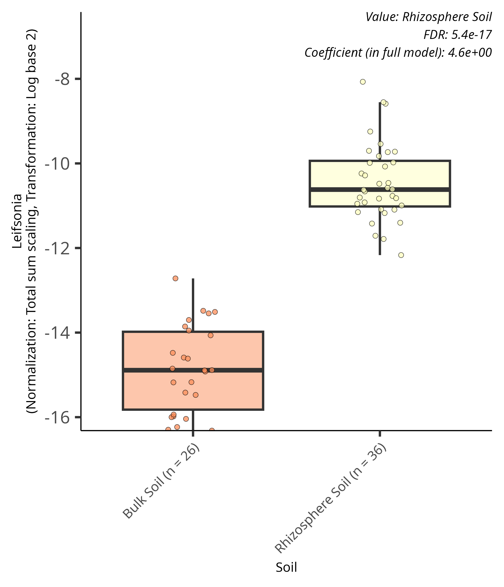
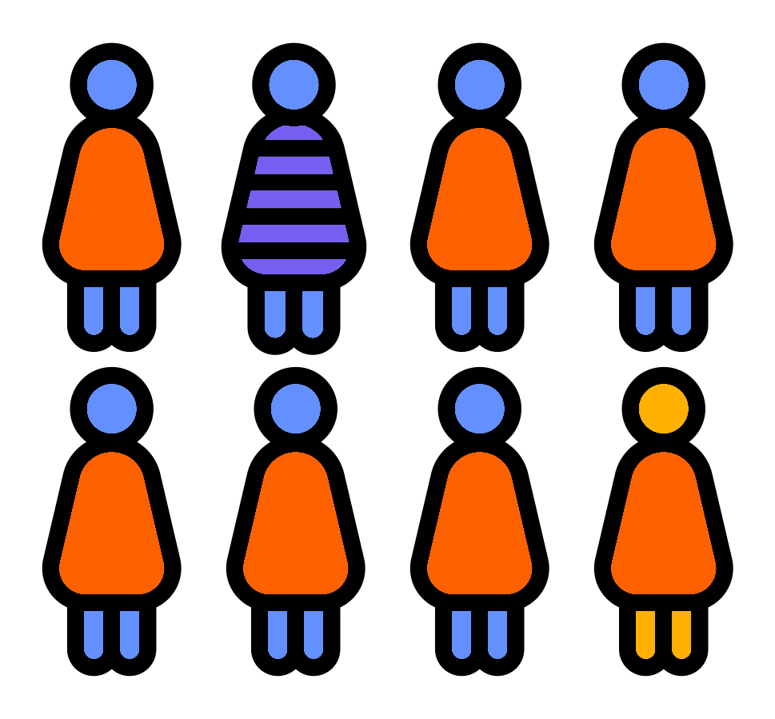

# Categorical linear boxplots
{style="width:200px; background:white; border-radius:5px; border: white solid 5px" fig-align="center"}

Boxplots are used to visualise relative/linear modelling associations with categorical fixed effects. To learn about these we will look at the `Soil` association to interpret the metrics and plots. As a reminder we used Bulk Soil as the reference and Rhizosphere Soil as the query.

In this page we will:

-   Create a significant results table with only abundance model and `Soil` rows
-   Explain the coefficient value
-   View and display box plots

## Significant results table
{style="width:150px; background:white; border-radius:5px; border: white solid 5px" fig-align="center"}

To start we'll create a significant result tibble only containing `Soil` associations with the abundance model.

```{r, eval=FALSE}
#Tibble of significant abundance associations for Soil
sig_res_soil_abund_tbl <- sig_res_tbl |> 
    #Filter to retain metadata Soil rows
    dplyr::filter(metadata == "Soil") |>
    #Filter to retain abundance model rows
    dplyr::filter(model == "abundance")
#Glimpse the tibble
sig_res_soil_abund_tbl |> dplyr::glimpse()

```

With this tibble we'll extract the top 5 associations by their q-values (`qval_individual`).

```{r,eval=FALSE}
#Top 5 lowest qval individual values species by abundance for Soil
sig_res_soil_abund_tbl |> 
    #Extract the five rows with the smallest qval_individual values
    dplyr::slice_min(qval_individual, n=5) |>
    #Select rows of interest
    dplyr::select(c(1:5,9,12,14,15))
```

You'll see the top association is:

-   feature: *Leifsonia*
-   name: SoilRhizosphere Soil
-   coefficient: 4.630948

But what does the coefficient mean?

## Coefficient
{style="width:250px; background:white; border-radius:5px; border: white solid 5px" fig-align="center"}

The coefficient value of abundance modelling with categorical data represents the fold change in relative abundance from the **reference group** to the **query group**. 
The MaAsLin3 manual's description is: "a one-unit change in the metadatum variable corresponds to a 2^coef^ fold change in the relative abundance of the feature."

In our data the coefficient of *Leifsonia* for Rhizosphere Soil (query) is 4.630948. 
This indicates the relative abundance of the feature is \>16 times larger in Rhizosphere Soil (query) samples compared to Bulk Soil (reference) samples.

In the above we say \>16 times as 2^4^ is 16. The actual value of **2\^4.630948** is **24.77732**.

Below is a table of 2 to the power of:

| 2^0^ | 2^1^ | 2^2^ | 2^3^ | 2^4^ | 2^5^ | 2^6^ | 2^7^ | 2^8^ | 2^9^ | 2^10^ |
|------|------|------|------|------|------|------|------|------|------|-------|
| 1    | 2    | 4    | 8    | 16   | 32   | 64   | 128  | 256  | 512  | 1024  |

If the value is **negative** it indicates the relative abundance of the feature is 2^coef^ times less in the query compared to the reference.

## Box plot
{style="width:150px; background:white; border-radius:5px; border: white solid 5px" fig-align="center"}

With an understanding of the coefficient value we'll now look at the boxplot for the `Rhizosphere Soil` association of *Leifsonia*.

You can open it in the jupyter file explorer. Its path is `./genus_output/figures/association_plots/Soil/linear/Soil_Leifsonia_linear.png`. 
The breakdown of this path is:

-   `./`: Represents the work directory of your jupyter notebook
-   `genus_output/`: The output directory specified and created by `maaslin3()`
-   `figures/`: The directory with all output figures
-   `association_plots/`: Contains directories of association figures
    -   Each subdirectory is for each specified fixed effect (i.e. `Soil` and `Reads`)
-   `Soil`: Directory for `Soil` association figures containing 2 subdirectories
    -   `linear`: Contains linear/relative model figures
    -   `logistic`: Contains logistic/prevalence model figures

:::{.callout-note}
As a reminder plots are only created for significant associations.
:::

If the figure is particularly interesting you can display it in your jupyter notebook.

```{r, eval=FALSE}
#Plot for Leifsonia
IRdisplay::display_png(file=
    "./genus_output/figures/association_plots/Soil/linear/Soil_Leifsonia_linear.png",
    width = 600)
```

For convenience the plot is shown below:

{style="width:400px" fig-align="center"}

The features of the plot are:

-   **x-axis:** The different categorical values of the fixed effect (Bulk Soil and Rhizosphere Soil).
    - Shows the number of samples for each category (e.g. Bulk Soil has 26 samples)
-   **y-axis:** The abundance of the feature (*Leifsonia*)
    -   These values are the log base 2 of the relative abundance values (total sum scaling)
-   **Top right:** Statistical information

Log scale to relative abundance:

| Relative abundance | 1   | 0.9    | 0.5    | 0.1    | 0.05   | 0.01   | 0.005  | 0.001  |
|-------|-------|-------|-------|-------|-------|-------|-------|-------|
| Log relative abundance     | 0   | -0.105 | -0.693 | -2.303 | -3.000 | -4.605 | -5.298 | -6.908 |

With this plot we can clearly see that the relative abundance of the Rhizosphere Soil samples is much higher than for Bulk Soil.
The median value for Rhizosphere Soil is around -11 (relative abundance = ~0.00001) whereas its around -15 (relative abundance = ~ 0.0000003) for Bulk Soil.

## Tasks and MCQs
{style="width:150px; background:white; border-radius:5px; border: white solid 5px" fig-align="center"}

Please attempt the following tasks and MCQs:

### Task 1

View the metrics of the top five significant Soil associations with negative coefficient values.
I.e. filter out associations with positive values and then look at the five associations with the lowest (most significant) q-values.

```{r, echo = FALSE}
opts_p <- c(answer="Streptosporangium",
            "Pseudonocardia",
            "Hyphomicrobium",
            "Desulfosporosinus",
            "Kribbella"
            )
```
1. Which feature association has the highest significance (i.e lowest individual q-value)? `r longmcq(opts_p)`

```{r, echo = FALSE}
opts_p <- c("Streptosporangium",
            "Pseudonocardia",
            "Hyphomicrobium",
            answer="Desulfosporosinus",
            "Kribbella"
            )
```
2. Which feature association has the greatest coefficient value (i.e. the value furtherest from 0 representing the largest fold change difference comparing the query to the reference)? `r longmcq(opts_p)`

```{r, echo = FALSE}
opts_p <- c("Streptosporangium",
            "Pseudonocardia",
            "Hyphomicrobium",
            answer="Desulfosporosinus",
            "Kribbella"
            )
```
3. Which feature association has the lowest prevalence (i.e. the lowest `N_not_zero` value)? `r longmcq(opts_p)`


::: {.callout-note collapse="true" title="Code solution"}
```{r, eval=FALSE}
#View the metrics of the top five significant associations with negative coefficients
sig_res_soil_abund_tbl |> 
    #Retain rows with a coefficient value less than 0
    dplyr::filter(coef < 0) |>
    dplyr::slice_min(qval_individual, n=5)
```
:::

### Task 2

Using the relevant plots answer the below MCQs:

```{r, echo = FALSE}
opts_p <- c("__-7__", "__-7.5__", answer="__-17__")
```
1. Approximately, what is the median log relative abundance of _Desulfosporosinus_ for the Rhizosphere Soil samples? `r longmcq(opts_p)`

```{r, echo = FALSE}
opts_p <- c(answer="__-7__", "__-7.5__", "__-17__")
```
2. Approximately, what is the median log relative abundance of _Pseudonocardia_ for the Bulk Soil samples? `r longmcq(opts_p)`

```{r, echo = FALSE}
opts_p <- c("__-7__", answer="__-7.5__", "__-17__")
```
3. Approximately, what is the median log relative abundance of _Noviherbaspirillum_ for the Rhizosphere Soil samples? `r longmcq(opts_p)`

## The power of n=
{style="width:200px; background:white; border-radius:5px" fig-align="center"}

Abundance association tests only use samples where the feature is present.
This means associations where the feature is more prevalent will have greater power.

This can be seen in our tibble of the most significant Soil abundance associations with -ve coefficients you created for task 1.
For convenience this is below:

```{r, echo=FALSE}
load("./files/sig_res_soil_abund_tbl.RData")
sig_res_soil_abund_tbl |> 
    #Retain rows with a coefficient value less than 0
    dplyr::filter(coef < 0) |>
    dplyr::slice_min(qval_individual, n=5) |>
    #Select rows of interest
    dplyr::select(c(1:5,9,12,14,15))
```

In these results *Desulfosporosinus* has the largest log fold change (-5.61)
Yet, it does not have the most significant individual q-value.
This is because there are 42 samples with _Desulfosporosinus_ present compared to the four other top genera which are present in >60 samples.