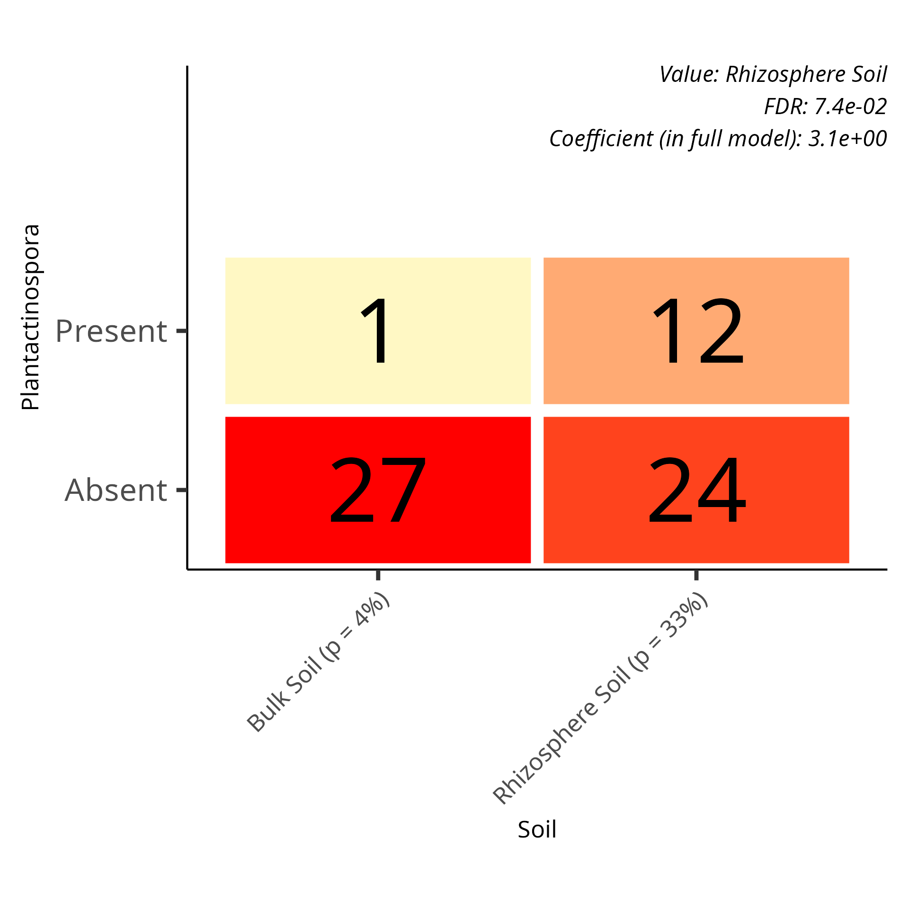
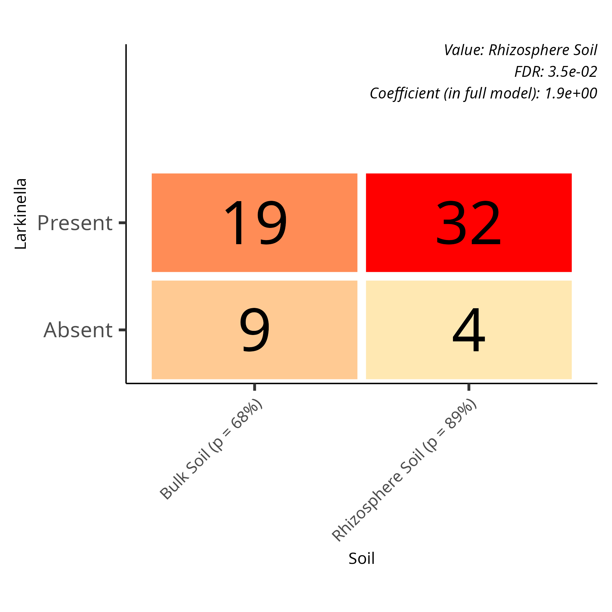
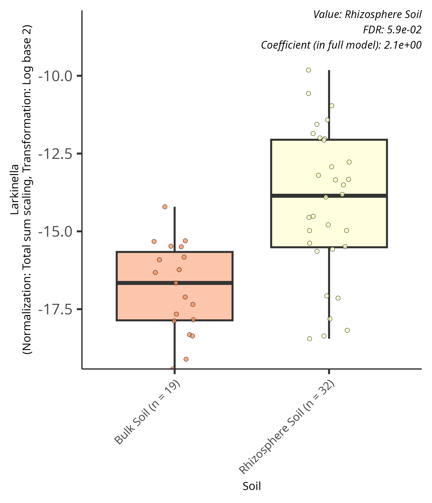

# Categorical logistic grid plots
{style="width:200px; background:white; border-radius:5px; border: white solid 5px" fig-align="center"}

Grid/tile plots are used to visualise prevalence/logistic modelling associations with categorical effects.
These show the number of samples where the feature is present and absent in for each group.

We will use the `Soil` grouping to look at categorical logistic results.

In this page we will:

- Create a significant results table with only prevalence model and sample site rows
- Explain the coefficient value
- View and display grid plots

The concept of log-odds is very important in this and the next page.
It was covered earlier in this website: [logistic modelling](/maaslin3/logistic_model.qmd)

## Significant results table
{style="width:150px; background:white; border-radius:5px; border: white solid 5px" fig-align="center"}

Create a significant result tibble containing `SampleSite` associations with the prevalence model.

```{r, eval=FALSE}
#Create a tbl with our sig results of interest
sig_res_soil_prev_tbl <- sig_res_tbl |> 
    #Filter to retain metadata Soil rows
    dplyr::filter(metadata == "Soil") |>
    #Filter to retain prevalence model rows
    dplyr::filter(model == "prevalence")
```

Extract the top 5 associations by their q-values (qval_individual).

```{r, eval=FALSE}
#Top 5 significant associations for prevalence modelling of Soil
sig_res_soil_prev_tbl |>
    #Extract the five rows with the smallest qval_individual values
    dplyr::slice_min(qval_individual, n=5) |>
    #Select rows of interest
    dplyr::select(c(1:5,9,15))
```

In this table all the associations have very low q-values (significant) and reasonably high positive coefficients (higher in query/Rhizosphere Soil).

## Coefficient
{style="width:250px; background:white; border-radius:5px; border: white solid 5px" fig-align="center"}

The coefficient indicates the difference of log-odds/logit of the feature being present in query samples compared to the reference samples.

The feature in the 1st row is:

- __feature:__ *Quadrisphaera*
- __name:__ SoilRhizosphere Soil
- __coefficient:__ 4.394469

This indicates that the [log-odds/logit](/maaslin3/logistic_model.qmd#log-oddslogit) of *Quadrisphaera* being present in Rhizosphere Soil samples compared to Bulk Soil samples is higher by 4.4.
In other words the probability of *Quadrisphaera* being present is higher in Rhizosphere Soil compared to Bulk Soil.
This could work if the log-odds of Rhizosphere Soil and Bulk Soil were both negative, both positive, or if the Rhizosphere Soil's log-odds is positive whilst the Bulk Soil's is negative.
To know this we need to look at the plot.

## Plots
{style="width:150px; background:white; border-radius:5px; border: white solid 5px" fig-align="center"}

Logistic categorical plots shows us how many samples the feature is present and absent in for the different groupings.
We'll look at 2 examples.

### *Quadrisphaera*

Below is the grid/tile plot created for the logistic modelling of *Quadrisphaera* for the Soil groupings. 

{style="width:400px" fig-align="center"}

In this case the plot shows:

- *Quadrisphaera* is present in 34 out of the 36 cheek samples (94%)
    - The feature is more likely than not (>50% chance) to be present in Rhizosphere Soil samples
- *Quadrisphaera* is present in 10 out of the 28 Bulk Soil samples (13%)
    - The feature is not more likely than not (<50% chance) to be present in Bulk Soil samples

The coefficient is positive (4.4) showing the log-odds of the feature being present in Rhizosphere Soil samples is higher than the log-odds of the feature being present in Bulk Soil samples.
This would be an instance of a positive log-odds for Rhizosphere soil (probability > 0.5) and a negative one (probability < 0.5) for Bulk Soil.

### *Plantactinospora*

Lets look at a different example. 
Below is the grid plot for *Plantactinospora*.

{style="width:400px" fig-align="center"}

In this case the plot shows:

- *Plantactinospora* is present in 12 out of the 36 cheek samples (33%)
    - The feature is more likely than not (>50% chance) to be present in Rhizosphere Soil samples
- *Plantactinospora* is present in 2 out of the 28 Bulk Soil samples (4%)
    - The feature is not more likely than not (<50% chance) to be present in Bulk Soil samples

In this case even though the log-odds is negative for Rhizosphere Soil it is still much closer to 1 (100% probability) compared to the Bulk Soil samples.
This is a reminder that the coefficient is the difference of the log-odds, not the log-odds value of the query group.

## Errors
{style="width:150px; background:white; border-radius:5px; border: white solid 5px" fig-align="center"}

There is an `error` column (column 12) in our results table.
Most rows will have the value `NA` meaning there was no error.
However, some will have information on an error that occurred for the association.

View the rows with errors in `sig_res_soil_prev_tbl`.

```{r, eval=FALSE}
#View rows where error is not NA
# for prevalence modelling of Soil
sig_res_soil_prev_tbl |>
    #Drop rows where error is NA
    #I.e. retain rows with errors
    tidyr::drop_na(error) |>
    #Select rows of interest
    dplyr::select(c(1:5,9,12,14,15))
```

The various error messages we have include:

- Prevalence association possibly induced by stronger abundance association
- All logistic values are the same
- A large coefficient (>15 in absolute value) or small p-value (< 10^-10) was obtained from a feature present in >95% of samples. Check this is intended.
- pwrssUpdate did not converge in (maxit) iterations

Below we'll demonstrate the Prevalence association error.
For other errors please see: [MaAsLin3 diagnostics](https://github.com/biobakery/Maaslin3#diagnostics)

### Prevalence association

Below is the logistic grid plot for _Larkinella_, one of the associations with the "Prevalence association possibly induced by stronger abundance association" error.
From the plot we can see that the percentage of Bulk Soil samples with presence of the feature is lower than for the Rhizosphere Sample samples (68% vs 89%).

{style="width:400px" fig-align="center"}

To discover the meaning of the error it is best to view the abundance/linear modelling plot for the feature.
In the below plot we can see a strong association for the feature when comparing Rhizosphere Soil to Bulk Soil.
Additionally, the abundance of the feature in the Soil samples it is found in are very low.
The values are all less than -10 (>0.001 relative abundance) with a median of around -16 (>0.0001 relative abundance).

{style="width:400px" fig-align="center"}

Additionally, lets look at the results of all the _Larkinella_ associations.

```{r, eval=FALSE}
#All results of Larkinella
sig_res_tbl |>
    #Filter to only retain Larkinella associations
    dplyr::filter(feature=="Larkinella") |>
    #Select rows of interest
    dplyr::select(c(1:5,8,12,13,14,15))
```

Here we can see the abundance modelling is quite strong with a coefficient of 2.13.
Therefore, MaAsLin3 is unsure if the prevalence association is true biology or if true presence was undetected in samples.
A low abundance feature may not be detected due to the inherent nature of upstream wet lab procedures and/or bioinformatics processes.

## MCQs
{style="width:150px; background:white; border-radius:5px; border: white solid 5px" fig-align="center"}

Attempt the below MCQs based on the prevalence modelling with the `Soil` fixed effect:

```{r, echo = FALSE}
opts_p <- c(answer="_Candidatus_Nitrotoga_",
            "_Ferrovibrio_",
            "*Fluviicola*"
            )
```
1. Looking at the five most significant associations with negative coefficients, which feature has the highest `N_not_zero` value? `r longmcq(opts_p)`

```{r, echo = FALSE}
opts_p <- c("_Candidatus_Nitrotoga_",
            answer="_Ferrovibrio_",
            "*Fluviicola*"
            )
```
2. Looking at the five most significant associations with positive coefficients, which feature has the highest coefficient value? `r longmcq(opts_p)`

::: {.callout-note collapse="true" title="Code solutions for MCQ 1 & 2"}
```{r,eval=FALSE}
#MCQ1: Of the top 5 significant -ve coef features
# Which has the highest N_not_zero value
sig_res_soil_prev_tbl |>
    #Filter to retain -ve coef
    dplyr::filter(coef <0) |>
    #Top 5 by significance
    dplyr::slice_min(qval_individual,n=5) |>
    #Highest N_not_zero
    dplyr::slice_max(N_not_zero, n=1)
```
```{r,eval=FALSE}
#MCQ2: Of the top 5 significant +ve coef features
# Which has the highest coefficient value value
sig_res_soil_prev_tbl |>
    #Filter to retain +ve coef
    dplyr::filter(coef >0) |>
    #Top 5 by significance
    dplyr::slice_min(qval_individual,n=5) |>
    #Top coefficient value
    dplyr::slice_max(coef, n=1)
```
:::

Looking at specific tile plots will allow you answer the next 2 questions.

```{r, echo = FALSE}
opts_p <- c("__6%__",
            "**29%**",
            answer="**83%**"
            )
```
3. What percentage of Rhizosphere Soil samples is _Fluviicola_ present in? `r longmcq(opts_p)`

```{r, echo = FALSE}
opts_p <- c("__6%__",
            answer="**29%**",
            "**83%**"
            )
```
4. What percentage of Bulk Soil samples is _Bordetella_ present in? `r longmcq(opts_p)`

Creating some filtering code will help answer the below questions.


::: {.callout-tip}
The below filter function will retain rows where `error` is `NA`. Normally filtering won't work with `NA` values.

```{r,eval=FALSE}
#Retain rows where error is NA
#needs to be part piped code
dplyr::filter(if_any(error, is.na))
```
:::

```{r, echo = FALSE}
opts_p <- c("__4__",
            answer="**55**",
            "**59**"
            )
```
5. How many significant (based on qval_individual <0.1) prevalence Soil associations are there with no errors? `r longmcq(opts_p)`

```{r, echo = FALSE}
opts_p <- c(answer="__4__",
            "**55**",
            "**59**"
            )
```
6. How many significant (based on qval_individual <0.1) prevalence Soil associations are there with errors? `r longmcq(opts_p)`

::: {.callout-note collapse="true" title="Code solutions for MCQ 5 & 6"}
```{r, eval=FALSE}
##Significant associations with no errors
sig_res_soil_prev_tbl |>
    #Filter by q-value
    dplyr::filter(qval_individual<0.1) |> 
    #Filter to retain rows where error is NA
    dplyr::filter(if_any(error, is.na)) |>
    #Count rows
    nrow()
```
```{r,eval=FALSE}
##Significant associations with errors
sig_res_soil_prev_tbl |>
    #Filter by q value
    dplyr::filter(qval_individual<0.1) |> 
    #Drop NAs in error
    tidyr::drop_na(error) |>
    #Count rows
    nrow()
```
:::