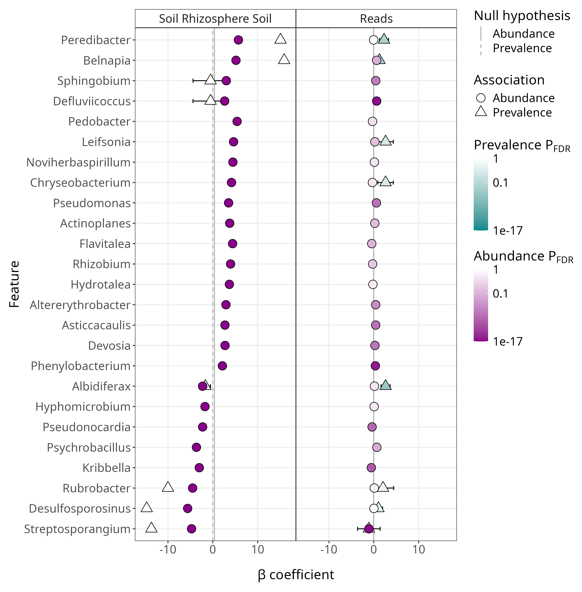

# Coefficient plot

The coefficient plots display information on the abundance and prevalence models.
Below is the coefficient plot by itself (made by manual editing of the summary plot).

{style="width:600px" fig-align="center"}

Lets go through its features/aesthetics one by one.

## Outside plotting area

The features outside of the plotting area are:

- __x-axis:__ The [coefficient](/maaslin3/metrics.qmd#coefficients) value of the association
- __y-axis:__ The feature (e.g. *Peridibacter*)
- __Facet header:__ The Fixed effect comparison (e.g. Soil Rhizosphere Soil indicates the Rhizosphere Soil against Bulk Soil comparison)

## Abundance values
{style="width:150px; background:white; border-radius:5px" fig-align="center"}

The features inside the plotting area can be split by Abundance and Prevalence modelling.

Lets look at the abundance modelling first.

- __Circles:__ The abundance coefficient
    - __x-axis:__ The position represents its coefficient value
    - __colour:__ Represents its q-value (P~FDR~) 
        - Gradient goes from white to dark purple
        - Gradient range is displayed on the legend (1 -> 1e-31)
- __Horizontal line:__ Represents the null hypothesis
    - In this case this is the median coefficient value of the metadata
    - We set the abundance median comparison to `TRUE`, more info: [Median comparisons](/maaslin3/median_comparison.qmd)

## Prevalence values
{style="width:150px; background:white; border-radius:5px; border: white solid 5px" fig-align="center"}

- __Triangle:__ The prevalence coefficient
    - __x-axis:__ The position represents its coefficient value
    - __colour:__ Represents its q-value (P~FDR~) 
        - Gradient goes from white to dark cyan
        - Gradient range is displayed on the legend (1 -> 1e-31)
- __Horizontal dashed line:__ Represents the null hypothesis
    - In this case this is 0
    - We set the abundance median comparison to `FALSE`, more info: [Median comparisons](/maaslin3/median_comparison.qmd)