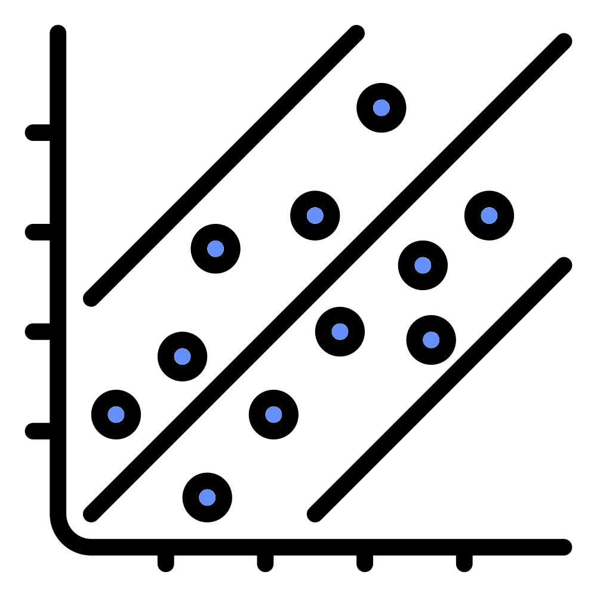
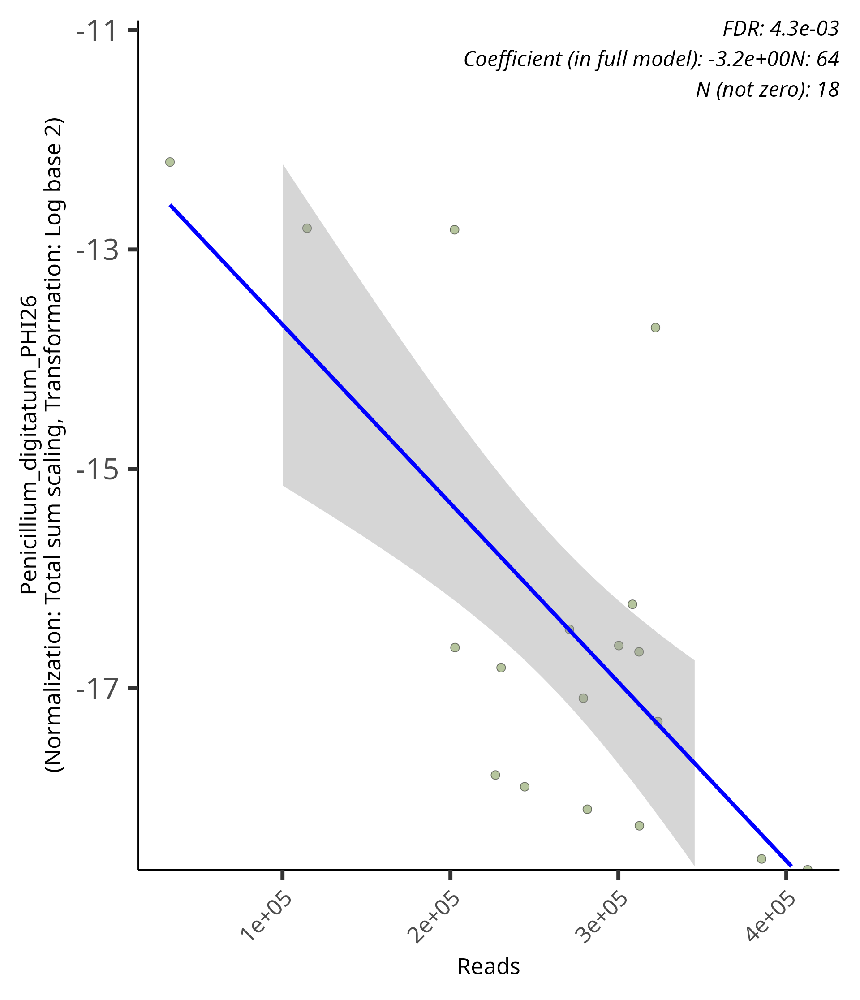
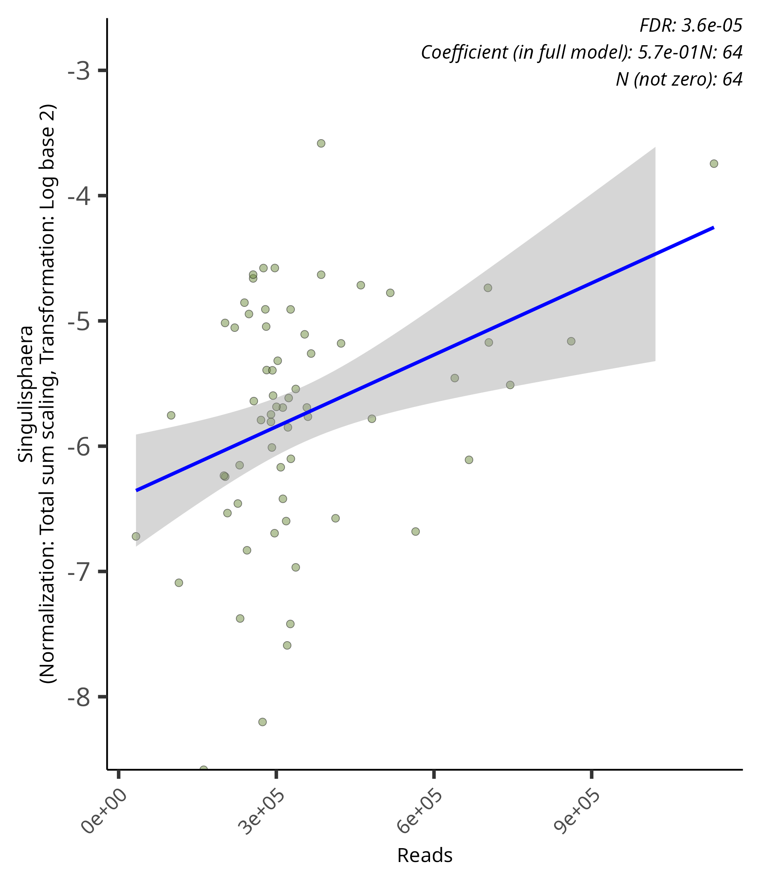

# Continuous linear scatter plots
{style="width:200px; background:white; border-radius:5px; border: white solid 5px" fig-align="center"}

Scatter plots with a line of best fit (regression line) are used to visualise relative/linear modelling associations with continuous fixed effects. We will use the results from our `Reads` associations to interpret the metrics and plots. Preferably we'll have no associations but as always biology has other ideas.

In this page we will:

- Create a significant results table with only abundance model and Reads rows
- Explain the coefficient value
- View and display scatter plots

## Significant results table
{style="width:150px; background:white; border-radius:5px; border: white solid 5px" fig-align="center"}

Create a significant result tibble only containing `Reads` associations with the abundance model.

```{r, eval=FALSE}
#Tibble of significant abundance associations for Reads
sig_res_reads_abund_tbl <- sig_res_tbl |> 
    #Filter to retain metadata SampleSite rows
    dplyr::filter(metadata == "Reads") |>
    #Filter to retain abundance model rows
    dplyr::filter(model == "abundance")
#Glimpse the tibble
sig_res_reads_abund_tbl |> dplyr::glimpse()
```

Extract the top 5 associations by their q-values (`qval_individual`).

```{r, eval=FALSE}
#Top 5 significant abundance read associations by qval
sig_res_reads_abund_tbl |> 
    #Extract the five rows with the smallest qval_individual values
    dplyr::slice_min(qval_individual, n=5) |>
    #Select rows of interest
    dplyr::select(c(1:5,9,11,12,14,15))
```

You’ll see the top association is:

- feature: *Candidatus_Nostocoida*
- coefficient: 0.9792495

## Non-significant result

Run the below command to see the non-significant results in the tibble you created.

```{r, eval=FALSE}
#Non significant results
sig_res_reads_abund_tbl |> 
    #Filter by non-significance
    dplyr::filter(qval_individual>0.1) |>
    #Select rows of interest
    dplyr::select(c(1:5,9,11,12,14,15))
```

With this you can see that you have 36 non-significant `Reads` associations in `sig_res_reads_abund_tbl`.
These are included in the significant results table as their joint q-values are <0.1. 
However, plots of these associations were not created since their q-values are larger than the max significance value (0.1) we chose when running `maaslin3()` and the replot function.

More info about joint q-values: [P-value in Metrics page](/maaslin3/metrics.qmd#p-values)

## Coefficient
{style="width:250px; background:white; border-radius:5px; border: white solid 5px" fig-align="center"}

For continuous metadata the coefficient represents the amount of change the variable causes, i.e. the slope. For example, a high positive value would represent a steep positive slope in a linear model. If we had this for our reads metadata that would indicate the abundance of the feature is likely to be higher if the sample has a higher read count compared to the samples with lower read counts. As `maaslin3()` analysed relative abundance values (`normalization = 'TSS'`) we would ideally like no features to have significant associations with `Reads`, but we most likely will.

## Scatter plots
{style="width:150px; background:white; border-radius:5px; border: white solid 5px" fig-align="center"}

Below is the plot for the association of *Penicillium_digitatum_PHI26* for Reads.
In it we can see the slope is reasonably steep and goes downwards.
This matches our coefficient values of -3.2.

{style="width:400px" fig-align="center"}

Below is the plot for the association of _Singulisphaera_ for Reads.
Its slope is positive and a lot more gentle, matching our coefficient of 0.57.
Additionally, the association appears relatively modest, with a diffuse spread of points and a fairly wide confidence band.

{style="width:400px" fig-align="center"}

## MCQs
{style="width:150px; background:white; border-radius:5px; border: white solid 5px" fig-align="center"}

Please attempt the following questions based on the **top 20 significant associations**:

```{r, echo = FALSE}
opts_p <- c(answer="*Agaricicola*",
            "*Mycobacterium*",
            "*Penicillium_digitatum_PHI26*"
            )
```
1. Which feature association has the largest positive coefficient? `r longmcq(opts_p)`

```{r, echo = FALSE}
opts_p <- c("*Agaricicola*",
            "*Mycobacterium*",
            answer="*Penicillium_digitatum_PHI26*"
            )
```
2. Which feature association has the largest `N_not_zero` value? `r longmcq(opts_p)`

::: {.callout-note collapse="true" title="Code solutions"}
```{r,eval=FALSE}
#MCQ1: Largest positive coefficient
sig_res_reads_abund_tbl |> 
    #Extract the five rows with the smallest qval_individual values
    dplyr::slice_min(qval_individual, n=20) |>
    #Select rows of interest
    dplyr::select(c(1:5,9,11,12,14,15)) |>
    #Largest coef
    dplyr::slice_max(coef, n=1)
```
```{r,eval=FALSE}
#MCQ2: Smallest N_not_zero
sig_res_reads_abund_tbl |> 
    #Extract the five rows with the smallest qval_individual values
    dplyr::slice_min(qval_individual, n=20) |>
    #Select rows of interest
    dplyr::select(c(1:5,9,11,12,14,15)) |>
    #Smallest N_not_zero
    dplyr::slice_min(N_not_zero, n=1)
```
:::
