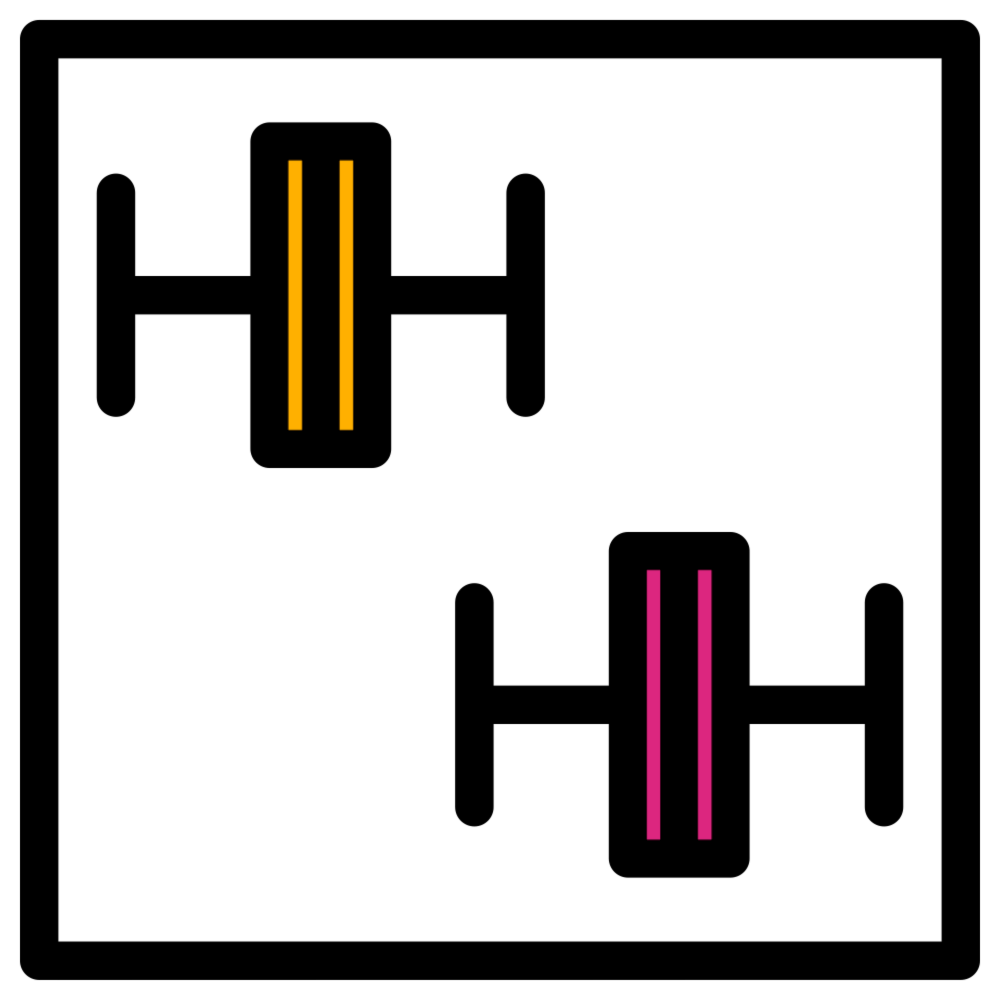
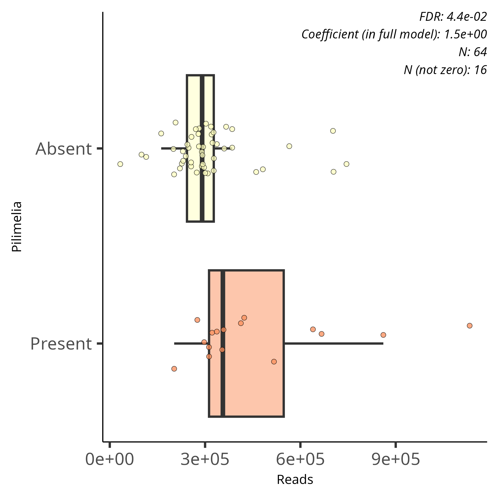

# Continuous logistic boxplots
{style="width:200px; background:white; border-radius:5px; border: white solid 5px" fig-align="center"}

Box plots are used to visualise prevalence/logistic modelling associations with continuous effects.
These show the range of read sizes for samples where the feature is absent and samples where the feature is absent.

We will use the `Reads` grouping to look at continuous logistic results.

In this page we will:

- Create a significant results table with only prevalence model and read rows
- Explain the coefficient value
- View and display box plots

## Significant results table
{style="width:150px; background:white; border-radius:5px; border: white solid 5px" fig-align="center"}

Create a significant result tibble only containing `Reads` associations with the prevalence model.

```{r, eval=FALSE}
#Create a tbl with our sig results of interest
sig_res_reads_prev_tbl <- sig_res_tbl |> 
    #Filter to retain metadata Reads rows
    dplyr::filter(metadata == "Reads") |>
    #Filter to retain prevalence model rows
    dplyr::filter(model == "prevalence")
#Glimpse the tibble
sig_res_reads_prev_tbl |> dplyr::glimpse()
```

Extract the top 5 associations by their q-values (qval_individual).

```{r, eval=FALSE}
#Top 5 significant associations for prevalence modelling of Reads
sig_res_reads_prev_tbl |>
    #Extract the five rows with the smallest qval_individual values
    dplyr::slice_min(qval_individual, n=5) |>
    #Select rows of interest
    dplyr::select(c(1:5,9,12,14,15))
```

## Coefficient
{style="width:250px; background:white; border-radius:5px; border: white solid 5px" fig-align="center"}

Let's look at the top association:

- __Feature:__ *Azospira*
- **Coefficient:** 2.360408
- **Q-value:** 0.012062

For continuous metadata the coefficient represents the amount of increased/decreased likelihood of the feature's presence with a higher value of the metadata.
A positive value for `Reads` would indicate the feature is more likely to be present with samples of higher read counts.
In other words a positive coefficient means the logit of the feature being present increases.

## Plots
{style="width:150px; background:white; border-radius:5px; border: white solid 5px" fig-align="center"}

Logistic continuous plots are horizontal box plots of read counts separated into 2 groupings:

- Samples where the feature is absent
- Samples where the feature is present

Let's look at an example.

### *Pilimelia*

Below is the box plot created for the logistic modelling of *Pilimelia* for the reads effect. 

{style="width:400px" fig-align="center"}

In this case the plot shows:

- Samples where the feature are present tend to have higher read counts
- There are more samples where the feature is absent (N (not zero) = 16) compared to where it is absent (64-16=48).

## Negative coefficient
{style="width:150px; background:white; border-radius:5px; border: white solid 5px" fig-align="center"}

View the associations with negative coefficients in `sig_res_reads_prev_tbl`.

```{r, eval=FALSE}
#Significant associations with negative coefficients
# for prevalence modelling of Reads
sig_res_reads_prev_tbl |>
    #Retain rows with a coefficient value less than 0
    dplyr::filter(coef < 0) |>
    #Select rows of interest
    dplyr::select(c(1:5,9,11,12,14,15)) |>
    #Arrange by individual q-value
    dplyr::arrange(qval_individual)
```

From this we can see that we have 12 associations.
This is in contrast to the 129 positive associations (141-12=129).
 However, there are some caveats to these negative associations.

Only four of the associations do not have errors.
The other eight have the error: "Prevalence association possibly induced by stronger abundance association".

The most important feature to notice is that only 4 of the associations are significant (`qval_individual`<0.1).
The other eight are included because their joint q-values are < 0.1.

It makes sense that you are more likely to get positive coefficient values for reads.
The more reads you have the more likely you are to detect all organisms present.

## MCQs
{style="width:150px; background:white; border-radius:5px; border: white solid 5px" fig-align="center"}

Attempt the below MCQs based on the prevalence modelling with the `Reads` fixed effect:

Answer the two below MCQs based on the top 5 significant features of Reads with the prevalence model.

```{r, echo = FALSE}
opts_p <- c("*Azospira*",
            "*Talaromyces_phialosporus*",
            "*Amaricoccus*",
            answer="*Bacteriovorax*",
            "*Advenella*"
            )
```
1. Which feature association has the largest coefficient value? `r longmcq(opts_p)`

```{r, echo = FALSE}
opts_p <- c("*Azospira*",
            "*Talaromyces_phialosporus*",
            answer="*Amaricoccus*",
            "*Bacteriovorax*",
            "*Advenella*"
            )
```
2. Which feature has the highest amount of samples where the feature is absent (i.e. lowest prevalence)? `r longmcq(opts_p)`

Open and view the reads logistic plots for the following features to answer the next 3 MCQs.

- *Actinocorallia*
- *Hirschia*
- *Truepera*

__Tip:__ The reads/x-axis scale is identical for all the plots making for easier comparisons.

```{r, echo = FALSE}
opts_p <- c("*Actinocorallia*",
            "*Hirschia*",
            answer="*Truepera*"
            )
```
3. Which feature has the smallest difference between its median values for the absent and present groupings? `r longmcq(opts_p)`

```{r, echo = FALSE}
opts_p <- c(answer="*Actinocorallia*",
            "*Hirschia*",
            "*Truepera*"
            )
```
4. Which feature has the lowest IQR range for the absent box? `r longmcq(opts_p)`

```{r, echo = FALSE}
opts_p <- c("*Actinocorallia*",
            answer="*Hirschia*",
            "*Truepera*"
            )
```
5. Which feature has the lowest median value for the absent samples? `r longmcq(opts_p)`

Using the object `sig_res_reads_prev_tbl`, create some code to answer the below questions.

```{r, echo = FALSE}
opts_p <- c("**24**",
            answer="**60**",
            "**141**"
            )
```
5. How many associations have a `qval_individual` value of less than 0.1? `r longmcq(opts_p)`

```{r, echo = FALSE}
opts_p <- c(answer="**24**",
            "**60**",
            "**141**"
            )
```
6. How many associations are there where the feature is absent in more than 50% of the samples? `r longmcq(opts_p)`

__Tip:__ You can carry out mathematical operations on different columns in a [`dplyr::filter()` function](https://cgr-liverpool.github.io/Tidyverse/dplyr/filter.html) and carry out a comparison/filter on its result.


::: {.callout-note collapse="true" title="Code solutions"}
```{r, eval=FALSE}
#MCQs
## Significant results with individual q-value < 0.1
sig_res_reads_prev_tbl |>
   filter(qval_individual<0.1) |>
   nrow()
## Number of results where the feature is absent in more than
# 50% of the samples
sig_res_reads_prev_tbl |>
   filter(N_not_zero/N < 0.5) |>
   nrow()
```
:::