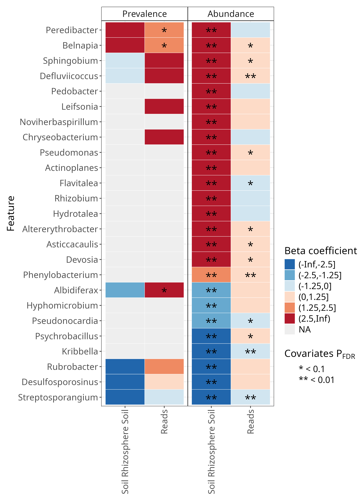

# Coefficient heatmap

There are two heatmaps, one for abundance and one for prevalence.
These heatmaps are further split by metadata/effects, in this case `Soil Rhizosphere Soil` and `Reads`.

Below is the coefficient heatmap by itself (made by manual editing of the summary plot).

{style="width:600px" fig-align="center"}

The features of the plot are:

- __Colour:__ Coefficient value
    - The colour goes from blue (-Infinity) to white (0) to red (+Infinity).
- __Stars:__ The significance threshold
    - One star (`*`) represents a q-value less than our threshold (<0.1)
    - Two stars (`**`) represents a q-value 10 times less than our threshold (<0.01)
 