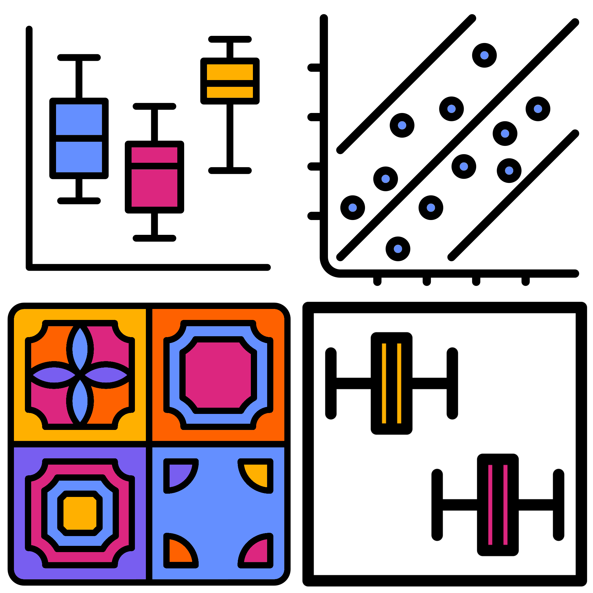
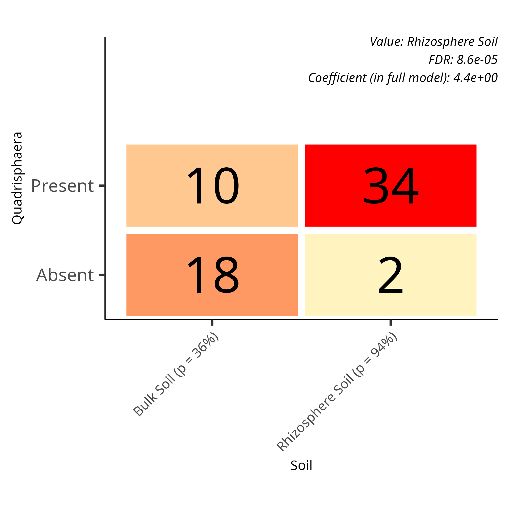

# Plot types
{style="width:300px; background:white; border-radius:5px; border: white solid 5px" fig-align="center"}

As a recap the four different types of plots are below.

## Linear plots

For abundance associations.

### Categorical linear

Box plot showing the log base 2 relative abundance values of the features.

{style="width:400px" fig-align="center"}

Coefficient represents the fold change from the reference to the query group.

### Continuous linear

Scatter plot of log base 2 relative abundance (y) against continuous effect (x, read depth in below figure) with best fit line.

{style="width:400px" fig-align="center"}

Coefficient represents the amount of change the variable causes, i.e. the slope. 

## Logistic plots

For prevalence associations.

### Categorical logistic

Tile plot showing the number of samples where the feature is present and absent for each grouping.

{style="width:400px" fig-align="center"}

The coefficient indicates the difference of log-odds/logit of the feature being present in query samples compared to the reference samples.

### Continuous logistic

Box plot of the continuous value (read depth in below figure) split by samples where the feature is present and absent.

{style="width:400px" fig-align="center"}

The coefficient represents the amount of increased/decreased likelihood (log-odds/logit) of the feature's presence with a higher value of the metadata.