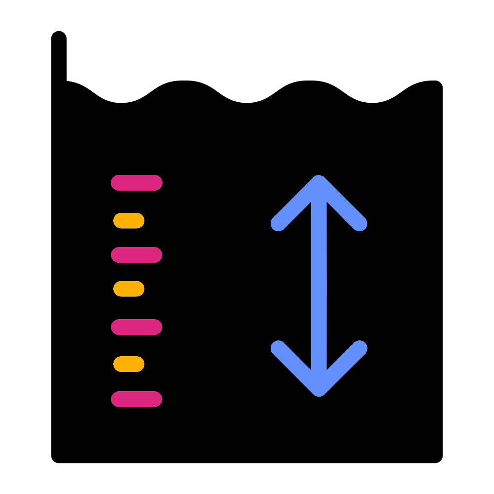

# Read counts
{style="width:200px; background:white; border-radius:5px" fig-align="center"}

`MaAsLin3` can test whether metadata variables are associated with feature presence/absence. 
This is called a prevalence test.

Prevalence of organisms can be greatly affected by the read depth of the different samples.
When using abundance values (not quantitative abundance values) the read numbers/depth for each sample should be included as a continuous fixed effect.


::: {.callout-note collapse="true" title="Quantitative abundance?"}
Quantitative abundances (aka absolute abundances) are the actual count of cells in an environment.
With the correct protocol this can be calculated, such as through qPCR and 16S rRNA spike-ins.
This approach is still relatively rare.

Some people like to call non-quantitative abundances as relative abundance values (i.e. normal 16S rRNA approach).
However I find this confusing.
Instead I like to use the following 3 terms for normal 16S rRNA counts:

- __Abundance/counts:__ The 16S counts without any normalisation
- **Relative abundance:** The 16S counts normalised to fractions so each sample has a total count of 1
- **Rarefied abundances:** Normalised 16S counts made of whole numbers (>=1), via subsampling, so each sample has the same total count/depth

More information about absolute abundances and how to analyse them can be found in the [official MaAsLin3 manual](https://github.com/biobakery/biobakery/wiki/MaAsLin3#41-absolute-abundance)
:::

## Calculate read depth data
{style="width: 100px; border-radius:5px;  background-color: white; border: 5px solid white" fig-align="center"}

We can calculate read depths from our count table with `rowSums()`.

```{r, eval=FALSE}
#Calculate read count of each sample
read_counts <- taxa_df |> rowSums()
read_counts
```

To add these values to our metadata we can create a `data.frame` containing 2 columns:

- `Sample`: Name of samples matching `Sample` column in `metadf`
- `Reads`: The read depth values that we'll add to `metadf`

```{r,eval=FALSE}
#Convert to data.frame
read_df <- data.frame(names(read_counts), unname(read_counts))
#Change column names
colnames(read_df) <- c("Sample", "Reads")
#Check top of df
read_df |> head()
```

## Add depths to metadata

To add the depths to our `metadf` `data.frame` we can use the function [`dplyr::inner_join()`](https://dplyr.tidyverse.org/reference/mutate-joins.html).
This function joins 2 `data.frames`/`tibbles` ensuring the rows are assigned correctly by a shared column.
It is similar to VLOOKUP in excel.

In our case this is the column `Sample`, ensuring that each sample is assigned the correct read depth value.

```{r,eval=FALSE}
#Add read count values to metadf with dplyr::inner_join()
#Similar to excel's vlookup
metadf <- metadf |>
    dplyr::inner_join(read_df, by="Sample")
#Check top of df
metadf |> head()
```

Unfortunately `dplyr::inner_join()` removes row names.
These are required for our `metadf` so let's add them back.

```{r,eval=FALSE}
#Add row names back (removed from inner_join)
row.names(metadf) <- metadf$Sample
#Check top of df
metadf |> head()
```

## Save R objects
{style="width:150px; background:white; border-radius:5px" fig-align="center"}

We'll open a new jupyter notebook in the next section.
Save your `taxa_df` and `metadf` objects as files so you can load them into the next notebook.

```{r,eval=FALSE}
save(taxa_df,file="genus_taxa_df.RData")
save(metadf,file="metadf.RData")

```

You can now save then close and halt the notebook.

With our count table and we can move onto the MaAsLin3 analysis.