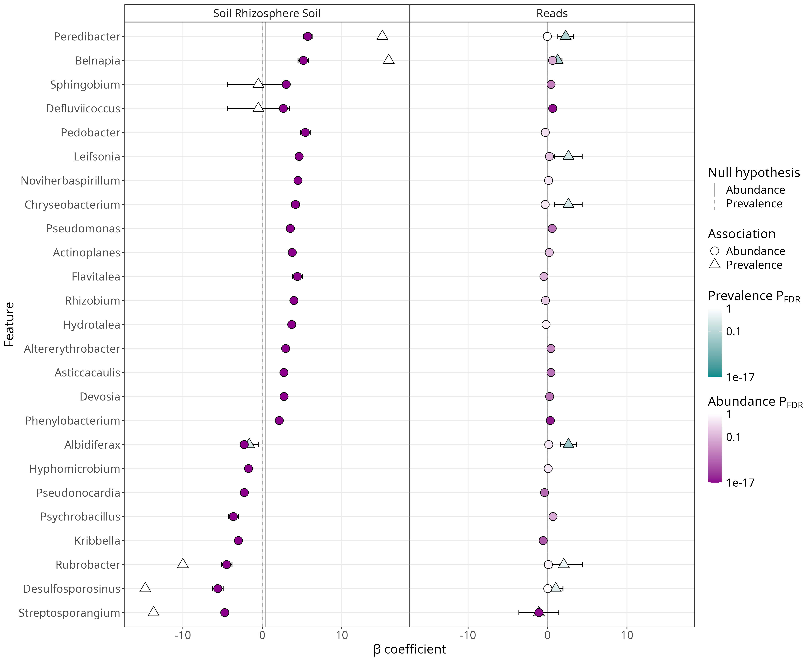

# Summary plot intro
{style="width:150px; background:white; border-radius:5px; border: white solid 5px" fig-align="center"}

We have looked at the four different types of plots and their coefficients.
With this knowledge we can now look at the summary plot.

Normally, this would be the first plot you look at but it was best to look through the other plots to learn bit by bit rather than all at once.

## The plot

It is good to display the summary plot in your jupyter notebook since it is a very useful overview.
Type and run the below code to do so.

```{r, eval=FALSE}
#View summary image
IRdisplay::display_png(file="./genus_output/figures/summary_plot.png")
```

The plot should be the same as below:

{style="width:800px" }

This only contains the coefficient plot since we only tested 2 fixed effects.
So you can see what the heatmap looks like we'll replot to include one.

## Replot
{style="width:150px; background:white; border-radius:5px; border: white solid 5px" fig-align="center"}

We can use the function [`maaslin3::maaslin_plot_results_from_output()`](/maaslin3/replot.qmd) to recreate our plots.
Importantly we can use the parameters  `coef_plot_vars=` and `heatmap_vars=` to set which variables will be included in the heatmap and coefficient plot.
Additionally, it sets the order of the variables too.

The easiest option is to create vectors of the variable names.
Some important notes:

- The variables names need to be exactly as they are shown in the summary plot
    - For example the first variable in the plot above is "Soil Rhizosphere Soil" i.e. The metadata name, a space, and then the value
- You can add variables to the heatmap that only show in the coefficient plot to the heatmap and vice versa
- If you exclude a variable it will not show in the subsequent plot
- If you include a variable that does not exist the replot function will ignore the variables you provide
    - For example, if you try to include "Soil Bulk Soil" it will not work as it is the reference value

Set the order of variables for replotting.

```{r, eval=FALSE}
#Set order of Coefficient plot variables
coef_plot_variables <- c("Soil Rhizosphere Soil", "Reads")
#Set order of heatmap variables for plot recreation
heatmap_variables <- c("Soil Rhizosphere Soil", "Reads")
```

Replot with the coefficient and heatmap variables.

:::{.callout-note}
You can include the parameters `coef_plot_vars` and `heatmap_vars` in the `maaslin3()` function.
However, it is normally best to see the first summary plot `maaslin3()` creates and then replot with the parameters so you can see what you want to change.
:::

```{r,eval=FALSE}
#MaAsLin3 replot
maaslin3::maaslin_plot_results_from_output(
    output = 'genus_output',
    metadata = metadf,
    normalization = 'NONE',
    transform = 'LOG',
    max_significance = 0.1,
    median_comparison_abundance = TRUE,
    median_comparison_prevalence = FALSE,
    #Coefficient and heatmap variables
    coef_plot_vars = coef_plot_variables,
    heatmap_vars = heatmap_variables,
    max_pngs = 1000
)
```

You'll then get the below summary plot.

{style="width:800px" fig-align="center"}

## Plot features

The plot show us the top 25 features by significant associations with 2 main types of plots:

- Coefficient plot
    - On the left side
    - One plot each for the two most significant fixed effect comparisons (unless you choose them with replotting)
- Coefficient heatmap
    - On the right side
    - One plot is for the prevalence logistic modelling of fixed effect comparisons not in the coefficient plot (unless you choose them with replotting)
    - One plot is for the abundance linear modelling of fixed effect comparisons not in the coefficient plot (unless you choose them with replotting)

There is a legend on the right side.
We'll explain the plots and their values starting with the coefficient plot.