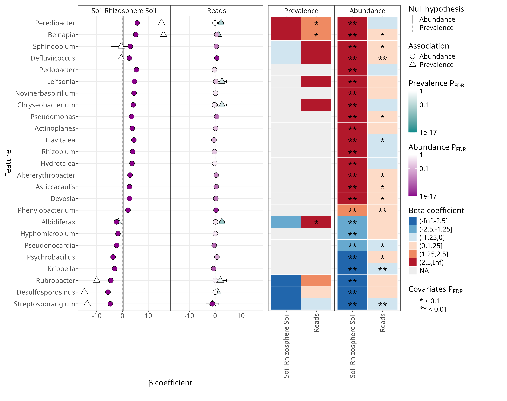
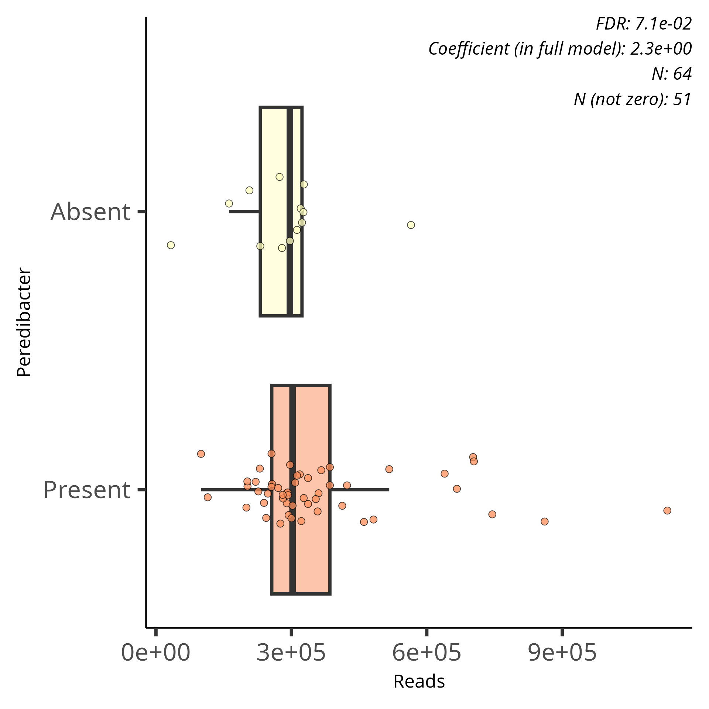

```{r, echo=FALSE, warning=FALSE, results=FALSE, output=FALSE}
#Load library so functions run smoothly
library(tidyverse)
```

# Summary interpretation

With the plot we'll interpret the results of *Cutibacterium acnes* and some overall patterns.

{style="width:800px" fig-align="center"}

## *Peredibacter*

*Peredibacter* is the top feature in the plot so lets discuss what the plot can tell us.

### Soil

**Peredibacter's* abundance association for Rhizosphere Soil is very signifiant with a deep purple colour.
Additionally, the coefficient value (~5) indicates a 32 increase in abundance of the genus in Rhizosphere Soil compared to Bulk Soil.

The prevalence model for the feature has a very high coefficient (>10).
However, this association is not significant.

Let's look at the table results for this feature below.

```{r, echo=FALSE}
#Read in all results
readr::read_delim(
    file = "./files/all_results.tsv", 
    delim="\t", show_col_types = FALSE) |>
    filter(feature=="Peredibacter") |>
    filter(metadata=="Soil") |>
    select(1,4,5,8,12,14,15)

```

Unfortunately this does not clarify why the prevalence association is not significant.
If you go back to your "1-Data.ipynb" `jupyter` notebook, rerun all the cells and then run the below at the bottom of the notebook:

```{r,eval=FALSE}
#Rhizosphere Soil prevalences of Peredibacter
rhizo_genus_prevs <- genus_pseq |>
    #Create phyloseq of only Rhizosphere Soil samples
    phyloseq::subset_samples(Soil == "Rhizosphere Soil") |>
    #Calculate prevalences of all features/genera
    microbiome::prevalence()
rhizo_genus_prevs["Peredibacter"]
```

```{r,eval=FALSE}
#Bulk Soil prevalence of Peredibacter
bulk_genus_prevs <- genus_pseq |>
    #Create phyloseq of only Bulk Soil samples
    phyloseq::subset_samples(Soil == "Bulk Soil") |>
    #Calculate prevalences of all features/genera
    microbiome::prevalence()
bulk_genus_prevs["Peredibacter"]
```

You will discover that *Peredibacter* is in 100% of the Rhizosphere Soil samples (1=100%) whilst it is found in 54% of the Bulk Soil samples.
Because their is no absence in the Rhizosphere Soil samples there is a lack of power of this categorical logistic test.
This leads to a low q-value.

Why is the coefficient so large then?
This can occur in logistics modelling when the feature is present in all the query samples.
The other way round can cause highly negative coefficient values.

### Reads

There is no significant abundance association for *Peredibacter* but there is a prevalence significant association.
We get a significant results in this case because we are comparing read depths of samples where the feature is present against samples where it is absent.
This is comparing 13 against 51 samples.
Not very powerful but the signifcnat value is not that great either.

{style="width:400px" fig-align="center"}

:::{.callout-note}
In your own analysis you may need to look at all the results `all_results.tsv` to find feature associations that are not present in the significant results output.
:::

### Overall

Some overall patterns to notice are:

- Most of the displayed features are in higher abundance in the Rhizosphere Soil compared to the Bulk Soil
- There are no significant prevalence associations for Soil in the summary plot
- Most features have significant abundance associations for Reads but these coefficient values are relatively low

Overall the summary plot is nice to get a quick glance at the results but the significant results table and individual plots are much more informative to look at specific features.

Brilliant! that's everything for MaAsLin3.
Check out the [appendix](/appendix/resources.qmd) for more resources and information.
