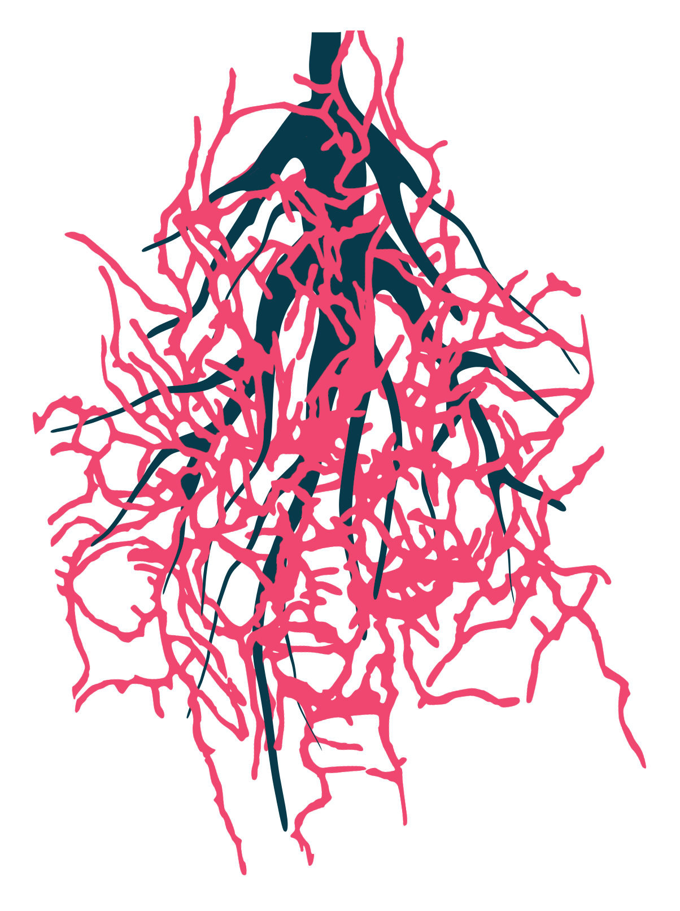

# Metadata correlation
{style="border-radius: 15px; width: 200px; background-color: white" fig-align="center"}

In this page we'll carry out correlation analysis of the metadata from the Rhizosphere soil dataset.

## Jupyter-notebook
{style="width:150px; background:white; border-radius:5px; border: white solid 5px" fig-align="center"}

In the "metad_exploration" directory create a new R jupyter notebook called "1-metadata_exploration.ipynb".

## Library
{style="width:150px; background:white; border-radius:5px" fig-align="center"}

Load the only library we need: `variancepartition`.

```{r, eval=FALSE}
#Library
library("variancePartition")
library("tidyverse")
```

## Data
{style="width:200px; background:white; border-radius:5px" fig-align="center"}

Load the full metadata `data.frame` for the rhizosphere dataset.
THis is in the same format as the metadata `data.frame` that is used for [MaAsLin3](/maaslin3/metadata.qmd).

```{r, eval=FALSE}
#Load metadata
load("/pub14/tea/nsc206/NEOF/R_community_advanced/rhizo_full_metadata_df.RData")
```

[`Glimpse`](https://neof-workshops.github.io/Tidyverse/dplyr/glimpse.html) the metadata.

```{r, eval=FALSE}
#View head of data.frame
metadata |> head()
```

Now we have 17 different variables.
When you have so many it can be difficult to know which ones to use.
Thankfully, we can narrow down our options with the following correlation analysis.

## Metadata values

We will create an object containing the formula we will test.
Prior to this, let's see all the unique values per column/variable.

```{r,eval=FALSE}
#Unique values of all columns
lapply(metadf, unique)
```

Looking through this we see that `Genotype` and `Collection_Time variables each have one (non-NA) value.
There is not point in using metadata with one variable in any analysis.
Due to this and the fact the correlation function will not work with one value variables we will not include them in our formula.

Additionally, we won't use `SampleID` or `Sample`.
These values are unique for each row/observation so again are not useful for any group comparisons.

## Formula
{style="width:150px; background:white; border-radius:5px" fig-align="center"}

Now to create our formula object, this is the same as the [lme formula for MaAsLin3](/maaslin3/lme4.qmd).

We'll use all the variables except the ones noted above.
We'll write the formula ready for `MaAsLin3` with fixed effects (e.g. `Soil`) and random effects (e.g. `(1|Plate)`).

```{r, eval=FALSE}
#Create formula to specify metadata variables that will be tested 
# against each other
form <- ~ Soil + Reads + RNA + Volume_ul +
    (1|Plate) + (1|Collection_Date) + (1|Pot_ID) +
    (1|Plot) + (1|Type) + (1|PCR_PlateBarcode) +
    (1|Cell)
```


::: {.callout-tip}
When running correlation analysis putting variables as random effects is no different than putting them as fixed effects.
We write the formula in the above manner so we can then easily use it for the [`maaslin3()` function](/maaslin3/maaslin3_function.qmd).
:::

## Pairwise correlations
{style="width:150px; background:white; border-radius:5px" fig-align="center"}

Now we can create a matrix of all the pairwise correlations between the metadata variables with the `canCorPairs()` function.
This requires the formula (created above) and then the metadata data.frame.

```{r, eval=FALSE}
C <- variancePartition::canCorPairs(form, metadf)
```

We can view the matrix where values of 1 mean complete correlation and 0 means no correlation.

```{r, eval=FALSE}
C
```

::: {.callout-note}
Some of the correlation of `Pot_ID` are `NA` because it had some `NA` values.
:::

## Correlation heatmap
{style="width:150px; background:white; border-radius:5px" fig-align="center"}

The `plotCorrMatrix()` function allows us to quickly create a correlation heatmap.

```{r, eval=FALSE}
#Create correlation heatmap
variancePartition::plotCorrMatrix(C)
```

With this plot we can which metadata variables correlate which don't.
However, we want more than that.
We also want to know how they correlate.
We'll explore this with some `tidyverse` functions in the next page.

