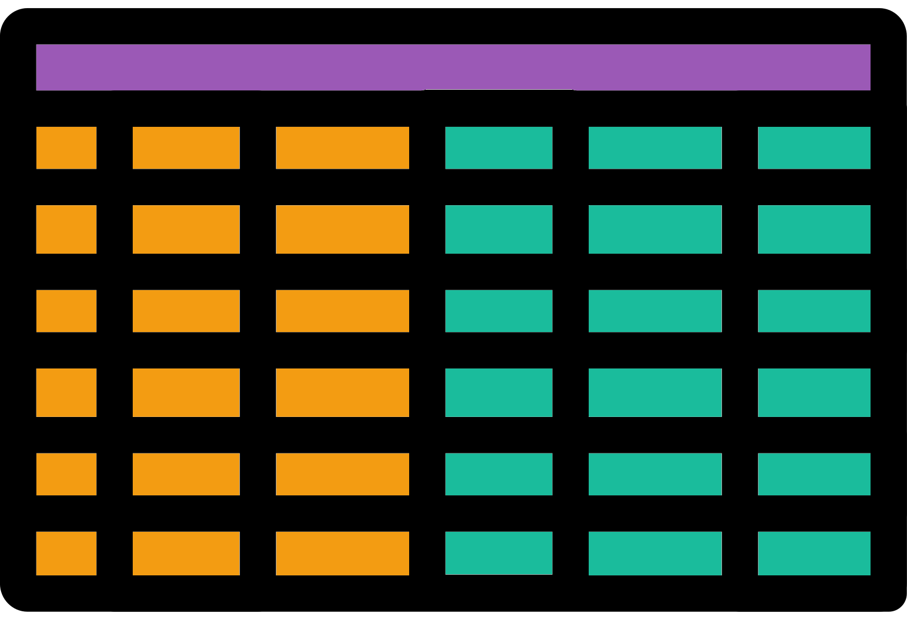
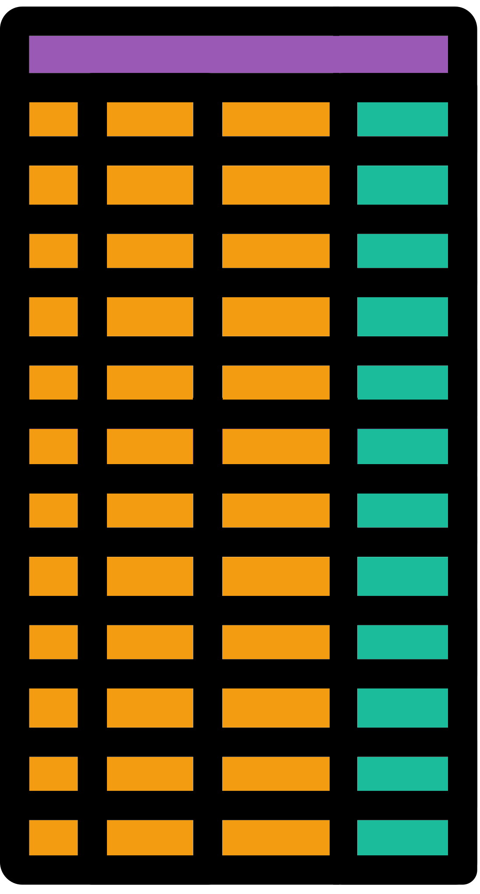

# α data frame tidying
{style="width:200px; border-radius:5px; background:white; border: white solid 5px" fig-align="center"}

In this section we will tidy up our data frame to make it ready for plotting by:

1. **Renaming** our metric of interest
2. Combining our __alpha diversity__ values and metadata
3 Converting our wide data frame to a long data frame
4. Subsetting our data frame so it only contains the __alpha diversity__ metrics we want to plot

## Rename metrics
{style="width:150px" fig-align="center"}

As seen at the end of the last page, many of the columns names are quite long such as "__diversity_shannon__".
This is not great for plotting so we will rename the column to "__shannon__" with [the `dplyr::rename()` function](https://neof-workshops.github.io/Tidyverse/dplyr/rename.html).

```{R, eval=FALSE}
#Rename
#Rename shannon_diversity column
alpha_df_mean <- alpha_df_mean |>
  dplyr::rename(shannon=diversity_shannon)
```


::: {.callout-tip}
Keep this part in mind when you reach the practice task on [Chapter_17](#alpha-task).
:::


## Metric and metadata data frame
{style="width:200px; border-radius:5px; background:white; border: white solid 5px" fig-align="center"}

Now that we have our __alpha diversity__ values we can create a data frame that contains these values and the metadata.

In the below code we extract the metadata from the rarefied phyloseq object created by the last rarefaction iteration loop.
This ensures we only acquire metadata from samples that are retained after __rarefaction__.
The samples that are retained are always the same across our __rarefaction iterations__.
This is because samples are retained based on the __rarefaction size/depth__ which is kept consistent across our __rarefactions iterations__.

```{r, eval=FALSE}
#Combine metadata and alpha diversity mean values into one data frame
#Extract metadata from rarefied phyloseq object
metadf <- phyloseq::sample_data(pseq_rarefy)
#Ensure row names are identical
#if not sort alpha data frame rows by metadata row names
if (identical(row.names(metadf), row.names(alpha_df_mean)) == FALSE) {
  alpha_df_mean <- alpha_df_mean[row.names(metadf),]
}
#Combine with cbind (column bind)
meta_alpha_mean_df <- cbind(metadf,alpha_df_mean)
head(meta_alpha_mean_df)
#Remove rarefied phyloseq object that we do not need any more in this notebook
rm(pseq_rarefy) 
```

From the output of `head()` you should see a table with the first set of columns being the metadata columns. The next set of columns are the alpha diversity metrics.

## Long tibble
{style="width:100px; border-radius:5px; background:white; border: white solid 5px" fig-align="center"}

We will plot our __alpha diversity__ values with `ggplot2` functions.
Before we carry this out we need to convert our wide data frame to a long [tibble](https://neof-workshops.github.io/Tidyverse/tibble/tibble.html).
We'll carry this out with [the `tidyr::pivot_longer()` function](https://neof-workshops.github.io/Tidyverse/tidyr/pivot_longer.html).

We want our metric values to become long.
This means that instead of the __alpha diversity__ values being spread across multiple rows and columns, there will only be one value per row.

Two columns will represent these values in the long format:

- __metric:__ The name of the alpha diversity metric
- __value:__ The value of the alpha diversity metric

```{r,eval=FALSE}
#Create long version for plotting
#alpha_df_mean (no metadata) column names to be used for long conversion
alpha_div_colnames <- colnames(alpha_df_mean)
#wide df to long tibble
meta_alpha_mean_tbl <- meta_alpha_mean_df |>
    tidyr::pivot_longer(
        #Change the alpha diversity names to long format
        #I.e keep our metadata columns as separate columns
        #all_of() used to silence wanring message
        cols = all_of(alpha_div_colnames),
        #Set metric names to column called metric
        names_to = "metric",
        #Set values to column called value
        values_to = "value") |>
    #Change metric column to a factor
    #Useful for plotting
    dplyr::mutate(metric=as.factor(metric))
#Glimpse produced tibble
meta_alpha_mean_tbl |> dplyr::glimpse()
#Remove unneeded objects
rm(alpha_df_mean, metadf)
```


::: {.callout-tip title="Cookbook links to Pipes, Tibbles, and the Tidyverse functions used above"}
- [Pipes (`|>`)](https://neof-workshops.github.io/Tidyverse/dplyr/pipes.html)
- [Tibbles](https://neof-workshops.github.io/Tidyverse/tibble/tibble.html)
- [`tidyr::pivot_longer()`](https://neof-workshops.github.io/Tidyverse/tidyr/pivot_longer.html)
- [`dplyr::mutate()`](https://neof-workshops.github.io/Tidyverse/dplyr/mutate.html)
- [`dplyr::glimpse()`](https://neof-workshops.github.io/Tidyverse/dplyr/glimpse.html)
:::


## Subset metrics
{style="width:200px; border-radius:5px; background:white; border: white solid 5px" fig-align="center"}

There are a lot of diversity values created by `microbiome::alpha()`.

You can check the variety with the below command:

```{R, eval=FALSE}
unique(meta_alpha_mean_tbl$metric)
```

For this tutorial we are only interested in the following:

- __observed:__ The number of observed features (ASVs, Phyla, Species, etc.)
- __shannon:__ The Shannon diversity metric
  - An estimate of feature diversity based on richness (presence/absence) and abundance
  - The higher the value the higher the diversity
  - We renamed this from __diversity_shannon__
  
We'll subset our long data frame to only retain rows with these metrics.
We'll also use the utility of factors to order the metrics so they will be plotted in our preferred order.

```{R, eval=FALSE}
#Subset tibble to only keep observed ASVs and shannon rows
#Vector of metrics/columns to keep
metrics <- c("observed","shannon")
#Filter our long alpha diversity tibble to only contain
# rows where the metric column value is "observed" or "shannon"
basic_alpha_metrics_tbl <- meta_alpha_mean_tbl |>
    dplyr::filter(metric %in% metrics)
#Glimpse long tibble
basic_alpha_metrics_tbl |> dplyr::glimpse()
```

::: {.callout-tip title="Cookbook links for Tidyverse functions used above"}
- [`dplyr::filter()`](https://neof-workshops.github.io/Tidyverse/dplyr/filter.html)
- [`dplyr::glimpse()`](https://neof-workshops.github.io/Tidyverse/dplyr/glimpse.html)
:::

With this data frame we can move onto visualisation and statistics.