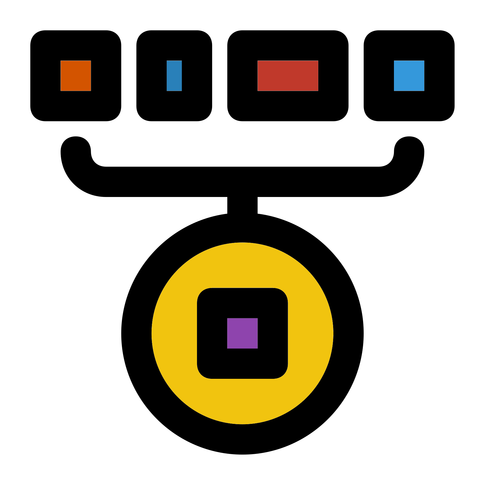

# β iterative rarefaction
{style="width:400px; border-radius:5px; background:white; border: white solid 5px" fig-align="center"}

Now that we know how to create a __beta diveristy__ paired distance matrix, we can create one with averaged values produced by __iterative rarefaction__.

## Iterative rarefaction values
{style="width:200px; border-radius:5px; background:white; border: white solid 5px" fig-align="center"}

We need to set our __rarefaction__ values and rngseeds.
We can use the same code as we used in the __alpha_diversity__ analysis.

```{R, eval = FALSE}
#Rarefaction values
#Rarefaction size
#Minimum sample depth in this case
rarefaction_size <- min(microbiome::readcount(pseq))
#Load the vector of 10 rngseeds created in the previous chapter
load("rngseeds.RData")
#Number of rarefaction iterations to be carried out
#Based on length of rng seed vector
rarefaction_iters <- length(rngseed_vec)
```

## Iterative beta diversity calculation
{style="width:200px; border-radius:5px; background:white; border: white solid 5px" fig-align="center"}

The below code carries out __iterative rarefaction__ and produces an averaged __weighted unifrac__ paired distance matrix.

```{R, eval = FALSE}
#Loop to create iteration based rarefied weighted unifrac values

#Create a matrix to contain the summed wunifrac beta diveristy values
#In this case we'll run the first rarefied beta diversity analysis
pseq_rarefy <- phyloseq::rarefy_even_depth(
    pseq,
    sample.size = rarefaction_size,
    rngseed = rngseed_vec[1],
    verbose = FALSE
)
#wunifrac beta diversity
beta_df_sum <-
    rbiom::bdiv_matrix(
        biom = rbiom::as_rbiom(pseq_rarefy),
        bdiv="weighted_unifrac")

#Loop through 2 to the number of rarefaction iterations
for (i in 2:rarefaction_iters){
    #Rarefaction
    pseq_rarefy <- phyloseq::rarefy_even_depth(
        pseq,
        sample.size = rarefaction_size,
        rngseed = rngseed_vec[i],
        verbose = FALSE
    )
    #Beta diversity
    beta_df <-
        rbiom::bdiv_matrix(
            biom = rbiom::as_rbiom(pseq_rarefy),
            bdiv="weighted_unifrac")
    #Add/sum the new data frame values to the sum data frame
    beta_df_sum <-  beta_df_sum + beta_df
}
#Divide by number of rarefaction iterations to get average
beta_df_mean <- beta_df_sum / rarefaction_iters
#Save beta mean dataframe
save(beta_df_mean, file = "wunifrac_df_mean.RData")
#See first 6 rows and columns of matrix
beta_df_mean[1:6,1:6]
#Remove created objects
rm(beta_df_sum, beta_df_mean, pseq_rarefy)

```

::: {.callout-note collapse="true" title="verbose = FALSE option"}
We include the option `verbose = FALSE` in the `phyloseq::rarefy_even_depth()` to prevent a lot of text to be displayed.
This text says which rngseed was used in the rarefaction.
We don't need this message as we already have a record of the rngseeds we used in `rngseed_vec`.
:::
You'll notice that each value is duplicated, once in the bottom left triangle and once in the top right triangle.
This is fine as the subsequent functions in this chapter will work with this in the same manner as if the matrix was de-duplicated.

In the above case we saved our final distance matrix and removed it.
We will then load the object in the next section.
This is convenient as it means we only need to run this code cell once. 
With higher numbers of rarefaction iterations it can take a while.