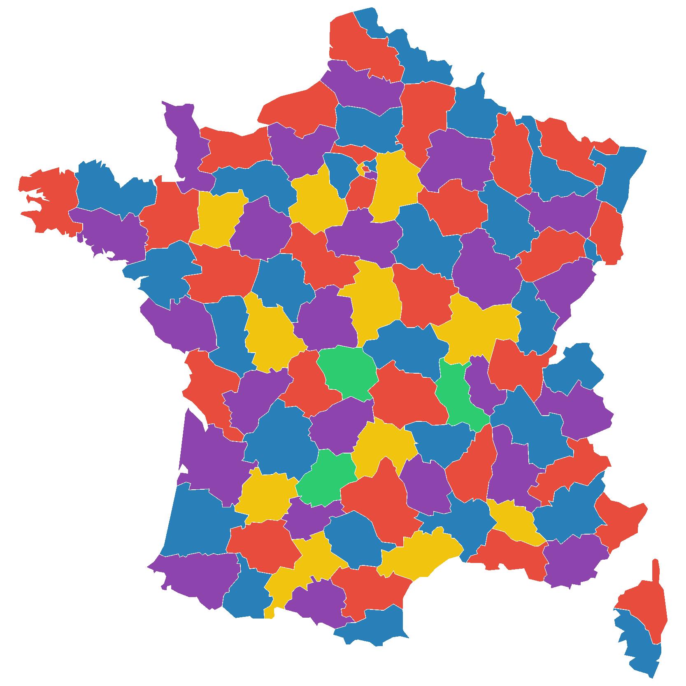
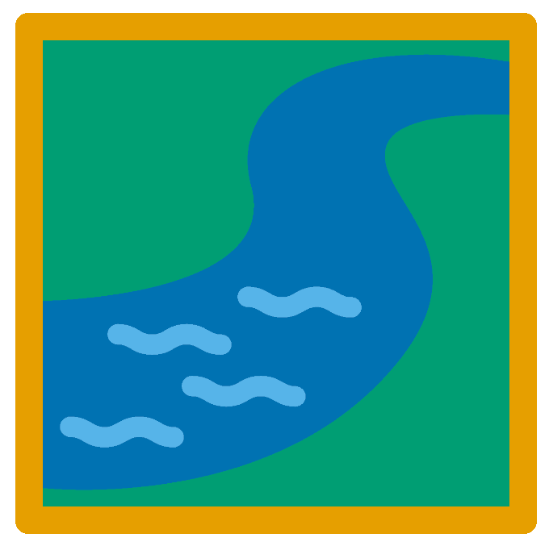

# Data & setup
{style="width:200px; border-radius:5px; background:white; border: white solid 5px" fig-align="center"}

## Dataset
{style="width:200px; border-radius:5px; background:white; border: white solid 5px" fig-align="center"}

The dataset we will use in this part is the same as that used in the [R community analysis workshop](https://neof-workshops.github.io/R_community_whqkt8/Course/02-Dataset_and_workflow.html#dataset).

Below are brief bullet points about the data:

- It is a 16S dataset of ASV counts with taxonomy and phylogeny produced by QIIME2
- The samples come from surface water from the Durance River in the south-east of France
- There are three sampling sites on an anthropisation gradient (low to high agriculture)
  - Upper Durance (UD)
  - Middle Durance (MD)
  - Lower Durance (LD)
- Four different media approaches were used to produce bacterial lawns that were sequenced
  - Environmental sample (ENV): No media used, frozen at -20°C.
  - TSA 10% incubated at 28°C for 2 days.
  - KBC incubated at 28°C for 2 days.
  - CVP incubated at 28°C for 3 days.
- There are three replicates for each sampling site and media combination (36 samples total)

## Setup
{style="width:200px; background: white; border-radius:5px; border: white solid 10px" fig-align="center"}

Before you carry out any practice ensure you have setup your directory, environment, and `jupyter` as shown in the overall [setup](/setup/setup.qmd).

With the `jupyter` file explorer:

1. Create a directory called `iterative_rarefaction` within your `adv_R_comm` directory
2. Move into your newly created `iterative_rarefaction` directory.

Each of the following sections will use its own `jupyter` notebook so they will include the creation instructions.