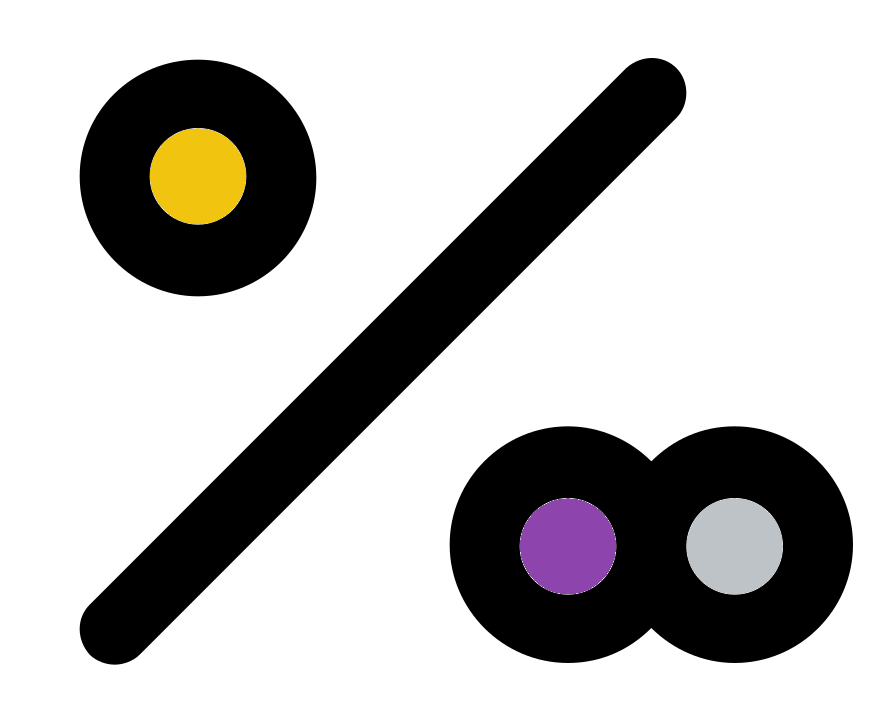

# Iteration task

Superlative! Now that you know how to carry out __iterative rarefaction__ I'll ask you to do it once more for the phyla data.

## One thousand iterations
{style="width:200px; border-radius:5px; background:white; border: white solid 5px" fig-align="center"}

Create a rarefaction averaged phyla relative abundance as we have done in the previous chapters but with **1,000 rarefaction iterations**.
For this task use __153478__ (one-five-three-four-seven-eight) as the __seed__ when creating your vector of 1,000 __rng seeds__.
Save this vector of rngseeds to a file called "rngseeds_1000.RData".


::: {.callout-note}
The iterative rarefaction step may take a few minutes. 
:::

After creating the relative abundance matrix determine how different the values are compared to the non-rarefied relative abundance with a histogram.

```{r, echo = FALSE}
opts_p <- c(answer="__-0.00015 to 0.00015__", "__-0.0015 to 0.002__", "__-0.004 to 0.005__")
```
What is the range of the differences compared to the non rarefied relative abundance values? `r longmcq(opts_p)`

## Solution

Please attempt the task yourself before looking at the solution code block in the below expandable boxes.

::: {.callout-note collapse="true" title="Creating vector of random seeds"}
```{R, eval=FALSE}
#Number of rarefaction iterations to be carried out
rarefaction_iters <- 1000
#Create rngseed vector
#Set seed for reproducibility
set.seed(153478)
#Create the rngseed vector
#Sample 1000 (number of iters) values from the number range 1-100,000
rngseed_vec <- sample(x=1:100000, size = rarefaction_iters, replace = FALSE)
#Save our rngseed vector
save(rngseed_vec, file="rngseeds_1000.RData")
#Reset seed
set.seed(NULL)
```
:::

::: {.callout-note collapse="true" title="Phyla aggregation and iterative rarefaction"}
```{R, eval=FALSE}
#Iterative rarefaction to produce an average rarefied abundance table

#Assign rarefaction size
rarefaction_size <- min(microbiome::readcount(pseq_env_phyla))
#Load our rng seed vector
load("rngseeds_1000.RData")

#Initialise where we will store the output
#In this case we create the first iteration
#Carry out first rarefaction
pseq_rarefy <- phyloseq::rarefy_even_depth(pseq_env_phyla,
                                           sample.size = rarefaction_size,
                                           #First random seed as the rng seed
                                           rngseed = rngseed_vec[1],
                                           replace = FALSE,
                                           verbose = FALSE)
rarefy_phyla_df <- as.data.frame(phyloseq::otu_table(pseq_rarefy))

#Loop through the next 999 iterations
#Add the rarefied values to rarefy_phyla_df
for (i in 2:length(rngseed_vec)){
  #Rarefy
  pseq_rarefy <- phyloseq::rarefy_even_depth(pseq_env_phyla,
                                           sample.size = rarefaction_size,
                                           rngseed = rngseed_vec[i],
                                           replace = FALSE,
                                           verbose = FALSE)
  #Add values to rarefy_phyla_df
  rarefy_phyla_df <- 
    rarefy_phyla_df + as.data.frame(phyloseq::otu_table(pseq_rarefy))
}
#Average the values of the summed relabund phyla_table
rarefy_phyla_mean_df <- rarefy_phyla_df / length(rngseed_vec)
#Remove unwanted objects
rm(pseq_rarefy, rarefy_phyla_df)
```
:::

::: {.callout-note collapse="true" title="Relative abundance transformation"}
```{R, eval = FALSE}
#Convert to relative abundance table
rarefy_i1000_relabund_phyla_df <- dplyr::mutate_all(rarefy_phyla_mean_df, prop.table)
#View relative abundances
rarefy_i1000_relabund_phyla_df
```
:::

::: {.callout-note collapse="true" title="Histogram of difference to non rarefied data"}
```{R, eval=FALSE}
#Value difference matrix
iterative_rarefaction_1000_diff <- 
  as.matrix(phyloseq::otu_table(pseq_env_phyla_relabund) - rarefy_i1000_relabund_phyla_df)
iterative_rarefaction_diff
#Histogram
hist(iterative_rarefaction_diff)
```
:::

## Iterating rarefaction recap
{style="width:200px; border-radius:5px; background:white; border: white solid 5px" fig-align="center"}

Amazing!

With this section you have learnt:

- How to create a vector of rngseeds
- How to use rng seeds to carry out __iterative rarefaction__

In you real life analysis you would not use this method to create relative abundance taxonomy bar charts, you would use the non-rarefied relative abundance.
However, this has hopefully given you a good idea of how __iterative rarefaction__ works so we can utilise it the next 2 chapters for alpha and beta diversity analysis.

Feel free to save then close and halt your "Iterating_rarefaction.ipynb" notebook.