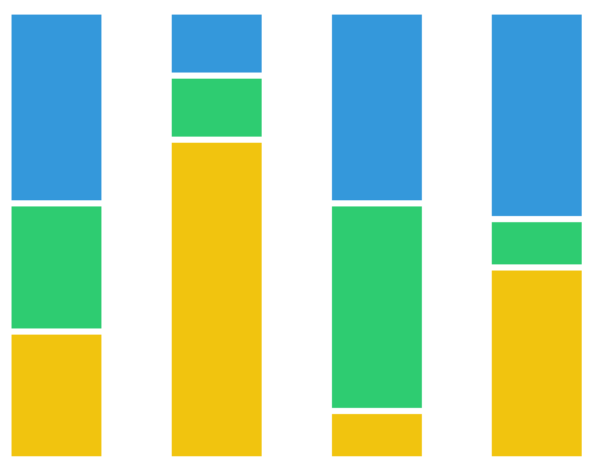

# Phyla relative abundance
{style="width:200px; border-radius:5px; background:white; border: white solid 5px" fig-align="center"}

Prior to __iterative rarefaction__ we will look at the phyla composition of the environmental samples.

## Subset and phyla aggregation
{style="width:200px; border-radius:5px; background:white; border: white solid 5px" fig-align="center"}

For demonstrative purposes we will reduce the amount of samples and features in our data for this section. We will carry this out by:

- Subsetting the data so it only contains the 9 environmental samples.
- Aggregate the taxa to phyla whilst [aggregating rare taxa](https://neof-workshops.github.io/R_community_whqkt8/Course/11-Taxa_plots.html#aggregateraretaxa) to one "other group"

```{R, eval=FALSE}
#Reduce data for demonstrative purposes
#Subset phyloseq object to only retain the ENV samples
#I.e. remove the media samples
pseq_env <- phyloseq::subset_samples(pseq, media == "ENV")

#Aggregate to phyla level whilst aggregating rare phyla
pseq_env_phyla <- microbiome::aggregate_rare(
  pseq_env, level = "Phylum",
  detection = 0.1, prevalence = 0.5,
  #Prevent info on aggregation to be printed out
  verbose = FALSE)
#View count table
otu_table(pseq_env_phyla)
#Sum count of samples
microbiome::readcount(pseq_env_phyla)
#Remove unwanted objects
rm(pseq, pseq_env)
```

We now have:

- 9 samples
  - These samples have counts/depths ranging from 11,000 to 17,000
- 10 phyla groups
  - This includes "Other", our aggregated phyla

## Phyla relative abundance bar chart
{style="width:200px; border-radius:5px; background:white; border: white solid 5px" fig-align="center"}

Let's have a quick look at the non rarefied phyla relative abundances through a bar chart.

::: {.callout-note}
This is how you would normally look at this type of bar chart.
:::

```{R, eval=FALSE}
#Quick phyla bar chart of relative abundance
#Relative abundance transformation
pseq_env_phyla_relabund <- microbiome::transform(pseq_env_phyla, "compositional")
#Create, save, and display bar chart
phylum_bar <- microbiome::plot_composition(pseq_env_phyla_relabund)
ggsave(filename = "./env_phyla_relabund.png", plot = phylum_bar,
       device = "png", dpi = 300, units = "mm", height = 100, width = 200)
IRdisplay::display_png(file = "./env_phyla_relabund.png")
```

Great! We now know what the relative abundance of our phyla looks like within and between our samples.
In the next page we'll **rarefy** the aggregated phyla phyloseq and recreate the above plot with the **rarefied** data.