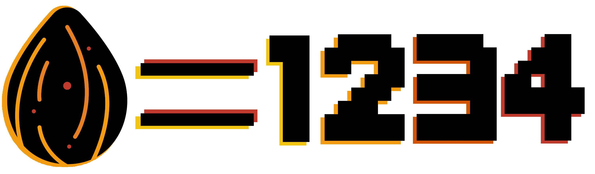

# R and random seeds

{style="width:200px; border-radius:5px; background:white; border: white solid 5px" fig-align="center"}

Sampling is meant to be random but true randomness is pretty much impossible, especially in computing. Therefore, many programs use **seeds** to determine how random tasks will be carried out. Various programs that use **random seeds** include:

- Sampling tools such as `sample()` and rarefaction
- Creating bootstrapped phylogenies
- Creating procedural content such as building Minecraft worlds

## Setting the R seed

{style="width:300px; border-radius:5px; background:white; border: white solid 5px" fig-align="center"}

To carry out random processes `R` uses a global variable called `seed`. The `seed` is normally random and changes every time it is used. This is useful for everyday analysis but what if you want replicable/repeatable results?

### Sampling 0 to 9

In R we can set the `seed` with the function `seet.seed()`. Carry this out to determine the randomness of sampling.

```{R, eval=FALSE}
#Set random seed
set.seed(1234)
#Randomly sample 5 of these numbers without replacement
sample(x = num_vec, size = 5, replace = FALSE)
#Reset random seed (covered later)
set.seed(NULL)
```

You will get a result of "9, 5, 4, 3, & 0". You can try to run the code multiple times and you will always get the same results.

If you run a tool that uses random sampling you will always get the same results if:

- You use the same random seed (`seed` for R)
- You use the same data
- You use the same parameters including the replacement method (with or without)

### Sample 10 to 19 with same the seed

Run the below code in a new code cell and you may notice a similarity with your previous output.

```{R, eval=FALSE}
#Set random seed
set.seed(1234)
#Create a vector containing the numbers 10 to 19
larger_num_vec <- 10:19
#Randomly sample 5 of these numbers
sample(x = num_vec, size = 5)
#Reset random seed (covered later)
set.seed(NULL)
```

That's right, `sample()` will always return the 10th, 6th, 5th, 4th, and 1st values in that order if:

- The **random seed** is **1234**
- The **input vector** is a **length** of **10**
- It is asked to **sample 5 values**

### Reproducible randomness

Setting our randomness is incredibly beneficial for reproducibility in research.

When you carry out analysis you may need to redo some work. This could be due to reviewer comments or you may want to incorporate some new methods. As long as you saved the random seeds you used you can get the same results where you need to. It also means others can replicate your results.

## Reset seed

{style="width:300px; border-radius:5px; background:white; border: white solid 5px" fig-align="center"}

We set a **random seed** at the start of the cell for reproducibility and control, but why do we then run the line `set.seed(NULL)`?

The normal operation of R means that, in effect, its **random seed** changes every time it is used. This means R normally randomly determines randomness. This is how it should be until we want to determine the randomness. It is therefore good practice to set the seed to `NULL` after you have utilised your set **seeds**. This will revert the **seed** to its normal random operations.

One last point to note is R versions. Version 3.6 changed R's sampling methods, therefore if you use Version 3.5 or below you will get different results than we have got. Hopefully the R developers will not change this in a later version again.