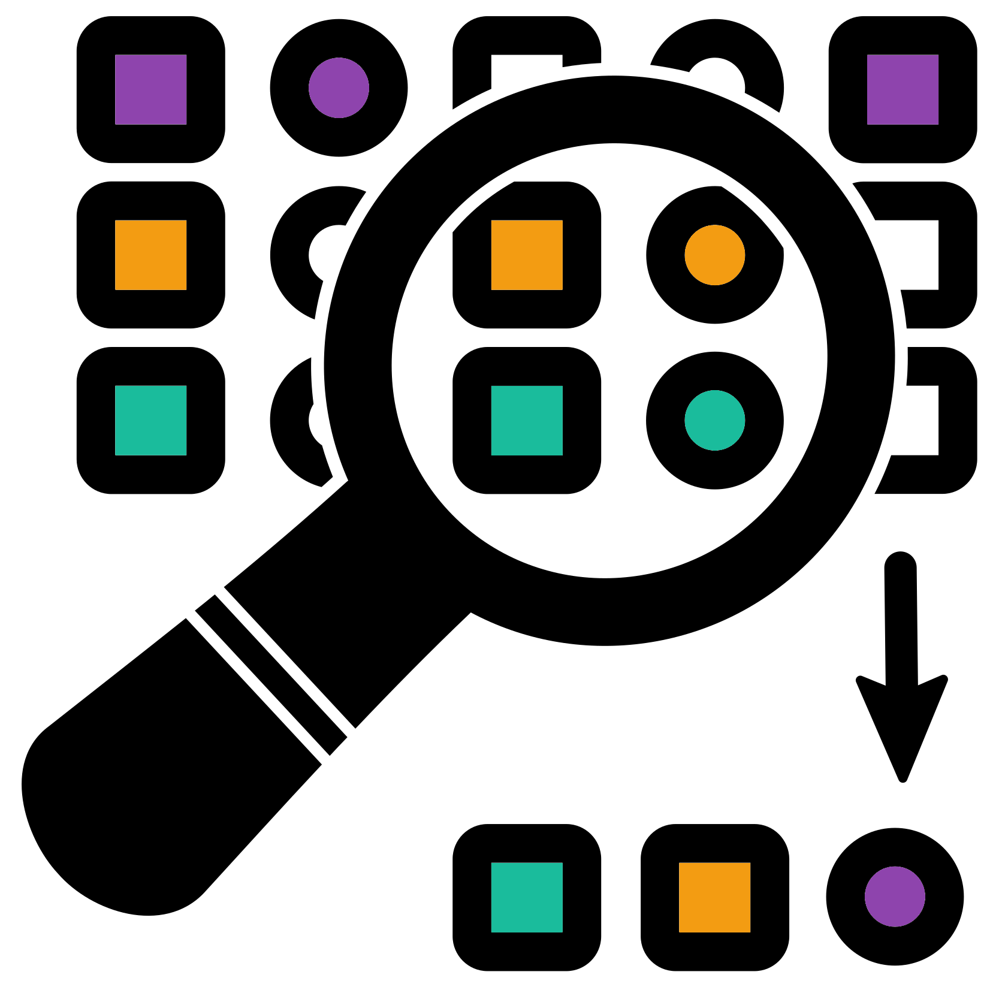

# Random seeds and sampling {#random_seeds_n_sampling_chap}
{style="width:200px; border-radius:5px; background:white; border: white solid 5px" fig-align="center"}

__Rarefaction__ requires __random sampling__.
You can carry out __random sampling__ in R with __random seeds__.

What are __random seeds__?

__Random seeds__ are numbers that computational tasks use to determine how they will carry out a random task.

In this section we will demonstrate the use of __random seeds__. 
This is to help understand what they are and why they are used.

## Random seed notebook
{style="width:100px; border-radius:5px; background:white; border: white solid 5px" fig-align="center"}

Create a new R jupyter-notebook called "Random_seeds.ipynb" for this section.

## Random sampling
{style="width:200px; border-radius:5px; background:white; border: white solid 5px" fig-align="center"}

To demonstrate the use of random seeds we will use the R function `sample()`. 
This function randomly samples a set of numbers.

Create the below code in a code cell.

```{R, eval=FALSE}
#Create a vector containing the numbers 0 to 9
num_vec <- 0:9
#Randomly sample 5 of these numbers
sample(x = num_vec, size = 5)
```

If you run the code you will get five random single digit numbers.

Run this multiple times and you will hopefully see the sampled numbers are different every time.

## Sampling with replacement
{style="width:200px; border-radius:5px; background:white; border: white solid 5px" fig-align="center"}

You may also notice that within each sample there are no repeating numbers.
You can change this by adding the option `replace = TRUE`.

Try this out in a new cell.

```{R, eval=FALSE}
#Randomly sample 5 of these numbers with replacement
sample(x = num_vec, size = 5, replace = TRUE)
```

Run this a few times and you will hopefully notice that the five numbers are not always unique.

When sampling __with replacement__ you replace each result back into the pool before sampling again.
When sampling __without replacement__ you don't replace the results.

### Yellow and green balls

The famous example is sampling green and yellow balls from a bag.
If you had a bag with 1000 balls and you wanted a rough idea of the ratio of yellow and green balls you could count the number of these balls within a sample of 50.
Without replacement you would take out a ball, record its colour and throw it in a separate container.
With replacement you would take out a ball, record its colour and put it back into the initial bag, meaning it could possibly be recounted.

### Advantage of replacement

One advantage of sampling with replacement is that your sampling size can be larger than your actual population size.
For example, you could create a random sampling of 50 with a bag containing 10 balls with replacement.
This would not work without replacement.
The below script will cause R to produce an error saying "cannot take a sample larger than the population when 'replace = FALSE' ".

```{R, eval=FALSE}
#Randomly sample 15 of these numbers without replacement
sample(x = num_vec, size = 15, replace = FALSE)
```

## Rarefaction samples without replacement

__Rarefaction__ uses sampling __without replacement__.
This is for the important reason that we never want a taxa/ASV to have a larger count after rarefaction normalisation than it did before.
We don't want to add counts that don't exist in our original data.
Any samples with a lower depth than the rarefaction size will be removed and will therefore not be in the resulting rarefied data.