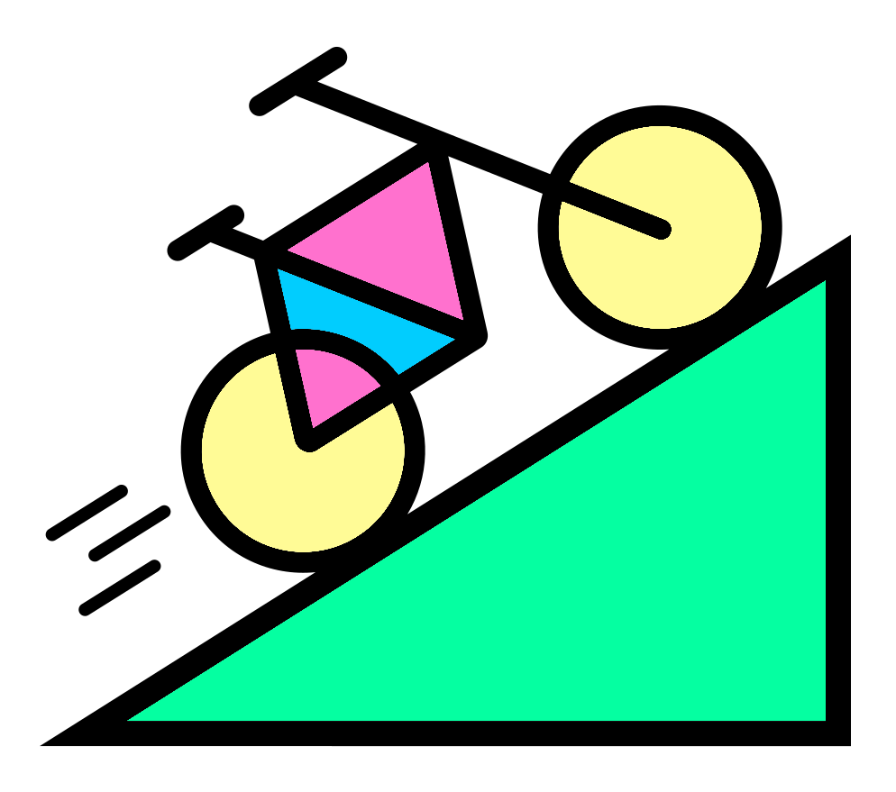

# Rarefaction

Rarefaction is used for two different but related processes.
These were covered in the R community analysis course:

- [Depth evaluations via rarefactions curves and slopes](https://neof-workshops.github.io/R_community_whqkt8/Course/14-Rarefaction.html#rarefaction-curve)
- [Normalisation to control for sample depth variation](https://neof-workshops.github.io/R_community_whqkt8/Course/14-Rarefaction.html#rarefy-data)

## Iterations

{style="width:200px; border-radius:5px; background:white; border: white solid 5px" fig-align="center"}

In this part we will primarily focus on carrying out iterative rarefaction normalisation.
This is the process:

1. Carrying out out multiple rarefaction normalisations
2. Producing the desired diversity (alpha and/or beta) analyses on all the normalised count tables
3. Producing an average result

Theory, practice and code are in the following sections:

- [Data & setup](/rarefaction/data_and_setup.qmd)
- [Random seeds](/rarefaction/random_seeds.qmd): How and why random seeds are used for reproducibility
- [Iterating rarefaction](/rarefaction/iterating_rarefaction.qmd): Carrying out rarefaction through iterations
- [Alpha diversity](/rarefaction/alpha_intro.qmd): Alpha diversity through iterative rarefaction
- [Beta diversity](/rarefaction/beta_intro.qmd): Beta diversity through iterative rarefaction
- [Template script](/rarefaction/iterative_rarefaction_diversity_loop.qmd): A template script for your future analysis

## Rarefaction slope boxplot

{style="width:200px; border-radius:5px; background:white; border: white solid 5px" fig-align="center"}

In addition there is a section on creating rarefaction slope boxplots to help decide on an appropriate rarefaction size.
This is useful for datasets where rarefaction curves are harder to read.

- [Rarefaction slopes](/rarefaction/rareslope_intro.qmd)
