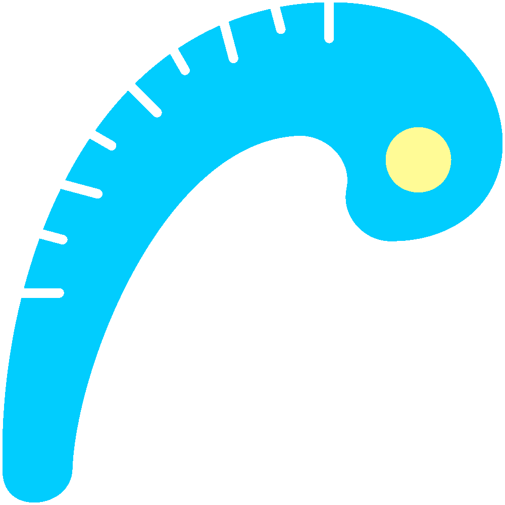

# Rarefaction curve
{style="width:200px; border-radius:5px; background:white; border: white solid 10px" fig-align="center"}

Before looking at slopes let's see what our rarefaction curve looks like.
We'll primarily run the same commands as the [R community workshop](https://neof-workshops.github.io/R_community_whqkt8/Course/14-Rarefaction.html).
The main change is that we will set the seeds to produce reproducible results.

## Create data.frame
{style="width:200px; border-radius:5px; background:white; border: white solid 10px" fig-align="center"}

Create a `data.frame` that we will use for `vegan::rarecurve()`.

```{r,eval=FALSE}
#Create data frame for rarefaction
abund_df <- pseq |>
    #Extract otu/count table
    phyloseq::otu_table() |>
    #Transpose and convert to data.frame
    t() |> as.data.frame()
```

Additionally, view the sample depths/total read counts.

```{r, eval=FALSE}
#Check sample sizes
abund_df |>
    rowSums() |> sort()
```

Here you can see the depths of the newly added replicates.
These were generated for this workshop.
The depth ranges of the replicates are:

- **rep4**: 1,000-3,000
    - Produced by subsampling the relevant replicate 1 sample
- **rep5**: 5,000-10,000
    - Produced by subsampling the relevant replicate 2 sample
- **rep6**: 30,000+
    - Produced by combining the counts of the three original/real replicates (rep1, rep2, and rep3)

## Rarefaction curve tibble
{style="width:200px; border-radius:5px; background:white" fig-align="center"}


Create a `tibble` for the rarefaction curve plot.

The option `tidy=TRUE` ensure the output is a `tibble`.

```{r, eval=FALSE}
#Set seed
set.seed(117)
#Create rarefaction tidy data frame to put into ggplot2
rarecurve_tbl <- vegan::rarecurve(
    x=abund_df, 
    step=100,
    xlab="Read depth",
    ylab="ASVs",
    tidy=TRUE
)
#Glimpse tibble
rarecurve_tbl |> dplyr::glimpse()
#Set seed to NULL
set.seed(NULL)
```

## Rarefaction curve plot
{style="width:200px; border-radius:100px; background:white" fig-align="center"}

With our tibble we can create the rarefaction curve plot.

```{r,eval=FALSE}
#Rarefaction curve plot
rarecurve <- rarecurve_tbl |>
    ggplot2::ggplot(aes(x=Sample,y=Species, colour=Site)) +
    ggplot2::geom_line() +
    ggplot2::scale_x_continuous(
        breaks=seq(from = 0, to = 20000, by = 1000),
        limits=c(0,20000)
    ) +
    ggplot2::guides(colour="none")
ggsave(filename = "rarecurve.png", plot = rarecurve, 
       device = "png", units="mm", width=300, height=200, dpi=300)
```

```{r, eval=FALSE}
IRdisplay::display_png(file=
    "./rarecurve.png",
    width = 600)
```

In the plot we can the samples do plateau.
However, it is very difficult to make out the curves of all the different samples as they overlap each other.
This is when rarefaction slopes come in handy.