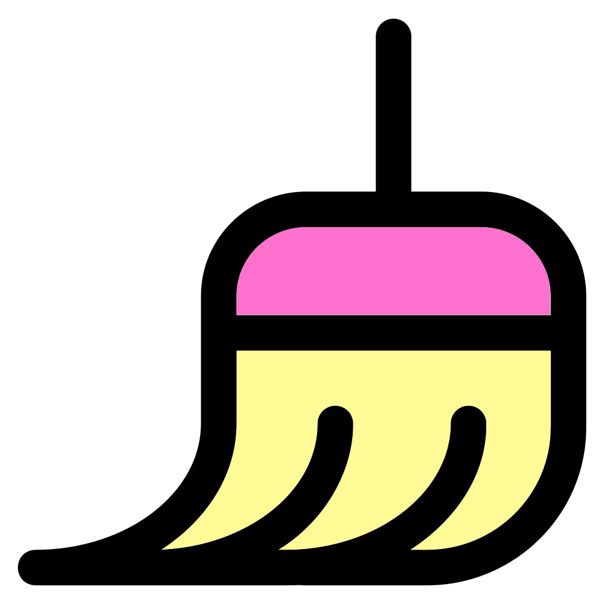

# Rarefaction slope tibble
{style="width:200px; border-radius:5px; background:white" fig-align="center"}

In the main [R community workshop](https://neof-workshops.github.io/R_community_whqkt8/Course/14-Rarefaction.html#rarefaction-slope) we created calculated the rarefaction slope for each sample at our specified sampling depth.
This depth was the depth of the sample with the smallest/minimum read count.

In this section we will carry this out but we will calculate the rarefaction slopes of all samples at all unique sample depths.

In other words we will:

1. Find the depth of the sample with the lowest read count/depth
2. Calculate the rarefaction slopes of all samples at this depth
3. Find the depth of the sample with the 2nd lowest read count/depth
4. Calculate the rarefaction slopes of all samples at this depth
5. Etc. all the way to the depth of the sample with the highest read count/depth

To create this tibble we'll:

1. Create a tibble of samples and their read depths
2. Loop through this tibble to create our tibble of rarefaction slopes
3. Add the sample depths to this tibble
4. Remove `NA`s and rows where the rarefaction depth is higher than the sample's depth

## Ordered tibble of read depths
{style="width:200px; border-radius:5px; background:white; border: 5px white solid" fig-align="center"}

First we'll create a 2-column tibble of Samples and read depths.
We'll order it from lowest to highest depth.

```{r,eval=FALSE}
#Vector of ordered read depths
ordered_read_depths <- abund_df |>
    rowSums() |> sort()
#Create a tibble 
read_depths_tbl <- tibble::tibble(
    Sample=names(ordered_read_depths),
    Reads=ordered_read_depths
)
#View top
read_depths_tbl |> head()
```

We can see the sample with the lowest/minimum depth is "UD_KBC_rep4" with a depth of 1,399.

## Rarefaction slopes at each sample depth
{style="width:200px; border-radius:100px; background:white; border: 5px white solid" fig-align="center"}

The most complex step is creating our tibble with rarefaction slopes of each sample at all sample depths.
To carry this out we'll create four **vectors** which will be used to create the columns of our **tibble**.
The columns will be:

- `Sample`: The sample which is having its rarefaction slope calculated
- `RareSlope`: The rarefaction slope value
- `RarefyDepth`: The rarefaction depth the slope value was calculated at
- `RarefyDepthSample`: The sample whose depth is equal to the `RarefyDepth` sample

```{r,eval=FALSE}
#Create tibble of rareslope for each sample at each rarefy depth
#Set seed
set.seed(343)
#Create empty vectors for loop
#Sample column
sample_vec <- c()
#RareSlope column
rareslope_vec <- c()
#RarefyDepth column
rarefy_depth_vec <- c()
#RarefyDepthSample column
rarefy_depth_sample_vec <- c()
#Loop through read_depths_tibble
for (i in 1:nrow(read_depths_tbl)) {
    #Extract rarefy depth and rarefy depth sample
    #Use pull to extract values as scalar rather than a tibble
    rarefy_depth <- read_depths_tbl[i,"Reads"] |> dplyr::pull()
    rarefy_depth_sample <- read_depths_tbl[i,"Sample"] |> dplyr::pull()
    #Calculate rareslopes
    #Creates vector with names
    #Names are samples, values are rareslope
    rareslopes <- vegan::rareslope(
        abund_df, sample=rarefy_depth
    )   
    #Add values to vectors
    sample_vec <- c(sample_vec, names(rareslopes))
    #Use unname() to only extract rare slope value
    rareslope_vec <- c(rareslope_vec, unname(rareslopes))
    #Replicate rarefy depth and sample by the length of the rareslopes vector
    #These values are the same within ech iteration of the loop
    rarefy_depth_vec <- c(rarefy_depth_vec, 
                        rep(rarefy_depth, length(rareslopes)))
    rarefy_depth_sample_vec <- c(rarefy_depth_sample_vec, 
                               rep(rarefy_depth_sample, length(rareslopes)))
}
#Create tibble
rareslope_tbl <- tibble::tibble(
    Sample = sample_vec,
    RareSlope = rareslope_vec,
    RarefyDepth = rarefy_depth_vec,
    RarefyDepthSample = rarefy_depth_sample_vec
    )
#Set seed to NULL
set.seed(NULL)
```

Check the number of rows and the top of the **tibble**.

```{r,eval=FALSE}
nrow(rareslope_tbl)
```

```{r,eval=FALSE}
rareslope_tbl |> head()
```

There are a lot of rows but we'll reduce this number in the next steps.

## Tidying up
{style="width:200px; border-radius:5px; background:white; border: 5px white solid" fig-align="center"}


We'll tidy up `rareslope_tbl`.
First we'll add the depth of the samples to the tibble with [`dplyr::inner_join()`](https://dplyr.tidyverse.org//reference/mutate-joins.html) (this is similar to excel's vlookup).

```{r, eval=FALSE}
#Add column of sample depths
rareslope_tbl <- rareslope_tbl |>
    #Add Reads values from read_depths_tbl
    #Joins by their shared column "Sample"
    dplyr::inner_join(read_depths_tbl, by="Sample") |>
    #Rename and move column
    dplyr::rename(SampleDepth=Reads) |>
    dplyr::relocate(SampleDepth, .after=Sample)
#Glimpse
rareslope_tbl |> dplyr::glimpse()
```

::: {.callout-tip title="Cookbook and reference links for Tidyverse function used above"}
- [`dplyr::inner_join()`](https://dplyr.tidyverse.org//reference/mutate-joins.html)
- [`dplyr::rename()`](https://neof-workshops.github.io/Tidyverse/dplyr/rename.html)
- [`dplyr::relocate()`](https://neof-workshops.github.io/Tidyverse/dplyr/relocate.html)
:::

Next we'll:

- Remove any rows with `NA`s 
- Retain rows where `SampleDepth` is greater or equal to `RarefyDepth`
    - The rarefaction slope of a sample equal to or above its depth is always 0 and therefore uninformative
- Convert `ReadDepthSample` to a factor for later plotting

```{r,eval=FALSE}
#Edits
rareslope_tbl <- rareslope_tbl |>
    #Remove NAs
    tidyr::drop_na() |>
    #Keep rows where sample depth is greater than rarefy depth
    dplyr::filter(SampleDepth > RarefyDepth)    
#Change ReadDepthSample to factor so it stays in order
# of lowest to highest read depth
rareslope_tbl$RarefyDepthSample <-
    factor(rareslope_tbl$RarefyDepthSample,
              #Set order
              levels=read_depths_tbl$Sample)
#Glimpse
rareslope_tbl |> dplyr::glimpse()
```

Now you can see we only have 2,628 rows now which is good.

::: {.callout-tip title="Cookbook links for Tidyverse function used above"}
- [`tidyr::drop_na()`](https://neof-workshops.github.io/Tidyverse/tidyr/drop_na.html)
- [`dplyr::filter()`](https://neof-workshops.github.io/Tidyverse/dplyr/filter.html)
:::

## One sample example

Run the below command and you'll see the rarefaction slopes of UD_CVP_rep1.
It starts from the minimum read depth (1,399) moving across the read depth of samples in increasing order until it reaches the depth of the sample before it (MD_TSA_rep3 with 10,521).

```{r, eval=FALSE}
#View all rarefaction slopes of UD_CVP_rep1
rareslope_tbl |>
    filter(Sample=="UD_CVP_rep1")
```

As you scroll down the tibble, from lowest to highest rarefaction depth, you'll notice the rarefaction slopes decreasing indicating the sample's rarefaction curve plateauing.
Let's visualise this in the next page.